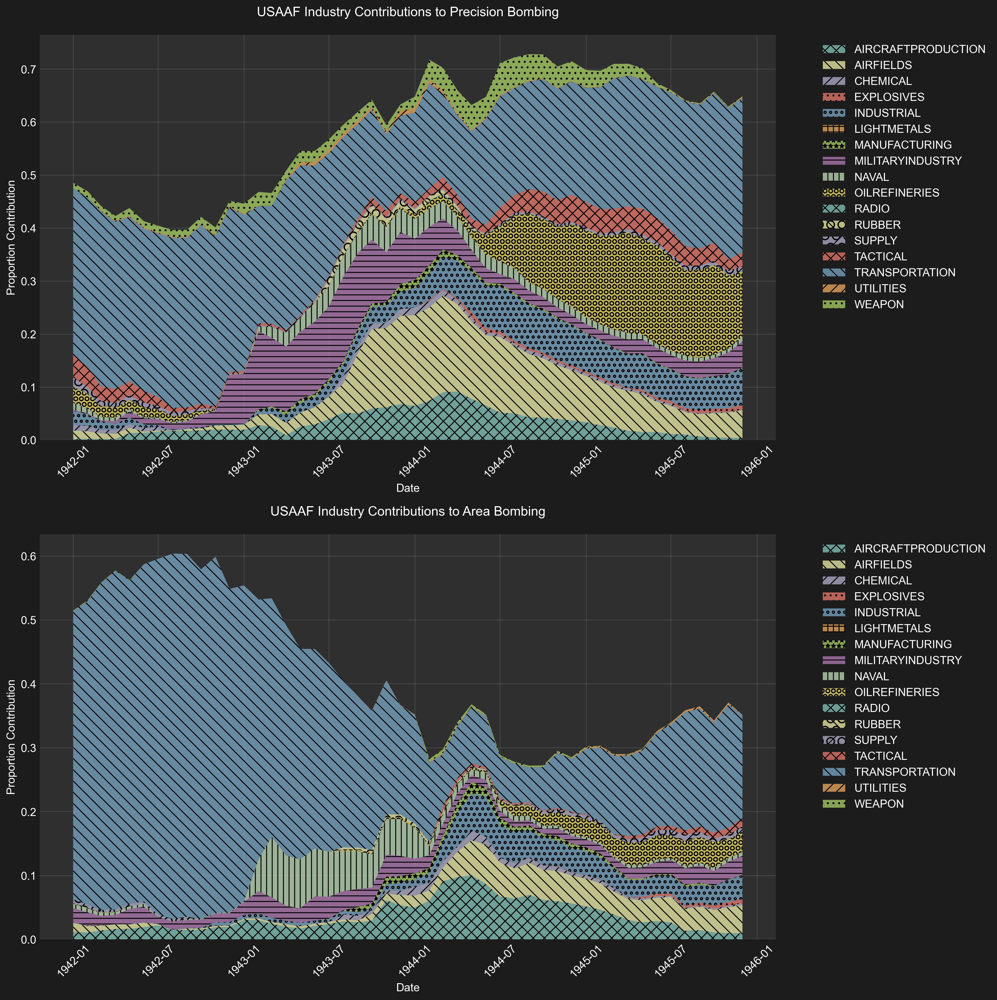

# Chapter 1: The Character of the Strategic Bombing Campaign

As we have seen, the historiography presents a seemingly inexorable progression: operational challenges gradually forced a transition from precision bombing to area bombing. This deterministic narrative, while compelling in its simplicity, faces a significant empirical challenge. Analysis of mission-level data from the European theater reveals that no such shift occurred.

<!-- Remember that we have to add more citations to scholarly sources and not just rely on the USSBS -->

The industry contribution graph for the United States Army Air Forces (Figure 1) provides the clearest evidence against this conventional narrative. The visualization shows the relative proportion of precision versus area bombing across different industrial sectors throughout the war.[^1] If the traditional narrative were correct, we would expect to see a large increase in the proportion of area bombing late in the war. Instead, the data reveals remarkable consistency in the ratio between the two approaches, with precision bombing remaining dominant throughout the war.[^2] [^2.25]

*Figure 1: First visualization of industry-specific bombing patterns for USAAF missions, showing the relative contribution of each industry sector and the proportion of area vs. precision bombing within each. Note that the overall proportions of area bombing are relatively stable, with a slight increase in the proportion of area bombing in the transportation sector late in the war.*

Overall, precision bombing accounted for 69.0% (1,211,273 tons) of all bombs dropped, compared to 31.0% (544,681 tons) categorized as area bombing. More importantly, this ratio remained relatively stable even as the absolute scale of bombing operations increased dramatically in 1944 and 1945. Both precision and area bombing intensified in parallel during these later stages, suggesting a simple expansion of bombing operations rather than a strategic pivot from one approach to another.

The persistence of both bombing strategies throughout the war fundamentally challenges the traditional historical narrative. Since the conventional explanation—that operational failures of precision bombing led to the adoption of area bombing—does not align with the empirical evidence, we must seek new frameworks to understand the strategic choices made during the bombing campaign. The relatively balanced application of both precision and area bombing throughout the war suggests that the simple dichotomy emphasized by previous historians fails to capture the reality of Allied bombing strategy.

This evidence undermines a key justification for the campaign's civilian toll—that operational limitations forced a shift to area bombing. Instead, both precision and area bombing were deliberate, parallel strategies from the start. Before exploring the root causes of this approach in [Chapter 3](https://github.com/nac-codes/thesis_bombing/blob/master/chapter_3.md), we must first examine whether either strategy was truly necessary or effective at achieving its stated aims.

## Area Bombing

The extraordinary resources devoted to area bombing reflected an emphasis on general destruction, yet proved ineffective at achieving its stated economic objectives. The devastating power of incendiary weapons, particularly when combined with high explosives, made them the most destructive conventional weapons of the war. As noted in the USSBS Physical Damage Report, incendiary bombs caused "close to five times as much damage, per ton, as high-explosive bombs" in urban areas.[^2.5]

Still, the destructive capacity does not guarantee effectiveness. If area bombing had successfully undermined the Nazi economy through civilian and urban targeting, we would expect to see either significant labor force reductions or the diversion of resources from military to civilian needs. The United States Strategic Bombing Survey found neither outcome.

The USSBS's comprehensive analysis found no evidence supporting either of these anticipated outcomes. The Survey's Overall Report explicitly states that "bomb damage to the civilian economy was not a proximate cause of the military collapse of Germany," further noting that there is no evidence that "shortages of civilian goods reached a point where the German authorities were forced to transfer resources from war production in order to prevent disintegration on the home front."[^3]

Additionally, German civilian employment levels remained stable throughout the war. The USSBS's analysis of the German economy reveals that the total employment of Germans, including those drafted into the Wehrmacht and accounting for casualties, remained "practically unchanged throughout the war."[^4] Even more telling, Germany maintained significant untapped labor reserves throughout the conflict. While Britain reduced its domestic service workforce from 1.2 to 0.5 million workers during the war, Germany's comparable workforce decreased only marginally from 1.5 to 1.3 million. This persistence of substantial civilian sector employment suggests that Germany retained significant economic flexibility, directly contradicting the notion that area bombing had put any significant pressure on the civilian economy.

The recovery capacity of German cities further undermines the strategic logic of area bombing. The United States Strategic Bombing Survey's analysis of ten heavily bombed German cities reveals an "extraordinary ability to recover from the effects of ruinous attacks." Hamburg provides a striking example: despite losing nearly one-third of its housing stock and suffering over 60,000 civilian casualties in the devastating "Operation Gomorrah" raids of July-August 1943, the city recovered 80% of its productive capacity within just five months. When industrial output was affected, the analysis shows that worker absenteeism, rather than physical destruction, accounted for the majority of production losses. Moreover, damage to local transportation and utility infrastructure proved insignificant, with services typically restored before industrial facilities had completed repairs.[^5]

The Area Division's detailed investigation of German cities subjected to area attacks provides further evidence of their limited effectiveness. Their Hamburg study concluded that "concentrated attacks (precision bombing) on limited targets were more effective in disrupting vital production than were the area raids on workers' quarters throughout the city." More broadly, the Area Studies Division Report found that area raids generally damaged "sectors of the German economy not essential to war production" and consequently "did not have a decisive effect upon the ability of the German nation to produce war material."[^6] While cities experienced immediate declines in their labor force following raids, they typically recovered most of their industrial workforce within two to three months.

Area bombing proved ineffective on multiple levels. First, despite causing the deaths of hundreds of thousands of civilians, it failed to significantly impact the availability of labor. Second, the destruction it caused was insufficient to force a reallocation of labor or resources from military to civilian needs. Finally, even in the cities that were directly targeted, productivity quickly recovered, resulting in minimal overall effect.

While the fog of war meant that bombing's precise effects remained uncertain during the conflict, the doctrinal foundations for precision bombing had been well-established in interwar military thought.[^7] The decision to pursue and expand a strategy of generalized destruction—targeting not just economic assets but civilian populations—represented a marked departure from this theoretical framework. What ideological forces drove this embrace of area bombing despite its divergence from established military doctrine?

<!-- Add section on morale bombing here -->

Maybe add this to chapter 1...
/Users/chim/Working/Thesis/Archive/HERBERT_HYMAN_PAPERS/USSBS_ARTICLE/IMG_3948.JPG
Various chapters of the Morale Division Reports were written by different analysts and derived by a variety of methods. Yet they tell a consistent story.
Not only is bombing of civilians unhuman, in terms of the effects on the lives of the victims and the paycho-social strains on them, but its prolongation and expansion make no sense in terms of the strategist's goals. The preamatist and the moralist reading this old story therefore end up in the same camp. To many it now seens abulantly clear that the continued bombings in Vietnam simply did not produce their intended effects, but what a harsh and unnecessary way to learn.
The fallacy of the idea that all one has to do is keep on bombing and finally a people's morale will be destroyed had been documented long ago.

<!-- Add a reference to how the implications of the ineffectiveness of area bombing will be covered in the next chapter -->

## Precision Bombing

The effectiveness of precision bombing as a military doctrine rests on the understanding of industrial economies as interconnected systems. Developed at the Air Corps Tactical School in the interwar period, this theory—variously called the "industrial web" or "critical node" theory—posited that modern economies function as complex networks where targeted strikes against key nodes could trigger cascading failures throughout the entire system. [^8]

The theory presumed that within any war economy there existed a limited set of facilities or infrastructure points that produced "key items or services indispensable to the economy as a whole, such as national transportation and power resources." By identifying and destroying these bottlenecks, strategic bombing planners believed they could bring an entire economy to a halt with remarkable efficiency.

However, the successful application of precision bombing doctrine depends entirely on specific conditions within the target economy. The strategy requires an industrial base operating at or near maximum capacity, with minimal redundancy in critical systems and limited ability to adapt to disruptions. In such an economy, tight supply chains, significant resource constraints, and numerous bottlenecks create vulnerabilities that, when exploited, cannot be easily circumvented. Without these conditions, precision strikes become more of a nuisance than a decisive factor—the enemy can simply redirect resources or activate spare capacity to maintain production.

In examining the potential effectiveness of precision bombing against Nazi Germany, we must therefore first understand the fundamental nature of the German war economy. Evidence from the United States Strategic Bombing Survey suggests that the German industrial base did not match the theoretical prerequisites for successful precision bombing. As we shall see, rather than operating as a tightly constrained system vulnerable to targeted disruption, the German economy maintained significant underutilized capacity across multiple sectors.

As previously stated, Germany refused to fully mobilize its workforce, particularly women. Although this has often been attributed to Nazi paternalistic ideology,  the reality is that the German economy simply did not require this additional labor force. In addition, even the administrative sector remained bloated, with approximately 3.5 million workers in public administration positions that Albert Speer, as armaments minister, tried unsuccessfully to reduce.[^9]

Civilian consumption levels remained remarkably high, with the economy operating under what the Strategic Bombing Survey termed a "guns and butter" philosophy that persisted even after the initial defeats in Russia. Rather than implementing strict rationing and resource allocation, Germany maintained civilian consumption at levels exceeding those of 1929 well into the war years.[^10]

Industrial capacity showed similar patterns of underutilization. With the notable exception of the aero-engine industry, most German armament facilities operated on single shifts throughout the war, despite having the machinery and infrastructure to support multiple shift operations. The USSBS noted that "machine tool and machinery capacity was generally in excess of needs," indicating significant unused productive potential. This inefficiency extended to the allocation of raw materials, particularly steel, which remained "freely available for all current purposes," including civilian construction projects of "doubtful utility."[^11]

Under Walther Funk's Economic Ministry, this pattern of inefficiency was institutionalized. The ministry maintained excess capacity while "satisfying high cost firms" and continuing "production of superfluous civilian goods.” The appointment of Albert Speer as Minister for Weapons and Ammunition in 1942 revealed the fundamental tensions in Germany's economic strategy. Initially given limited powers as an "expediter" and coordinator of urgent weapons production, Speer operated within a fragmented system where multiple agencies maintained control over different sectors of the economy.[^12]

Only after the disaster at Stalingrad, when the impossibility of a quick victory became apparent, did Germany attempt comprehensive economic mobilization. In early 1943, Speer received sweeping powers as head of the newly created Ministry for Armament and War Production. However, this belated move toward rationalization faced two insurmountable challenges. First, Germany could no longer afford the time required to expand basic industrial capacity in steel, oil, and coal production—investments that should have been made years earlier. Second, despite the growing crisis, there remained strong resistance to reducing civilian consumption. Local political leaders (gauleiters) continued to oppose cuts to civilian standards even "in the hour of their greatest peril," and industrial reports indicate that civilian orders were still being fulfilled through 1943.[^13]

Despite these constraints, Speer achieved significant increases in armament production—56 percent higher in 1943 than 1942, and more than double 1941 levels. However, these gains demonstrate not Speer's organizational genius but rather the extent of Germany's previously unutilized industrial capacity. The Strategic Bombing Survey noted that this dramatic increase was possible primarily because of "the existence of large untapped capacities in Germany's industrial establishment."The Allied bombing campaign may have actually aided Speer's rationalization efforts, as "the stress of the raids permitted him to mobilize the energies of the population" and overcome bureaucratic resistance to efficiency measures.[^14]

There was a fundamental mismatch between Germany's economic preparation and the war it ultimately had to fight. The economy was structured for a series of quick victories that would enhance German living standards rather than a prolonged conflict requiring total mobilization.[^15] This approach meant that the economy the Allies were bombing had in fact more potential energy than kinetic making it a poor candidate for precision bombing strategies predicated on disrupting highly strained industrial systems.

The strategic bombing campaign faced an inherent challenge in its targeting strategy, as it devoted significant resources to industries with remarkable regenerative capacity. USAAF bombing data reveals that approximately 83% of bombs were directed at targets with significant regenerative or dispersal capacity. Aircraft and military production facilities (24.3% of total tonnage), industrial/city areas (9.8%), and naval installations (2.1%) all demonstrated remarkable resilience through dispersal and reconstruction. In contrast, sectors with limited redundancy or dispersal options — including chemical plants, explosives facilities, utilities, and specialized manufacturing - received only about 17% of the total bombing effort.[^16] While this categorization is somewhat of a generalization, the stark disparity suggests that the majority of bombing resources were directed at targets that could be reconstructed, relocated, or substituted relatively quickly.

<!-- Drags here. Make it flow a bit better. more in footnotes -->

The transportation network alone received 38.4% of the total effort, and had some of the most considerable effects. Between August and December, freight car loadings fell by approximately 50%, while coal shipments dropped precipitously from 7.4 million tons to 2.7 million tons. By March 1945, coal shipments could barely meet the railroads' own fuel needs.[^17] As senior German officers like von Rundstedt and von Gersdorf later acknowledged, it was not the overall shortages of materials that proved most devastating, but rather "the constant attrition of these supplies en route from the factories to the front lines.”[^18] Yet much of this tonnage had limited impact due to dispersed targeting. As Generalmajor Peters stated to the USSBS, "the bombing of a certain limited area, or a stretch of railway lines from north to south, or east to west, caused much more damage than indiscriminate bombing of marshalling yards and railroad stations throughout the entire German Reich.”[^19] This suggests that the same strategic effect could have been achieved with far fewer bombs if properly concentrated. Most notably, he emphasized that bridge attacks were particularly devastating, stating that while damaged marshalling yards could be repaired to maintain at least two to three tracks for traffic, bridge repairs "took months," and severely damaged bridges were often abandoned entirely. Peters concluded that had the Allies "confined themselves to bombing bridges only, throughout Germany, transportation would have come to a complete standstill."[^20] This testimony suggests that even in a case where strategic bombing proved ultimately successful, it was far less efficient in terms of effect per tons dropped than it could have been.

Another example of effectiveness came with the campaign against Germany's synthetic oil plants provides perhaps the most striking example—production of synthetic fuels, which accounted for 90% of aviation gasoline and 30% of motor gasoline, collapsed from 359,000 tons in early 1944 to just 24,000 tons by September. Aviation gasoline output specifically plummeted from 175,000 tons to a mere 5,000 tons during this period. The oil campaign had cascading effects across other vital industries, as these same facilities produced synthetic nitrogen, methanol, and rubber—by late 1944, synthetic nitrogen production had fallen from 75,000 to 20,000 tons monthly, forcing cuts in both agricultural use and explosives manufacturing.[^21]

Still, there were other vulnerable industries could have been effectively targeted but were not. Haywood S. Hansell Jr., a key architect of American air strategy, makes a compelling case in his memoir that targeting Germany's electrical power system could have achieved decisive results before the Normandy invasion. He argues that "the Combined Bomber Offensive could have included the destruction of most of the German powerplants and the disruption of the power distribution system by demolishing the switching stations" and that this, combined with attacks on synthetic petroleum, nitrogen production, and transportation, "would have produced in May or June of 1944 the chaos which characterized the German war industry and the German state in January, February, and March of 1945." The fact that this strategy was not pursued, Hansell suggests, was largely due to political rather than military considerations.[^22]

<!-- should answer the question of whether there were officers within the USAAF that were aware of these strategic lackings, and then leave a dangling question of why did it end up that a strategy pursuing destruction over efficiency was pursued. Some will examine this question by looking at specific directives and memos, but this is a fool's errand. Some cause and effect can be found, but identifying precisely who infuenced whom when and what had an effect vs what was just talk cannot easily be determined. So it is better to approach this question with a broader sociological theory for why the war was conducted in this way, that is not dependent on any individual but is dependent on the dynamics of the state and the society. -->

Some might argue that such precision targeting was impractical given the operational capabilities of the time. Hansell's analysis challenges this notion. Using the example of the utilities industry, he describes how two combat wings (108 bombers) attacking a power generating station would achieve "virtual assurance of at least 1 hit in the powerhouse, a 96.5 percent probability of knocking it out with 2 hits for several months and 89 percent probability of 3 hits, knocking it out for 6 to 18 months." To target two-thirds of German electrical power would have required approximately 35,000 to 48,000 tons of bombs - "a small portion of the total effort available in March, April, and May of 1944," when U.S. Strategic Air Forces dropped 198,000 tons of bombs, with only 6,080 tons directed at oil targets.[^23]

Add to Chapter 1
/Users/chim/Working/Thesis/Archive/Telford_Taylor_Papers/USSBS_HETTLAGE/IMG_3866.JPG
II.
INDUSTRY PRIOR TO. WAR
Questioned as to whether industry was actually interested in war produc
tion or whether it intentionally sabotaged armament production, Hettlage replied that there was really no full war production in Germany and that there were strong tendencies in the industry which were against decentralization. In the end nearly all investments were made by the State since private industry didn't like investing additional capital in war production. With the exception of Mr. Rochling of the Iron and Steel industry who was convinced that the war would be won, most industrialists were inclined to invest only for the purpose of post-war business.
Krupp, for example, was one of those industrialists who was of a negative opinion, and others included the director of A.E.G. who only continued the development of some apparatus as far as would be of any use in post war times. These industrialists were not against the construction of new buildings but they did oppose the purchase of new machines, especially single purpose machines. The watch industry, for example, produced fuses and detonators during the war and the leaders of the industry refused to invest additional funds to acquire specialized machinery which could not be used in post wor manufacture. In general, the industrialists thought of post war times only and this attitude remained the same regardless as to whether individual industrialists believed Germany would be victorious.
Lainsae men lost

## Conclusion

The strategic bombing campaign, while achieving some successes, failed to maximize its effectiveness due to issues of both precision and target selection. The campaign often expended considerable resources on industrial targets with significant redundancy, while overlooking critical vulnerabilities in the German war economy that could have yielded more decisive results. Albert Speer, Reich Minister of Armaments and War Production, captured this strategic miscalculation perfectly in his testimony to the U.S. Strategic Bombing Survey. He compared German war production to a stream, noting that Allied bombing concentrated on the "mouth" (final assembly plants) rather than the "source" (basic industries like steel production). As Speer observed, this approach "could not decisively alter the course of the stream."[^24] Speer aptly summarized how the bombing campaign, by focusing on downstream industrial targets rather than critical upstream bottlenecks, failed to maximize its potential impact on the German war economy.

<!-- Add this stuff if it's not already in there -->

 the same is not
true for the AAF. An examination of the actual execution of operations in
Europe, such as CLARION , THUNDERCLAP , and the War-Weary Bomber proj-
ect, reveals that American air commanders there consciously tried to avoid
terror bombing even when superiors were encouraging it. Some, like Carl
Spaatz, seemed to have genuine moral concerns about such bombing; others,
like Ira Eaker, were apparently more concerned with public opinion against
such tactics or believed they were ineffective or inefficient. AAF operations
in Europe contrast starkly with the American strategic bombing of Japan,
where the destruction of cities by firebombing was adopted. Yet this decision
also was made by the commander on the scene, Curtis LeMay, without real
direction from Washington. Bombing policy in each theater was shaped by
the military necessity of combat, but it was also affected by the individual
personality of each commander, who defined that necessity. Air campaigns
were also influenced by command relationships. In Europe, US Strategic

File: --- crane_bombs.pdf --- Page 26 ---

A debate between Air Chief Marshal Harris and Air Vice-Marshal Freeman in April 1943, as recounted in [Hansen (2008)](./corpora_cited/hansen_fury/chunks/hansen_fury_0079.txt), revealed early misconceptions about incendiary effectiveness. Freeman, analyzing reconnaissance photos of Rostock and Lübeck, advocated for increased use of incendiaries, arguing that concentrated incendiary attacks were necessary for "decisive degree of destruction." Harris disagreed, asserting that "People can escape from fires, and the casualties of a solely fire raising raid would be as nothing."[^2.75] This proved to be a serious miscalculation. Freeman's advocacy for concentrated incendiary attacks proved prescient, as demonstrated by later firestorms. The devastating effectiveness of combined high explosive and incendiary attacks became undeniable after Hamburg in July 1943. As noted in the [Physical Damage Report](ussbs_reports/PHYSICAL_DAMAGE_REPORT/IMG_10499.JPG), "Until the atomic bomb was used, the incendiary was the weapon that caused the most widespread property damage and the greatest loss of life in attacks on city areas." The report states that in city areas, incendiary bombs caused "close to five times as much damage, per ton, as high-explosive bombs." The presence of "fairly continuous chains of combustible material" in dwelling houses made urban areas particularly vulnerable to incendiary attack.

This stark difference in effectiveness justifies our categorization of missions using any incendiaries as area bombing. While high explosive bombing of urban areas could certainly be intended as terror bombing, its actual effects were more aligned with precision bombing's economic impact through structural damage and workforce disruption. The truly devastating area attacks required incendiaries, as evidenced by Hamburg where "the great fire attacks burned in excess of 12 square miles – 4½ square miles in a single night – and 100,000 persons perished in the fire area" [(USSBS Physical Damage Report)](ussbs_reports/PHYSICAL_DAMAGE_REPORT/IMG_10499.JPG). Similar results were seen at Kassel and Dresden, where combined incendiary and high explosive attacks created firestorms of unprecedented destructive power. This fundamental distinction in destructive capacity - between high explosive bombs that primarily caused localized structural damage and incendiary attacks that could create widespread firestorms with massive civilian casualties - provides a clear empirical basis for our categorization methodology. While both types of bombing could be deployed against civilian targets, only incendiary-based attacks achieved the kind of indiscriminate mass destruction that truly distinguishes area bombing as a fundamentally different form of aerial warfare.

The most striking example of how this categorization reveals previously obscured patterns of area bombing occurred in the transportation sector, where the USAAF would often designate marshalling yards (a group of railroad tracks and yards, together with the buildings and equipment associated with railroad operations) as the primary targets. Despite this designation, incendiary bombs were frequently used in these raids, which is inexplicable given their ineffectiveness against most rail infrastructure.

The industry contribution graph from the USAAF (Figure 1.3) illustrates trends in area bombing tactics. It's important to note that the proportions of area bombing before 1943 are not particularly meaningful for the USAAF, as the total number of bombs dropped during this period was relatively small. While the overall increase in the proportion of area bombing from 1942 to 1944 appears slight and not highly significant, a notable trend emerges in the transportation sector. Our algorithm shows a substantial increase in the proportion of bombs categorized as area bombing within this sector from late 1943 onwards. This shift highlights a significant change in strategic priorities, with area bombing becoming more prevalent in transportation targets during the latter part of the war.

*Figure 1.3: First visualization of industry-specific bombing patterns for USAAF missions, showing the relative contribution of each industry sector and the proportion of area vs. precision bombing within each. Note that while overall proportions of area bombing remained relatively stable, specific sectors like transportation saw significant increases in area bombing tactics. The early years of the war are not particularly meaningful due to the low total number of bombs dropped.*

Figure 1.4 illustrates a marked increase in the scale of bombing within the transportation industry, particularly in late 1944. This graph demonstrates how the intensity of bombing operations escalated as the war progressed. Notably, the increase in area bombing on transportation targets was at least proportional to the rise in precision targeting, indicating that area bombing tactics did not displace precision bombing but rather intensified alongside it.

*Figure 1.4: Area vs Precision Bombing USAAF Transportation. Note the spike in area bombing in late 1944.*

Other academics, particularly those from the moralist camp, have noted this shift. Lucien Mott, in his analysis, highlights the moral implications of targeting civilian populations under the guise of military objectives, questioning the efficiency and ethicality of such strategies [(Lucien Mott 2019)](./corpora_cited/lucien_pinpoint/chunks/lucien_pinpoint_0036.txt). Similarly, Robert Anthony Pape discusses how transportation targets were often nominally designated as military objectives, yet the use of incendiaries indicates a broader aim to wreak havoc on civilian areas [(Pape 1960)](./corpora_cited/pape_coercion/chunks/pape_coercion_0177.txt)). Charles S. Maier also critiques the escalation of destruction, noting how the USAAF's strategy evolved to shroud large-scale area bombings with specific targets, effectively blurring the lines between military and civilian objectives [(Maier 2005)](./corpora_cited/maier_city/chunks/maier_city_0011.txt)). Our data adds important context to these claims - while there was indeed an intensification of area bombing efforts against transportation targets, this increase occurred in parallel with the overall escalation of the air campaign against the transportation sector, rather than representing a wholesale shift in strategy.

The Transportation Division Report of the USSBS provides further evidence that the use of incendiaries in transportation raids had little tactical justification. The report lists the most effective methods of disrupting rail transport, with "systematic line cuts (preferably bridges, underpasses, and viaducts)" and "throats of yards and other choke points" being the top priorities [(USSBS Transportation Report)](ussbs_reports/TRANSPORTATION_REPORT/IMG_10557.JPG). These targets required only high explosive bombs and, due to their concentrated nature, far fewer resources than what was needed to incapacitate an entire marshalling yard.

The only mention of incendiaries being effective is in the case of rolling stock, and then only against "old-style engine houses and car shop facilities." Even in the case of freight stations, which the report cites as vulnerable to fire damage, the on-the-ground reality suggests limited effectiveness. For instance, the report notes that even when incendiaries successfully destroyed the roofs and superstructure of freight stations at "Köln Gereon Yard, Essen central freight station, and Munster," their "very heavy concrete platforms... were still sufficient for the volume of traffic which continued to move" ([USSBS Transportation Report](ussbs_reports/TRANSPORTATION_REPORT/IMG_10611.JPG)).

This raises serious questions about the tactical rationale behind the extensive and increasing use of incendiaries in transportation raids. If we examine target selection from first principles, considering the predominantly non-flammable nature of rail infrastructure and the USSBS's own conclusion that delayed-action high explosive bombs were most effective for yard disruption, the widespread deployment of incendiaries appears strategically questionable. The fact that many of the USAAF's heaviest area bombing missions targeted marshalling yards, combined with the ineffectiveness of incendiaries against such targets, strongly suggests that these raids were intended to achieve broader urban destruction rather than to destroy specific transportation objectives[^4]. Therefore, there seems to be a degree of miscategorization in the historical record that obscures the full extent of USAAF participation in area bombing operations, a lesson in how state-generated statistics and summations can obfuscate historical realities.

[^1]: This analysis draws from a comprehensive digitization effort of the United States Strategic Bombing Survey's original mission records. The project involved processing 8,134 photographs of original USSBS computer printouts, using Azure Optical Character Recognition and Document Intelligence to extract 31 distinct fields of data per raid. These fields included target identification, mission details, operational parameters, and detailed bomb loads. The extracted data underwent multiple stages of validation and correction, combining deterministic rules based on known bomb specifications with context-aware large language models to ensure accuracy. A final manual review process helped identify and remove summation rows that could have led to double-counting of mission data. The resulting dataset contains over 54,608 individual bombing missions. The complete dataset, along with all code used in its creation, has been made publicly available to enable further research and analysis (you may find the complete the complete dataset [here](https://github.com/nac-codes/thesis_bombing/blob/master/attack_data/combined_attack_data_bombing_type.csv), the github repository [here](https://github.com/nac-codes/thesis_bombing) and the index of primary and secondary sources [here](https://raw.githubusercontent.com/nac-codes/thesis_bombing/refs/heads/master/s3_bucket_index.md). A detailed description of the methodology, including specific validation rules and data processing steps, may be found here: [methodology_attack_data.md](https://github.com/nac-codes/thesis_bombing/blob/master/methodology_attack_data.md). A presentation of the results is available here: [results_attack_data.md](https://github.com/nac-codes/thesis_bombing/blob/master/results_attack_data.md).

[^2]: Our classification system identifies area bombing through the presence of incendiary munitions. This approach is justified by the fundamental difference in destructive capacity between high explosive and incendiary weapons. As documented in the USSBS Physical Damage Report, high explosive bombs primarily damaged structures through blast effects and falling debris, with fires being a relatively rare secondary effect. Their lethality stemmed mainly from fragmentation, which required either direct exposure or insufficient structural protection. In contrast, incendiary attacks could create widespread firestorms with massive civilian casualties, as evidenced at Hamburg where "the great fire attacks burned in excess of 12 square miles – 4½ square miles in a single night – and 100,000 persons perished in the fire area" [(USSBS Physical Damage Report)](https://bomberdata.s3.us-east-1.amazonaws.com/Archive/Reports/BOX_75/FOLDER_134b/PHYSICAL_DAMAGE/IMG_10499.JPG). While both types of bombing could target civilian areas, only incendiary-based attacks achieved the kind of indiscriminate mass destruction that truly distinguishes area bombing as a fundamentally different form of aerial warfare. For a detailed breakdown of the classification methodology, see [categorize_bombing.py](https://github.com/nac-codes/thesis_bombing/blob/master/attack_data/categorize_bombing.py).

[^2.25]: The one notable exception to this stability was the transportation sector, where we observed a substantial increase in area bombing from late 1943 onwards (see Figure 1.4). This trend is particularly striking given the tactical ineffectiveness of incendiaries against rail infrastructure. The USSBS Transportation Division Report clearly indicated that "systematic line cuts (preferably bridges, underpasses, and viaducts)" and "throats of yards and other choke points" were the most effective methods of disrupting rail transport [(USSBS Transportation Report)](https://bomberdata.s3.us-east-1.amazonaws.com/Archive/Reports/BOX_59/FOLDER_64a/LOGISTICS/IMG_9689.JPG). Even when incendiaries successfully destroyed freight station structures at "Köln Gereon Yard, Essen central freight station, and Munster," their "very heavy concrete platforms... were still sufficient for the volume of traffic which continued to move" [(USSBS Transportation Report)](https://bomberdata.s3.us-east-1.amazonaws.com/Archive/Reports/BOX_59/FOLDER_64a/LOGISTICS/IMG_9690.JPG). Several scholars have noted this pattern: Lucien Mott highlights the targeting of civilian populations under the guise of military objectives [(Lucien Mott 2019)](https://bomberdata.s3.us-east-1.amazonaws.com/Readings/corpora/lucien_pinpoint/chunks/lucien_pinpoint_0036.txt), while Robert Anthony Pape discusses how transportation targets often served as nominal military objectives for broader civilian targeting [(Pape 1960)](https://bomberdata.s3.us-east-1.amazonaws.com/Readings/corpora_cited/pape_coercion/chunks/pape_coercion_0177.txt). See a graph of the development of strategic bombing in the transportation sector [here](https://github.com/nac-codes/thesis_bombing/blob/master/attack_data/reports/trends_by_industry/trend_transportation__usaaf.png).

[^2.5]: [United States Strategic Bombing Survey, Physical Damage Report, 23](https://bomberdata.s3.us-east-1.amazonaws.com/Archive/Reports/BOX_75/FOLDER_134b/PHYSICAL_DAMAGE/IMG_10499.JPG)

[^3]: [United States Strategic Bombing Survey, Overall Report, 38](https://bomberdata.s3.us-east-1.amazonaws.com/Archive/Reports/BOX_47/FOLDER_2/OVERALL_REPORT/IMG_8254.JPG)

[^4]: [United States Strategic Bombing Survey, German Economy Report, 9](https://bomberdata.s3.us-east-1.amazonaws.com/Archive/Reports/BOX_47/FOLDER_3/GERMAN_ECONOMY/IMG_8550.JPG)

[^5]: [United States Strategic Bombing Survey, Overall Report, 72](https://bomberdata.s3.us-east-1.amazonaws.com/Archive/Reports/BOX_47/FOLDER_2/OVERALL_REPORT/IMG_8271.JPG)

[^6]: [Gian P. Gentile, How Effective Is Strategic Bombing? Lessons Learned from World War II to Kosovo (New York: New York University Press, 2001), 78](https://bomberdata.s3.us-east-1.amazonaws.com/Readings/corpora/gentile_effective/chunks/gentile_effective_0098.txt)

[^7]: [Conrad C. Crane, Bombs, Cities, and Civilians: American Airpower Strategy in World War II (Lawrence: University Press of Kansas, 1993), 29](https://bomberdata.s3.us-east-1.amazonaws.com/Readings/corpora/crane_bombs/chunks/crane_bombs_0020.txt)

[^8]: [Alexander B. Downes, "Defining and Explaining Civilian Victimization," in Targeting Civilians in War (Ithaca: Cornell University Press, 2008), 39](https://bomberdata.s3.us-east-1.amazonaws.com/Readings/corpora/downes_strategic/chunks/downes_strategic_0065.txt)

[^9]: [United States Strategic Bombing Survey, German Economy Report, 7](https://bomberdata.s3.us-east-1.amazonaws.com/Archive/Reports/BOX_47/FOLDER_3/GERMAN_ECONOMY/IMG_8549.JPG)

[^10]: [United States Strategic Bombing Survey, German Economy Report, 9](https://bomberdata.s3.us-east-1.amazonaws.com/Archive/Reports/BOX_47/FOLDER_3/GERMAN_ECONOMY/IMG_8550.JPG)

[^11]: [United States Strategic Bombing Survey, German Economy Report, 20-1](https://bomberdata.s3.us-east-1.amazonaws.com/Archive/Reports/BOX_47/FOLDER_3/GERMAN_ECONOMY/IMG_8556.JPG)

[^12]: [United States Strategic Bombing Survey, German Economy Report, 24-5](https://bomberdata.s3.us-east-1.amazonaws.com/Archive/Reports/BOX_47/FOLDER_3/GERMAN_ECONOMY/IMG_8558.JPG)

[^13]: Ibid.

[^14]: [United States Strategic Bombing Survey, German Economy Report, 26-7](https://bomberdata.s3.us-east-1.amazonaws.com/Archive/Reports/BOX_47/FOLDER_3/GERMAN_ECONOMY/IMG_8559.JPG)

[^15]: This is a point that's been made by others.
[Alan J. Levine, The Strategic Bombing of Germany, 1940-1945 (Westport, CT: Praeger, 1992), 34](https://bomberdata.s3.us-east-1.amazonaws.com/Readings/corpora/levine_bombing/chunks/levine_bombing_0034.txt)
[Richard Overy, The Bombers and the Bombed: Allied Air War Over Europe, 1940-1945 (New York: Viking, 2013), 255](https://bomberdata.s3.us-east-1.amazonaws.com/Readings/corpora/overy_bombed/chunks/overy_bombed_0255.txt). It is worth noting while Germany had a material cushion, it was under severe economic strain, as outlined by Tooze. By 1944, Wehrmacht expenditures alone exceeded the total national income of the late 1930s. [Adam Tooze, The Wages of Destruction: The Making and Breaking of the Nazi Economy (London: Allen Lane, 2006), 414](https://bomberdata.s3.us-east-1.amazonaws.com/Readings/corpora/tooze_wages/chunks/tooze_wages_0414.txt)

[^16]: Full analysis of USAAF tonnage (1,054,708.40 total tons): Easily dispersible/regenerative targets (82.7%): Transportation (405,038.14, 38.4%), Aircraft/Airfields (197,310.60, 18.7%), Industrial Areas (103,426.67, 9.8%), Military Industry (52,739.97, 5.0%), Manufacturing (7,474.76, 0.7%), Naval (22,467.20, 2.1%), Supply (11,522.81, 1.1%), Tactical (43,535.28, 4.1%), Other misc. (29,441.57, 2.8%). Less dispersible/strategic bottleneck targets (17.3%): Oil (163,244.13, 15.5%), Chemical (9,557.85, 0.9%), Explosives (6,553.02, 0.6%), Light Metals (67.20, 0.0%), Radio (184.00, 0.0%), Rubber (1,317.28, 0.1%), Utilities (2,943.60, 0.3%). View at [summary_statistics_detailed.txt](https://github.com/nac-codes/thesis_bombing/blob/master/attack_data/reports/summary_statistics/summary_statistics_detailed.txt)

[^17]: [United States Strategic Bombing Survey, German Economy Report, 12-3](https://bomberdata.s3.us-east-1.amazonaws.com/Archive/Reports/BOX_47/FOLDER_3/GERMAN_ECONOMY/IMG_8552.JPG)

[^18]: [United States Strategic Bombing Survey, Logisitics Report, 125-6](https://bomberdata.s3.us-east-1.amazonaws.com/Archive/Reports/BOX_59/FOLDER_64a/LOGISTICS/IMG_9689.JPG)

[^19]: [United States Strategic Bombing Survey, Interrogation of Generalmajors Peters, 315](https://bomberdata.s3.us-east-1.amazonaws.com/Archive/Interrogations/CONTAINER_5/2L139/IMG_0315.JPG)-[316](https://bomberdata.s3.us-east-1.amazonaws.com/Archive/Interrogations/CONTAINER_5/2L139/IMG_0316.JPG)

[^20]: Ibid.

[^21]: [United States Strategic Bombing Survey, German Economy Report, 12-3](https://bomberdata.s3.us-east-1.amazonaws.com/Archive/Reports/BOX_47/FOLDER_3/GERMAN_ECONOMY/IMG_8552.JPG)

[^22]: [Haywood S. Hansell, The Strategic Air War Against Germany and Japan: A Memoir (Washington, D.C.: Office of Air Force History, 1986), 278](https://bomberdata.s3.us-east-1.amazonaws.com/Readings/corpora/hansell_memoir/chunks/hansell_memoir_0278.txt)

[^23]: Ibid., [Appendix](https://bomberdata.s3.us-east-1.amazonaws.com/Readings/corpora/hansell_memoir/chunks/hansell_memoir_0301.txt)

[^24]: [U.S. Strategic Bombing Survey, "Interrogation of Albert Speer"](https://bomberdata.s3.us-east-1.amazonaws.com/Archive/Interrogations/CONTAINER_6/2L178_USSBS/IMG_0492.JPG)
