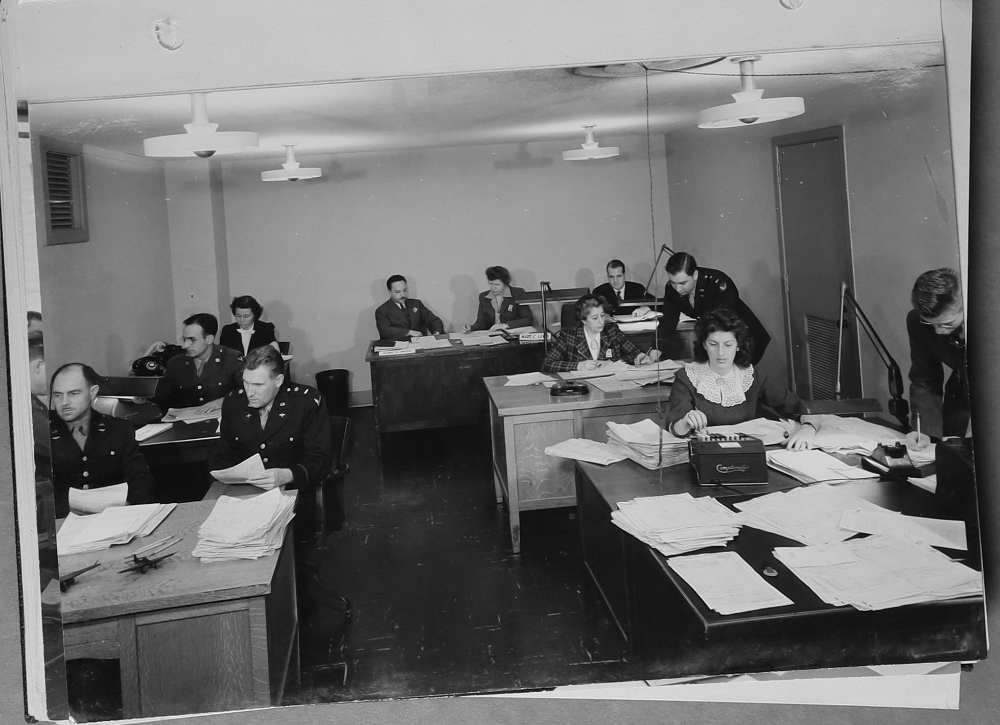
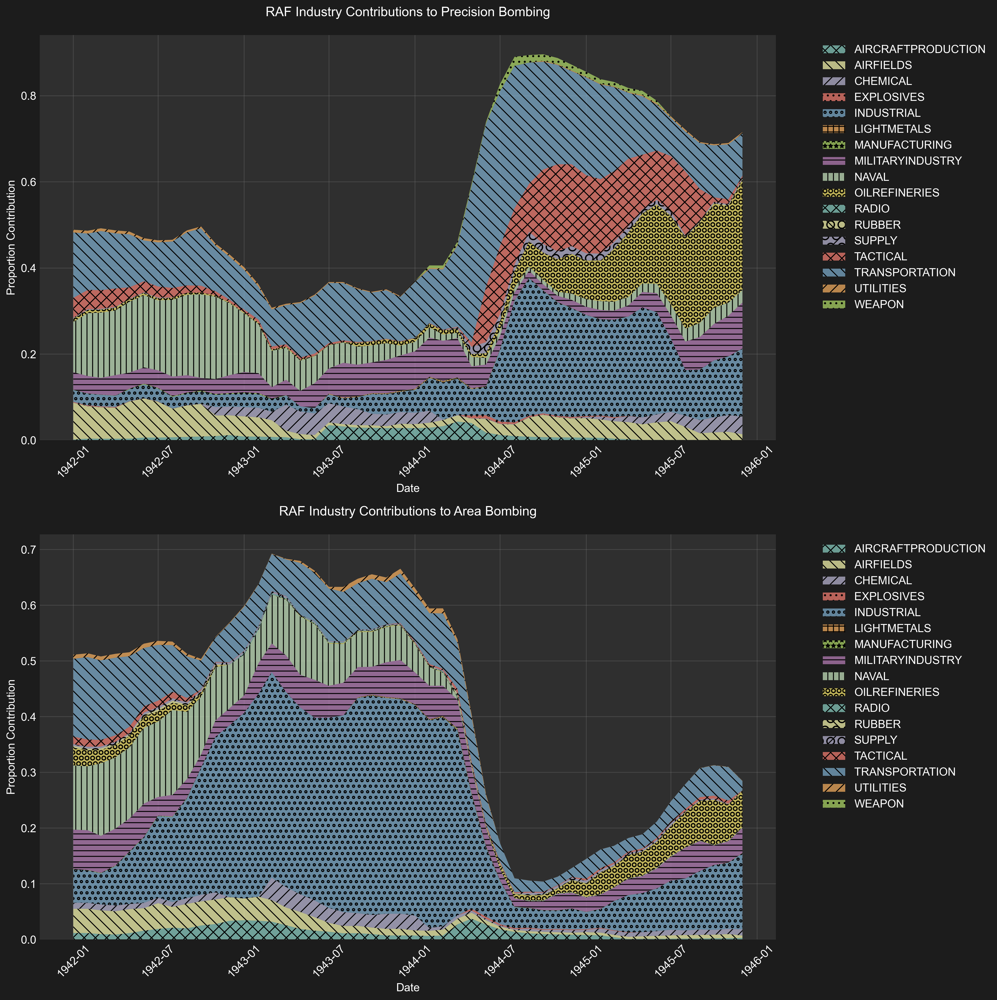

# Chapter 1: Bombing by the Numbers

"It is believed that anyone studying the figures will conclude that the differences, viewed in their proper perspective, become quite insignificant, that the larger lessons to be learned from the figures are clear and unmistakable, and that the decisive role of air power stands out in bold relief."
[*—United States Strategic Bombing Survey, *Summary Report* (1945)*](ussbs_reports/SUMMARY_REPORT/IMG_8296.JPG)

## A New Approach

The historiography of strategic bombing in World War II has largely relied on aggregate statistics to support broader arguments about the nature and evolution of the bombing campaign. Scholars frequently cite total tonnage dropped, overall accuracy rates, and casualty figures to support their positions[^1]. Most of these statistics come from the first few pages of either the Summary Report or Overall Report of the United States Strategic Bombing Survey (USSBS) (e.g. [Overall Report](ussbs_reports/OVERALL_REPORT/IMG_8235.JPG) and [Summary Report](ussbs_reports/SUMMARY_REPORT/IMG_8218.JPG)), displaying a relative lack of depth in previous historical analysis. While these statistics are valuable for broad analysis, they obscure the distributed nature of how the strategic bombing campaign was conducted. This thesis attempts to remedy this by creating and analyzing the most comprehensive raid-by-raid dataset of the European theater to date, based on the original computer tabulations of the United States Strategic Bombing Survey (USSBS).

The United States Strategic Bombing Survey (USSBS) was established by Secretary of War Henry Stimson in November 1944, following a directive from President Roosevelt. Led by civilian chairman Franklin D'Olier, the survey brought together over 1,000 civilian and military personnel with the ambitious goal of conducting an impartial and expert study of the effects of aerial attacks on Germany. While officially independent, the survey was closely tied to Army Air Forces leadership who hoped to use its findings to advocate for an independent air force [Delori](./corpora_cited/delori_memory/chunks/delori_memory_0004.txt).

Using what was likely an IBM 405 Alphabetical Accounting Machine, the USSBS Tabulating Service processed detailed data for every recorded bombing mission "FROM THE FIRST ATTACK TO 'V-E' DAY"[^2]. These original computer printouts, stored at the [National Archives in College Park, Maryland](https://catalog.archives.gov/id/561292), contain detailed information about each raid, including target location, air force and squadron identification, number of aircraft, bombing altitude, visibility conditions, and precise bomb loads broken down by type and fuzing.

The Allied strategic bombing campaign represented a form of warfare that was unprecedented in its diffusion across time and space. While some narratives attempt to pigeonhole strategic bombing within traditional pitched battle abstractions like "Battle of the Ruhr" or "Big Week", strategic bombing was in fact continuous and diffuse in nature. It was recorded mission-by-mission, not battle-by-battle. Thus historians must move away from the Thucydidean tradition of historicizing warfare in terms of grand battle narratives, and instead analyze warfare computationally, holistically, and granularly. This thesis attempts to take a step in this direction.

*Figure 1.1: Example of USSBS computer printout showing detailed raid data of attacks on oil refinery in Korneuburg, Austria.*

While summary statistics from the USSBS and other sources like the USAAF Office of Statistical Control (OSC), British Air Ministry, and British Bombing Survey Unit have been widely available—showing aggregate tons dropped by year, month, air force, or bomb type—the more granular, raid-level data has remained largely inaccessible and unanalyzed. Historically, this is not surprising given the era's technological limitations. The WWII era was one of bureaucratic paper and tyrannizing statistics, where even simple summations could only be performed by those with access to the resources, data, and computational power of the state apparatus. Today, given that an individual with a laptop and an internet connection has the power to perform more computational work than the entire US Government did in 1944, it is unacceptable that historians continue to rely on the authority of more than eighty-year-old state-generated statistics and summarization.

In that spirit, this thesis will open-source all necessary data and code to enable further analysis of the strategic bombing campaign. Along with a fully digitized collection of the summary reports of the USSBS, this includes the creation and analysis of a comprehensive digital database derived from 8,134 photographs of original USSBS computer printouts. Each photograph was processed using Azure Optical Character Recognition (OCR) and Document Intelligence to extract 31 distinct fields of data per raid, including target identification (location, name, coordinates, and code), mission details (date, time, air force, and squadron), operational parameters (number of aircraft, altitude, sighting method, visibility, target priority), and detailed bomb loads (numbers, sizes, and tonnages of high explosive, incendiary, and fragmentation munitions).

*Figure 1.2: Computers for the Office of Statistical Control (OSC). Picture is from a pamphlet entitled "WHAT YOU SHOULD KNOW ABOUT COMBAT ANALYSIS" contained in the USSBS archive. The woman on the right is using a [Comptometer](https://en.wikipedia.org/wiki/Comptometer), a mechanical calculator.*

The extracted data underwent multiple stages of validation and correction, combining deterministic rules based on known bomb specifications with context-aware large language models to ensure accuracy. A final manual review process helped identify and remove summation rows that could have led to double-counting of mission data. The resulting dataset contains over 54,608 individual bombing missions. [The complete dataset](attack_data/combined_attack_data_checked.csv), along with all code used in its creation, has been made publicly available to enable further research and analysis. A detailed description of the methodology, including specific validation rules and data processing steps, may be found here: [methodology_attack_data.md](methodology_attack_data.md).

Our analysis of World War II strategic bombing data reveals strong alignment with historical records for United States Army Air Forces (USAAF) operations while highlighting significant gaps in Royal Air Force (RAF) records. The dataset's totals for the Eighth Air Force (697,814 tons) and Fifteenth Air Force (290,529 tons) closely match the figures reported by both the Office of Statistical Control (692,918 and 312,173 tons respectively) and the United States Strategic Bombing Survey Tabulating Service. This consistency validates our dataset as a reliable foundation for analyzing USAAF strategic bombing operations. However, our RAF Bomber Command total of 701,246 tons falls significantly short of the Air Ministry's reported 1,066,141 tons, with the majority of missing data concentrated in industrial target categories—primarily city areas. While this discrepancy requires careful consideration when drawing conclusions about RAF operations, the dataset still provides valuable insights into bombing patterns and strategic priorities. The temporal and categorical distribution of raids, choice of munitions, and evolution of targeting strategies can be analyzed with confidence for USAAF operations, while RAF trends can be studied with appropriate caveats regarding the underrepresentation of industrial targeting. For a comprehensive breakdown of the data, including detailed charts, tables, and temporal analyses, see the [full results documentation](results_attack_data.md).

While it is the hope of this researcher that the compiled dataset may prove useful for future historians for a variety of forms of historical analysis, in this thesis our focus lies in observing whether the oft-noted strategic shift from precision to area bombing actually occurred, especially in the context of the USAAF. This will be explored in the next section.

## Evaluating the Strategic Shift from Precision to Area Bombing

This section examines empirically whether and to what extent the strategic bombing campaign shifted from precision to area bombing. Our analysis will proceed as follows:

1. We present our approach to categorizing bombing missions, using an algorithm that considers both munition types and tactical patterns rather than relying on stated objectives.
2. We show that precision bombing accounted for 69% of all bombs dropped, but demonstrate why this figure requires careful interpretation when compared to USSBS assessments.
3. We examine how marshalling yard raids, particularly by the USAAF, often served as a proxy for area bombing despite their official designation as precision targets.
4. We contrast the USAAF's concealed area bombing with the RAF's more overt embrace of the strategy in the records, particularly in their targeting of "Industrial" areas.
5. We demonstrate that while area bombing increased over time in specific sectors, precision bombing remained the predominant strategy throughout the war.

Through this analysis, we challenge existing narratives that overemphasize the shift toward area bombing while unveiling the extent to which USAAF participated in area bombing tactics. 

Our methodology for categorizing tons of bombs as being either part of "area" bombing or "precision" bombing involved developing a nuanced categorization algorithm. This algorithm considers both the types of munitions used and the temporal and spatial relationships between raids. Initially, we considered using a simple ratio of incendiary to high explosive/fragmentary bombs as the determining factor. However, this approach proved inadequate as it failed to capture tactics that combined high explosive and incendiary bombs to maximize destruction.

Our algorithm, implemented in [`categorize_bombing.py`](attack_data/categorize_bombing.py), uses the following logic:

1. Any mission that deployed incendiary bombs is automatically categorized as "area" bombing.
2. For missions using only high explosive bombs, the algorithm:
   - Examines all other missions targeting the same location within a 4-hour time window before and after the mission.
   - If any related mission within this window used incendiaries, the mission is categorized as "area" bombing.
   - Only if no related missions used incendiaries is the mission categorized as "precision" bombing.

This approach, while generous in identifying area bombing, provides a valuable analytical framework for understanding strategic bombing patterns, despite some limitations in edge cases such as oil refinery raids.

Our analysis initially appears to show a predominance of precision bombing, with 69.0% (1,211,273 tons) of all bombs dropped being categorized as precision bombing compared to 31.0% (544,681 tons) categorized as area bombing. 

However, these figures require careful interpretation when compared to the United States Strategic Bombing Survey's own analysis. The USSBS reported that "during the period from October 1939 to May 1945 the Allied Air Forces, primarily the RAF, dropped over one-half million tons of high explosives, incendiaries, and fragmentation bombs in such area raids on the 61 German cities." This apparent similarity to our figure of 544,681 tons is misleading. 

First, our dataset is missing nearly 400,000 tons of RAF bombing missions, primarily those targeting industrial areas and cities (See [results_attack_data.md](results_attack_data.md#comparison-of-total-bomb-tonnage) for more details). If we adjust for this missing data, our estimate for area bombing would increase to approximately 940,000 tons—nearly double the USSBS figure. 

This discrepancy stems from fundamentally different approaches to categorization. The USSBS used a narrow definition of area raids as those "intentionally directed against a city area by more than 100 bombers with a bomb weight in excess of 100 tons, which destroyed more than 2 percent of the residential buildings in the city" [USSBS 1945](ussbs_reports/OVERALL_REPORT/IMG_8271.JPG). The Survey acknowledged the limitations of this intent-based categorization, noting that "in many cases bombs dropped by instruments in 'precision' raids directed against specific targets fell over a wide area comparable to that covered normally in an 'area' raid."

Our methodology, by contrast, focuses on tactical implementation rather than stated intent. By categorizing any mission using incendiaries—or any mission temporally and spatially associated with incendiary use—as area bombing, our analysis captures the operational reality of the bombing campaign. This approach reveals how supposedly precision targets often became de facto area raids through the combined use of high explosives and incendiaries. The USSBS itself acknowledged this reality, noting that when precision raids targeted facilities within cities, such missions "had the practical effect of an area raid against that city" even while being recorded as precision attacks in air force records [USSBS 1945](ussbs_reports/OVERALL_REPORT/IMG_8271.JPG).

The most damning instance of such miscategorization occurred in the transportation sector, where the USAAF would often designate marshalling yards (a group of railroad tracks and yards, together with the buildings and equipment associated with railroad operations) as the primary targets. Despite this designation, incendiary bombs were frequently used in these raids, which is inexplicable given their ineffectiveness against most rail infrastructure.

We can observe the growth in the use of area bombing tactics in the industry contribution graph from the USAAF (Figure 1.3), which shows a steady increase in the proportion of bombs dropped related to area bombing, particularly in the transportation sector, from late 1943 onwards.

*Figure 1.3: Industry contribution to USAAF bombing missions, showing the shift from precision to area bombing.*[^3]

We also see a marked increase in the use of area bombing in the transportation industry specifically, in late 1944 (Figure 1.4):

*Figure 1.4: Area vs Precision Bombing USAAF Transportation. Note the spike in area bombing in late 1944.*

Other academics, particularly those from the moralist camp, have noted this shift. Lucien Mott, in his analysis, highlights the moral implications of targeting civilian populations under the guise of military objectives, questioning the efficiency and ethicality of such strategies [(Lucien Mott, *Strategic Bombing Campaign During World War Two: Pinpoint vs Area Bombing*)](./corpora_cited/lucien_pinpoint/chunks/lucien_pinpoint_0036.txt). Similarly, Robert Anthony Pape discusses how transportation targets were often nominally designated as military objectives, yet the use of incendiaries indicates a broader aim to wreak havoc on civilian areas [(Pape, *Why Study Military Coercion?*)](./corpora_cited/pape_coercion/chunks/pape_coercion_0177.txt)). Charles S. Maier also critiques the escalation of destruction, noting how the USAAF's strategy evolved to shroud large-scale area bombings with specific targets, effectively blurring the lines between military and civilian objectives [(Maier, *Targeting the City*)](./corpora_cited/maier_city/chunks/maier_city_0011.txt)). Our data allows for these claims to be empirically validated.

The Transportation Division Report of the USSBS provides further evidence that the use of incendiaries in transportation raids had little tactical justification. The report lists the most effective methods of disrupting rail transport, with "systematic line cuts (preferably bridges, underpasses, and viaducts)" and "throats of yards and other choke points" being the top priorities ([USSBS Transportation Report](ussbs_reports/TRANSPORTATION_REPORT/IMG_10557.JPG)). These targets required only high explosive bombs and, due to their concentrated nature, far fewer resources than what was needed to incapacitate an entire marshalling yard.

The only mention of incendiaries being effective is in the case of rolling stock, and then only against "old-style engine houses and car shop facilities." Even in the case of freight stations, which the report cites as vulnerable to fire damage, the on-the-ground reality suggests limited effectiveness. For instance, the report notes that even when incendiaries successfully destroyed the roofs and superstructure of freight stations at "Köln Gereon Yard, Essen central freight station, and Munster," their "very heavy concrete platforms... were still sufficient for the volume of traffic which continued to move" ([USSBS Transportation Report](ussbs_reports/TRANSPORTATION_REPORT/IMG_10611.JPG)).

This raises serious questions about the tactical rationale behind the extensive and increasing use of incendiaries in transportation raids. If we examine target selection from first principles, considering the predominantly non-flammable nature of rail infrastructure and the USSBS's own conclusion that delayed-action high explosive bombs were most effective for yard disruption, the widespread deployment of incendiaries appears strategically questionable. The fact that many of the USAAF's heaviest area bombing missions targeted marshalling yards, combined with the ineffectiveness of incendiaries against such targets, strongly suggests that these raids were intended to achieve broader urban destruction rather than to destroy specific transportation objectives[^4]. If this is the case, then the misrepresentation of these raids as precision bombing in the historical record represents a dangerous state-sponsored concealment of the true character of the American strategic bombing campaign. 

The RAF, by contrast, more blatantly or perhaps more proudly displays its embrace of area bombing in its records, recording these missions as being part of the "Industrial" category, however their targets descriptions are often listed as "town" or "city" area[^5]. These RAF records show a disposition towards area bombing of "Industrial" targets (meaning cities and industrial areas). This was the case especially early in the war (1943) (the period for which we have the most reliable data for the RAF) where area bombing accounted for around 60% of all bombs dropped. 

*Figure 1.5: Industry contribution to RAF bombing missions, showing the dominance of area bombing.*

*Figure 1.5: Area vs Precision Bombing RAF. Note the dominance of area bombing in the industrial sector around 1943.*

The drop in the proportion of area bombing in the RAF in the latter part of the war can likely be attributed to the missing data from the RAF bombing missions. Given that most of the missing data is from the industrial sector, it is evident that the RAF continued to employ area bombing tactics late into the war. Even without this data, we see an increasing proportion of area bombing in the RAF in the latter part of the war, mostly as a result of the increasing proportion of industrial bombing.

Having examined the most dramatic instances of area bombing and their trends, we must be careful not to overstate the shift towards area bombing, particularly in the case of the USAAF. Despite the increasing use of area bombing tactics in certain sectors, precision bombing still accounted for nearly 70% of all bombing missions throughout the latter stages of the war (1944-1945). This aspect of the campaign included only high explosive bombs, a majority of which were committed to transportation targets and oil refineries. While these raids could still have impacted population centers, the lack of incendiaries suggest both a lack of intent to destroy urban populations and a lack of effectiveness in doing so (high explosive bombs alone did not create the sort of firestorms that killed hundreds of thousands of people). Since others have emphasized the shift towards area bombing late in the war, authors often fail to effectively analyze the impact of this late precision bombing campaign.

As we move to examine the economic effectiveness of the strategic bombing campaign in the next section, we will seek to understand the contributions of area and precision bombing to the overall destruction of the German economy in general and relative to the land invasion, in an effort to determine which strategy truly won the war.

[^1]: Examples include: [Davis 1993](./corpora_cited/davis_spaatz/chunks/davis_spaatz_0854.txt) analyzes the Eighth and Fifteenth Air Forces, citing 1,005,729 tons of bombs dropped (with 28% on marshaling yards, 13% on oil targets), along with RAF Bomber Command's additional 1,047,412 tons. [Webster and Frankland 1961](./corpora_cited/butler_v3/chunks/butler_v3_0298.txt) focus on aggregate statistics in their analysis of the final Battle of the Ruhr (October-December 1944), citing "14,254 sorties... 60,830 tons of bombs... and only 136 bombers failed to return". [Knell 2003](./corpora_cited/knell_city/chunks/knell_city_0293.txt) likewise emphasizes total tonnage, noting that "well over 1 million tons of bombs rained down on Europe in 1944". Most of these statistics come from either the Summary Report or Overall Report of the United States Strategic Bombing Survey (e.g. [Overall Report](ussbs_reports/OVERALL_REPORT/IMG_8235.JPG) and [Summary Report](ussbs_reports/SUMMARY_REPORT/IMG_8218.JPG)). Note that these statistics are from the first few pages of the USSBS reports, displaying a relative lack of depth in historical analysis.

[^2]: This is stated on the cover of every folder in the Statistical Attack Data Series, e.g. [Oil Refineries Folder Cover](attack_data/IMG_0381.JPG)

[^3]: One must generally ignore the proportion values for the first two years of the war as the number of tons dropped is so low that the proportion values are not significant. 

[^4]: See [Top Missons Transportation USAAF Area](attack_data/reports/top_missions/top_missions_transportation__usaaf_area.csv) for a list of the heaviest area bombing missions on transportation targets.

[^5]: See [Top Missons Industrial RAF](attack_data/reports/top_missions/top_missions_industrial__raf_area.csv) for a list of the heaviest area bombing missions on industrial targets.