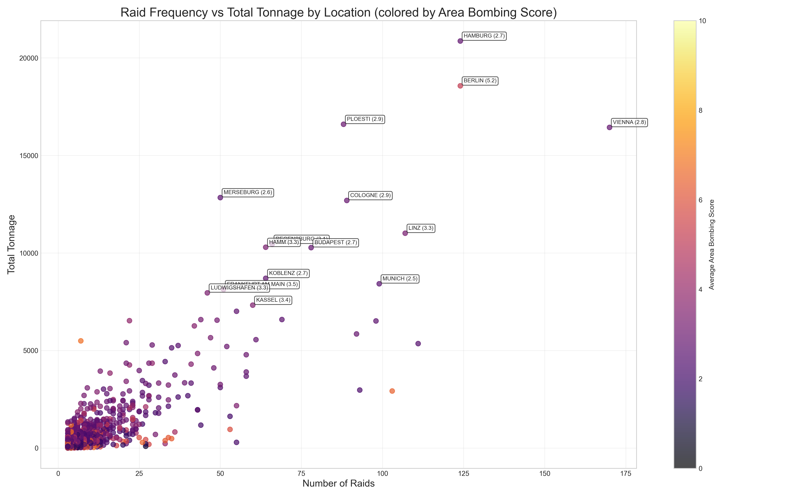

# Chapter 1: Strategic Bombing Campaign by the Numbers

The historiography of strategic bombing presents us with several compelling narratives about how the campaign should have unfolded. The Realist perspective suggests an inexorable progression from precision to area bombing driven by operational necessity—as bombing accuracy proved elusive and losses mounted, military leaders would naturally shift toward less precise but more survivable tactics. The Moralist perspective similarly predicts a dominance of area bombing, but attributes it to the destructive impulses of military leadership using precision bombing merely as a veneer to mask their true intentions. Building on J.F.C. Fuller's analysis of warfare in modern mass societies, a third perspective would predict an overwhelmingly barbaric approach prioritizing destruction above all else—even military efficiency—as the emotional connection between populace and state drove warfare toward its most extreme form.

Yet the empirical evidence presents a striking paradox. Analysis of mission-level data from the European theater reveals that none of these predicted patterns materialized. Rather than a binary distinction, bombing operations existed on a spectrum from precision to area targeting, classified by target type, tonnage deployed, and incendiary usage. Using this nuanced classification system, we find no evidence of the commonly asserted total shift from precision to area bombing over the course of the war. While a modest increase in area bombing characteristics emerged in later years, precision methods persistently dominated throughout the conflict—a finding that contradicts popular narratives distorted by either grandiose theories or selective focus on emotionally charged examples.

In our analysis, we employ a novel comprehensive approach based on a complete digitization of the United States Strategic Bombing Survey (USSBS) attack-by-attack data. This unprecedented effort involved processing over 8000 of early computer readouts from the National Archives, extracting locations, tonnage, munition types, and other critical operational details for every recorded bombing mission in the European theater. Prior historical analyses have typically focused on specific campaigns or cities—Dresden, Berlin, or Schweinfurt—without examining the complete dataset, leaving scholars unable to identify broader patterns or make definitive claims about the overall character of the air war. Recent advancements in optical character recognition, artificial intelligence, and cloud computing have made this comprehensive digitization possible for a single researcher, allowing for the first data-complete analysis of strategic bombing operations.

To systematically evaluate the nature of each bombing mission, we developed a three-dimensional scoring algorithm that quantifies each raid's similarity to area bombing tactics on a 0-10 scale. The system combines three weighted metrics: target designation (40% of total) assigns 10 points to raids targeting industrial areas and 0 points to precision targets; tonnage score (30%) ranks each raid by bomb tonnage dropped, converting percentile ranks directly to a 0-10 score; and incendiary score (30%) employs a non-linear piecewise function that assigns progressively higher values to raids with greater percentages of incendiary bombs, with thresholds at the 75th, 90th, 95th, and 99th percentiles creating a stepped scoring that heavily rewards the most incendiary-intensive raids.[^1] These three components are combined in a weighted average and normalized to produce the final 0-10 area bombing score, with higher scores indicating stronger area bombing characteristics.

This weighted approach creates a nuanced classification spectrum where, for instance, a heavy raid on a designated city area without significant incendiary usage would be classified as "area bombing" but not necessarily "heavy area bombing." Conversely, even a lighter raid combining substantial incendiaries with city area targeting would qualify as area bombing. Raids employing unusually heavy tonnage on specific targets with minimal incendiary usage would fall into the "mixed" category, representing an intermediate position between precision and area bombing approaches. This multidimensional system provides a more sophisticated assessment than the USSBS's original narrow definition of area raids as those "intentionally directed against a city area by more than 100 bombers with a bomb weight in excess of 100 tons, which destroyed more than 2 percent of the residential buildings in the city."[^2]

The scale and weights used in this analysis are admittedly arbitrary; however, their value lies in consistent application across all operations, enabling meaningful tracking of relative changes over time. While alternative weighting schemes might alter individual raid classifications, the core findings—particularly the absence of a wholesale shift from precision to area bombing—remain robust. The complete dataset and code are available for researchers wishing to test alternative analytical frameworks.

The results decisively challenge the conventional understanding of strategic bombing evolution. Rather than a dramatic shift from precision to area bombing, we find relative stability throughout the conflict. The mean area bombing score across all raids was 3.27 out of 10, with a median of 2.7—indicating that most bombing operations maintained significant precision elements throughout the war with a long-tail of outlier area bombing raids. While there was a modest upward trend in area bombing scores over time (from approximately 2.5 to 3.5), this change falls well within one standard deviation and represents a refinement rather than transformation of bombing doctrine.

*Figure 1.1: Yearly distribution of bombing categories, showing the relative stability of precision bombing throughout the conflict.*

The yearly distribution of bombing categories offers additional insight into this evolution. Very precise bombing (scores 0-2) maintained a relatively stable proportion throughout the remainder of the war. Mixed bombing approaches (scores 4-6) increased modestly from around 10% early in the war to 18.6% at their peak. Clear area bombing (scores 6-8) and heavy area bombing (scores 8-10) did increase over time, with heavy area bombing emerging from non-existence in 1941 to a small but notable presence by 1944. 

This modest increase in area bombing coincided with the period of heaviest overall bombing activity and significantly increased tonnage per raid—a correlation that suggests operational scale rather than doctrinal transformation drove these changes. This pattern is what we would expect: some increase in area bombing characteristics as operations intensified, but not the dramatic wholesale shift from precision to area bombing that dominates conventional narratives. The data reveals a nuanced reality where tactical diversification occurred within a framework that remained fundamentally committed to precision approaches.

*Figure 1.2: Yearly evolution of area bombing scores, demonstrating that each subsequent year remained within one standard deviation of previous years.*

Examining operational metrics reveals additional nuance in the bombing campaign's development. Average tonnage per raid increased over time, reflecting enhanced capabilities and logistical improvements, though with significant variability. Notably, the incendiary percentage remained relatively flat throughout the European theater, contradicting the notion of a progressive shift toward fire-based area bombing tactics. The most dramatic change was in raid frequency, which increased exponentially in early 1944, representing a quantitative rather than qualitative evolution in bombing operations.

*Figure 1.3: Quarterly evolution of key bombing metrics, showing increased tonnage but stable incendiary percentages.*

*Figure 1.4: Comparison of high-explosive and incendiary tonnage by year, illustrating parallel growth rather than substitution.*

Breaking down the data by target category provides further evidence against a hidden shift toward area bombing. While the "industrial" category consistently showed the highest area bombing scores, these remained stable across the war years rather than progressively increasing. Other high-scoring categories included manufacturing, aircraft production, military industry, and oil refineries—with oil targets actually showing decreased area bombing scores in later years. No category demonstrated the dramatic escalation that would indicate either a deliberate concealment of area tactics or a fundamental doctrinal shift.

*Figure 1.5: Comparison of area bombing scores by target category, showing consistent patterns rather than progressive escalation.*

*Figure 1.6: Heatmap of average area bombing scores by category and year, demonstrating stability across most target types.*

*Figure 1.7: Radar chart showing component scores for the entire dataset.*

One persistent claim in strategic bombing historiography deserves particular scrutiny: the assertion that transportation targets served as a pretext for area bombing. Several prominent scholars have advanced this theory—Lucien Mott argues that transportation targeting masked deliberate attacks on civilian populations [(Lucien Mott 2019)](https://bomberdata.s3.us-east-1.amazonaws.com/Readings/corpora/lucien_pinpoint/chunks/lucien_pinpoint_0036.txt), while Robert Anthony Pape contends that marshalling yards and rail centers functioned as nominal military objectives concealing broader civilian targeting [(Pape 1960)](https://bomberdata.s3.us-east-1.amazonaws.com/Readings/corpora_cited/pape_coercion/chunks/pape_coercion_0177.txt).[^3] These scholars point to the use of incendiary munitions against transportation infrastructure—weapons tactically ill-suited for disrupting rail operations—and excessive tonnage deployments as evidence of disguised area bombing.

However, our comprehensive data analysis thoroughly refutes these claims. Transportation targets consistently maintained one of the most precise bombing profiles throughout the war, with a median area bombing score of just 2.4—well within the "precise bombing" classification. The incendiary component averaged a mere 1.0 across all transportation raids, significantly lower than the dataset average. Only 7.3% of transportation attacks fell into the "mixed" category (scores 4-6), with none qualifying as true area bombing. The distribution of bombing scores for transportation targets shows a pronounced concentration in the precise categories, directly contradicting the notion that these missions served as cover for civilian targeting. 

Rather than transportation, the misclassification appears in the "industrial" category, where targets labeled as "city area," "town area," or "unidentified target" reveal the true locus of area bombing operations. This classification is particularly significant, as the USSBS dedicated several folders to this "industrial" category, with the overwhelming majority of targets therein being city areas, town areas, or unidentified targets associated with cities. This categorization effectively served as a catch-all for area bombing operations targeting urban centers, lending some credence to scholarly claims about classification manipulation.

This misclassification can be interpreted in two ways. One perspective suggests a deliberate concealment of area bombing practices, obscuring civilian targeting behind industrial designations. Alternatively, it may reflect the USAAF's doctrinal commitment to precision bombing—so deeply ingrained that even when targeting entire city areas, operations were conceptualized as attacking "city industry" or "German workers," thus maintaining the fiction of precision targeting. Regardless of interpretation, our methodology classifies these operations as area bombing based on their operational characteristics rather than their administrative designation, providing a more accurate representation of bombing practices throughout the campaign.

*Figure 1.8: Radar chart showing component scores for transportation targets. While the low target type score (0/10) merely confirms these weren't designated as city targets, the consistently low incendiary usage (1.0/10) and relatively moderate tonnage deployment (6.7/10) demonstrate that transportation raids maintained genuine precision characteristics in practice, contradicting assertions they functionally served as disguised area attacks.*

*Figure 1.9: Distribution of bombing categories for transportation targets, showing the overwhelming predominance of precision bombing approaches.*

*Figure 1.10: Area bombing score distribution for transportation operations, revealing a strong concentration in the precise bombing range.*

The most notable exception to these patterns was Berlin, which experienced significantly higher area bombing tactics. Only 23% of Berlin operations qualified as very precise or precise bombing, with 50% falling into mixed categories and nearly 27% constituting clear or heavy area bombing. The average incendiary percentage for Berlin proper reached 46%—extraordinarily high compared to other targets—with a median area bombing score of 4.9. [^4] This exceptional treatment of the Nazi capital suggests that emotional or symbolic factors may have influenced targeting decisions for particularly emblematic objectives.

*Figure 1.11: Distribution of bombing categories for Berlin, showing a significantly higher proportion of area bombing compared to the overall campaign.*

*Figure 1.12: Area bombing score distribution for Berlin operations, demonstrating the exceptional nature of the capital's treatment.*

Other cities received similar levels of bombing in terms of number of raids and total tonnage. Vienna, Hamburg, Graz, Linz, Munich, Ploesti, and Budapest all experienced substantial bombing campaigns, with 1944 standing out as having an exceptionally high number of raids concentrated on these major urban centers. The frequency of bombing increased exponentially during this period, creating a near-constant presence of Allied aircraft over certain cities.

*Figure 1.13: Comparison of top cities by raid count and total tonnage, revealing that certain locations were subjected to an exceptional number of raids.*

*Figure 1.14: Yearly heatmap of bombing intensity for the top 50 locations, showing the dramatic concentration of raids in 1944.*

In this dataset, frequency is not a dimension of precision, as from the perspective of the bomber this metric is operationally irrelevant. Precision occurs on a raid-by-raid level—it concerns the intended target of each specific mission and the tactical approach chosen to attack it. However, from the perspective of those being bombed, whether the bombers above intended for any specific raid to be precise becomes increasingly meaningless when raids occur every few days. Whether attacking a munitions factory on the outskirts one day or a marshalling yard in the center of town the next, even if both missions are technically "precise," civilians experience a constant onslaught that, in essence, begins to *feel* much more like area bombing.

One caveat is that a raid that triggers a firestorm engulfing a neighborhood or even a whole city feels considerably more destructive and apocalyptic than a raid on a marshalling yard where some high-explosive bombs miss their target and destroy nearby homes. This experiential difference explains why a substantial weight was assigned to the proportion of incendiaries used in our classification system. Nevertheless, constant aerial bombardment—whether technically precise or not—from the perspective of those under the bombs creates a feeling of total war regardless of the technical classification of individual raids.[^5]

This divergence between operational intent and civilian experience represents a fundamental tension in strategic bombing historiography. While our analysis focuses on the perspective of the bombers—examining their operational decisions, targeting strategies, and tactical approaches—we must acknowledge that historical narratives have often privileged the perspective of those being bombed. This civilian-centered approach naturally emphasizes the most dramatic and destructive instances of bombing.

The USAAF conducted bombing operations at over 3,700 distinct locations throughout Europe. The top 10 most bombed locations received only 13.5% of all bombing tonnage, while the top 50 locations received 38.2%. It required 118 locations to account for 50% of all bombing, 307 locations for 75%, and 745 locations for 90% of the total bombing effort.

While the USAAF dramatically expanded the number of locations bombed, from fewer than 200 per quarter in early 1943 to over 800 locations per quarter by mid-1944, we must acknowledge a significant concentration trend. By Q4 1944, the top 10% of locations received 70.7% of all bombing tonnage—a dramatic increase from just 34.9% in Q3 1943. This concentration meant that for civilians in these heavily targeted cities in that quarter of 1944, bombing raids—even if technically classified as precision operations—occurred with increasing frequency, creating an experience for those on the ground that more closely resembled area bombing.

*Figure 1.15: Evolution of bombing concentration metrics over time, showing the share of total bombing received by the top 1% and top 10% of locations by quarter.*

*Figure 1.16: Evolution of the cumulative number of locations bombed over time, showing a dramatic increase from early 1943 to mid-1944.*

This concentration pattern can be explained by several factors that align with precision bombing doctrine rather than contradicting it. First, German industrial production was itself concentrated in and around major urban centers, making these locations legitimate military targets under precision bombing principles. Second, the USAAF likely discovered that repeatedly targeting key facilities prevented repairs and created more permanent disruption to Nazi war production—a refinement of precision strategy rather than abandonment.

This apparent paradox—increasing concentration amid persistent precision characteristics—highlights a critical nuance in strategic bombing evolution. While select locations experienced dramatically intensified bombing frequency, the operational characteristics of individual raids remained largely consistent with precision doctrine. Our data shows no significant increase in per-raid tonnage or incendiary usage even as certain cities faced increasingly frequent attacks. Rather than abandoning precision for area bombing, the USAAF appears to have scaled up precision operations against legitimate industrial and military targets concentrated within key urban areas and their environs. For civilians in these locations, the practical distinction between precision and area bombing became increasingly theoretical—constant bombardment of various "precise" targets throughout a city created an experience functionally indistinguishable from area bombing, despite each individual raid maintaining technical precision characteristics. This explains why both contemporary accounts and subsequent historiography often characterized late-war bombing as predominantly area-focused, even while operational metrics tell a different story.

Even within the top 10% of most heavily bombed locations—those receiving 70.7% of all bombing tonnage by Q4 1944—the operational characteristics remained distinctly different from Berlin's exceptional treatment. These cities experienced more frequent raids, but each individual raid maintained precision attributes: specific military-industrial targets (marshalling yards, oil refineries, munitions factories) rather than "city areas"; moderate rather than excessive tonnage per raid; and notably low incendiary usage compared to true area bombing operations. This pattern strongly suggests that the USAAF was pursuing legitimate military objectives within these cities rather than targeting urban areas for destruction. The concentration resulted from the unfortunate reality that German war production facilities were themselves concentrated in and around urban centers, not from an abandonment of precision doctrine.

If the bombing campaign had truly shifted from precision to area bombing as many historians have contended, the latter part of the war would have looked much more like Berlin throughout Europe. We would have observed several clear patterns: a steady increase in the proportion of incendiary munitions; target classifications progressively migrating toward the "industrial" category; transportation targets adopting area bombing characteristics; tonnage per raid showing consistent increases; and all components of our area bombing score—target type, tonnage, and incendiary percentage—displaying coordinated increases over time. Instead, we observed that incendiary proportions remained flat; target classifications showed no migration toward "industrial" categories; transportation targets maintained precision characteristics; tonnage per raid showed no meaningful trend; and the components of our area bombing score displayed no coordinated increases. Thus, the conclusion is inescapable: there was no wholesale shift from precision to area bombing in the USAAF strategic bombing campaign.

## Conclusion

The persistence of precision bombing throughout the war fundamentally challenges the traditional historical narrative. The conventional explanation—that a wholesale shift from precision to area bombing occurred—is not supported by the empirical evidence. Our comprehensive analysis of the raw data, examining target categorization, tonnage deployed, and incendiary proportions, reveals a more nuanced reality. While area bombing did increase in specific instances like Berlin and occurred more frequently in absolute terms as operations expanded, it remained proportionally consistent and concentrated in particular symbolic targets rather than representing a doctrinal transformation. This analysis of bomber intent and operational classification in no way diminishes the experience of the bombed—our aim is not to dismiss civilian suffering, but rather to contribute to a more accurate understanding of the actual strategic doctrine that guided bombing operations. The campaign was predominantly characterized by precision approaches, with a mean area bombing score of just 3.27 out of 10 across all raids. This finding directly contradicts the commonly held notion of a dramatic "0 to 1" shift from precision to area bombing by the USAAF throughout the war. Instead, the evidence points to a strategic continuity with tactical adaptations, maintaining precision as the fundamental operational approach even as the scale and complexity of the air campaign reached unprecedented levels.

*N.B.: To facilitate further research and enable independent verification of these findings, a web application has been developed that provides comprehensive access to the complete bombing dataset. This resource allows researchers to explore operations by year, target category, city, or any combination of factors, with the ability to download raw or processed data for independent analysis: https://strategic-bombing-data.streamlit.app/. The reader, if they are reading this thesis on paper, is encouraged to please pause and visit the website.*

[^1]: The USSBS folders marked as "industrial" predominantly contain targets with names such as "city area," "town area," or "unidentified target" over a city. This classification is a misnomer, as it does not accurately reflect the actual nature of the targets being bombed. Therefore this whole category we weigh towards area bombing classification.

[^2]: [(USSBS Overall Report)](https://bomberdata.s3.us-east-1.amazonaws.com/Archive/Reports/BOX_47/FOLDER_2/OVERALL_REPORT/IMG_8271.JPG). See the script that did the classification at [visualize_usaaf_bombing.py](./attack_data/deployment_usaaf_dashboard/visualize_usaaf_bombing.py).

[^3]: Mott, Lucien. *Pinpoint: The Evolution of Precision Bombing*., 36; Pape, Robert Anthony. *Coercion: The Logic of Air Power and the Bombing of Civilian Targets*., 277.

[^4]: Note that this excludes Berlin suburbs such as Templehof and Siemenstadt which received more precise attacks. 

[^5]: It is important to acknowledge a significant limitation in our analysis: it focuses exclusively on USAAF raids, omitting Royal Air Force (RAF) operations. From the perspective of those being bombed, the distinction between RAF or USAAF aircraft was largely irrelevant. While RAF bombing data is contained within our dataset and was documented in the USSBS, we discovered that a substantial number of raids appear to be missing from the record. Our initial compilation of RAF tonnage fell short by approximately 400,000 tons of bombs compared to official totals, a discrepancy not attributable to methodological error. Notably, these missing tons were almost entirely from the "industrial" or city area category—precisely the categories most associated with area bombing practices. Given this significant incompleteness in the RAF data, we deemed it inadmissible for our analysis, and thus the scope of this thesis is limited to the USAAF bombing campaign.