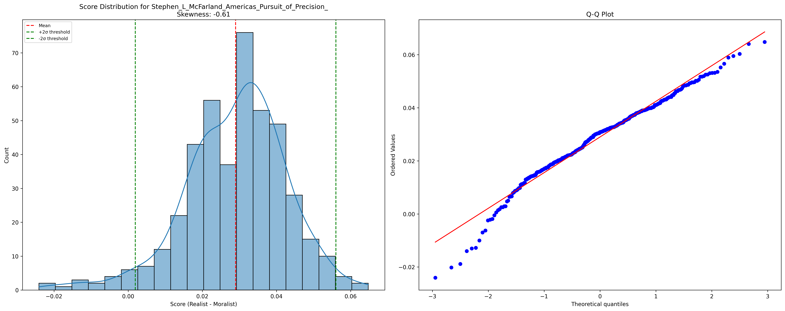

# Preface

This writing sample represents the literature review and first chapter of my senior thesis examining strategic bombing in World War II through computational and theoretical methods. The complete thesis, which I am currently developing, will include several additional major components:

- A theoretical network model simulating the German wartime economy to analyze the relative effectiveness of precision versus area bombing strategies
- Computational analysis of public discourse using a corpus of over 10,000 contemporary newspaper articles
- Analysis of digitized USSBS interrogation transcripts, including Albert Speer's detailed accounts of industrial adaptation to bombing
- Theoretical framework incorporating perspectives from military history, sociology, and economics

This is a digitally native project - all citations contain direct links to the referenced passages, methodologies, results, and underlying datasets. If you are reading a version where the links have been stripped or a print version, I encourage you to either:
- Read the digital PDF at: [github.com/nac-codes/thesis_bombing/blob/master/thesis.pdf](https://github.com/nac-codes/thesis_bombing/blob/master/thesis.pdf)
- View the complete project and markdown version at: [github.com/nac-codes/thesis_bombing](https://github.com/nac-codes/thesis_bombing)

The full thesis aims to challenge conventional narratives about strategic bombing through a novel combination of traditional historical methods and modern computational techniques. This sample demonstrates my approach to integrating quantitative and qualitative analysis while maintaining rigorous scholarly standards.

# Introduction

The historiography of the Allied strategic bombing campaign in World War II is dominated by two competing narratives. The first emphasizes the gradual abandonment of precision bombing in favor of area bombing, viewing this shift as evidence of war's inevitable descent into barbarism. The second narrative, primarily advanced by military historians, focuses on the technical and strategic evolution of the bombing campaign, particularly highlighting the neccessity of shifting towards area bombing in order to achieve the destruction of the German war-making capacity.

This thesis will attempt to both discredit and synthesize these two narratives. After a brief overview of the literature from both perspectives, we will begin with an analysis of the effectiveness of precision bombing *vis a vis* area bombing. We will utilize raw attack data from the US Strategic Bombing Survey (USSBS) to display the persistance of precision bombing late into the war, diminishing the narrative of a blanket shift to area bombing. Reports from the US Strategic Bombing Survey will substantiate the claim that these late-war precision attacks were the decisive factor in Allied military victory while area bombing and even the land invasion had fairly little (at least economic) effect. We will then back up this *post facto* analysis with the presentation of an *a priori* theory for the effectiveness of precision bombing and the relative ineffectiveness of area bombing.

Knowing the effectiveness of precision bombing over area bombing, we will then question why the Allies persisted in applying area bombing as much as they did late into the war and raise doubts as to whether the true objective of the Allied bombing campaign was to weaken the German war-making capacity while minimizing civilian casualties. To this question we will then apply a theory of the state and war-making as presented by the likes of Hans-Herrmann Hoppe that describe the sociological process by which the modern state shifted towards a form of total war that was not just economic in nature but sought to eliminate every vertex of the enemy's Clausewitzian triangle: its popular passion, its political will, and its military leadership. We argue that the driving force behind the wanton destructiveness of the Allied area bombings was not the military cadre alone or even primarily, but instead was the natural result of the left edge of Clausewitz's triangle—popular passion and governmental will—becoming both overzealous in its ability to destroy and impatient for an end to the war. Destruction—of the enemy materiel, its political entities, its infrastructure, and even its population—became the means by which the Allies sought to achieve swift and total victory.

This thesis is not unique in its criticism of area bombing during World War II, nor in identifying popular sentiment as a driving force behind the Allied bombing campaign's most destructive elements. However, it diverges from conventional interpretations in both its synthesis and conclusions. While many scholars use the shift to area bombing as evidence of warfare's inherently destructive nature—and thus argue for the general avoidance of war—this thesis reaches a different conclusion. Rather than condemning war itself, it identifies the inclusion of popular passion in warmaking as the fundamental problem. It argues that precision bombing doctrine represented a step toward a more rational and civilized approach to warfare, one that was ultimately overwhelmed by the fury of the *demos* and totalitarian impulses.

# Literature Review

## The Realist and Moralist Narratives

There are currently two competing narratives on the the shift of strategic bombing from precision to area bombing over the course of the Second World War. One presents it as a natural development from the naivete of precision, or "pinpoint," bombing to a more realistic and battle-tested approach of area bombing. This we call the "Realist" narrative. The other presents the shift to area bombing as the inevitable result of bellicose military leaders who were willing to do anything to accomplish their objectives and sees precision bombing as a mere public relations front to cover up the true intentions of the bombing campaign. This we call the "Moralist" narrative.

First, in order to avoid confusion, it is necessary to define strategic bombing, precision bombing, and area bombing.
1. Precision bombing refers to the targeting of specific nodes in the enemy's economic network, such as factories, transportation hubs, and oil refineries. The goal of this strategy is to neutralize the enemy's war-making capacity by destroying these key nodes.
2. Area bombing, on the other hand, refers to the bombing of a large area, typically a city or industrial area, with the aim of destroying it, its infrastructure, and portions of its workforce. The goal of this strategy is to disrupt economic production and weaken the morale of the civilian population.
3. Strategic bombing refers to the overall campaign, which may include precision bombing, area bombing or both.

As stated previously, we have divided the literature into two categories: the "Realist" and the "Moralist." These categories are neither exhaustive nor mutually exclusive. No one author fits neatly into one category or the other. They are meant merely to provide a helpful framework for both reader and author.

We begin with the Realist perspective. The main argument of the Realist perspective is that the theory of precision, otherwise known as "pinpoint," bombing, developed at Maxwell Air Force Base in Alabama over the decade preceding WWII, was not applicable under real-world wartime conditions. The pre-war theorists, so the idea goes, had approached strategic bombing too simplistically, viewing it merely as a targeting problem while failing to account for the complex military intelligence network required or the various frictions of war such as weather, maintenance, training, ordinance, and aircraft capabilities. As [Griffith (1994)](https://github.com/nac-codes/thesis_bombing/blob/master/corpora_cited/griffith_hansell/chunks/griffith_hansell_0031.txt) notes, "Only operational experience in combat would reveal many of the problems strategic bombers would face. Once World War II had begun the strategic air war took on a dynamic driven by existing technology and actual combat conditions, not by a preconceived air war doctrine." The reality of warfare meant that "technology and friction became the masters, not the servant of strategic bombing practices," leading to a significant departure from pre-war theoretical frameworks.

The technical and operational challenges of precision bombing proved to be far more daunting than pre-war theorists had anticipated. As [McFarland (1995)](https://github.com/nac-codes/thesis_bombing/blob/master/corpora_cited/mcfarland_pursuit/chunks/mcfarland_pursuit_0001.txt) reveals, even with sophisticated equipment like the Norden bombsight, accuracy remained elusive: "one study in 1944 concluded that only 7 percent of all American bombs fell within 1,000 feet of their aiming point." Others like [Beagle (2001)](https://github.com/nac-codes/thesis_bombing/blob/master/corpora_cited/beagle_pointblank/chunks/beagle_pointblank_0007.txt) cite a more generous study, noting that "over the duration of the Second World War, only about 20 percent of the bombs aimed at targets designated for precision attack fell within 1,000 feet of their aim point."[^1]

The unescorted bomber doctrine proved particularly costly. [Builder (1994)](https://github.com/nac-codes/thesis_bombing/blob/master/corpora_cited/builder_icarus/chunks/builder_icarus_0107.txt) explains that "The invincibility of the unescorted bomber formation was an article of faith; Flying Fortress was no idle choice of name for the B-17." This faith would be shattered by reality - as demonstrated by the devastating Schweinfurt and Regensburg raids of 1943, which saw loss rates as high as 20½ percent. Beyond the technical challenges of accuracy and survivability, [Kennett (1982)](https://github.com/nac-codes/thesis_bombing/blob/master/corpora_cited/kennett_history/chunks/kennett_history_0128.txt) emphasizes that "precision bombing would almost certainly be daylight bombing, which meant that the bomber would need speed, armament, or both for its own defense," which created an almost impossible operational challenge for both the engineering of the bombers and crews that flew them.[^2]

The sheer scale required for "precision" attacks further undermined their practicality. According to [Beagle (2001)](https://github.com/nac-codes/thesis_bombing/blob/master/corpora_cited/beagle_pointblank/chunks/beagle_pointblank_0007.txt), even after achieving air superiority in 1944, a precision bombing mission against a single target required approximately 1,000 aircraft. Moreover, "the minimum bomb pattern bombers could deliver was typically larger than the area of the industrial plant being targeted," making precise targeting of specific components within facilities essentially impossible. These limitations meant that bombing campaigns against specific target sets like ball bearing production, aircraft manufacturing, or transportation infrastructure required months of sustained operations, allowing other target sets time to recover and demonstrating the resilience of the German war economy.

The narrative of the operational hazards of precision bombing typically climaxes with the notorious Schweinfurt raids. Schweinfurt was designated as a target because of the concentration of ball bearing production there, producing an estimated half of these mechanical devices essential to the functioning of automotive engines and industrial machinery. As [Biddle (2002)](https://github.com/nac-codes/thesis_bombing/blob/master/corpora_cited/biddle_rhetoric/chunks/biddle_rhetoric_0366.txt) recounts, the first raid on August 17, 1943, celebrating the anniversary of U.S. operations in Europe, led to the loss of 16% of the bombers, but this high cost did not prevent a second assault. The October 14 mission, however, was disastrous: "Of the 291 bombers dispatched, 198 of them were shot down or damaged." This raid finally shattered the "theory of the self-defending bomber," revealing the limitations of the doctrine that had justified unescorted bombing operations.

The failure to achieve strategic objectives at Schweinfurt exposed flaws in the precision bombing campaign, exacerbated by overestimation of the bombers' self-defense capabilities. According to [Murray (1983)](https://github.com/nac-codes/thesis_bombing/blob/master/corpora_cited/murray_defeat/chunks/murray_defeat_0269.txt), “The conduct of the Schweinfurt/Regensburg attack…reflects an overestimation of both the accuracy and effectiveness of bombing,” a realization made more acute by "the heavy losses that American bombers suffered…reflecting the insufficient range of escorting fighters." [Haun (2019)](https://github.com/nac-codes/thesis_bombing/blob/master/corpora_cited/haun_lectures/chunks/haun_lectures_0263.txt) underscores the unsustainable attrition rates, noting that “Eighth Air Force sacrificed 60 of 291 B-17s at an unsustainable attrition rate of 20.7 percent” during the October raid, which “curtailed US efforts to conduct unescorted high-altitude daylight precision bombing against Germany.”[^3]

These operational challenges and especially the heavy losses during the Schweinfurt raids are employed to provide a rationale for the shift if not towards area bombing than at least away from precision bombing. To explain the shift towards area bombing there are both technical and theoretical arguments that have been put forth. The former describes the development of incendiary bomb technology as the driver of the allied approach to war. As [Knell (2003)](https://github.com/nac-codes/thesis_bombing/blob/master/corpora_cited/knell_city/chunks/knell_city_0057.txt) notes, "The fire raid using a mixture of H.E. and incendiary bombs and causing firestorms proved the ultimate answer," with these tactics being "practiced first by the Luftwaffe over Britain starting in September 1940, experimented with and developed further by RAF Bomber Command from 1942 onward." The devastating effectiveness of these tactics was demonstrated during the Hamburg raids of July 1943, where, according to [Crane (2016)](https://github.com/nac-codes/thesis_bombing/blob/master/corpora_cited/crane_bombs/chunks/crane_bombs_0202.txt), "Approximately 45,000 people had died... the vast majority from the devastating RAF firestorm of the night of 27 July, the first such conflagration caused by bombing." The impact was so severe that even American commanders like General Eaker were impressed, believing that "the fear of another Hamburg 'apparently has the Germans in a great dither,'" and wanted to exploit this psychological advantage with similar attacks on Berlin.

[Overy (2020)](https://github.com/nac-codes/thesis_bombing/blob/master/corpora_cited/overy_airwar/chunks/overy_airwar_0294.txt) explains that while "large high-explosive bombs were better suited for precision attacks," it was "the growing evidence of how effective fire-bombs were, which came about with the switch to area bombing, that encouraged the RAF to place greater emphasis on them." The technical advantages of area bombing with incendiaries were further enhanced by the development of new techniques, including "the use of high explosive bombs to seal off a section of a city into which the fire-bombs were to be aimed," which "enormously increased the destructive power of the conventional bomb attack."

This technological argument is supplemented by several theoretical arguments justifying the shift to area bombing. The first stems from the claim that Germany had initiated city attacks, thereby setting the precedent. As [Garrett (1993)](https://github.com/nac-codes/thesis_bombing/blob/master/corpora_cited/garrett_ethics/chunks/garrett_ethics_0025.txt) notes, "the Germans had after all initiated city attacks-first with the bombing of Warsaw, then the assault on Rotterdam in May 1940 (which was said to have caused 30,000 fatalities), and finally with the blitz on Britain itself." The Blitz campaign against Britain is often emphasized, with "50,000 tons of bombs [having been] dropped on British cities, which led to about 40,000 civilian" casualties.

A second theoretical justification arose from the concept of total war, which blurred traditional distinctions between combatants and civilians. As [Garrett (1993)](https://github.com/nac-codes/thesis_bombing/blob/master/corpora_cited/garrett_ethics/chunks/garrett_ethics_0300.txt) explains, total war "involves not just the complete mobilization of the resources of the state for military purposes but also the blurring, if not evaporation, of any distinction between the home front and the battle front." This concept was articulated as early as 1921 by the British Naval Staff, who stated that "modern war resolves itself into an attempt to throttle the national life" with the ultimate object being "to bring pressure on the mass of the enemy people, distressing them by every possible means, so as to compel the enemy's government to submit to terms."[^4]

This blurring of lines between civilian and military targets was further justified by the argument that industrial workers were legitimate military targets. [Buckley (1999)](https://github.com/nac-codes/thesis_bombing/blob/master/corpora_cited/buckley_total/chunks/buckley_total_0010.txt) poses the question: "Why would those organizing and supporting the war effort in Germany be less of a legitimate target than soldiers fighting at the front, especially in an age when most soldiers are conscripts and may have been indifferent supporters of or even hostile to the Nazi regime?" The argument extended to the claim that those who "build and manufacture the weapons of total war" were as culpable as those who used them.[^5]

This targeting of civilian workers was given theoretical cover through careful rhetorical framing. As [Bellamy (2012)](https://github.com/nac-codes/thesis_bombing/blob/master/corpora_cited/bellamy_terror/chunks/bellamy_terror_0006.txt) notes, while acknowledging it was "contrary to the dictates of humanity [to engage in] the indiscriminate bombing of a city for the sole purpose of terrorising the civilian population," military leaders like Hugh Trenchard (RAF) argued that since "a state's industrial capacity determined its ability to wage war, bombing aimed at 'dehousing' factory workers was legitimate." The resulting civilian casualties were characterized as an "inevitable result of a lawful operation of war" - an unintended but "not unhelpful byproduct."

Finally, these various justifications were ultimately supported by the pragmatic argument that area bombing was effective and helped bring the war to a swift conclusion. As [Buckley (1999)](https://github.com/nac-codes/thesis_bombing/blob/master/corpora_cited/buckley_total/chunks/buckley_total_0008.txt) argues, "the conduct of war throughout history has been influenced less by morality and more by military capability, balanced by political acceptability." In total war environments, "both the stakes and the military capability have been high, resulting in the use of previously unparalleled methods of waging war." The key factor became simply whether a strategy would "allow you to win and bring the war to a speedy conclusion."[^5.5]

[Werrell (2009)](https://github.com/nac-codes/thesis_bombing/blob/master/corpora_cited/werrell_death/chunks/werrell_death_0242.txt) utilizes a combination of the above arguments to joust with the "Moralist" narrative directly, questioning the very premise of civilian innocence in modern warfare. He asks provocatively: "are all civilians innocent? Certainly babies are. But are war workers, be they men, women, or even children? Are those who support the war with their labor, taxes, voices, and votes innocent?" He further contextualizes the moral debate by comparing strategic bombing casualties to other forms of warfare, noting that while "Strategic bombing in World War II probably killed at least 600,000," the World War I Allied blockade "starved to death 800,000, certainly mostly women, children, and old men." His conclusion is that "the great evil is not strategic bombing but war itself."

The Realist perspective therefore may be summed up as follows: War has an inherent tendency toward escalation and brutality, as articulated by Clausewitz's observation that "war is an act of force which theoretically can have no limits" [Garrett 1993](https://github.com/nac-codes/thesis_bombing/blob/master/corpora_cited/garrett_ethics/chunks/garrett_ethics_0198.txt). The shift from precision to area bombing was not driven by malice or bloodlust, but rather by what [Garrett 1993](https://github.com/nac-codes/thesis_bombing/blob/master/corpora_cited/garrett_ethics/chunks/garrett_ethics_0306.txt) describes as "the tendency in war, and particularly in total war, of military operations escalating to the use of all conceivable means." As Clausewitz argued, attempts to place "philanthropic" limits on warfare are futile and even dangerous - "the mistakes which come from kindness can be the very worst" [Garrett 1993](https://github.com/nac-codes/thesis_bombing/blob/master/corpora_cited/garrett_ethics/chunks/garrett_ethics_0198.txt). This escalation was further driven by technological advancement - as [Garrett 1993](https://github.com/nac-codes/thesis_bombing/blob/master/corpora_cited/garrett_ethics/chunks/garrett_ethics_0306.txt) notes, "Because the technology was there, it proved well-nigh irresistible to employ it." The development of new technologies, the emergence of total societal mobilization, and operational necessities all pushed strategic bombing toward ever more destructive forms. Since the war itself was deemed just and necessary, the means required to end it - including area bombing - were seen as regrettable but ultimately justified by the imperative of victory.

The Moralist perspective contends that the distinction between precision and area bombing was largely rhetorical—a facade maintained to obscure the truly destructive and immoral nature of strategic bombing. [Sherry (1987)](https://github.com/nac-codes/thesis_bombing/blob/master/corpora_cited/sherry_armageddon/chunks/sherry_armageddon_0298.txt) notes that while "much was made about a distinction between British night bombing to terrorize German cities and American daylight precision bombing designed to immobilize the enemy's war-making capacity," this distinction "had never been clearly drawn in American doctrine." Indeed, as early as 1926, the Air Corps doctrine described air attack as "a method of imposing will by terrorizing the whole population... while conserving life and property to the greatest extent." While references to "terrorizing" were later discretely dropped, the underlying intent remained.[^6]

The evidence of this duplicity, the Moralists argue, can be found in the actual conduct of the bombing campaign. [Downes (2008)](https://github.com/nac-codes/thesis_bombing/blob/master/corpora_cited/downes_strategic/chunks/downes_strategic_0005.txt) points out that "The U.S. Army Air Forces during World War II launched seventy self-described attacks on a 'city area' in Germany," and devoted "about half of their total effort to radar bombing, which—although not purposefully directed at civilians—American military officers knew was the functional equivalent of British area bombing." The choice of weapons further betrays this intent: American commanders used "a large percentage of incendiary bombs (the preferred weapon against cities) on these raids even though such bombs were ineffective against rail yards, the official targets."

[Maier (2005)](https://github.com/nac-codes/thesis_bombing/blob/master/corpora_cited/maier_city/chunks/maier_city_0011.txt) describes how the U.S. "clung to shrouding large-scale bombing with particular industrial or strategic objectives," even as the logic of bombing shifted from precision to pure destruction. By the end of the war, the justification had evolved from targeting specific military objectives to a broader theory that "the more destruction there was, the sooner the collapse would come." This evolution was not a response to operational necessity but rather the revelation of bombing's true purpose.[^7]

Vengeance and emotion, this perspective argues, rather than military necessity, were the true drivers behind the strategic bombing campaign. This narrative, most notably advocated by Michael Sherry, points to the rhetoric surrounding bombing campaigns as evidence. As [Sherry (1987)](https://github.com/nac-codes/thesis_bombing/blob/master/corpora_cited/sherry_armageddon/chunks/sherry_armageddon_0747.txt) documents, public discourse was filled with emotional calls for "socking the rapacious German nation" and "repayment for Nazi crimes" - language that betrayed motivations far removed from rational military calculus.[^8]

This emotional drive for vengeance was enabled by what Sherry terms "amoral technicians" within the military bureaucracy. [Sherry (1987)](https://github.com/nac-codes/thesis_bombing/blob/master/corpora_cited/sherry_armageddon/chunks/sherry_armageddon_1300.txt) describes how "airmen placed operational considerations first and said little about the enemy, rarely employing the rhetoric of vengeance found elsewhere." Through this technical, methodological approach, "the air force could serve as a vehicle of vengeance while confining itself to the problems of technique." The result was a kind of moral abdication where military leaders became "instruments of a nation's anger in which they had no particular investment."

This combination of public bloodlust and bureaucratic amorality created what [Downes (2008)](https://github.com/nac-codes/thesis_bombing/blob/master/corpora_cited/downes_strategic/chunks/downes_strategic_0121.txt) describes as an erosion of moral restraint. When "conflicting doctrines and policies clashed, they were judged by the pragmatic test of military efficacy and the degree to which they would contribute to victory. Moral and political considerations were secondary." This prioritization of military victory above all else led to what Barton Bernstein calls a "redefinition of morality" that ultimately enabled the use of atomic weapons, as "by 1945, there were few moral restraints left in what had become virtually a total war."

The moral justification offered for this escalation was, according to [Sherry (1987)](https://github.com/nac-codes/thesis_bombing/blob/master/corpora_cited/sherry_armageddon/chunks/sherry_armageddon_0757.txt), dangerously open-ended. While Americans "acknowledged the widespread killing of civilians, accepted their innocence, labeled their killing murder," they then "designated it as justifiable homicide, as the only recourse if victory were to be secured and Allied casualties minimized." Yet as Sherry points out, few could plausibly argue that American survival itself was at stake. Rather, "they meant the requirements of victory, total victory at that, and with minimum suffering and loss for the victors." This reasoning "could justify almost any action that accelerated triumph."[^9]

[Maier (2005)](https://github.com/nac-codes/thesis_bombing/blob/master/corpora_cited/maier_city/chunks/maier_city_0000.txt) adds that this moral progression—from accepting collateral damage, to area bombing, to atomic weapons—has been difficult to critically examine due to two "twin inhibitions": "the reluctance of German commentators to seem apologetic for the Third Reich, and the difficulty in the U.S. of seeming to cast any aspersions on those who fought 'the good war.'" This framing of World War II as "the good war" has made it particularly challenging to critically examine the ethics of Allied bombing campaigns.

Moralists have also argued that total war actually elongates rather than shortens conflict. The French Catholic philosopher Jacques Maritain, as cited by [Sherry (1987)](https://github.com/nac-codes/thesis_bombing/blob/master/corpora_cited/sherry_armageddon/chunks/sherry_armageddon_0396.txt), argued that "terror and total war prolonged war. They defeated the very end of victory by arousing resistance, and they poisoned the peace thereafter as well." Maritain proposed a utilitarian standard: "Whatever was unnecessary for victory... was 'bestiality.'" While this standard could be manipulated to justify extreme measures if they could be plausibly linked to victory, it at least provided a framework for restraint that appealed to practical interests rather than "unenforceable rules of international law or flimsy consciences."

This argument about the counterproductive nature of total war is supported by evidence that the war never truly reached the theoretical extremes of "total war." As [Hansen (2008)](https://github.com/nac-codes/thesis_bombing/blob/master/corpora_cited/hansen_fury/chunks/hansen_fury_0372.txt) points out, even during the Allied invasion of Germany, armies "did not—as total war would predict—go from house to house spraying civilians with machine-gun fire. On the contrary, they took every reasonable effort to minimize civilian casualties." This suggests that the war "did not—as some would have it—entirely erase the distinction between a soldier and a citizen (though it may have blurred it)." While Hansen acknowledges that Germany's defeat was "both a geopolitical and a moral necessity," he argues that "none of this can justify the degree of death and destruction meted out."[^10]

The moral calculus used to justify civilian casualties was particularly problematic. [Garrett (1993)](https://github.com/nac-codes/thesis_bombing/blob/master/corpora_cited/garrett_ethics/chunks/garrett_ethics_0228.txt) critiques Bomber Harris's notorious statement that he did not "regard the whole of the remaining cities of Germany as worth the bones of one British Grenadier." Garrett argues that while governments have a "perfect obligation" to protect their own soldiers and civilians, they retain "imperfect" but real duties to enemy civilians, "the assumption being that all individual human beings have certain rights that continue to obtain even in the midst of war."[^11]

The Moralist critique ultimately extends beyond specific tactics to challenge fundamental assumptions about the nature of war itself. [Fuller (1961)](https://github.com/nac-codes/thesis_bombing/blob/master/corpora_cited/fuller_conduct/chunks/fuller_conduct_0245.txt) illuminates a crucial philosophical divide between two conceptions of warfare. The Clausewitzian view maintains that "morality, as understood by civilized peoples, was a factor in social life," seeing war as an extension of politics bound by societal values and ethical constraints. Lenin's more radical critique strips away this civilized veneer, reducing war to "a purely animal struggle in which no punches were barred." His declaration that "We repudiate all morality derived from non-human and non-class concepts... We do not believe in an eternal morality" represents not just a rejection of traditional military ethics, but an unmasking of what the Moralists see as warfare's true nature.

This perspective suggests that the escalation to area bombing reveals the fundamental truth of Lenin's analysis—that beneath the rhetoric of precision and military necessity lies the inherently barbaric nature of modern warfare. The bureaucratic machinery of strategic bombing, with its technical language and cold calculations, served merely as what Lenin would recognize as "a deception, a fraud in the interests of the landlords and capitalists." The precision bombing doctrine, in this view, was less a genuine military innovation than a moral fig leaf, designed to obscure warfare's descent into unrestricted violence. The Moralist critique thus sees the strategic bombing campaign not as an aberration but as the inevitable unmasking of war's true character: an "animal struggle" that necessarily tends toward total destruction once its civilized pretenses are abandoned.[^12]

## Computational Analysis of the Literature

To better understand the distribution of these perspectives within the literature, we conducted a computational analysis of the texts using natural language processing techniques. Each source text was divided into meaningful chunks and processed using OpenAI's text-embedding-ada-002 model to generate vector representations.[^13] These embeddings were then compared against two carefully curated sets of statements representing the Realist and Moralist positions. The Realist statements encompassed arguments about operational necessity, technological limitations, and military pragmatism (e.g., "Precision bombing was largely ineffective due to technological limitations" and "The effectiveness of area bombing in hastening victory justifies its use over less effective methods"), while the Moralist statements captured ethical critiques and concerns about strategic bombing's moral implications (e.g., "The shift from precision to indiscriminate bombing was not due to necessity but reflected an immoral strategy" and "Emotional vengeance, not military necessity, motivated strategic bombing").[^14]

The resulting analysis reveals a notable skew toward the Realist perspective across our sample of strategic bombing literature (Figure 1). This bias manifests not only in the aggregate but is particularly visible in individual authors' distributions. For instance, Tami Davis Biddle's work shows a characteristic S-shaped pattern in its Q-Q plot, indicating a systematic bias toward Realist arguments (Figure 2). Conversely, Stephen L. McFarland's "America's Pursuit of Precision Bombing" demonstrates a more Moralist-leaning perspective, with a pronounced negative skew in its distribution (Figure 3).[^15]

*Figure 1: Skewness Spectrum. Displays the distribution of the Realist and Moralist statements across the corpus.*

*Figure 2: Tami Davis Biddle. Displays a pronounced skew toward the Realist position.*

*Figure 3: Stephen L. McFarland. Displays a pronounced skew toward the Moralist position.*

This computational analysis helps illuminate several important aspects of the strategic bombing literature. First, it suggests that the Realist perspective, with its focus on operational and technological constraints, dominates the scholarly discourse. While this could reflect the inherent strength of the Realist position, it may also indicate a historiographical bias toward military and operational histories over moral and ethical analyses. Second, the relative scarcity of strong Moralist positions might partly stem from the extremity of our Moralist statement set, which perhaps represents a more radical critique than typically found in academic literature.[^16]

A particularly interesting case emerges in Michael Sherry's "The Rise of American Air Power," which we initially drew upon heavily for the Moralist perspective. Surprisingly, our analysis shows that Sherry's work actually exhibits a skew towards the Realist position (Figure 4). Upon [closer examination](https://github.com/nac-codes/thesis_bombing/blob/master/scripts/literature_review/get_top_scorers.py), this apparent contradiction illuminates the sophistication of Sherry's approach. Rather than engaging in direct moral condemnation, Sherry methodically documents how bureaucratic distance and technical rationalization enabled moral disengagement from bombing's consequences. His work carefully traces both the operational challenges that shaped strategic bombing and how the professional, technical mindset of military planners created emotional distance from moral implications. By letting these historical processes speak for themselves rather than imposing overt moral judgments, Sherry crafts a more devastating critique than traditional Moralist arguments. The effectiveness of this approach helps explain why our computational analysis detected more "Realist" language patterns - Sherry's power lies not in moral pronouncements but in his clinical exposition of how technical and bureaucratic frameworks systematically sidestepped ethical considerations. It is a testament to the sensitivity of OpenAI's text embeddings that they captured this subtle but crucial distinction in Sherry's rhetoric.[^17]

*Figure 4: Michael Sherry. Displays a more balanced distribution.*

[^1]: For more information on bombing accuracy, see: [Crane 2016](https://github.com/nac-codes/thesis_bombing/blob/master/corpora_cited/crane_bombs/chunks/crane_bombs_0147.txt) emphasizes that while American airpower had confidence in the Norden bombsight, the anticipated precision was hard to achieve, with only about 14% of bombs landing within 1,000 feet of their targets during early 1943. [McFarland 1995](https://github.com/nac-codes/thesis_bombing/blob/master/corpora_cited/mcfarland_pursuit/chunks/mcfarland_pursuit_0251.txt) discusses the challenges that altitude and large bombing formations posed to accuracy, noting that bomb patterns became increasingly imprecise as formation size and altitude increased. [Parks 1945](https://github.com/nac-codes/thesis_bombing/blob/master/corpora_cited/parks_preciscion/chunks/parks_preciscion_0005.txt) describes how 'bombing on leader' formations, adopted for practical reasons, led to larger bombing patterns and a lower level of accuracy than originally anticipated for precision bombing.

[^2]: For more information on the challenges and assumptions surrounding bomber escort and self-defense capabilities, see: [Biddle 2002](https://github.com/nac-codes/thesis_bombing/blob/master/corpora_cited/biddle_rhetoric/chunks/biddle_rhetoric_0272.txt) examines how American planners believed in the viability of the "self-defending" bomber, relying on speed, altitude, and armament for unescorted penetration. This view persisted despite underlying doubts and logistical challenges, until wartime experience revealed its flaws. [Werrell 2009](https://github.com/nac-codes/thesis_bombing/blob/master/corpora_cited/werrell_death/chunks/werrell_death_0062.txt) discusses how American bomber advocates underestimated the need for escorts, firmly believing in the superiority of bombers in mutual defense formations, and failing to predict advancements in defensive technology, such as radar. [Hecks 1990](https://github.com/nac-codes/thesis_bombing/blob/master/corpora_cited/hecks_bombing/chunks/hecks_bombing_0126.txt) details the early struggles with the B-17, noting that inadequate armament and harsh European weather conditions led to high losses, showing that unescorted bombers faced significant operational challenges.

[^3]: [Werrell 2009](https://github.com/nac-codes/thesis_bombing/blob/master/corpora_cited/werrell_death/chunks/werrell_death_0175.txt) details the severe costs of the Schweinfurt raid, stating that "does not inflict decisive damage, cannot be followed up, and merits the award of five of the nation's highest decoration deserves sharp criticism." [Kohn 1988](https://github.com/nac-codes/thesis_bombing/blob/master/corpora_cited/interview_strategic/chunks/interview_strategic_0035.txt) includes firsthand account from Leon Johnson (one of the first four flying officers in the 8th Air Force) describing the Schweinfurt missions as "one of the most hazardous missions in the whole war," underscoring the intense five-hour battles fought over Schweinfurt. Additionally, [Crane 2016](https://github.com/nac-codes/thesis_bombing/blob/master/corpora_cited/crane_bombs/chunks/crane_bombs_0017.txt) argues that while precision bombing was initially seen as both efficient and humane, the pressures of war and technological limitations led commanders to prioritize military objectives over moral considerations. As he notes, "once LeMay became convinced that pinpoint tactics were no longer effective, morality alone was not enough to prevent the firebombing of Tokyo." The growing pressure to end an increasingly bloody war, combined with vast fleets of bombers that "could not just sit idle, despite poor weather," pushed commanders toward more destructive tactics.

[^4]: [Lucien (1971)](https://github.com/nac-codes/thesis_bombing/blob/master/corpora_cited/lucien_pinpoint/chunks/lucien_pinpoint_0036.txt) cites Donald Wilson (USAF General) who stated that "Modern industrial nations are susceptible to defeat by interruption of this web" and that "morale collapse brought about by the breaking of this closely knit web will be sufficient."

[^5]: The argument about civilian culpability was further developed by [Garrett (1993)](https://github.com/nac-codes/thesis_bombing/blob/master/corpora_cited/garrett_ethics/chunks/garrett_ethics_0300.txt) who noted that airpower made it "possible to wage war not just on the enemy's soldiers but on the society supporting them," leading to what one authority called "a crisis in the law of war, and a process of barbarization such as had not been seen in Europe since the second half of the seventeenth century." The rhetoric used here, however, might be categorized in the "Moralist" camp.

[^5.5]: [Crane 2016](https://github.com/nac-codes/thesis_bombing/blob/master/corpora_cited/crane_bombs/chunks/crane_bombs_0018.txt) explains that the overriding objective was winning the war quickly and efficiently with minimal American casualties, which often prevented morality from being an "overriding criterion." He notes that while some planners took comfort in proposals that would minimize civilian casualties, the need for Allied cooperation led the US to mute ethical arguments since Britain strongly supported attacking civilian morale. The Americans wanted to avoid causing rifts with their allies or aiding German propaganda.

[^6]: The evolution of this doctrine is traced by [Buckley (1999)](https://github.com/nac-codes/thesis_bombing/blob/master/corpora_cited/buckley_total/chunks/buckley_total_0009.txt) who notes that during WWI, bombing strategy "accepted that inaccurate bombs would hit and kill civilians and this was acceptable because it would damage enemy morale." While this targeting of civilians "declined as a strategy in the 1930s," it "re-emerged during the Second World War in the RAF once it proved impossible to bomb anything accurately." [Maier (2005)](https://github.com/nac-codes/thesis_bombing/blob/master/corpora_cited/maier_city/chunks/maier_city_0009.txt) describes how early in the war, the British moved to define "collateral damage" as an updated version of the medieval just-war doctrine of "double effect" - if civilians were killed while pursuing legitimate military objectives, this was acceptable as long as care was taken to minimize casualties and observe proportionality.

[^7]: This interpretation is supported by [Sherry (1987)](https://github.com/nac-codes/thesis_bombing/blob/master/corpora_cited/sherry_armageddon/chunks/sherry_armageddon_0298.txt) who notes that "In the 1930s, Americans never decisively opted for the enemy's war-making capacity as their objective. They proposed to attack the enemy's will, only by more humane and economical methods." The distinction between attacking war-making capacity and civilian will was thus blurred from the beginning.

[^8]: The emotional nature of public discourse around bombing is further evidenced by [Sherry (1987)](https://github.com/nac-codes/thesis_bombing/blob/master/corpora_cited/sherry_armageddon/chunks/sherry_armageddon_0747.txt) who notes that when Vera Brittain published a critique of bombing in 1944, the responses revealed "the mood of vengeance usually shrouded by utilitarian arguments for bombing."

[^9]: The casualness of moral debate around bombing is particularly striking. [Sherry (1987)](https://github.com/nac-codes/thesis_bombing/blob/master/corpora_cited/sherry_armageddon/chunks/sherry_armageddon_0757.txt) attributes this not just to "moral laziness" but to the circumstances of air war itself: "Americans entered the war with little tradition of realistic debate about air power to draw upon... journalists and politicians were ill-equipped or disinclined to raise moral issues."

[^10]: Hansen's argument about the limits of total war is particularly significant as it challenges both the necessity and inevitability of area bombing. He argues that "Moral clarity has two sides to it: it gives the Allied war aims moral purpose and it defines the limits within which those aims are pursued."

[^11]: Garrett develops this argument further, explaining that moral reasoning requires "universalization," meaning decisions must consider "the interests and rights of all affected parties." He argues that "The mere fact that a state of war exists does not remove the legitimate claims of enemy civilians for a reasonable chance to go on living."

[^12]: This interpretation helps explain why, as [Sherry (1987)](https://github.com/nac-codes/thesis_bombing/blob/master/corpora_cited/sherry_armageddon/chunks/sherry_armageddon_0757.txt) noted earlier, moral debates about bombing remained "casual" despite their gravity. If war itself is seen as inherently immoral, then debates about specific tactics become merely technical rather than ethical questions.

[^13]: The technical implementation can be found in [`get_similarity_scores.py`](https://github.com/nac-codes/thesis_bombing/blob/master/scripts/literature_review/get_similarity_scores.py) and [`calc_and_visualize.py`](https://github.com/nac-codes/thesis_bombing/blob/master/scripts/literature_review/calc_and_visualize.py). The embedding process converts text into high-dimensional vectors that capture semantic relationships, allowing for quantitative comparison of textual similarity. Each chunk's embedding is compared against both Realist and Moralist statement sets using cosine similarity. The maximum cosine similarity value is then taken from each set and subtracted from each other to generate a relative position score on the spectrum of Moralist to Realist. Most values are close to zero, because the general context and semantics of the statements are similar.

[^14]: The statement sets were carefully constructed to represent the core arguments of each perspective, with 15 Realist statements and 13 Moralist statements. The full statement sets are available in [`get_similarity_scores.py`](https://github.com/nac-codes/thesis_bombing/blob/master/scripts/literature_review/get_similarity_scores.py). The relative scoring between -1 (most Moralist) and +1 (most Realist) allows for nuanced positioning of each text chunk along the ideological spectrum.

[^15]: Statistical significance was assessed using skewness tests (scipy.stats.skewtest), with p < 0.05 indicating significant deviation from normal distribution. The visualization methodology employs both histogram distributions and Q-Q plots to reveal patterns in the data. Red bars in Figure 1 indicate statistically significant skewness.

[^16]: Our sample includes over 60 major works on strategic bombing, representing approximately 30,000 text chunks and 9.8 million words. While not exhaustive, this corpus encompasses most of the seminal works in the field and provides a reasonable representation of the scholarly literature.

[^17]: Sherry's methodical approach is evident throughout his work. For example, he clinically observes that "Duty involved the performance of technical tasks. The ethic was not a military one bound to the achievement of victory as it was for most other servicemen, but a professional one... To a considerable degree, airmen were technicians and professionals who happened to be waging war" [Sherry (1987)](https://github.com/nac-codes/thesis_bombing/blob/master/corpora_cited/sherry_armageddon/chunks/sherry_armageddon_0843.txt). His documentation of operational challenges serves not to justify but to illuminate the mechanistic mindset, noting that "missions, takeoff alone posed peril, for the planes were so heavily loaded with bombs and gasoline that the slightest mechanical or human failure could abort a mission or destroy a bomber" [Sherry (1987)](https://github.com/nac-codes/thesis_bombing/blob/master/corpora_cited/sherry_armageddon/chunks/sherry_armageddon_1122.txt). This detached, analytical treatment yields a skewness of 0.234 (p=0.041) in our analysis, reflecting how Sherry's rhetorical strategy favors precise documentation over moral pronouncement.

# Chapter 1: Bombing by the Numbers

"It is believed that anyone studying the figures will conclude that the differences, viewed in their proper perspective, become quite insignificant, that the larger lessons to be learned from the figures are clear and unmistakable, and that the decisive role of air power stands out in bold relief."
[*—United States Strategic Bombing Survey, *Summary Report* (1945)*](https://github.com/nac-codes/thesis_bombing/blob/master/ussbs_reports/SUMMARY_REPORT/IMG_8296.JPG)

## A New Approach

The historiography of strategic bombing in World War II has largely relied on aggregate statistics to support broader arguments about the nature and evolution of the bombing campaign. This approach, while valuable for broad analysis, reflects a persistent tendency to frame aerial warfare through traditional military history paradigms - following in the Thucydidean tradition of organizing continuous operations into discrete "battles" like the "Battle of the Ruhr" or "Big Week." Yet strategic bombing represented warfare of unprecedented temporal and spatial diffusion. It was planned, executed, and recorded not as a series of decisive engagements, but as thousands of individual missions distributed across time and space. This fundamental mismatch between the nature of strategic bombing and how we have historically analyzed it suggests an opportunity for new methodological approaches. By examining the bombing campaign at the granular level of individual missions while maintaining the ability to aggregate and analyze patterns at scale, we can better understand both its distributed nature and its evolution over time. This thesis attempts to take a step in this direction.

This reliance on aggregate statistics is particularly evident in how scholars have approached the United States Strategic Bombing Survey (USSBS). Most analyses draw from a narrow set of summary statistics - total tonnage dropped, overall accuracy rates, and casualty figures - found in the first few pages of either the Summary Report or Overall Report[^1] (e.g. [The Overall Report](https://github.com/nac-codes/thesis_bombing/blob/master/ussbs_reports/OVERALL_REPORT/IMG_8235.JPG) and [The Summary Report](https://github.com/nac-codes/thesis_bombing/blob/master/ussbs_reports/SUMMARY_REPORT/IMG_8218.JPG)). Yet the USSBS contains far richer data. Behind these summary reports lie detailed computer tabulations recording every bombing mission of the war, a granular dataset that has remained largely unexplored. This thesis leverages these original mission-level records to create the most comprehensive raid-by-raid dataset of the European theater to date, enabling the kind of distributed analysis that the nature of strategic bombing demands.

The United States Strategic Bombing Survey (USSBS) was established by Secretary of War Henry Stimson in November 1944, following a directive from President Roosevelt. Led by civilian chairman Franklin D'Olier, the survey brought together over 1,000 civilian and military personnel with the ambitious goal of conducting an impartial and expert study of the effects of aerial attacks on Germany. While officially independent, the survey was closely tied to Army Air Forces leadership who hoped to use its findings to advocate for an independent air force, as stated by [Delori (2023)](https://github.com/nac-codes/thesis_bombing/blob/master/corpora_cited/delori_memory/chunks/delori_memory_0004.txt).[^1.5]

Using what was likely an IBM 405 Alphabetical Accounting Machine, the USSBS Tabulating Service processed detailed data for every recorded bombing mission "FROM THE FIRST ATTACK TO 'V-E' DAY"[^2]. These original computer printouts, stored at the [National Archives in College Park, Maryland](https://catalog.archives.gov/id/561292), contain detailed information about each raid, including target location, air force and squadron identification, number of aircraft, bombing altitude, visibility conditions, and precise bomb loads broken down by type and fuzing.

*Figure 1.1: Example of USSBS computer printout showing detailed raid data of attacks on oil refinery in Korneuburg, Austria.*

While summary statistics from the USSBS and other sources like the USAAF Office of Statistical Control (OSC), British Air Ministry, and British Bombing Survey Unit have been widely available—showing aggregate tons dropped by year, month, air force, or bomb type—the more granular, raid-level data has remained largely inaccessible and unanalyzed. Historically, this is not surprising given the era's technological limitations. The WWII era was one of bureaucratic paper and tyrannizing statistics, where even simple summations could only be performed by those with access to the resources, data, and computational power of the state apparatus. Today, given that an individual with a laptop and an internet connection has the power to perform more computational work than the entire US Government did in 1944, there is no reason for continued reliance on the authority of more than eighty-year-old state-generated surface-level statistics.

In that spirit, this thesis will open-source all necessary data and code to enable further analysis of the strategic bombing campaign. Along with a fully digitized collection of the summary reports of the USSBS, this includes the creation and analysis of a comprehensive digital database derived from 8,134 photographs of original USSBS computer printouts. Each photograph was processed using Azure Optical Character Recognition (OCR) and Document Intelligence to extract 31 distinct fields of data per raid, including target identification (location, name, coordinates, and code), mission details (date, time, air force, and squadron), operational parameters (number of aircraft, altitude, sighting method, visibility, target priority), and detailed bomb loads (numbers, sizes, and tonnages of high explosive, incendiary, and fragmentation munitions).

*Figure 1.2: Computers for the Office of Statistical Control (OSC). Picture is from a pamphlet entitled "WHAT YOU SHOULD KNOW ABOUT COMBAT ANALYSIS" contained in the USSBS archive. The woman on the right is using a [Comptometer](https://en.wikipedia.org/wiki/Comptometer), a mechanical calculator.*

The extracted data underwent multiple stages of validation and correction, combining deterministic rules based on known bomb specifications with context-aware large language models to ensure accuracy. A final manual review process helped identify and remove summation rows that could have led to double-counting of mission data. The resulting dataset contains over 54,608 individual bombing missions. [The complete dataset](https://github.com/nac-codes/thesis_bombing/blob/master/attack_data/combined_attack_data_checked.csv), along with all code used in its creation, has been made publicly available to enable further research and analysis. A detailed description of the methodology, including specific validation rules and data processing steps, may be found here: [methodology_attack_data.md](https://github.com/nac-codes/thesis_bombing/blob/master/methodology_attack_data.md).

Our analysis of World War II strategic bombing data reveals strong alignment with historical records for United States Army Air Forces (USAAF) operations while highlighting significant gaps in Royal Air Force (RAF) records. The dataset's totals for the Eighth Air Force (697,814 tons) and Fifteenth Air Force (290,529 tons) closely match the figures reported by both the Office of Statistical Control (692,918 and 312,173 tons respectively) and the United States Strategic Bombing Survey Tabulating Service[^2.5]. This consistency validates our dataset as a reliable foundation for analyzing USAAF strategic bombing operations. However, our RAF Bomber Command total of 701,246 tons falls significantly short of the Air Ministry's reported 1,066,141 tons, with the majority of missing data concentrated in industrial target categories—primarily city areas. When analyzing RAF operations, we must account for this missing ~365,000 tons (approximately 34% of total RAF bombing) which was directed almost exclusively at industrial and urban targets. The temporal and categorical distribution of raids, choice of munitions, and evolution of targeting strategies can be analyzed with confidence for USAAF operations, while RAF trends must be interpreted with the understanding that industrial targeting is significantly underrepresented in our data. For a comprehensive breakdown of the data, including detailed charts, tables, and temporal analyses, see the [full results documentation](https://github.com/nac-codes/thesis_bombing/blob/master/results_attack_data.md).

While it is the hope of this researcher that the compiled dataset may prove useful for future historians for a variety of forms of historical analysis, in this thesis our focus lies in observing whether the oft-noted strategic shift from precision to area bombing actually occurred, especially in the context of the USAAF. This will be explored in the next section.

## Evaluating the Strategic Shift from Precision to Area Bombing

This section examines empirically whether and to what extent the strategic bombing campaign shifted from precision to area bombing. Our analysis will proceed as follows:

1. We present our approach to categorizing bombing missions, using an algorithm that considers both munition types and tactical patterns rather than relying on stated objectives.
2. We show that precision bombing accounted for 69% of all bombs dropped, but demonstrate why this figure requires careful interpretation when compared to USSBS assessments.
3. We examine how marshalling yard raids, particularly by the USAAF, often served as a proxy for area bombing despite their official designation as precision targets.
4. We contrast the USAAF's concealed area bombing with the RAF's more overt embrace of the strategy in the records, particularly in their targeting of "Industrial" areas.
5. We demonstrate that while area bombing increased over time in specific sectors, precision bombing remained the predominant strategy throughout the war.

Through this analysis, we challenge existing narratives that overemphasize the shift toward area bombing while unveiling the extent to which USAAF participated in area bombing tactics.

Our methodology for categorizing tons of bombs as being either part of "area" bombing or "precision" bombing involved developing a nuanced categorization algorithm. This algorithm considers both the types of munitions used and the temporal and spatial relationships between raids. Initially, we considered using a simple ratio of incendiary to high explosive/fragmentary bombs as the determining factor. However, this approach proved inadequate as it failed to capture tactics that combined high explosive and incendiary bombs to maximize destruction.

Our algorithm, implemented in [`categorize_bombing.py`](https://github.com/nac-codes/thesis_bombing/blob/master/attack_data/categorize_bombing.py), uses the following logic:

1. Any mission that deployed incendiary bombs is automatically categorized as "area" bombing.
2. For missions using only high explosive bombs, the algorithm:
   - Examines all other missions targeting the same location within a 4-hour time window before and after the mission.
   - If any related mission within this window used incendiaries, the mission is categorized as "area" bombing.
   - Only if no related missions used incendiaries is the mission categorized as "precision" bombing.

This approach, while generous in identifying area bombing, provides a valuable analytical framework for understanding strategic bombing patterns, despite some limitations in edge cases such as oil refinery raids.

Our analysis initially appears to show a predominance of precision bombing, with 69.0% (1,211,273 tons) of all bombs dropped being categorized as precision bombing compared to 31.0% (544,681 tons) categorized as area bombing.

However, these figures require careful interpretation when compared to the United States Strategic Bombing Survey's own analysis. The USSBS reported that "during the period from October 1939 to May 1945 the Allied Air Forces, primarily the RAF, dropped over one-half million tons of high explosives, incendiaries, and fragmentation bombs in such area raids on the 61 German cities." This apparent similarity to our figure of 544,681 tons is misleading.

First, our dataset is missing nearly 400,000 tons of RAF bombing missions, primarily those targeting industrial areas and cities (See [results_attack_data.md](https://github.com/nac-codes/thesis_bombing/blob/master/results_attack_data.md#comparison-of-total-bomb-tonnage) for more details). If we adjust for this missing data, our estimate for area bombing would increase to approximately 940,000 tons—nearly double the USSBS figure.

This discrepancy stems from fundamentally different approaches to categorization. The USSBS used a narrow definition of area raids as those "intentionally directed against a city area by more than 100 bombers with a bomb weight in excess of 100 tons, which destroyed more than 2 percent of the residential buildings in the city" [(USSBS Overall Report)](https://github.com/nac-codes/thesis_bombing/blob/master/ussbs_reports/OVERALL_REPORT/IMG_8271.JPG). The Survey acknowledged the limitations of this intent-based categorization, noting that "in many cases bombs dropped by instruments in 'precision' raids directed against specific targets fell over a wide area comparable to that covered normally in an 'area' raid."

Our methodology, by contrast, focuses on tactical implementation rather than stated intent. By categorizing any mission using incendiaries—or any mission temporally and spatially associated with incendiary use—as area bombing, our analysis captures the operational reality of the bombing campaign. This approach reveals how supposedly precision targets often became de facto area raids through the combined use of high explosives and incendiaries. The USSBS itself acknowledged this reality, noting that when precision raids targeted facilities within cities, such missions "had the practical effect of an area raid against that city" even while being recorded as precision attacks in air force records [(USSBS Overall Report)](https://github.com/nac-codes/thesis_bombing/blob/master/ussbs_reports/OVERALL_REPORT/IMG_8271.JPG).

The basis for this categorization becomes clear when examining the physical effects of different munition types. As documented in the [USSBS Physical Damage Report](https://github.com/nac-codes/thesis_bombing/blob/master/ussbs_reports/PHYSICAL_DAMAGE_REPORT/IMG_10488.JPG), high explosive bombs primarily damaged structures through blast effects and falling debris, with fires being a relatively rare secondary effect. Their lethality against personnel stemmed mainly from fragmentation, which required either direct exposure or insufficient structural protection. Structural damage from high explosives alone, while disruptive to the war economy through labor diversion and infrastructure damage, did not achieve the catastrophic levels of destruction seen in firebombing raids.

A debate between Air Chief Marshal Harris and Air Vice-Marshal Freeman in April 1943, as recounted in [Hansen (2008)](https://github.com/nac-codes/thesis_bombing/blob/master/corpora_cited/hansen_fury/chunks/hansen_fury_0079.txt), revealed early misconceptions about incendiary effectiveness. Freeman, analyzing reconnaissance photos of Rostock and Lübeck, advocated for increased use of incendiaries, arguing that concentrated incendiary attacks were necessary for "decisive degree of destruction." Harris disagreed, asserting that "People can escape from fires, and the casualties of a solely fire raising raid would be as nothing."[^2.75] This proved to be a serious miscalculation. Freeman's advocacy for concentrated incendiary attacks proved prescient, as demonstrated by later firestorms. The devastating effectiveness of combined high explosive and incendiary attacks became undeniable after Hamburg in July 1943. As noted in the [Physical Damage Report](https://github.com/nac-codes/thesis_bombing/blob/master/ussbs_reports/PHYSICAL_DAMAGE_REPORT/IMG_10499.JPG), "Until the atomic bomb was used, the incendiary was the weapon that caused the most widespread property damage and the greatest loss of life in attacks on city areas." The report states that in city areas, incendiary bombs caused "close to five times as much damage, per ton, as high-explosive bombs." The presence of "fairly continuous chains of combustible material" in dwelling houses made urban areas particularly vulnerable to incendiary attack.

This stark difference in effectiveness justifies our categorization of missions using any incendiaries as area bombing. While high explosive bombing of urban areas could certainly be intended as terror bombing, its actual effects were more aligned with precision bombing's economic impact through structural damage and workforce disruption. The truly devastating area attacks required incendiaries, as evidenced by Hamburg where "the great fire attacks burned in excess of 12 square miles – 4½ square miles in a single night – and 100,000 persons perished in the fire area" [(USSBS Physical Damage Report)](https://github.com/nac-codes/thesis_bombing/blob/master/ussbs_reports/PHYSICAL_DAMAGE_REPORT/IMG_10499.JPG). Similar results were seen at Kassel and Dresden, where combined incendiary and high explosive attacks created firestorms of unprecedented destructive power. This fundamental distinction in destructive capacity - between high explosive bombs that primarily caused localized structural damage and incendiary attacks that could create widespread firestorms with massive civilian casualties - provides a clear empirical basis for our categorization methodology. While both types of bombing could be deployed against civilian targets, only incendiary-based attacks achieved the kind of indiscriminate mass destruction that truly distinguishes area bombing as a fundamentally different form of aerial warfare.

The most striking example of how this categorization reveals previously obscured patterns of area bombing occurred in the transportation sector, where the USAAF would often designate marshalling yards (a group of railroad tracks and yards, together with the buildings and equipment associated with railroad operations) as the primary targets. Despite this designation, incendiary bombs were frequently used in these raids, which is inexplicable given their ineffectiveness against most rail infrastructure.

The industry contribution graph from the USAAF (Figure 1.3) illustrates trends in area bombing tactics. It's important to note that the proportions of area bombing before 1943 are not particularly meaningful for the USAAF, as the total number of bombs dropped during this period was relatively small. While the overall increase in the proportion of area bombing from 1942 to 1944 appears slight and not highly significant, a notable trend emerges in the transportation sector. Our algorithm shows a substantial increase in the proportion of bombs categorized as area bombing within this sector from late 1943 onwards. This shift highlights a significant change in strategic priorities, with area bombing becoming more prevalent in transportation targets during the latter part of the war.

*Figure 1.3: First visualization of industry-specific bombing patterns for USAAF missions, showing the relative contribution of each industry sector and the proportion of area vs. precision bombing within each. Note that while overall proportions of area bombing remained relatively stable, specific sectors like transportation saw significant increases in area bombing tactics. The early years of the war are not particularly meaningful due to the low total number of bombs dropped.*

Figure 1.4 illustrates a marked increase in the scale of bombing within the transportation industry, particularly in late 1944. This graph demonstrates how the intensity of bombing operations escalated as the war progressed. Notably, the increase in area bombing on transportation targets was at least proportional to the rise in precision targeting, indicating that area bombing tactics did not displace precision bombing but rather intensified alongside it.

*Figure 1.4: Area vs Precision Bombing USAAF Transportation. Note the spike in area bombing in late 1944.*

Other academics, particularly those from the moralist camp, have noted this shift. Lucien Mott, in his analysis, highlights the moral implications of targeting civilian populations under the guise of military objectives, questioning the efficiency and ethicality of such strategies [(Lucien Mott 2019)](https://github.com/nac-codes/thesis_bombing/blob/master/corpora_cited/lucien_pinpoint/chunks/lucien_pinpoint_0036.txt). Similarly, Robert Anthony Pape discusses how transportation targets were often nominally designated as military objectives, yet the use of incendiaries indicates a broader aim to wreak havoc on civilian areas [(Pape 1960)](https://github.com/nac-codes/thesis_bombing/blob/master/corpora_cited/pape_coercion/chunks/pape_coercion_0177.txt)). Charles S. Maier also critiques the escalation of destruction, noting how the USAAF's strategy evolved to shroud large-scale area bombings with specific targets, effectively blurring the lines between military and civilian objectives [(Maier 2005)](https://github.com/nac-codes/thesis_bombing/blob/master/corpora_cited/maier_city/chunks/maier_city_0011.txt)). Our data adds important context to these claims - while there was indeed an intensification of area bombing efforts against transportation targets, this increase occurred in parallel with the overall escalation of the air campaign against the transportation sector, rather than representing a wholesale shift in strategy.

The Transportation Division Report of the USSBS provides further evidence that the use of incendiaries in transportation raids had little tactical justification. The report lists the most effective methods of disrupting rail transport, with "systematic line cuts (preferably bridges, underpasses, and viaducts)" and "throats of yards and other choke points" being the top priorities [(USSBS Transportation Report)](https://github.com/nac-codes/thesis_bombing/blob/master/ussbs_reports/TRANSPORTATION_REPORT/IMG_10557.JPG). These targets required only high explosive bombs and, due to their concentrated nature, far fewer resources than what was needed to incapacitate an entire marshalling yard.

The only mention of incendiaries being effective is in the case of rolling stock, and then only against "old-style engine houses and car shop facilities." Even in the case of freight stations, which the report cites as vulnerable to fire damage, the on-the-ground reality suggests limited effectiveness. For instance, the report notes that even when incendiaries successfully destroyed the roofs and superstructure of freight stations at "Köln Gereon Yard, Essen central freight station, and Munster," their "very heavy concrete platforms... were still sufficient for the volume of traffic which continued to move" ([USSBS Transportation Report](https://github.com/nac-codes/thesis_bombing/blob/master/ussbs_reports/TRANSPORTATION_REPORT/IMG_10611.JPG)).

This raises serious questions about the tactical rationale behind the extensive and increasing use of incendiaries in transportation raids. If we examine target selection from first principles, considering the predominantly non-flammable nature of rail infrastructure and the USSBS's own conclusion that delayed-action high explosive bombs were most effective for yard disruption, the widespread deployment of incendiaries appears strategically questionable. The fact that many of the USAAF's heaviest area bombing missions targeted marshalling yards, combined with the ineffectiveness of incendiaries against such targets, strongly suggests that these raids were intended to achieve broader urban destruction rather than to destroy specific transportation objectives[^4]. Therefore, there seems to be a degree of miscategorization in the historical record that obscures the full extent of USAAF participation in area bombing operations, a lesson in how state-generated statistics and summations can obfuscate historical realities.

Still, it must be noted that area bombing only constituted for around 30%-40% of bombs dropped by the USAAF later into the war, and that the large majority of bombs dropped we still constitute as precision bombing. The shift towards area bombing noted in the historiography does not seem to have been as pronounced as advertised. Although the shift may be overstated, there clearly was a continued emphasis on area bombing by the USAAF late into the war.

The RAF, by contrast, more blatantly or perhaps more proudly displays its embrace of area bombing in its records, recording these missions as being part of the "Industrial" category, however their targets descriptions are often listed as "town" or "city" area[^5]. These RAF records show a disposition towards area bombing of "Industrial" targets (meaning cities and industrial areas). This was the case especially early in the war (1943) (the period for which we have the most reliable data for the RAF, although the number of tons dropped is still relatively small) where area bombing accounted for around 60% of all bombs dropped.

*Figure 1.5: Industry contribution to RAF bombing missions, showing the dominance of area bombing.*

*Figure 1.5: Area vs Precision Bombing RAF. Note the dominance of area bombing in the industrial sector around 1943.*

The drop in the proportion of area bombing in the RAF in the latter part of the war can likely be attributed to the missing data from the RAF bombing missions. Given that most of the missing data is from the industrial sector, it is evident that the RAF continued to employ area bombing tactics late into the war. Even without this data, we see a slightly increasing proportion of area bombing in the RAF in the latter part of the war, mostly as a result of the increasing proportion of industrial bombing. This would be even more pronounced if we had the complete data.

## Conclusions

In this section, we have demonstrated that:

1. Precision bombing (using only high explosives) on city areas primarily affected morale and caused structural damage, without resulting in substantial loss of life. Area bombing (using incendiaries or mixed munitions) and the firestorms that resulted caused widespread destruction and (upon reaching sufficient scale) significant loss of life.
2. In the transportation sector, there was an increase in area bombing late in the war, which often served as a cover for city area bombing.
3. The RAF consistently engaged in city area bombing throughout the war.
4. While we debunked the notion of a wholesale shift from precision to area bombing, both the USAAF and the RAF maintained a sustained emphasis on area bombing late into the war, with tonnage numbers escalating exponentially.

Our goal in the next section is to understand the economic effects of each of these methods on the German economy, evaluate their strategic implications, and determine which strategy was more effective in achieving the stated military objectives of the Allied air campaign.

[^1]: Examples include: [Davis 1993](https://github.com/nac-codes/thesis_bombing/blob/master/corpora_cited/davis_spaatz/chunks/davis_spaatz_0854.txt) analyzes the Eighth and Fifteenth Air Forces, citing 1,005,729 tons of bombs dropped (with 28% on marshaling yards, 13% on oil targets), along with RAF Bomber Command's additional 1,047,412 tons. [Webster and Frankland 1961](https://github.com/nac-codes/thesis_bombing/blob/master/corpora_cited/butler_v3/chunks/butler_v3_0298.txt) focus on aggregate statistics in their analysis of the final Battle of the Ruhr (October-December 1944), citing "14,254 sorties... 60,830 tons of bombs... and only 136 bombers failed to return". [Knell 2003](https://github.com/nac-codes/thesis_bombing/blob/master/corpora_cited/knell_city/chunks/knell_city_0293.txt) likewise emphasizes total tonnage, noting that "well over 1 million tons of bombs rained down on Europe in 1944". Most of these statistics come from either the Summary Report or Overall Report of the United States Strategic Bombing Survey (e.g. [Overall Report](https://github.com/nac-codes/thesis_bombing/blob/master/ussbs_reports/OVERALL_REPORT/IMG_8235.JPG) and [Summary Report](https://github.com/nac-codes/thesis_bombing/blob/master/ussbs_reports/SUMMARY_REPORT/IMG_8218.JPG)). Note that these statistics are from the first few pages of the USSBS reports, displaying a relative lack of depth in historical analysis.

[^1.5]: Delori's work provides a critical perspective on the motivations behind the USSBS. He highlights that the survey was not merely a scientific endeavor but was influenced by the strategic interests of the Army Air Forces and the aviation industry. At the time, the United States did not have an independent air force, and senior Air Corps officers were eager to establish autonomy from the Army. This ambition was supported by major aircraft manufacturers like Boeing and the Douglas Aircraft Company, who saw the creation of an independent air force as essential for maintaining post-war contracts. Delori notes that these stakeholders formed an alliance to influence the survey's scope and outcomes, aiming to demonstrate the effectiveness of strategic bombing. This alliance later evolved into the "Rand Project," which laid the groundwork for the Rand Corporation.

[^2]: This is stated on the cover of every folder in the Statistical Attack Data Series, e.g. [Oil Refineries Folder Cover](https://github.com/nac-codes/thesis_bombing/blob/master/attack_data/IMG_0381.JPG)

[^2.5]: The small discrepancy in the total tonnage dropped by the USAAF between the USSBS and our dataset is due to factors like OCR errors and AI hallucinations. These errors are mostly constrained to relatively insignificant values and several steps have been taken to minimize them, as can be see in [methodology_attack_data.md](https://github.com/nac-codes/thesis_bombing/blob/master/methodology_attack_data.md). The dataset is by no means perfect, but it represents an approximation of the actual bombing campaign, adequate for the purposes of this analysis.

[^2.75]: Harris's statement is quoted in the subsequent chunk [Hansen (2008)](https://github.com/nac-codes/thesis_bombing/blob/master/corpora_cited/hansen_fury/chunks/hansen_fury_0080.txt).

[^4]: See [Top Missons Transportation USAAF Area](https://github.com/nac-codes/thesis_bombing/blob/master/attack_data/reports/top_missions/top_missions_transportation__usaaf_area.csv) for a list of the heaviest area bombing missions on transportation targets.

[^5]: See [Top Missons Industrial RAF](https://github.com/nac-codes/thesis_bombing/blob/master/attack_data/reports/top_missions/top_missions_industrial__raf_area.csv) for a list of the heaviest area bombing missions on industrial targets.

# Bibliography

Beagle, T. W. Jr. 2001. *Effects-Based Targeting: Another Empty Promise?* Maxwell Air Force Base, AL: Air University Press.

Bellamy, Alex J. 2012. *Massacres and Morality: Mass Atrocities in an Age of Civilian Immunity*. Oxford Scholarship Online.

Biddle, Tami Davis. *Rhetoric and Reality in Air Warfare: The Evolution of British and American Ideas about Strategic Bombing, 1914-1945*. Princeton: Princeton University Press, 2002.

Buckley, John. *Air Power in the Age of Total War*. London: UCL Press, 1999.

Builder, Carl H. *The Icarus Syndrome: The Role of Air Power Theory in the Evolution and Fate of the U.S. Air Force*. Routledge, 1994.

Crane, Conrad C. *American Airpower Strategy in World War II: Bombs, Cities, Civilians, and Oil*. Lawrence: University Press of Kansas, 2016.

Davis, Richard G. *Carl A. Spaatz and the Air War in Europe*. Washington, DC: Office of Air Force History, U.S. Air Force, 1993.

Delori, Mathias. *Understanding the Fragmentation of the Memory of the Allied Bombings of World War II: The Role of the United States Strategic Bombing Survey*. Routledge, 2023.

Downes, Alexander B. 2008. *Defining and Explaining Civilian Victimization*. Ithaca: Cornell University Press.

Fuller, J. F. C. *The Conduct of War 1789–1961*. Routledge, 1961.

Garrett, Stephen A. *Ethics and Airpower in World War II: The British Bombing of German Cities*. New York: St. Martin's Press, 1993.

Griffith, Charles R. *The Quest: Haywood Hansell and American Strategic Bombing in World War II*. Knoxville: The University of Tennessee, 1994.

Hansen, Randall. *Fire and Fury: The Allied Bombing of Germany 1942-45*. Toronto: Doubleday Canada, 2008.

Haun, Phil. *Lectures of the Air Corps Tactical School and American Strategic Bombing in World War II*. Lexington: The University Press of Kentucky, 2019.

Haysparks, W. "Precision" and "Area" Bombing: Who Did Which, and When? US Army Air Forces, April 1945.

Hecks, Karl. *Bombing 1939 - 1945: The Air Offensive against Land Targets in World War Two*. London: Robert Hale, 1990.

Kennett, Lee. *A History of Strategic Bombing*. New York: Charles Scribner's Sons, 1982.

Knell, Hermann. *To Destroy a City*. New York: Da Capo Press, 2003.

LeMay, Curtis E., Leon W. Johnson, David A. Burchinal, and Jack J. Catton. Edited by Richard H. Kohn and Joseph P. Harahan. *Strategic Air Warfare*. Washington, DC: Office of Air Force History, United States Air Force, 1988.

Maier, Charles S. *Targeting the City: Debates and Silences about the Aerial Bombing of World War II*. Cambridge: Cambridge Press, 2005.

McFarland, Stephen L. *America's Pursuit of Precision Bombing, 1910-1945*. Tuscaloosa: The University of Alabama Press, 1995.

Mott, Lucien. *Strategic Bombing Campaign During World War Two: Pinpoint vs Area Bombing*. St. John’s University, Unknown.

Murray, Williamson. *Strategy for Defeat: The Luftwaffe, 1933-1945*. Maxwell Air Force Base, Ala.: Air University Press, 1983.

Overy, Richard J. *The Air War 1939-1945*. Plunkett Lake Press, November 2020.

Pape, Robert Anthony. *Why Study Military Coercion?* Ithaca: Cornell University Press, 1960.

Sherry, Michael S. *The Rise of American Air Power: The Creation of Armageddon*. New Haven: Yale University Press, 1987.

Webster, Sir Charles, and Noble Frankland. *The Strategic Air Offensive Against Germany 1939-1945: Volume III: Victory Part 5*. London: Her Majesty's Stationery Office, 1961.

Werrell, Kenneth P. *Death from the Heavens: A History of Strategic Bombing*. Annapolis, MD: Naval Institute Press, 2009.

