# Acknowledgements

This thesis represents not only over a year of academic inquiry but also the culmination of significant support from numerous individuals and institutions. I am deeply grateful to all who contributed to this work, directly and indirectly.

First and foremost, I wish to express my profound gratitude to Professor Matthew Connelly, my primary advisor, for his steadfast partnership throughout this journey. His candid feedback proved invaluable in refining both my arguments and methodology. As the leader of my thesis seminar, Professor Connelly fostered an environment that encouraged innovative approaches to historical research, particularly his support for employing digital methods and data analysis in historical inquiry—an approach that became central to this project.

I am equally indebted to Professor Adam Tooze, my second reader, whose exceptional guidance regarding data analysis and presentation significantly shaped this work. His vast knowledge of economic history and the German war economy provided crucial context for interpreting the patterns revealed in my dataset. Our conversations consistently challenged me to sharpen my analysis and consider broader implications of my findings.

This research would not have been possible without the exceptional assistance of the staff at the National Archives in College Park, Maryland. Their patience and expertise were instrumental in locating and accessing the thousands of USSBS documents that form the empirical foundation of this thesis. I am particularly grateful for their willingness to accommodate my unorthodox requests and accelerated timeline.

Though they appear less prominently in the final product, I also wish to thank the staff at Columbia's Butler Rare Book and Manuscript Library for their assistance in locating materials related to public opinion polling and other secondary sources. The resources of the Columbia Libraries system were indispensable throughout my research process.

On a personal note, I extend my sincere thanks to my friend Wes Clark, who generously provided housing during my extended research visit to the National Archives. His hospitality made an intensive week of archival work both possible and pleasant.

Finally, I owe a special debt of gratitude to my girlfriend, Rachel, who patiently endured countless impromptu lectures on strategic bombing far beyond what any person should have to bear.

# Preface

*This thesis is designed to be read digitally. Throughout the text, citations are hyperlinked to their source documents, allowing the reader to access and verify the original material with a single click. The data visualizations in Chapter 1 particularly benefit from digital viewing, where zooming capabilities reveal nuanced patterns that may be lost in print. The reader is encouraged to visit the [accompanying website](https://strategic-bombing-data.streamlit.app/) for additional data exploration features.*

*Additionally, this project represents a collaborative partnership between human scholarship and artificial intelligence. AI tools were integral to every phase of this project—from enhancing my research capabilities, to writing substantial portions of the data processing code, assisting with OCR conversion of archival documents, and serving as a critical thinking partner during drafting and revision. AI functioned as an indispensable research assistant, enabling me to process and analyze volumes of historical data that would have been impossible for an individual researcher to manage within the given timeframe a few years ago. Rather than diminishing the scholarly contribution, this human-AI collaboration exemplifies how emerging computational tools can extend our analytical capabilities while preserving the essential human elements of historical judgment and critical interpretation.*

*For transparency and accountability, the entire research project has been archived on GitHub at [https://github.com/nac-codes/thesis_bombing](https://github.com/nac-codes/thesis_bombing), documenting the evolution of the argument through all previous versions. This repository also contains all scripts and methodological tools referenced in the appendices, making the research fully reproducible.*

*All materials used in this thesis are stored in an s3 bucket, the index for which can be found [here](https://raw.githubusercontent.com/nac-codes/thesis_bombing/refs/heads/master/s3_bucket_index.md).*

*Should the reader choose to print this document, color printing is strongly recommended to preserve the distinctions between categories in the data visualizations.*

# Introduction

Dresden reduced to rubble, Hamburg engulfed in flames, civilians wandering through devastated urban landscapes—these scenes have become emblematic of the darker side of the Allied air campaign. They represent what many historians portray as the inevitable evolution of aerial warfare—from the idealistic promises of precision targeting to the brutal reality of indiscriminate destruction. This narrative of moral descent has become deeply embedded in historical understanding, portraying the campaign as a cautionary tale of how even democracies fighting fascism can succumb to an escalating cycle of violence, ultimately sacrificing ethical constraints in pursuit of victory.

The conventional wisdom suggests that as the war intensified, the United States abandoned its initial commitment to precision bombing in favor of devastating area attacks that prioritized destruction over discrimination. In this telling, cities like Dresden stand as stark evidence of America's moral compromise—emblems of how the imperative to defeat Nazism gradually eroded ethical boundaries until the distinction between military and civilian targets became meaninglessly blurred.

Yet this widely accepted narrative rests on surprisingly fragile empirical foundations. Despite the extensive scholarship on strategic bombing, historians have traditionally relied on selective examples or aggregated statistics compiled by the United States Strategic Bombing Survey (USSBS) over 80 years ago, before modern analytical tools existed to process such vast quantities of data.

This thesis presents the first comprehensive digitization of every bombing raid conducted by the United States Army Air Forces in the European theater—quantifying each bomb dropped and making this information accessible in digital form. Through the processing of over 8000 early computer readouts from the National Archives, this research has reconstructed the most complete digital operational record of the strategic bombing campaign that exists to date. For the first time, scholars can analyze the entire air war comprehensively, based on primary source data rather than selective examples or imperfect statistical aggregations of the USSBS.

The results challenge fundamental assumptions about the character and evolution of the bombing campaign. Analysis of this newly digitized dataset reveals no evidence of the commonly asserted wholesale shift from precision to area bombing. While area bombing did increase modestly in later years and certain symbolic targets like Berlin received disproportionately heavy treatment, precision methods persistently dominated throughout the conflict—a finding that contradicts popular narratives shaped by either grandiose theories or emotional responses to particularly devastating raids.

Beyond documenting the actual pattern of bombing operations, this thesis also evaluates the effectiveness of both precision and area approaches. The evidence suggests that neither fully delivered on its strategic promises. Area bombing fundamentally failed to disrupt the German labor force or force resource reallocation away from military production, despite its devastating human toll. Precision bombing demonstrated effectiveness when properly targeted—as with oil facilities and key transportation nodes—but was severely compromised by devoting the majority of its resources to targets with significant regenerative capacity.

Thus this thesis demonstrates that while the strategic bombing campaign was not the exercise in indiscriminate destruction that popular memory suggests, it nevertheless fell far short of its potential effectiveness. With more disciplined targeting focused on critical vulnerabilities in the German war economy, the same strategic effects could have been achieved with significantly fewer bombs dropped and lives lost—both Allied airmen and German civilians.

By grounding this assessment in comprehensive empirical evidence rather than emotionally resonant but potentially unrepresentative instances, this thesis offers a more nuanced understanding of one of history's most controversial military campaigns.


# Literature Review

## The Realist and Moralist Narratives

The current literature offers two competing narratives on the evolution of strategic bombing during World War II. The first, which we term the "Realist" narrative, presents the shift from precision to area bombing as a pragmatic adaptation to operational realities—a natural development from the naivete of "pinpoint" bombing to a more battle-tested approach. The second, which we call the "Moralist" narrative, interprets this shift as the inevitable result of bellicose military leaders willing to do anything to accomplish their objectives, with precision bombing serving merely as public relations cover for the campaign's true destructive intentions.

Before examining these perspectives in detail, it is necessary to define our key terms:
1. Precision bombing refers to the targeting of specific nodes in the enemy's economic network, such as factories, transportation hubs, and oil refineries. The goal of this strategy is to neutralize the enemy's war-making capacity by destroying these key nodes.
2. Area bombing refers to the bombing of a large area, typically a city or industrial area, with the aim of destroying it, its infrastructure, and portions of its workforce. The goal of this strategy is to disrupt economic production and weaken the morale of the civilian population.
3. Strategic bombing refers to the overall campaign, which may include precision bombing, area bombing, or both.

These categories, like our "Realist" and "Moralist" frameworks, are neither exhaustive nor mutually exclusive. No author fits neatly into one category, but they provide a helpful framework for understanding the scholarly landscape.

We begin with the Realist perspective. The main argument of the Realist perspective is that the theory of precision bombing, developed at Maxwell Air Force Base in Alabama over the decade preceding WWII, was not applicable under real-world wartime conditions. Pre-war theorists had approached strategic bombing too simplistically, viewing it merely as a targeting problem while failing to account for the complex military intelligence network required or the various frictions of war such as weather, maintenance, training, ordinance, and aircraft capabilities. As [Griffith (1994)](https://github.com/nac-codes/thesis_bombing/blob/master/corpora_cited/griffith_hansell/chunks/griffith_hansell_0031.txt) notes, "Only operational experience in combat would reveal many of the problems strategic bombers would face. Once World War II had begun the strategic air war took on a dynamic driven by existing technology and actual combat conditions, not by a preconceived air war doctrine." The reality of warfare meant that "technology and friction became the masters, not the servant of strategic bombing practices," leading to a significant departure from pre-war theoretical frameworks.[^1]

The technical and operational challenges of precision bombing proved to be far more daunting than pre-war theorists had anticipated. As [McFarland (1995)](https://github.com/nac-codes/thesis_bombing/blob/master/corpora_cited/mcfarland_pursuit/chunks/mcfarland_pursuit_0001.txt) reveals, even with sophisticated equipment like the Norden bombsight, accuracy remained elusive: "one study in 1944 concluded that only 7 percent of all American bombs fell within 1,000 feet of their aiming point."[^2]

The unescorted bomber doctrine proved particularly costly. [Builder (1994)](https://github.com/nac-codes/thesis_bombing/blob/master/corpora_cited/builder_icarus/chunks/builder_icarus_0107.txt) explains that "The invincibility of the unescorted bomber formation was an article of faith; Flying Fortress was no idle choice of name for the B-17." This faith would be shattered by reality - as demonstrated by the devastating Schweinfurt and Regensburg raids of 1943, which saw loss rates as high as 20½ percent.[^3]

The sheer scale required for "precision" attacks further undermined their practicality. According to [Beagle (2001)](https://github.com/nac-codes/thesis_bombing/blob/master/corpora_cited/beagle_pointblank/chunks/beagle_pointblank_0007.txt), even after achieving air superiority in 1944, a precision bombing mission against a single target required approximately 1,000 aircraft. Moreover, "the minimum bomb pattern bombers could deliver was typically larger than the area of the industrial plant being targeted," making precise targeting of specific components within facilities essentially impossible.[^4] These limitations meant that bombing campaigns against specific target sets like ball bearing production, aircraft manufacturing, or transportation infrastructure required months of sustained operations, allowing other target sets time to recover and demonstrating the resilience of the German war economy.

The narrative of the operational hazards of precision bombing typically climaxes with the notorious Schweinfurt raids. Schweinfurt was designated as a target because of the concentration of ball bearing production there, producing an estimated half of these mechanical devices essential to the functioning of automotive engines and industrial machinery. The October 14 mission was disastrous: "Of the 291 bombers dispatched, 198 of them were shot down or damaged." This raid finally shattered the "theory of the self-defending bomber," revealing the limitations of the doctrine that had justified unescorted bombing operations.

These operational challenges and especially the heavy losses during the Schweinfurt raids are employed to provide a rationale for the shift if not towards area bombing than at least away from precision bombing. To explain the shift towards area bombing there are both technical and theoretical arguments that have been put forth. The former describes the development of incendiary bomb technology as the driver of the allied approach to war. As [Knell (2003)](https://github.com/nac-codes/thesis_bombing/blob/master/corpora_cited/knell_city/chunks/knell_city_0057.txt) notes, "The fire raid using a mixture of H.E. and incendiary bombs and causing firestorms proved the ultimate answer," with these tactics being "practiced first by the Luftwaffe over Britain starting in September 1940, experimented with and developed further by RAF Bomber Command from 1942 onward."[^5]

This technological argument is supplemented by several theoretical arguments justifying the shift to area bombing. The first stems from the claim that Germany had initiated city attacks, thereby setting the precedent. As [Garrett (1993)](https://github.com/nac-codes/thesis_bombing/blob/master/corpora_cited/garrett_ethics/chunks/garrett_ethics_0025.txt) notes, "the Germans had after all initiated city attacks-first with the bombing of Warsaw, then the assault on Rotterdam in May 1940 (which was said to have caused 30,000 fatalities), and finally with the blitz on Britain itself."[^6]

A second theoretical justification arose from the concept of total war, which blurred traditional distinctions between combatants and civilians. As [Garrett (1993)](https://github.com/nac-codes/thesis_bombing/blob/master/corpora_cited/garrett_ethics/chunks/garrett_ethics_0300.txt) explains, total war "involves not just the complete mobilization of the resources of the state for military purposes but also the blurring, if not evaporation, of any distinction between the home front and the battle front."[^7]

This blurring of lines between civilian and military targets was further justified by the argument that industrial workers were legitimate military targets. [Buckley (1999)](https://github.com/nac-codes/thesis_bombing/blob/master/corpora_cited/buckley_total/chunks/buckley_total_0010.txt) poses the question: "Why would those organizing and supporting the war effort in Germany be less of a legitimate target than soldiers fighting at the front, especially in an age when most soldiers are conscripts and may have been indifferent supporters of or even hostile to the Nazi regime?"[^8]

Finally, these various justifications were ultimately supported by the pragmatic argument that area bombing was effective and helped bring the war to a swift conclusion. As [Buckley (1999)](https://github.com/nac-codes/thesis_bombing/blob/master/corpora_cited/buckley_total/chunks/buckley_total_0008.txt) argues, "the conduct of war throughout history has been influenced less by morality and more by military capability, balanced by political acceptability." The key factor became simply whether a strategy would "allow you to win and bring the war to a speedy conclusion."[^9] [^10]

The Realist perspective therefore may be summed up as follows: War has an inherent tendency toward escalation and brutality, as articulated by Clausewitz's observation that "war is an act of force which theoretically can have no limits." The shift from precision to area bombing was not driven by malice or bloodlust, but rather by what [Garrett 1993](https://github.com/nac-codes/thesis_bombing/blob/master/corpora_cited/garrett_ethics/chunks/garrett_ethics_0306.txt) describes as "the tendency in war, and particularly in total war, of military operations escalating to the use of all conceivable means."[^11]

The Moralist perspective contends that the distinction between precision and area bombing was largely rhetorical—a facade maintained to obscure the truly destructive and immoral nature of strategic bombing. [Sherry (1987)](https://github.com/nac-codes/thesis_bombing/blob/master/corpora_cited/sherry_armageddon/chunks/sherry_armageddon_0298.txt) notes that while "much was made about a distinction between British night bombing to terrorize German cities and American daylight precision bombing designed to immobilize the enemy's war-making capacity," this distinction "had never been clearly drawn in American doctrine."[^12]

The evidence of this duplicity, the Moralists argue, can be found in the actual conduct of the bombing campaign. [Downes (2008)](https://github.com/nac-codes/thesis_bombing/blob/master/corpora_cited/downes_strategic/chunks/downes_strategic_0005.txt) points out that "The U.S. Army Air Forces during World War II launched seventy self-described attacks on a 'city area' in Germany," and devoted "about half of their total effort to radar bombing, which—although not purposefully directed at civilians—American military officers knew was the functional equivalent of British area bombing."[^13]

[Maier (2005)](https://github.com/nac-codes/thesis_bombing/blob/master/corpora_cited/maier_city/chunks/maier_city_0011.txt) describes how the U.S. "clung to shrouding large-scale bombing with particular industrial or strategic objectives," even as the logic of bombing shifted from precision to pure destruction. By the end of the war, the justification had evolved from targeting specific military objectives to a broader theory that "the more destruction there was, the sooner the collapse would come."[^14]

Vengeance and emotion, this perspective argues, rather than military necessity, were the true drivers behind the strategic bombing campaign. This narrative, most notably advocated by Michael Sherry, points to the rhetoric surrounding bombing campaigns as evidence. As [Sherry (1987)](https://github.com/nac-codes/thesis_bombing/blob/master/corpora_cited/sherry_armageddon/chunks/sherry_armageddon_0747.txt) documents, public discourse was filled with emotional calls for "socking the rapacious German nation" and "repayment for Nazi crimes" - language that betrayed motivations far removed from rational military calculus.[^15]

This emotional drive for vengeance was enabled by what Sherry terms "amoral technicians" within the military bureaucracy. [Sherry (1987)](https://github.com/nac-codes/thesis_bombing/blob/master/corpora_cited/sherry_armageddon/chunks/sherry_armageddon_1300.txt) describes how "airmen placed operational considerations first and said little about the enemy, rarely employing the rhetoric of vengeance found elsewhere." Through this technical, methodological approach, "the air force could serve as a vehicle of vengeance while confining itself to the problems of technique."[^16]

The moral justification offered for this escalation was, according to [Sherry (1987)](https://github.com/nac-codes/thesis_bombing/blob/master/corpora_cited/sherry_armageddon/chunks/sherry_armageddon_0757.txt), dangerously open-ended. While Americans "acknowledged the widespread killing of civilians, accepted their innocence, labeled their killing murder," they then "designated it as justifiable homicide, as the only recourse if victory were to be secured and Allied casualties minimized." This reasoning "could justify almost any action that accelerated triumph."[^17]

Moralists have also argued that total war actually elongates rather than shortens conflict. The French Catholic philosopher Jacques Maritain, as cited by [Sherry (1987)](https://github.com/nac-codes/thesis_bombing/blob/master/corpora_cited/sherry_armageddon/chunks/sherry_armageddon_0396.txt), argued that "terror and total war prolonged war. They defeated the very end of victory by arousing resistance, and they poisoned the peace thereafter as well."[^18]

[^1]: [Griffith, Thomas E. "Strategic Attack of National Electrical Systems." Air University Press, 1994, p. 31.](https://github.com/nac-codes/thesis_bombing/blob/master/corpora_cited/griffith_hansell/chunks/griffith_hansell_0031.txt)

[^2]: [McFarland, Stephen L. "America's Pursuit of Precision Bombing, 1910-1945." Smithsonian Institution Press, 1995, p. 1.](https://github.com/nac-codes/thesis_bombing/blob/master/corpora_cited/mcfarland_pursuit/chunks/mcfarland_pursuit_0001.txt). For more information on bombing accuracy, see: [Crane, Conrad C. "Bombs, Cities, and Civilians: American Airpower Strategy in World War II." University Press of Kansas, 2016, p. 147.](https://github.com/nac-codes/thesis_bombing/blob/master/corpora_cited/crane_bombs/chunks/crane_bombs_0147.txt) emphasizes that while American airpower had confidence in the Norden bombsight, the anticipated precision was hard to achieve, with only about 14% of bombs landing within 1,000 feet of their targets during early 1943. [McFarland, Stephen L. "America's Pursuit of Precision Bombing, 1910-1945." Smithsonian Institution Press, 1995, p. 251.](https://github.com/nac-codes/thesis_bombing/blob/master/corpora_cited/mcfarland_pursuit/chunks/mcfarland_pursuit_0251.txt) discusses the challenges that altitude and large bombing formations posed to accuracy, noting that bomb patterns became increasingly imprecise as formation size and altitude increased. [Parks, W. Hays. "Precision and Area Bombing: Who Did Which, and When?" Journal of Strategic Studies, 1945, p. 5.](https://github.com/nac-codes/thesis_bombing/blob/master/corpora_cited/parks_preciscion/chunks/parks_preciscion_0005.txt) describes how 'bombing on leader' formations, adopted for practical reasons, led to larger bombing patterns and a lower level of accuracy than originally anticipated for precision bombing.

[^3]: [Builder, Carl H. "The Icarus Syndrome: The Role of Air Power Theory in the Evolution and Fate of the U.S. Air Force." Transaction Publishers, 1994, p. 107.](https://github.com/nac-codes/thesis_bombing/blob/master/corpora_cited/builder_icarus/chunks/builder_icarus_0107.txt). For more information on the challenges and assumptions surrounding bomber escort and self-defense capabilities, see: [Biddle, Tami Davis. "Rhetoric and Reality in Air Warfare: The Evolution of British and American Ideas about Strategic Bombing, 1914-1945." Princeton University Press, 2002, p. 272.](https://github.com/nac-codes/thesis_bombing/blob/master/corpora_cited/biddle_rhetoric/chunks/biddle_rhetoric_0272.txt) examines how American planners believed in the viability of the "self-defending" bomber, relying on speed, altitude, and armament for unescorted penetration. This view persisted despite underlying doubts and logistical challenges, until wartime experience revealed its flaws. [Werrell, Kenneth P. "Death from the Heavens: A History of Strategic Bombing." Naval Institute Press, 2009, p. 62.](https://github.com/nac-codes/thesis_bombing/blob/master/corpora_cited/werrell_death/chunks/werrell_death_0062.txt) discusses how American bomber advocates underestimated the need for escorts, firmly believing in the superiority of bombers in mutual defense formations, and failing to predict advancements in defensive technology, such as radar. [Hecks, Karl. "Bombing 1939-45: The Air Offensive Against Land Targets in World War Two." Robert Hale Ltd, 1990, p. 126.](https://github.com/nac-codes/thesis_bombing/blob/master/corpora_cited/hecks_bombing/chunks/hecks_bombing_0126.txt) details the early struggles with the B-17, noting that inadequate armament and harsh European weather conditions led to high losses, showing that unescorted bombers faced significant operational challenges.

[^4]: [Beagle, T.W. "Effects-Based Targeting: Another Empty Promise?" Air University Press, 2001, p. 7.](https://github.com/nac-codes/thesis_bombing/blob/master/corpora_cited/beagle_pointblank/chunks/beagle_pointblank_0007.txt)

[^5]: [Knell, Hermann. "To Destroy a City: Strategic Bombing and Its Human Consequences in World War II." Da Capo Press, 2003, p. 57.](https://github.com/nac-codes/thesis_bombing/blob/master/corpora_cited/knell_city/chunks/knell_city_0057.txt). [Werrell, Kenneth P. "Death from the Heavens: A History of Strategic Bombing." Naval Institute Press, 2009, p. 175.](https://github.com/nac-codes/thesis_bombing/blob/master/corpora_cited/werrell_death/chunks/werrell_death_0175.txt) details the severe costs of the Schweinfurt raid, stating that "does not inflict decisive damage, cannot be followed up, and merits the award of five of the nation's highest decoration deserves sharp criticism." [Kohn, Richard H. and Joseph P. Harahan, eds. "Strategic Air Warfare: An Interview with Generals Curtis E. LeMay, Leon W. Johnson, David A. Burchinal, and Jack J. Catton." Office of Air Force History, 1988, p. 35.](https://github.com/nac-codes/thesis_bombing/blob/master/corpora_cited/interview_strategic/chunks/interview_strategic_0035.txt) includes firsthand account from Leon Johnson (one of the first four flying officers in the 8th Air Force) describing the Schweinfurt missions as "one of the most hazardous missions in the whole war," underscoring the intense five-hour battles fought over Schweinfurt. Additionally, [Crane, Conrad C. "Bombs, Cities, and Civilians: American Airpower Strategy in World War II." University Press of Kansas, 2016, p. 17.](https://github.com/nac-codes/thesis_bombing/blob/master/corpora_cited/crane_bombs/chunks/crane_bombs_0017.txt) argues that while precision bombing was initially seen as both efficient and humane, the pressures of war and technological limitations led commanders to prioritize military objectives over moral considerations. As he notes, "once LeMay became convinced that pinpoint tactics were no longer effective, morality alone was not enough to prevent the firebombing of Tokyo." The growing pressure to end an increasingly bloody war, combined with vast fleets of bombers that "could not just sit idle, despite poor weather," pushed commanders toward more destructive tactics.

[^6]: [Garrett, Stephen A. "Ethics and Airpower in World War II: The British Bombing of German Cities." St. Martin's Press, 1993, p. 25.](https://github.com/nac-codes/thesis_bombing/blob/master/corpora_cited/garrett_ethics/chunks/garrett_ethics_0025.txt). [Lucien, Boyne. "The Development of Pinpoint Bombing." Air Force Magazine, 1971, p. 36.](https://github.com/nac-codes/thesis_bombing/blob/master/corpora_cited/lucien_pinpoint/chunks/lucien_pinpoint_0036.txt) cites Donald Wilson (USAF General) who stated that "Modern industrial nations are susceptible to defeat by interruption of this web" and that "morale collapse brought about by the breaking of this closely knit web will be sufficient."

[^7]: [Garrett, Stephen A. "Ethics and Airpower in World War II: The British Bombing of German Cities." St. Martin's Press, 1993, p. 300.](https://github.com/nac-codes/thesis_bombing/blob/master/corpora_cited/garrett_ethics/chunks/garrett_ethics_0300.txt).

[^8]: [Buckley, John. "Air Power in the Age of Total War." UCL Press, 1999, p. 10.](https://github.com/nac-codes/thesis_bombing/blob/master/corpora_cited/buckley_total/chunks/buckley_total_0010.txt). The argument about civilian culpability was further developed by [Garrett, Stephen A. "Ethics and Airpower in World War II: The British Bombing of German Cities." St. Martin's Press, 1993, p. 300.](https://github.com/nac-codes/thesis_bombing/blob/master/corpora_cited/garrett_ethics/chunks/garrett_ethics_0300.txt) who noted that airpower made it "possible to wage war not just on the enemy's soldiers but on the society supporting them," leading to what one authority called "a crisis in the law of war, and a process of barbarization such as had not been seen in Europe since the second half of the seventeenth century." The rhetoric used here, however, might be categorized in the "Moralist" camp.

[^9]: [Buckley, John. "Air Power in the Age of Total War." UCL Press, 1999, p. 8.](https://github.com/nac-codes/thesis_bombing/blob/master/corpora_cited/buckley_total/chunks/buckley_total_0008.txt). [Crane, Conrad C. "Bombs, Cities, and Civilians: American Airpower Strategy in World War II." University Press of Kansas, 2016, p. 18.](https://github.com/nac-codes/thesis_bombing/blob/master/corpora_cited/crane_bombs/chunks/crane_bombs_0018.txt) explains that the overriding objective was winning the war quickly and efficiently with minimal American casualties, which often prevented morality from being an "overriding criterion." He notes that while some planners took comfort in proposals that would minimize civilian casualties, the need for Allied cooperation led the US to mute ethical arguments since Britain strongly supported attacking civilian morale. The Americans wanted to avoid causing rifts with their allies or aiding German propaganda.

[^10]: The evolution of this doctrine is traced by [Buckley, John. "Air Power in the Age of Total War." UCL Press, 1999, p. 9.](https://github.com/nac-codes/thesis_bombing/blob/master/corpora_cited/buckley_total/chunks/buckley_total_0009.txt) who notes that during WWI, bombing strategy "accepted that inaccurate bombs would hit and kill civilians and this was acceptable because it would damage enemy morale." While this targeting of civilians "declined as a strategy in the 1930s," it "re-emerged during the Second World War in the RAF once it proved impossible to bomb anything accurately." [Maier, Charles S. "Targeting the City: Debates and Silences about the Aerial Bombing of World War II." International Review of the Red Cross, 2005, p. 9.](https://github.com/nac-codes/thesis_bombing/blob/master/corpora_cited/maier_city/chunks/maier_city_0009.txt) describes how early in the war, the British moved to define "collateral damage" as an updated version of the medieval just-war doctrine of "double effect" - if civilians were killed while pursuing legitimate military objectives, this was acceptable as long as care was taken to minimize casualties and observe proportionality.

[^11]: [Garrett, Stephen A. "Ethics and Airpower in World War II: The British Bombing of German Cities." St. Martin's Press, 1993, p. 306.](https://github.com/nac-codes/thesis_bombing/blob/master/corpora_cited/garrett_ethics/chunks/garrett_ethics_0306.txt).

[^12]: [Sherry, Michael S. "The Rise of American Air Power: The Creation of Armageddon." Yale University Press, 1987, p. 298.](https://github.com/nac-codes/thesis_bombing/blob/master/corpora_cited/sherry_armageddon/chunks/sherry_armageddon_0298.txt). This interpretation is supported by [Sherry, Michael S. "The Rise of American Air Power: The Creation of Armageddon." Yale University Press, 1987, p. 298.](https://github.com/nac-codes/thesis_bombing/blob/master/corpora_cited/sherry_armageddon/chunks/sherry_armageddon_0298.txt) who notes that "In the 1930s, Americans never decisively opted for the enemy's war-making capacity as their objective. They proposed to attack the enemy's will, only by more humane and economical methods." The distinction between attacking war-making capacity and civilian will was thus blurred from the beginning.

[^13]: [Downes, Alexander B. "Targeting Civilians in War." Cornell University Press, 2008, p. 5.](https://github.com/nac-codes/thesis_bombing/blob/master/corpora_cited/downes_strategic/chunks/downes_strategic_0005.txt). The emotional nature of public discourse around bombing is further evidenced by [Sherry, Michael S. "The Rise of American Air Power: The Creation of Armageddon." Yale University Press, 1987, p. 747.](https://github.com/nac-codes/thesis_bombing/blob/master/corpora_cited/sherry_armageddon/chunks/sherry_armageddon_0747.txt) who notes that when Vera Brittain published a critique of bombing in 1944, the responses revealed "the mood of vengeance usually shrouded by utilitarian arguments for bombing."

[^14]: [Maier, Charles S. "Targeting the City: Debates and Silences about the Aerial Bombing of World War II." International Review of the Red Cross, 2005, p. 11.](https://github.com/nac-codes/thesis_bombing/blob/master/corpora_cited/maier_city/chunks/maier_city_0011.txt).

[^15]: [Sherry, Michael S. "The Rise of American Air Power: The Creation of Armageddon." Yale University Press, 1987, p. 747.](https://github.com/nac-codes/thesis_bombing/blob/master/corpora_cited/sherry_armageddon/chunks/sherry_armageddon_0747.txt). The casualness of moral debate around bombing is particularly striking. [Sherry, Michael S. "The Rise of American Air Power: The Creation of Armageddon." Yale University Press, 1987, p. 757.](https://github.com/nac-codes/thesis_bombing/blob/master/corpora_cited/sherry_armageddon/chunks/sherry_armageddon_0757.txt) attributes this not just to "moral laziness" but to the circumstances of air war itself: "Americans entered the war with little tradition of realistic debate about air power to draw upon... journalists and politicians were ill-equipped or disinclined to raise moral issues."

[^16]: [Sherry, Michael S. "The Rise of American Air Power: The Creation of Armageddon." Yale University Press, 1987, p. 1300.](https://github.com/nac-codes/thesis_bombing/blob/master/corpora_cited/sherry_armageddon/chunks/sherry_armageddon_1300.txt). This interpretation helps explain why, as [Sherry, Michael S. "The Rise of American Air Power: The Creation of Armageddon." Yale University Press, 1987, p. 757.](https://github.com/nac-codes/thesis_bombing/blob/master/corpora_cited/sherry_armageddon/chunks/sherry_armageddon_0757.txt) noted earlier, moral debates about bombing remained "casual" despite their gravity. If war itself is seen as inherently immoral, then debates about specific tactics become merely technical rather than ethical questions.

[^17]: [Sherry, Michael S. "The Rise of American Air Power: The Creation of Armageddon." Yale University Press, 1987, p. 757.](https://github.com/nac-codes/thesis_bombing/blob/master/corpora_cited/sherry_armageddon/chunks/sherry_armageddon_0757.txt).

[^18]: [Sherry, Michael S. "The Rise of American Air Power: The Creation of Armageddon." Yale University Press, 1987, p. 396.](https://github.com/nac-codes/thesis_bombing/blob/master/corpora_cited/sherry_armageddon/chunks/sherry_armageddon_0396.txt).

## Wars *aux allures déchaînées*

While the Realist and Moralist perspectives dominate conventional historical discourse on strategic bombing, neither framework fully explains the transformation of warfare in the modern era. To move beyond these limited perspectives, this section considers broader social and political developments that J.F.C. Fuller argues fundamentally changed the nature of warfare itself. Major-General John Frederick Charles (J.F.C.) Fuller (1878-1966), a British Army officer, military historian, and strategist renowned for his pioneering theories on mechanized warfare and extensive writings on military history, provides key insights into how modern warfare evolved according to his theoretical framework, despite his troubling personal history.

Fuller offers a third perspective that locates the origins of total war not in technological limitations or the moral failings of military leadership, but in the fundamental transformation of the relationship between citizens and the state in the modern era. As an influential military theorist writing both before and after the war, Fuller identified a causal connection between mass society and the emergence of total war: warfare unlimited in scope and unconstrained by traditional military objectives, involving the mobilization of entire societies and the deliberate targeting of civilian populations. Rather than total war being something invented by the Nazis when they invaded Poland (as one eminent historian has claimed),[^19] Fuller's analysis suggests the very principles that underpin modern states as the driving forces behind the phenomenon of total war.

Fuller argues that before the advent of mass politics, warfare operated within clearly defined limits. As James Q. Whitman demonstrates, wars under monarchical sovereignty were conducted as contained political disputes, with professional armies acting as instruments of statecraft.[^20] Fuller aptly characterizes this earlier form of warfare as an "auction-room" where conflicts, though certainly brutal, remained confined to designated battlefields and did not consume society at large.[^21]

According to Fuller, this contained nature of warfare was fundamentally transformed by Rousseau's concept of the "general will." This idea endowed the nation-state with what Fuller terms a "quasi-divine sanction," creating a powerful new mythology around popular majorities' supposed ability to divine and pursue the general interest. Although Fuller regarded this assumption as "patently fallacious," he recognized how it "flattered the popular imagination and unthinkingly was accepted as an article of faith."[^22]

Fuller observed that the French Revolution demonstrated the profound implications of this transformation. The fusion of people and state under popular sovereignty fundamentally altered the character of warfare. As Fuller noted, "A new order of living and of killing emerged out of the cry of 'Vive la nation!'" War-making decisions were no longer guided by cabinet politics but by what he calls "the occult powers" of "wealth and public opinion—economics and emotionalism."[^23] In Fuller's view, when warfare became an expression of the general will, traditional restraints proved powerless against the unleashed passions of the nation.

Fuller cites Honoré Gabriel Riqueti, comte de Mirabeau, who proved clairvoyant when, speaking to the French National Assembly on May 20, 1790, he anticipated the consequences of placing the power to declare war in the hands of a people's assembly:

> "I ask you yourselves: will we be better assured of having only just, equitable wars if we exclusively delegate the exercise of the right to wage war to an assembly of 700 people? Have you foreseen how far passionate movements, how far the exaltation of courage and false dignity could carry and justify imprudence...? While one of the members will propose to deliberate, war will be demanded with loud cries; you will see around you an army of citizens. You will not be deceived by ministers; will you never be deceived by yourselves?... Look at free peoples: it is through more ambitious, more barbaric wars that they have always distinguished themselves. Look at political assemblies: it is always under the spell of passion that they have decreed war."[^24]

Fuller argues that the triumph of popular sovereignty unleashed what he terms "the jinni of popular absolutism" from its "monarchial brass bottle," transforming the auction-room of war into a slaughterhouse.[^25] In his view, this transformation stemmed from mass politics' activation of humanity's deeper tribal impulses. Fuller contends that this pattern emerges from our evolutionary heritage: "Man as he is can only be explained by man as he was, and never by man as we would like him to be."[^26] According to Fuller, when channeled through mass participation in politics, these ancient tribal loyalties transform political opponents and foreign nations into existential threats to the collective.

It is worth noting that Fuller's theories in his early work, *War and Western Civilization, 1832–1932: A Study of War as a Political Instrument and the Expression of Mass Democracy* (1932), primarily took aim at mass democracy as the root of modernity's crisis. Based on his political affiliations, he initially saw fascism as a potential solution to this crisis. However, in his later work, *The Conduct of War, 1789–1961* (1961), Fuller became more critical of both Nazism and Communism as exemplars of the mass politics madness and emotionality toward war. What Fuller missed in his present was the benefit of our hindsight—the ability to look back at all the various emerging modern societies of his time and identify a common thread between them.

Fuller's analysis leads to a stark conclusion that directly challenges political idealism: "The motive force of [mass politics] is not love of others, it is the hate of all outside the tribe, faction, party or nation."[^27] In Fuller's framework, this tribal hatred, legitimized through popular sovereignty and amplified by mass participation, becomes the driving force behind total war. Drawing from Clausewitz's observation that "War belongs to the province of social life," Fuller argues that modern warfare evolved into "a war of ideas, a conflict between different conceptions of civilization." The general will, rather than promoting universal brotherhood, "predicates total war, and hate is the most puissant of recruiters."

This combination of tribal psychology and mass political institutions transformed warfare into wars of righteousness—conflicts that expressed not merely territorial disputes or political calculations, but fundamental conflicts between entire societies and their ways of life. In his view, warfare in the age of modern mass societies thus became unbound from traditional limits, pursuing not just military victory but the complete transformation of the enemy society.

Churchill's wartime leadership, according to Fuller, exemplified this drive toward righteous warfare. Churchill's declaration that victory must be achieved "at all costs" and his characterization of the enemy as "a monstrous tyranny, never surpassed in the dark, lamentable catalogue of human crime" captured the moral absolutism inherent in modern mass society warfare. In place of the careful calibration of power that had characterized traditional diplomacy, Fuller observed that modern mass societies pursued total victory through the complete destruction of their enemies.[^28]

According to Fuller's analysis, this outcome of total war cannot be traced back to any individual, whether it be Churchill or Hitler; it cannot be blamed on the scapegoat of industrialization (a crutch of Marxists and Realists alike). Rather, he argues it stemmed from the inherent nature of modern mass society itself—the unleashing of "the jinni of popular absolutism." When warfare became an expression of the general will, Fuller contends it inevitably took on the character that he described as wars *aux allures déchaînées*—wars of frenzied appearance, unbound from traditional limits and driven by the passionate certainty of righteous conviction.[^29]

Fuller draws on Clausewitz, who famously described warfare as a "remarkable trinity" composed of three forces: the government and its political aims, the military and its professional conduct of operations, and the people with their primal passions and hatreds. In Fuller's view, in modern mass societies, these three elements often fall out of equilibrium, with the people and their passions assuming unprecedented influence. He argues that the revolution in mass politics elevated popular passion from a subordinate force, previously constrained by monarchical authority, to the dominant driver of warfare.

Fuller suggests that this transformation manifested across various political systems—Liberal Democracy, National Socialism, and Communism—which, despite their apparent differences, shared a fundamental reorientation of political authority around popular sovereignty and mass mobilization. These mass societies functioned in a way that blurred traditional distinctions between state and populace: the German *Volk* identified with the Nazi state, the proletariat with the Soviet Union, and the American people with the United States. In Fuller's analysis, this completed the Clausewitzian triangle, where the edge between the state and the people became fully weighted against the others, unlocking a new, more passionate form of warfare witnessed in World War II.

Fuller argues that when these modern mass societies engage in warfare against one another, the conflict inevitably transcends traditional military or political objectives. The enemy becomes not merely an opposing army or government but a mirror image of one's own society—a totality that must be confronted in its entirety.

This mirroring effect, in Fuller's view, transforms the nature of conflict itself. Victory can no longer be achieved through limited military success or diplomatic compromise. Instead, warfare becomes an existential struggle between competing social orders, demanding nothing less than the complete transformation of the enemy society. The goal shifts from achieving specific political objectives to pursuing total victory through the comprehensive defeat and reconstruction of the opposing nation. Fuller might have pointed to how this manifested in the race-based conquering and exterminating of the Nazis, the mass rape and scorched earth tactics of Soviet expansion, and the area bombing campaigns of the United States and Britain. Fuller argues that the applicability of this framework to the Nazi and Soviet regimes is obvious, but he extends it to the United States as well.

At Casablanca, the Combined Chiefs of Staff defined victory as the "progressive destruction and dislocation of the German Military, industrial, and economic system, and the undermining of the morale of the German people." [^30] The RAF's Combined Bomber Offensive was explicitly "designed to so destroy German material facilities as to undermine the willingness and ability of the German worker to continue the war," as if the German worker was some monolithic entity to be slain.[^31]

Most telling was the British Chiefs of Staff's casual reference to bombing as a means to "inflict direct damage on Germany and Germans."[^32] This deliberate distinction between state and people crystallizes how, in the warfare between modern mass societies that Fuller described, conflict had evolved to target not just military forces or industrial capacity, but the entire fabric of enemy society. The careful balance of Clausewitz's trinity had given way to a totalizing view that saw these elements as a single, indivisible target for destruction.

When German General Hans-Jürgen von Arnim was captured in Tunisia, General Eisenhower's staff suggested following the traditional military custom of receiving the defeated commander—a practice reflective of the more gentlemanly form of monarchical warfare:

> The custom had its origin in the fact that mercenary soldiers of old had no real enmity toward their opponents. Both sides fought for the love of a fight, out of a sense of duty or, more probably, for money. A captured commander of the eighteenth century was likely to be, for weeks or months, the honored guest of his captor. The tradition that all professional soldiers are really comrades in arms has, in tattered form, persisted to this day.[^33]

But Eisenhower forcefully rejected this tradition.

> For me World War II was far too personal a thing to entertain such feelings. Daily as it progressed there grew within me the conviction that as never before in a war between many nations the forces that stood for human good and men's rights were this time confronted by a completely evil conspiracy with which no compromise could be tolerated.

Most tellingly, Eisenhower frames the conflict in explicitly religious terms:

> Because only by the utter destruction of the Axis was a decent world possible, the war became for me a crusade in the traditional sense of that often misused word.

Fuller might have pointed to how one of America's most senior military commanders rejected the traditional professional courtesies of his station, instead treating the enemy as an absolute moral evil. This illustrates how, in Fuller's framework, the general will had transformed even career officers from dispassionate professionals into crusaders against evil.

Fuller would likely argue that this shift did not originate within the military establishment but was deeply rooted in and enthusiastically embraced by the American public. Herbert Hyman's wartime polling data illustrates a populace that not only accepted the concept of total war but actively demanded it. By January 1944, an overwhelming 81% of Americans insisted upon Germany's unconditional surrender, with only one in ten respondents willing to consider any alternative.[^34] Significantly, rather than displaying signs of war fatigue, the American public demonstrated a remarkable willingness to endure further sacrifices. In August 1942, 70% of respondents believed that the population had not yet been asked to make sufficient sacrifices for the war effort. Even by April 1944, after prolonged periods of rationing and mobilization, 58% continued to hold the view that additional sacrifices were necessary.[^35] These attitudes were not formed independently by the public alone; undoubtedly, government messaging, media narratives, and wartime propaganda played influential roles. However, attributing this phenomenon exclusively to either state influence or popular sentiment oversimplifies the issue. Rather, Fuller might suggest it was the reciprocal and reinforcing relationship between the state and its citizens that served as the fundamental driving force behind the emergence and persistence of total war.

Based on Fuller's theoretical framework, one might expect the United States' approach to warfare to be overtly destructive rather than precise—to not just acquiesce to area bombing but to actively encourage it—as the emotionality of the populace-state relationship continued to influence the outcome of the war. Others have arrived at similar conclusions through different theoretical paths. Moralists attribute this destructiveness to industrialization or a hawkish military cadre, while operational Realists argue that area bombing became a tactical necessity. We find all these theories to be insufficient and mostly inaccurate, as we will explore in the subsequent chapters.

[^19]: [Antony Beevor at Intelligence Squared Event (2012)](https://youtu.be/Sa-6pR5S5YY?si=7SCvHw2T72fDjegz&t=2849)
[^20]: James Q. Whitman, The Verdict of Battle: The Law of Victory and the Making of Modern War (Cambridge, MA: Harvard University Press, 2012), Chapter 4
[^21]: [J.F.C. Fuller, The Conduct of War, 1789–1961: A Study of the Impact of the French, Industrial, and Russian Revolutions on War and Its Conduct (New Brunswick, NJ: Rutgers University Press, 1961), 24](https://bomberdata.s3.us-east-1.amazonaws.com/Readings/corpora/fuller_conduct/chunks/fuller_conduct_0024.txt)
[^22]: [J.F.C. Fuller, The Conduct of War, 1789–1961: A Study of the Impact of the French, Industrial, and Russian Revolutions on War and Its Conduct (New Brunswick, NJ: Rutgers University Press, 1961), 24](https://bomberdata.s3.us-east-1.amazonaws.com/Readings/corpora/fuller_conduct/chunks/fuller_conduct_0024.txt)[, 36](https://bomberdata.s3.us-east-1.amazonaws.com/Readings/corpora/fuller_conduct/chunks/fuller_conduct_0036.txt)
[^23]: [J.F.C. Fuller, War and Western Civilization, 1832–1932: A Study of War as a Political Instrument and the Expression of Mass Democracy (London: Duckworth, 1932), 18](https://bomberdata.s3.us-east-1.amazonaws.com/Readings/corpora/fuller_civilization/chunks/fuller_civilization_0018.txt)
[^24]: Translated by Claude 3.7. Original text from Mirabeau's speech: "je vous demande à vous-mêmes: sera-t-on mieux assuré de n'avoir que des guerres justes, équitables, si l'on délègue exclusivement à une assemblée de 700 personnes l'exercice du droit de faire la guerre? Avez-vous prévu jusqu'où les mouvements passionnés, jusqu'où l'exaltation du courage et d'une fausse dignité pourroient porter et justifier l'imprudence...? Pendant qu'un des membres proposera de délibérer, on demandera la guerre à grands cris; vous verrez autour de vous une armée de citoyens. Vous ne serez pas trompés par des ministres; ne le serez-vous jamais par vous-mêmes?... Voyez les peuples libres: c'est par des guerres plus ambitieuses, plus barbares qu'ils se sont toujours distingués. Voyez les assemblées politiques: c'est toujours sous le charme de la passion qu'elles ont décrété la guerre." From [J.F.C. Fuller, The Conduct of War, 1789–1961, 26](https://bomberdata.s3.us-east-1.amazonaws.com/Readings/corpora/fuller_conduct/chunks/fuller_conduct_0026.txt)
[^25]: [J.F.C. Fuller, The Conduct of War, 1789–1961: A Study of the Impact of the French, Industrial, and Russian Revolutions on War and Its Conduct (New Brunswick, NJ: Rutgers University Press, 1961), 24](https://bomberdata.s3.us-east-1.amazonaws.com/Readings/corpora/fuller_conduct/chunks/fuller_conduct_0024.txt)
[^26]: [J.F.C. Fuller, The Conduct of War, 1789–1961: A Study of the Impact of the French, Industrial, and Russian Revolutions on War and Its Conduct (New Brunswick, NJ: Rutgers University Press, 1961), 41](https://bomberdata.s3.us-east-1.amazonaws.com/Readings/corpora/fuller_conduct/chunks/fuller_conduct_0041.txt)
[^27]: [Ibid](https://bomberdata.s3.us-east-1.amazonaws.com/Readings/corpora/fuller_conduct/chunks/fuller_conduct_0041.txt) .
[^28]: [Ibid, 310](https://bomberdata.s3.us-east-1.amazonaws.com/Readings/corpora/fuller_conduct/chunks/fuller_conduct_0310.txt)
[^29]:[Ibid, 33](https://bomberdata.s3.us-east-1.amazonaws.com/Readings/corpora/fuller_conduct/chunks/fuller_conduct_0033.txt)
[^30]: ["Plan for Combined Bomber Offensive From the United Kingdom,"Combined Chiefs of Staff, May 14, 1943](https://r2-text-viewer.nchimicles.workers.dev/0000000001/80650a98-fe49-429a-afbd-9dde66e2d02b/de60a378-52c7-400f-b09d-c121cbb23e90/frus1943d150_frus.txt)
[^31]: [Ibid.](https://docviewer.history-lab.org?doc_id=frus1943d92) .
[^32]: ["Memorandum by the British Chiefs of Staff," January 3, 1943](https://docviewer.history-lab.org/?doc_id=frus1941-43d401)
[^33]: Dwight D. Eisenhower, Crusade in Europe (Garden City, NY: Doubleday, 1948), 123-4
[^34]: [Memorandum on the Attitudes of the American People, Columbia University Archives](https://bomberdata.s3.us-east-1.amazonaws.com/Archive/HERBERT_HYMAN_PAPERS/MEMORANDUM_ATTITUDES/IMG_3966.JPG)
[^35]: [Ibid.](https://bomberdata.s3.us-east-1.amazonaws.com/Archive/HERBERT_HYMAN_PAPERS/MEMORANDUM_ATTITUDES/IMG_3964.JPG) .


# Chapter 1: Strategic Bombing Campaign by the Numbers

The historiography of strategic bombing presents us with several compelling narratives about how the campaign should have unfolded. The Realist perspective suggests an inexorable progression from precision to area bombing driven by operational necessity—as bombing accuracy proved elusive and losses mounted, military leaders would naturally shift toward less precise but more survivable tactics. The Moralist perspective similarly predicts a dominance of area bombing, but attributes it to the destructive impulses of military leadership using precision bombing merely as a veneer to mask their true intentions. Building on J.F.C. Fuller's analysis of warfare in modern mass societies, a third perspective would predict an overwhelmingly barbaric approach prioritizing destruction above all else—even military efficiency—as the emotional connection between populace and state drove warfare toward its most extreme form.

Yet the empirical evidence presents a striking paradox. Analysis of mission-level data from the European theater reveals that none of these predicted patterns materialized. Rather than a binary distinction, bombing operations existed on a spectrum from precision to area targeting, classified by target type, tonnage deployed, and incendiary usage. Using this nuanced classification system, we find no evidence of the commonly asserted total shift from precision to area bombing over the course of the war. While a modest increase in area bombing characteristics emerged in later years, precision methods persistently dominated throughout the conflict—a finding that contradicts popular narratives distorted by either grandiose theories or selective focus on emotionally charged examples.

In our analysis, we employ a novel comprehensive approach based on a complete digitization of the United States Strategic Bombing Survey (USSBS) attack-by-attack data. This unprecedented effort involved processing over 8000 of early computer readouts from the National Archives, extracting locations, tonnage, munition types, and other critical operational details for every recorded bombing mission in the European theater. Prior historical analyses have typically focused on specific campaigns or cities—Dresden, Berlin, or Schweinfurt—without examining the complete dataset, leaving scholars unable to identify broader patterns or make definitive claims about the overall character of the air war. Recent advancements in optical character recognition, artificial intelligence, and cloud computing have made this comprehensive digitization possible for a single researcher, allowing for the first data-complete analysis of strategic bombing operations.

To systematically evaluate the nature of each bombing mission, we developed a three-dimensional scoring algorithm that quantifies each raid's similarity to area bombing tactics on a 0-10 scale. The system combines three weighted metrics: target designation (40% of total) assigns 10 points to raids targeting industrial areas and 0 points to precision targets; tonnage score (30%) ranks each raid by bomb tonnage dropped, converting percentile ranks directly to a 0-10 score; and incendiary score (30%) employs a non-linear piecewise function that assigns progressively higher values to raids with greater percentages of incendiary bombs, with thresholds at the 75th, 90th, 95th, and 99th percentiles creating a stepped scoring that heavily rewards the most incendiary-intensive raids.[^36] These three components are combined in a weighted average and normalized to produce the final 0-10 area bombing score, with higher scores indicating stronger area bombing characteristics.

This weighted approach creates a nuanced classification spectrum where, for instance, a heavy raid on a designated city area without significant incendiary usage would be classified as "area bombing" but not necessarily "heavy area bombing." Conversely, even a lighter raid combining substantial incendiaries with city area targeting would qualify as area bombing. Raids employing unusually heavy tonnage on specific targets with minimal incendiary usage would fall into the "mixed" category, representing an intermediate position between precision and area bombing approaches. This multidimensional system provides a more sophisticated assessment than the USSBS's original narrow definition of area raids as those "intentionally directed against a city area by more than 100 bombers with a bomb weight in excess of 100 tons, which destroyed more than 2 percent of the residential buildings in the city."[^37]

The scale and weights used in this analysis are admittedly arbitrary; however, their value lies in consistent application across all operations, enabling meaningful tracking of relative changes over time. While alternative weighting schemes might alter individual raid classifications, the core findings—particularly the absence of a wholesale shift from precision to area bombing—remain robust. The complete dataset and code are available for researchers wishing to test alternative analytical frameworks.

The results decisively challenge the conventional understanding of strategic bombing evolution. Rather than a dramatic shift from precision to area bombing, we find relative stability throughout the conflict. The mean area bombing score across all raids was 3.27 out of 10, with a median of 2.7—indicating that most bombing operations maintained significant precision elements throughout the war with a long-tail of outlier area bombing raids. While there was a modest upward trend in area bombing scores over time (from approximately 2.5 to 3.5), this change falls well within one standard deviation and represents a refinement rather than transformation of bombing doctrine.


*Figure 1.1: Yearly distribution of bombing categories, showing the relative stability of precision bombing throughout the conflict.*

The yearly distribution of bombing categories offers additional insight into this evolution. Very precise bombing (scores 0-2) maintained a relatively stable proportion throughout the remainder of the war. Mixed bombing approaches (scores 4-6) increased modestly from around 10% early in the war to 18.6% at their peak. Clear area bombing (scores 6-8) and heavy area bombing (scores 8-10) did increase over time, with heavy area bombing emerging from non-existence in 1941 to a small but notable presence by 1944.

This modest increase in area bombing coincided with the period of heaviest overall bombing activity and significantly increased tonnage per raid—a correlation that suggests operational scale rather than doctrinal transformation drove these changes. This pattern is what we would expect: some increase in area bombing characteristics as operations intensified, but not the dramatic wholesale shift from precision to area bombing that dominates conventional narratives. The data reveals a nuanced reality where tactical diversification occurred within a framework that remained fundamentally committed to precision approaches.


*Figure 1.2: Yearly evolution of area bombing scores, demonstrating that each subsequent year remained within one standard deviation of previous years.*

Examining operational metrics reveals additional nuance in the bombing campaign's development. Average tonnage per raid increased over time, reflecting enhanced capabilities and logistical improvements, though with significant variability. Notably, the incendiary percentage remained relatively flat throughout the European theater, contradicting the notion of a progressive shift toward fire-based area bombing tactics. The most dramatic change was in raid frequency, which increased exponentially in early 1944, representing a quantitative rather than qualitative evolution in bombing operations.


*Figure 1.3: Quarterly evolution of key bombing metrics, showing increased tonnage but stable incendiary percentages.*


*Figure 1.4: Comparison of high-explosive and incendiary tonnage by year, illustrating parallel growth rather than substitution.*

Breaking down the data by target category provides further evidence against a hidden shift toward area bombing. While the "industrial" category consistently showed the highest area bombing scores, these remained stable across the war years rather than progressively increasing. Other high-scoring categories included manufacturing, aircraft production, military industry, and oil refineries—with oil targets actually showing decreased area bombing scores in later years. No category demonstrated the dramatic escalation that would indicate either a deliberate concealment of area tactics or a fundamental doctrinal shift.


*Figure 1.5: Comparison of area bombing scores by target category, showing consistent patterns rather than progressive escalation.*


*Figure 1.6: Heatmap of average area bombing scores by category and year, demonstrating stability across most target types.*

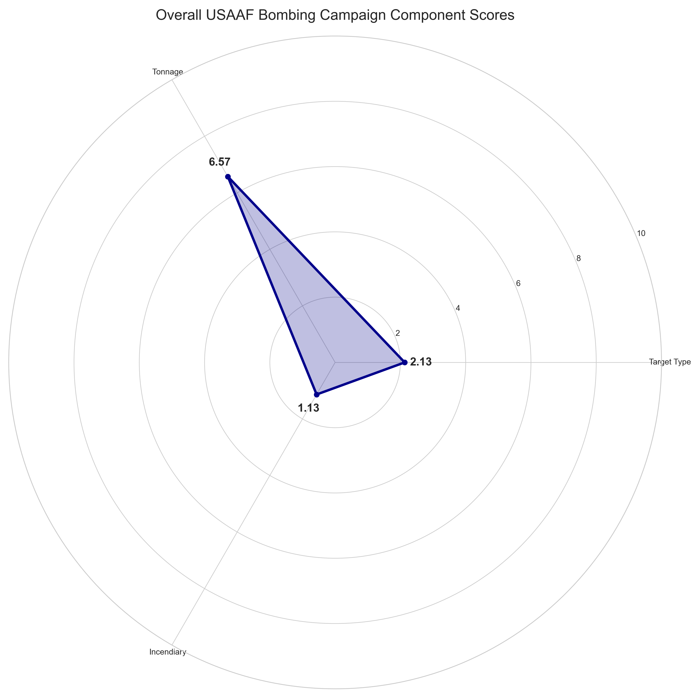
*Figure 1.7: Radar chart showing component scores for the entire dataset.*

One persistent claim in strategic bombing historiography deserves particular scrutiny: the assertion that transportation targets served as a pretext for area bombing. Several prominent scholars have advanced this theory—Lucien Mott argues that transportation targeting masked deliberate attacks on civilian populations [(Lucien Mott 2019)](https://bomberdata.s3.us-east-1.amazonaws.com/Readings/corpora/lucien_pinpoint/chunks/lucien_pinpoint_0036.txt), while Robert Anthony Pape contends that marshalling yards and rail centers functioned as nominal military objectives concealing broader civilian targeting [(Pape 1960)](https://bomberdata.s3.us-east-1.amazonaws.com/Readings/corpora_cited/pape_coercion/chunks/pape_coercion_0177.txt).[^38] These scholars point to the use of incendiary munitions against transportation infrastructure—weapons tactically ill-suited for disrupting rail operations—and excessive tonnage deployments as evidence of disguised area bombing.

However, our comprehensive data analysis thoroughly refutes these claims. Transportation targets consistently maintained one of the most precise bombing profiles throughout the war, with a median area bombing score of just 2.4—well within the "precise bombing" classification. The incendiary component averaged a mere 1.0 across all transportation raids, significantly lower than the dataset average. Only 7.3% of transportation attacks fell into the "mixed" category (scores 4-6), with none qualifying as true area bombing. The distribution of bombing scores for transportation targets shows a pronounced concentration in the precise categories, directly contradicting the notion that these missions served as cover for civilian targeting.

Rather than transportation, the misclassification appears in the "industrial" category, where targets labeled as "city area," "town area," or "unidentified target" reveal the true locus of area bombing operations. This classification is particularly significant, as the USSBS dedicated several folders to this "industrial" category, with the overwhelming majority of targets therein being city areas, town areas, or unidentified targets associated with cities. This categorization effectively served as a catch-all for area bombing operations targeting urban centers, lending some credence to scholarly claims about classification manipulation.

This misclassification can be interpreted in two ways. One perspective suggests a deliberate concealment of area bombing practices, obscuring civilian targeting behind industrial designations. Alternatively, it may reflect the USAAF's doctrinal commitment to precision bombing—so deeply ingrained that even when targeting entire city areas, operations were conceptualized as attacking "city industry" or "German workers," thus maintaining the fiction of precision targeting. Regardless of interpretation, our methodology classifies these operations as area bombing based on their operational characteristics rather than their administrative designation, providing a more accurate representation of bombing practices throughout the campaign.


*Figure 1.8: Radar chart showing component scores for transportation targets. While the low target type score (0/10) merely confirms these weren't designated as city targets, the consistently low incendiary usage (1.0/10) and relatively moderate tonnage deployment (6.7/10) demonstrate that transportation raids maintained genuine precision characteristics in practice, contradicting assertions they functionally served as disguised area attacks.*


*Figure 1.9: Distribution of bombing categories for transportation targets, showing the overwhelming predominance of precision bombing approaches.*


*Figure 1.10: Area bombing score distribution for transportation operations, revealing a strong concentration in the precise bombing range.*

The most notable exception to these patterns was Berlin, which experienced significantly higher area bombing tactics. Only 23% of Berlin operations qualified as very precise or precise bombing, with 50% falling into mixed categories and nearly 27% constituting clear or heavy area bombing. The average incendiary percentage for Berlin proper reached 46%—extraordinarily high compared to other targets—with a median area bombing score of 4.9. [^39] This exceptional treatment of the Nazi capital suggests that emotional or symbolic factors may have influenced targeting decisions for particularly emblematic objectives.


*Figure 1.11: Distribution of bombing categories for Berlin, showing a significantly higher proportion of area bombing compared to the overall campaign.*


*Figure 1.12: Area bombing score distribution for Berlin operations, demonstrating the exceptional nature of the capital's treatment.*

Other cities received similar levels of bombing in terms of number of raids and total tonnage. Vienna, Hamburg, Graz, Linz, Munich, Ploesti, and Budapest all experienced substantial bombing campaigns, with 1944 standing out as having an exceptionally high number of raids concentrated on these major urban centers. The frequency of bombing increased exponentially during this period, creating a near-constant presence of Allied aircraft over certain cities.

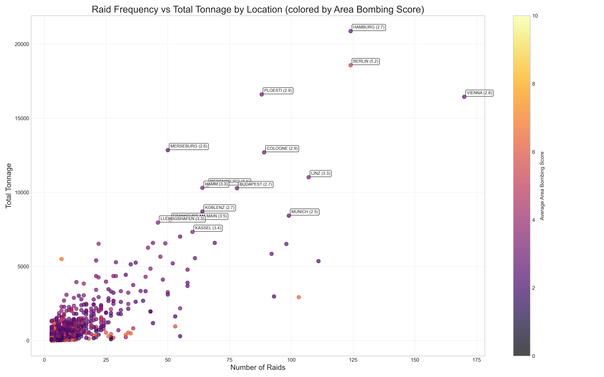
*Figure 1.13: Comparison of top cities by raid count and total tonnage, revealing that certain locations were subjected to an exceptional number of raids.*

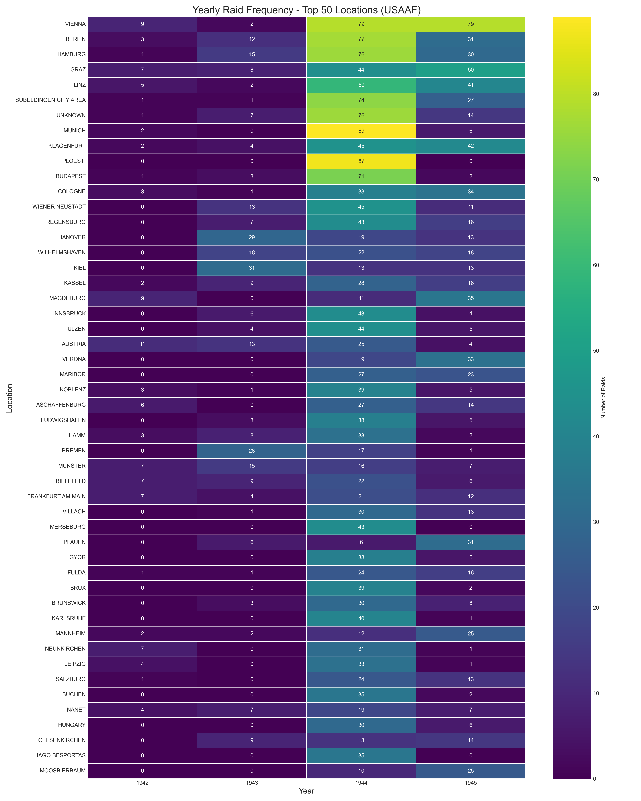
*Figure 1.14: Yearly heatmap of bombing intensity for the top 50 locations, showing the dramatic concentration of raids in 1944.*

In this dataset, frequency is not a dimension of precision, as from the perspective of the bomber this metric is operationally irrelevant. Precision occurs on a raid-by-raid level—it concerns the intended target of each specific mission and the tactical approach chosen to attack it. However, from the perspective of those being bombed, whether the bombers above intended for any specific raid to be precise becomes increasingly meaningless when raids occur every few days. Whether attacking a munitions factory on the outskirts one day or a marshalling yard in the center of town the next, even if both missions are technically "precise," civilians experience a constant onslaught that, in essence, begins to *feel* much more like area bombing.

One caveat is that a raid that triggers a firestorm engulfing a neighborhood or even a whole city feels considerably more destructive and apocalyptic than a raid on a marshalling yard where some high-explosive bombs miss their target and destroy nearby homes. This experiential difference explains why a substantial weight was assigned to the proportion of incendiaries used in our classification system. Nevertheless, constant aerial bombardment—whether technically precise or not—from the perspective of those under the bombs creates a feeling of total war regardless of the technical classification of individual raids.[^40]

This divergence between operational intent and civilian experience represents a fundamental tension in strategic bombing historiography. While our analysis focuses on the perspective of the bombers—examining their operational decisions, targeting strategies, and tactical approaches—we must acknowledge that historical narratives have often privileged the perspective of those being bombed. This civilian-centered approach naturally emphasizes the most dramatic and destructive instances of bombing.

The USAAF conducted bombing operations at over 3,700 distinct locations throughout Europe. The top 10 most bombed locations received only 13.5% of all bombing tonnage, while the top 50 locations received 38.2%. It required 118 locations to account for 50% of all bombing, 307 locations for 75%, and 745 locations for 90% of the total bombing effort.

While the USAAF dramatically expanded the number of locations bombed, from fewer than 200 per quarter in early 1943 to over 800 locations per quarter by mid-1944, we must acknowledge a significant concentration trend. By Q4 1944, the top 10% of locations received 70.7% of all bombing tonnage—a dramatic increase from just 34.9% in Q3 1943. This concentration meant that for civilians in these heavily targeted cities in that quarter of 1944, bombing raids—even if technically classified as precision operations—occurred with increasing frequency, creating an experience for those on the ground that more closely resembled area bombing.

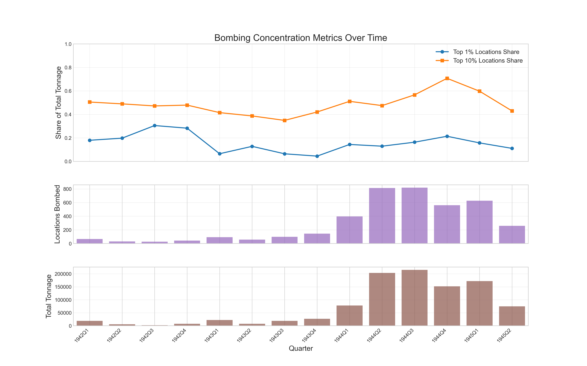
*Figure 1.15: Evolution of bombing concentration metrics over time, showing the share of total bombing received by the top 1% and top 10% of locations by quarter.*

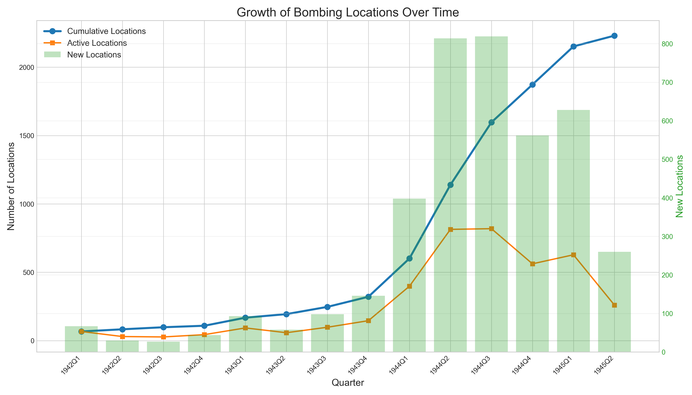
*Figure 1.16: Evolution of the cumulative number of locations bombed over time, showing a dramatic increase from early 1943 to mid-1944.*

This concentration pattern can be explained by several factors that align with precision bombing doctrine rather than contradicting it. First, German industrial production was itself concentrated in and around major urban centers, making these locations legitimate military targets under precision bombing principles. Second, the USAAF likely discovered that repeatedly targeting key facilities prevented repairs and created more permanent disruption to Nazi war production—a refinement of precision strategy rather than abandonment.

This apparent paradox—increasing concentration amid persistent precision characteristics—highlights a critical nuance in strategic bombing evolution. While select locations experienced dramatically intensified bombing frequency, the operational characteristics of individual raids remained largely consistent with precision doctrine. Our data shows no significant increase in per-raid tonnage or incendiary usage even as certain cities faced increasingly frequent attacks. Rather than abandoning precision for area bombing, the USAAF appears to have scaled up precision operations against legitimate industrial and military targets concentrated within key urban areas and their environs. For civilians in these locations, the practical distinction between precision and area bombing became increasingly theoretical—constant bombardment of various "precise" targets throughout a city created an experience functionally indistinguishable from area bombing, despite each individual raid maintaining technical precision characteristics. This explains why both contemporary accounts and subsequent historiography often characterized late-war bombing as predominantly area-focused, even while operational metrics tell a different story.

Even within the top 10% of most heavily bombed locations—those receiving 70.7% of all bombing tonnage by Q4 1944—the operational characteristics remained distinctly different from Berlin's exceptional treatment. These cities experienced more frequent raids, but each individual raid maintained precision attributes: specific military-industrial targets (marshalling yards, oil refineries, munitions factories) rather than "city areas"; moderate rather than excessive tonnage per raid; and notably low incendiary usage compared to true area bombing operations. This pattern strongly suggests that the USAAF was pursuing legitimate military objectives within these cities rather than targeting urban areas for destruction. The concentration resulted from the unfortunate reality that German war production facilities were themselves concentrated in and around urban centers, not from an abandonment of precision doctrine.

If the bombing campaign had truly shifted from precision to area bombing as many historians have contended, the latter part of the war would have looked much more like Berlin throughout Europe. We would have observed several clear patterns: a steady increase in the proportion of incendiary munitions; target classifications progressively migrating toward the "industrial" category; transportation targets adopting area bombing characteristics; tonnage per raid showing consistent increases; and all components of our area bombing score—target type, tonnage, and incendiary percentage—displaying coordinated increases over time. Instead, we observed that incendiary proportions remained flat; target classifications showed no migration toward "industrial" categories; transportation targets maintained precision characteristics; tonnage per raid showed no meaningful trend; and the components of our area bombing score displayed no coordinated increases. Thus, the conclusion is inescapable: there was no wholesale shift from precision to area bombing in the USAAF strategic bombing campaign.

## Conclusion

The persistence of precision bombing throughout the war fundamentally challenges the traditional historical narrative. The conventional explanation—that a wholesale shift from precision to area bombing occurred—is not supported by the empirical evidence. Our comprehensive analysis of the raw data, examining target categorization, tonnage deployed, and incendiary proportions, reveals a more nuanced reality. While area bombing did increase in specific instances like Berlin and occurred more frequently in absolute terms as operations expanded, it remained proportionally consistent and concentrated in particular symbolic targets rather than representing a doctrinal transformation. This analysis of bomber intent and operational classification in no way diminishes the experience of the bombed—our aim is not to dismiss civilian suffering, but rather to contribute to a more accurate understanding of the actual strategic doctrine that guided bombing operations. The campaign was predominantly characterized by precision approaches, with a mean area bombing score of just 3.27 out of 10 across all raids. This finding directly contradicts the commonly held notion of a dramatic "0 to 1" shift from precision to area bombing by the USAAF throughout the war. Instead, the evidence points to a strategic continuity with tactical adaptations, maintaining precision as the fundamental operational approach even as the scale and complexity of the air campaign reached unprecedented levels.

*N.B.: To facilitate further research and enable independent verification of these findings, a web application has been developed that provides comprehensive access to the complete bombing dataset. This resource allows researchers to explore operations by year, target category, city, or any combination of factors, with the ability to download raw or processed data for independent analysis: https://strategic-bombing-data.streamlit.app/. The reader, if they are reading this thesis on paper, is encouraged to please pause and visit the website.*

[^36]: The USSBS folders marked as "industrial" predominantly contain targets with names such as "city area," "town area," or "unidentified target" over a city. This classification is a misnomer, as it does not accurately reflect the actual nature of the targets being bombed. Therefore this whole category we weigh towards area bombing classification.

[^37]: [(USSBS Overall Report)](https://bomberdata.s3.us-east-1.amazonaws.com/Archive/Reports/BOX_47/FOLDER_2/OVERALL_REPORT/IMG_8271.JPG). See the script that did the classification at [visualize_usaaf_bombing.py](https://github.com/nac-codes/thesis_bombing/blob/master/attack_data/deployment_usaaf_dashboard/visualize_usaaf_bombing.py).

[^38]: Mott, Lucien. *Pinpoint: The Evolution of Precision Bombing*., 36; Pape, Robert Anthony. *Coercion: The Logic of Air Power and the Bombing of Civilian Targets*., 277.

[^39]: Note that this excludes Berlin suburbs such as Templehof and Siemenstadt which received more precise attacks.

[^40]: It is important to acknowledge a significant limitation in our analysis: it focuses exclusively on USAAF raids, omitting Royal Air Force (RAF) operations. From the perspective of those being bombed, the distinction between RAF or USAAF aircraft was largely irrelevant. While RAF bombing data is contained within our dataset and was documented in the USSBS, we discovered that a substantial number of raids appear to be missing from the record. Our initial compilation of RAF tonnage fell short by approximately 400,000 tons of bombs compared to official totals, a discrepancy not attributable to methodological error. Notably, these missing tons were almost entirely from the "industrial" or city area category—precisely the categories most associated with area bombing practices. Given this significant incompleteness in the RAF data, we deemed it inadmissible for our analysis, and thus the scope of this thesis is limited to the USAAF bombing campaign.

# Chapter 2: The Effectiveness of Strategic Bombing

## Introduction

Our analysis of bombing mission data reveals a strategic campaign more nuanced than conventional historiography suggests. Rather than a dramatic shift from precision to area bombing, evidence shows both approaches coexisted throughout the conflict, with area bombing increasing slightly in 1944.

This dual approach raises key questions about effectiveness. While the United States maintained consistent commitment to precision bombing even during operational expansion, it simultaneously employed area bombing across various targets, especially in symbolic locations like Berlin. This parallel use of different bombing strategies requires critical examination: did either approach justify its military and human costs?

This chapter evaluates both bombing methods based on their strategic outcomes, using the United States Strategic Bombing Survey's post-war assessments.[^41] These reports—compiled through thousands of interviews and document analyses in occupied Germany—provide a thorough evaluation of bombing effectiveness. Combined with testimony from German officials like Albert Speer and economic data from targeted industries, they help determine whether either bombing approach achieved its objectives.

## Area Bombing

The extraordinary resources devoted to area bombing reflected an emphasis on general destruction, yet proved ineffective at achieving its stated economic objectives. This disconnect between effort and outcome raises important questions about the underlying motivations for this approach. The devastating power of incendiary weapons, particularly when combined with high explosives, made them the most destructive conventional weapons of the war. As noted in the USSBS Physical Damage Report, incendiary bombs caused "close to five times as much damage, per ton, as high-explosive bombs" in urban areas.[^42]

Yet despite this destructive capacity, area bombing failed to achieve its purported strategic goals. If area bombing had successfully undermined the Nazi economy through civilian and urban targeting, we would expect to see either significant labor force reductions or the diversion of resources from military to civilian needs. The United States Strategic Bombing Survey found neither outcome.

The USSBS's comprehensive analysis found no evidence supporting either of these anticipated outcomes. The Survey's Overall Report explicitly states that "bomb damage to the civilian economy was not a proximate cause of the military collapse of Germany," further noting that there is no evidence that "shortages of civilian goods reached a point where the German authorities were forced to transfer resources from war production in order to prevent disintegration on the home front."[^43]

Additionally, German civilian employment levels remained stable throughout the war. The USSBS's analysis of the German economy reveals that the total employment of Germans, including those drafted into the Wehrmacht and accounting for casualties, remained "practically unchanged throughout the war."[^44] Even more telling, Germany maintained significant untapped labor reserves throughout the conflict. While Britain reduced its domestic service workforce from 1.2 to 0.5 million workers during the war, Germany's comparable workforce decreased only marginally from 1.5 to 1.3 million. This persistence of substantial civilian sector employment implies that Germany retained significant economic flexibility, directly contradicting the notion that area bombing had put any significant pressure on the civilian economy.

The recovery capacity of German cities further undermines the strategic logic of area bombing. The United States Strategic Bombing Survey's analysis of ten heavily bombed German cities reveals an "extraordinary ability to recover from the effects of ruinous attacks." Hamburg provides a striking example: despite losing nearly one-third of its housing stock and suffering over 60,000 civilian casualties in the devastating "Operation Gomorrah" raids of July-August 1943, the city recovered 80% of its productive capacity within just five months. When industrial output was affected, the analysis shows that worker absenteeism, rather than physical destruction, accounted for the majority of production losses. Moreover, damage to local transportation and utility infrastructure proved insignificant, with services typically restored before industrial facilities had completed repairs.[^45]

The Area Division's detailed investigation of German cities subjected to area attacks provides further evidence of their limited effectiveness. Their Hamburg study concluded that "concentrated attacks (precision bombing) on limited targets were more effective in disrupting vital production than were the area raids on workers' quarters throughout the city." More broadly, the Area Studies Division Report found that area raids generally damaged "sectors of the German economy not essential to war production" and consequently "did not have a decisive effect upon the ability of the German nation to produce war material."[^46] While cities experienced immediate declines in their labor force following raids, they typically recovered most of their industrial workforce within two to three months.

Area bombing cannot be justified based on its practical economic effectiveness. As demonstrated above, it failed to meaningfully disrupt the German labor force or force resource reallocation from military to civilian needs. Attempts to justify it based on its psychological impact are equally unconvincing. The USSBS Morale Division's findings explicitly noted that "the fallacy of the idea that all one has to do is keep on bombing and finally a people's morale will be destroyed had been documented long ago."[^47] More recent scholarship has further emphasized the ambiguous and often counterproductive nature of morale bombing, with "depressed and discouraged workers" not necessarily translating into reduced productivity.[^48]

The presence of area bombing despite this clear evidence of its ineffectiveness exemplifies the emotional dynamics that Fuller identified in warfare between modern mass societies. While the fog of war meant that bombing's precise effects remained uncertain during the conflict, the doctrinal foundations for precision bombing had been well-established in interwar military thought.[^49] The decision to pursue and expand (although only slightly) a strategy of generalized destruction—targeting not just economic assets but civilian populations—represented a marked departure from this theoretical framework. This indicates that area bombing was driven more by the emotional imperatives that Fuller described than by rational military calculation.

## Precision Bombing

The effectiveness of precision bombing as a military doctrine rests on the understanding of industrial economies as interconnected systems. Developed at the Air Corps Tactical School in the interwar period, this theory—variously called the "industrial web" or "critical node" theory—posited that modern economies function as complex networks where targeted strikes against key nodes could trigger cascading failures throughout the entire system.[^50] This rational, analytical approach to warfare stands in stark contrast to the emotional and vengeful motivations described in the Moralist narrative of strategic bombing, making the persistent American commitment to precision bombing all the more remarkable given the pressures of total war.

The theory presumed that within any war economy there existed a limited set of facilities or infrastructure points that produced "key items or services indispensable to the economy as a whole, such as national transportation and power resources." By identifying and destroying these bottlenecks, strategic bombing planners believed they could bring an entire economy to a halt with remarkable efficiency.

However, the successful application of precision bombing doctrine depends entirely on specific conditions within the target economy. The strategy requires an industrial base operating at or near maximum capacity, with minimal redundancy in critical systems and limited ability to adapt to disruptions. In such an economy, tight supply chains, significant resource constraints, and numerous bottlenecks create vulnerabilities that, when exploited, cannot be easily circumvented. Without these conditions, precision strikes become more of a nuisance than a decisive factor—the enemy can simply redirect resources or activate spare capacity to maintain production.

In examining the potential effectiveness of precision bombing against Nazi Germany, we must therefore first understand the fundamental nature of the German war economy. Evidence from the United States Strategic Bombing Survey indicates that the German industrial base did not match the theoretical prerequisites for successful precision bombing. As we shall see, rather than operating as a tightly constrained system vulnerable to targeted disruption, the German economy maintained significant underutilized capacity across multiple sectors.

As previously stated, Germany refused to fully mobilize its workforce, particularly women. Although this has often been attributed to Nazi paternalistic ideology, the reality is that the German economy simply did not require this additional labor force. In addition, even the administrative sector remained bloated, with approximately 3.5 million workers in public administration positions that Albert Speer, as armaments minister, tried unsuccessfully to reduce.[^51]

Civilian consumption levels remained remarkably high, with the economy operating under what the Strategic Bombing Survey termed a "guns and butter" philosophy that persisted even after the initial defeats in Russia. Rather than implementing strict rationing and resource allocation, Germany maintained civilian consumption at levels exceeding those of 1929 well into the war years.[^52]

Industrial capacity showed similar patterns of underutilization. With the notable exception of the aero-engine industry, most German armament facilities operated on single shifts throughout the war, despite having the machinery and infrastructure to support multiple shift operations. The USSBS noted that "machine tool and machinery capacity was generally in excess of needs," indicating significant unused productive potential. This inefficiency extended to the allocation of raw materials, particularly steel, which remained "freely available for all current purposes," including civilian construction projects of "doubtful utility."[^53]

Under Walther Funk's Economic Ministry, this pattern of inefficiency was institutionalized. The ministry maintained excess capacity while "satisfying high cost firms" and continuing "production of superfluous civilian goods." The appointment of Albert Speer as Minister for Weapons and Ammunition in 1942 revealed the fundamental tensions in Germany's economic strategy. Initially given limited powers as an "expediter" and coordinator of urgent weapons production, Speer operated within a fragmented system where multiple agencies maintained control over different sectors of the economy.[^54]

Only after the disaster at Stalingrad, when the impossibility of a quick victory became apparent, did Germany attempt comprehensive economic mobilization. In early 1943, Speer received sweeping powers as head of the newly created Ministry for Armament and War Production. However, this belated move toward rationalization faced two insurmountable challenges. First, Germany could no longer afford the time required to expand basic industrial capacity in steel, oil, and coal production—investments that should have been made years earlier. Second, despite the growing crisis, there remained strong resistance to reducing civilian consumption. Local political leaders (gauleiters) continued to oppose cuts to civilian standards even "in the hour of their greatest peril," and industrial reports indicate that civilian orders were still being fulfilled through 1943.[^55]

Despite these constraints, Speer achieved significant increases in armament production—56 percent higher in 1943 than 1942, and more than double 1941 levels. However, these gains demonstrate not Speer's organizational genius but rather the extent of Germany's previously unutilized industrial capacity. The Strategic Bombing Survey noted that this dramatic increase was possible primarily because of "the existence of large untapped capacities in Germany's industrial establishment." The Allied bombing campaign may have actually aided Speer's rationalization efforts, as "the stress of the raids permitted him to mobilize the energies of the population" and overcome bureaucratic resistance to efficiency measures.[^56]

There was a fundamental mismatch between Germany's economic preparation and the war it ultimately had to fight. The economy was structured for a series of quick victories that would enhance German living standards rather than a prolonged conflict requiring total mobilization.[^57] This approach meant that the economy the Allies were bombing had in fact more potential energy than kinetic making it a poor candidate for precision bombing strategies predicated on disrupting highly strained industrial systems.

The strategic bombing campaign faced an inherent challenge in its targeting strategy, as it devoted significant resources to industries with remarkable regenerative capacity. USAAF bombing data reveals that approximately 83% of bombs were directed at targets with significant regenerative or dispersal capacity. Aircraft and military production facilities (24.3% of total tonnage), industrial/city areas (9.8%), and naval installations (2.1%) all demonstrated remarkable resilience through dispersal and reconstruction. In contrast, sectors with limited redundancy or dispersal options — including chemical plants, explosives facilities, utilities, and specialized manufacturing - received only about 17% of the total bombing effort.[^58] While this categorization is somewhat of a generalization, the stark disparity implies that the majority of bombing resources were directed at targets that could be reconstructed, relocated, or substituted relatively quickly.

The transportation network alone received 38.4% of the total effort, and had some of the most considerable effects. Between August and December, freight car loadings fell by approximately 50%, while coal shipments dropped precipitously from 7.4 million tons to 2.7 million tons. By March 1945, coal shipments could barely meet the railroads' own fuel needs.[^59] As senior German officers like von Rundstedt and von Gersdorf later acknowledged, it was not the overall shortages of materials that proved most devastating, but rather "the constant attrition of these supplies en route from the factories to the front lines."[^60] Yet much of this tonnage had limited impact due to dispersed targeting. As Generalmajor Peters stated to the USSBS, "the bombing of a certain limited area, or a stretch of railway lines from north to south, or east to west, caused much more damage than indiscriminate bombing of marshalling yards and railroad stations throughout the entire German Reich."[^61] This indicates that the same strategic effect could have been achieved with far fewer bombs if properly concentrated. Most notably, he emphasized that bridge attacks were particularly devastating, stating that while damaged marshalling yards could be repaired to maintain at least two to three tracks for traffic, bridge repairs "took months," and severely damaged bridges were often abandoned entirely. Peters concluded that had the Allies "confined themselves to bombing bridges only, throughout Germany, transportation would have come to a complete standstill."[^62] This testimony implies that even in a case where strategic bombing proved ultimately successful, it was far less efficient in terms of effect per tons dropped than it could have been.

Another example of effectiveness came with the campaign against Germany's synthetic oil plants provides perhaps the most striking example—production of synthetic fuels, which accounted for 90% of aviation gasoline and 30% of motor gasoline, collapsed from 359,000 tons in early 1944 to just 24,000 tons by September. Aviation gasoline output specifically plummeted from 175,000 tons to a mere 5,000 tons during this period. The oil campaign had cascading effects across other vital industries, as these same facilities produced synthetic nitrogen, methanol, and rubber—by late 1944, synthetic nitrogen production had fallen from 75,000 to 20,000 tons monthly, forcing cuts in both agricultural use and explosives manufacturing.[^63]

Still, there were other vulnerable industries could have been effectively targeted but were not. Haywood S. Hansell Jr., a key architect of American air strategy, makes a compelling case in his memoir that targeting Germany's electrical power system could have achieved decisive results before the Normandy invasion. He argues that "the Combined Bomber Offensive could have included the destruction of most of the German powerplants and the disruption of the power distribution system by demolishing the switching stations" and that this, combined with attacks on synthetic petroleum, nitrogen production, and transportation, "would have produced in May or June of 1944 the chaos which characterized the German war industry and the German state in January, February, and March of 1945." The fact that this strategy was not pursued, Hansell states, was a "political decision" that disregarded military considerations.[^64]

Some might argue that such precision targeting was impractical given the operational capabilities of the time. Hansell's analysis challenges this notion. Using the example of the utilities industry, he describes how two combat wings (108 bombers) attacking a power generating station would achieve "virtual assurance of at least 1 hit in the powerhouse, a 96.5 percent probability of knocking it out with 2 hits for several months and 89 percent probability of 3 hits, knocking it out for 6 to 18 months." To target two-thirds of German electrical power would have required approximately 35,000 to 48,000 tons of bombs - "a small portion of the total effort available in March, April, and May of 1944," when U.S. Strategic Air Forces dropped 198,000 tons of bombs, with only 6,080 tons directed at oil targets.[^65]

The testimony of German industrialists further confirms that precision bombing could have been more effective with better target selection. As Hettlage, a German economic official, noted to USSBS interrogators, most German industrialists were "inclined to invest only for the purpose of post-war business" and "opposed the purchase of new machines, especially single purpose machines" for war production.[^66] This reluctance to fully convert to war production created vulnerabilities that could have been exploited through more focused precision bombing of critical industrial bottlenecks.

Perhaps the most telling assessment comes from Albert Speer himself:

> Our continuous bombing of aircraft assembly and other dispersed plants was not considered of decisive effect by SPEER. He compared German war production to a stream. Instead of bombing the source (steel) we chose to concentrate on the mouth. This could not decisively alter the course of the stream.[^67]

What emerges from this analysis is a picture of precision bombing that achieved meaningful strategic effects when properly targeted, yet fell short of its potential due to suboptimal target selection. The American commitment to precision bombing, despite significant operational challenges and the emotional pressures of total war, represents a notable adherence to rational military calculation in the face of Fuller's predicted descent into indiscriminate destruction. While precision bombing did not fully deliver on its theoretical promise of surgical efficiency, the empirical evidence demonstrates that when focused on critical economic bottlenecks—particularly oil production, specialized manufacturing, and key transportation nodes—it could produce decisive results with relatively modest resource expenditure. This suggests that the limitations of strategic bombing stemmed not from inherent flaws in the concept itself, but rather from failures in implementation and target prioritization that allowed the German war economy to maintain significant productive capacity until the final months of the conflict.

## Synthesis

Neither area nor precision bombing fully delivered on its strategic promises, though for different reasons. Area bombing failed fundamentally to disrupt German labor or force resource reallocation, despite its devastating human toll, suggesting its persistence and minor increase stemmed from emotional rather than rational imperatives. Precision bombing demonstrated effectiveness when properly targeted—as with oil facilities and key transportation nodes—but was severely compromised by devoting the majority of its resources to targets with significant regenerative capacity. The campaign's principal shortcoming was not technological limitations but strategic analysis—a failure to identify and consistently target the most vulnerable elements of the German war economy. This conclusion challenges both those who dismiss strategic bombing entirely and those who claim it was decisive; it contributed significantly to Allied victory but at considerably higher cost and lower efficiency than a more disciplined targeting approach might have achieved.

[^41]: This analysis relies primarily on USSBS findings rather than directly on the author's dataset of bombing missions. This methodological choice reflects the fragmented, unstandardized nature of raw bombing effects data, which would require a separate research project to analyze comprehensively. Even the complete USSBS data contains significant gaps, particularly regarding the Eastern Front. While the author has digitized these reports in their entirety—while previously only the Overall Report was available digitally—the USSBS's empirical findings remain valuable when critically examined, even as their strategic conclusions are reassessed.

[^42]: [United States Strategic Bombing Survey, Physical Damage Report, 23](https://bomberdata.s3.us-east-1.amazonaws.com/Archive/Reports/BOX_75/FOLDER_134b/PHYSICAL_DAMAGE/IMG_10499.JPG)

[^43]: [United States Strategic Bombing Survey, Overall Report, 38](https://bomberdata.s3.us-east-1.amazonaws.com/Archive/Reports/BOX_47/FOLDER_2/OVERALL_REPORT/IMG_8254.JPG)

[^44]: [United States Strategic Bombing Survey, German Economy Report, 9](https://bomberdata.s3.us-east-1.amazonaws.com/Archive/Reports/BOX_47/FOLDER_3/GERMAN_ECONOMY/IMG_8550.JPG)

[^45]: [United States Strategic Bombing Survey, Overall Report, 72](https://bomberdata.s3.us-east-1.amazonaws.com/Archive/Reports/BOX_47/FOLDER_2/OVERALL_REPORT/IMG_8271.JPG)

[^46]: [Gian P. Gentile, How Effective Is Strategic Bombing? Lessons Learned from World War II to Kosovo (New York: New York University Press, 2001), 78](https://bomberdata.s3.us-east-1.amazonaws.com/Readings/corpora/gentile_effective/chunks/gentile_effective_0098.txt)

[^47]: [Herbert Hyman, "The Psychology of Total War: Observations from the USSBS Morale Division"](https://bomberdata.s3.us-east-1.amazonaws.com/Archive/HERBERT_HYMAN_PAPERS/USSBS_ARTICLE/IMG_3948.JPG)

[^48]: Eric Ash, "Terror Targeting: The Morale of the Story," Aerospace Power Journal (Winter 1999), accessed via Defense Technical Information Center, https://apps.dtic.mil/sti/tr/pdf/ADA529782.pdf. Ash demonstrates how bombing could sometimes boost Allied morale through retribution while failing to break enemy resolve, noting that physical destruction did not automatically lead to moral collapse.

[^49]: [Conrad C. Crane, Bombs, Cities, and Civilians: American Airpower Strategy in World War II (Lawrence: University Press of Kansas, 1993), 29](https://bomberdata.s3.us-east-1.amazonaws.com/Readings/corpora/crane_bombs/chunks/crane_bombs_0020.txt)

[^50]: [Alexander B. Downes, "Defining and Explaining Civilian Victimization," in Targeting Civilians in War (Ithaca: Cornell University Press, 2008), 39](https://bomberdata.s3.us-east-1.amazonaws.com/Readings/corpora/downes_strategic/chunks/downes_strategic_0065.txt)

[^51]: [United States Strategic Bombing Survey, German Economy Report, 7](https://bomberdata.s3.us-east-1.amazonaws.com/Archive/Reports/BOX_47/FOLDER_3/GERMAN_ECONOMY/IMG_8549.JPG)

[^52]: [United States Strategic Bombing Survey, German Economy Report, 9](https://bomberdata.s3.us-east-1.amazonaws.com/Archive/Reports/BOX_47/FOLDER_3/GERMAN_ECONOMY/IMG_8550.JPG)

[^53]: [United States Strategic Bombing Survey, German Economy Report, 20-1](https://bomberdata.s3.us-east-1.amazonaws.com/Archive/Reports/BOX_47/FOLDER_3/GERMAN_ECONOMY/IMG_8556.JPG)

[^54]: [United States Strategic Bombing Survey, German Economy Report, 24-5](https://bomberdata.s3.us-east-1.amazonaws.com/Archive/Reports/BOX_47/FOLDER_3/GERMAN_ECONOMY/IMG_8558.JPG)

[^55]: Ibid.

[^56]: [United States Strategic Bombing Survey, German Economy Report, 26-7](https://bomberdata.s3.us-east-1.amazonaws.com/Archive/Reports/BOX_47/FOLDER_3/GERMAN_ECONOMY/IMG_8559.JPG)

[^57]: This is a point that's been made by others.
[Alan J. Levine, The Strategic Bombing of Germany, 1940-1945 (Westport, CT: Praeger, 1992), 34](https://bomberdata.s3.us-east-1.amazonaws.com/Readings/corpora/levine_bombing/chunks/levine_bombing_0034.txt)
[Richard Overy, The Bombers and the Bombed: Allied Air War Over Europe, 1940-1945 (New York: Viking, 2013), 255](https://bomberdata.s3.us-east-1.amazonaws.com/Readings/corpora/overy_bombed/chunks/overy_bombed_0255.txt). It is worth noting while Germany had a material cushion, it was under severe economic strain, as outlined by Tooze. By 1944, Wehrmacht expenditures alone exceeded the total national income of the late 1930s. [Adam Tooze, The Wages of Destruction: The Making and Breaking of the Nazi Economy (London: Allen Lane, 2006), 414](https://bomberdata.s3.us-east-1.amazonaws.com/Readings/corpora/tooze_wages/chunks/tooze_wages_0414.txt)

[^58]: Full analysis of USAAF tonnage (1,054,708.40 total tons): Easily dispersible/regenerative targets (82.7%): Transportation (405,038.14, 38.4%), Aircraft/Airfields (197,310.60, 18.7%), Industrial Areas (103,426.67, 9.8%), Military Industry (52,739.97, 5.0%), Manufacturing (7,474.76, 0.7%), Naval (22,467.20, 2.1%), Supply (11,522.81, 1.1%), Tactical (43,535.28, 4.1%), Other misc. (29,441.57, 2.8%). Less dispersible/strategic bottleneck targets (17.3%): Oil (163,244.13, 15.5%), Chemical (9,557.85, 0.9%), Explosives (6,553.02, 0.6%), Light Metals (67.20, 0.0%), Radio (184.00, 0.0%), Rubber (1,317.28, 0.1%), Utilities (2,943.60, 0.3%). View at [summary_statistics_detailed.txt](https://github.com/nac-codes/thesis_bombing/blob/master/attack_data/reports/summary_statistics/summary_statistics_detailed.txt)

[^59]: [United States Strategic Bombing Survey, German Economy Report, 12-3](https://bomberdata.s3.us-east-1.amazonaws.com/Archive/Reports/BOX_47/FOLDER_3/GERMAN_ECONOMY/IMG_8552.JPG)

[^60]: [United States Strategic Bombing Survey, Logisitics Report, 125-6](https://bomberdata.s3.us-east-1.amazonaws.com/Archive/Reports/BOX_59/FOLDER_64a/LOGISTICS/IMG_9689.JPG)

[^61]: [United States Strategic Bombing Survey, Interrogation of Generalmajors Peters, 315](https://bomberdata.s3.us-east-1.amazonaws.com/Archive/Interrogations/CONTAINER_5/2L139/IMG_0315.JPG)-[316](https://bomberdata.s3.us-east-1.amazonaws.com/Archive/Interrogations/CONTAINER_5/2L139/IMG_0316.JPG)

[^62]: Ibid.

[^63]: [United States Strategic Bombing Survey, German Economy Report, 12-3](https://bomberdata.s3.us-east-1.amazonaws.com/Archive/Reports/BOX_47/FOLDER_3/GERMAN_ECONOMY/IMG_8552.JPG)

[^64]: [Haywood S. Hansell, The Strategic Air War Against Germany and Japan: A Memoir (Washington, D.C.: Office of Air Force History, 1986), 278](https://bomberdata.s3.us-east-1.amazonaws.com/Readings/corpora/hansell_memoir/chunks/hansell_memoir_0278.txt)

[^65]: Ibid., [Appendix](https://bomberdata.s3.us-east-1.amazonaws.com/Readings/corpora/hansell_memoir/chunks/hansell_memoir_0301.txt)

[^66]: [United States Strategic Bombing Survey, "Interrogation of Hettlage"](https://bomberdata.s3.us-east-1.amazonaws.com/Archive/Telford_Taylor_Papers/USSBS_HETTLAGE/IMG_3866.JPG)

[^67]: [U.S. Strategic Bombing Survey, "Interrogation of Albert Speer"](https://bomberdata.s3.us-east-1.amazonaws.com/Archive/Interrogations/CONTAINER_6/2L178_USSBS/IMG_0492.JPG)

# Conclusion

This thesis has presented a comprehensive analysis of the strategic bombing campaign in the European theater, challenging longstanding narratives through empirical evidence drawn from a complete digitization of bombing mission data. The analysis in Chapter 1 definitively demonstrated that no wholesale shift from precision to area bombing occurred during the war. While area bombing characteristics modestly increased in 1944, precision methods persistently dominated throughout the conflict. This finding directly contradicts popular historical accounts that suggest an inexorable moral descent as the war progressed.

Chapter 2 revealed thar neither bombing approach fully delivered on its strategic promises. Area bombing fundamentally failed to disrupt the German labor force or force resource reallocation away from military production, despite its devastating human toll. The persistence of substantial civilian sector employment throughout the war and the remarkable recovery capacity of German cities undermine any strategic justification for area bombing. Precision bombing demonstrated effectiveness when properly targeted but was severely compromised by devoting the majority of its resources to targets with significant regenerative capacity.

These findings challenge the narrative that portrays the United States as descending into deliberate civilian targeting as a characteristic feature of modern warfare. The evidence does not support this view of moral compromise or abandonment of principles. The United States maintained a consistent commitment to precision bombing even as operations expanded dramatically in 1944-45. This persistence of precision methods, despite the fog of war and pressure for immediate results, deserves recognition in our historical memory.

Yet we must equally resist a jingoistic interpretation that absolves past decisions from critical assessment. While the campaign was not the exercise in indiscriminate destruction that popular memory suggests, it nevertheless fell far short of its potential effectiveness. With more disciplined targeting focused on critical vulnerabilities in the German war economy, the same strategic effects could have been achieved with significantly fewer bombs dropped and lives lost—both Allied airmen and German civilians.

What emerges from this analysis is a fundamental reassessment of strategic bombing's place in our understanding of modern warfare. The persistent commitment to precision bombing—despite its imperfect execution—directly challenges the fatalistic notion that total war inevitably leads to moral collapse and indiscriminate destruction. The American bombing campaign reveals instead that even under extreme pressure, military organizations can maintain operational principles that attempt to distinguish between military and civilian targets.

Thus, the most significant failure of strategic bombing was not a descent into barbarism, but rather a failure of analysis—an inability to correctly identify and persistently target the truly vulnerable nodes in the enemy's system. This suggests that the pursuit of precision in warfare is not merely a moral aspiration but a strategic imperative. When precision bombing succeeded—as it did with oil targets and certain transportation infrastructure—it achieved decisive effects with relatively modest resources. The lesson is not that precision warfare is impossible, but that it requires disciplined commitment to rigorous analysis and target selection—a commitment that was only inconsistently realized in World War II but remains essential for understanding the effective and ethical use of military force.

# Bibliography

Ash, Eric. "Terror Targeting: The Morale of the Story." *Aerospace Power Journal* (Winter 1999).

Beagle, T. W. Jr. "Effects-Based Targeting: Another Empty Promise?" Maxwell Air Force Base, AL: Air University Press, 2001.

Bellamy, Alex J. *Massacres and Morality: Mass Atrocities in an Age of Civilian Immunity*. Oxford: Oxford Scholarship Online, 2012.

Biddle, Tami Davis. *Rhetoric and Reality in Air Warfare: The Evolution of British and American Ideas about Strategic Bombing, 1914-1945*. Princeton: Princeton University Press, 2002.

Buckley, John. *Air Power in the Age of Total War*. London: UCL Press, 1999.

Builder, Carl H. *The Icarus Syndrome: The Role of Air Power Theory in the Evolution and Fate of the U.S. Air Force*. Routledge, 1994.

Crane, Conrad C. *Bombs, Cities, and Civilians: American Airpower Strategy in World War II*. Lawrence: University Press of Kansas, 1993.

Crane, Conrad C. *American Airpower Strategy in World War II: Bombs, Cities, Civilians, and Oil*. Lawrence: University Press of Kansas, 2016.

Davis, Richard G. *Carl A. Spaatz and the Air War in Europe*. Washington, D.C.: Office of Air Force History, U.S. Air Force, 1993.

Delori, Mathias. *Understanding the Fragmentation of the Memory of the Allied Bombings of World War II: The Role of the United States Strategic Bombing Survey*. London: Routledge, 2023.

Downes, Alexander B. *Targeting Civilians in War*. Ithaca: Cornell University Press, 2008.

Eisenhower, Dwight D. *Crusade in Europe*. Garden City, NY: Doubleday, 1948.

Fuller, J.F.C. *The Conduct of War, 1789–1961: A Study of the Impact of the French, Industrial, and Russian Revolutions on War and Its Conduct*. New Brunswick, NJ: Rutgers University Press, 1961.

Fuller, J.F.C. *War and Western Civilization, 1832–1932: A Study of War as a Political Instrument and the Expression of Mass Democracy*. London: Duckworth, 1932.

Garrett, Stephen A. *Ethics and Airpower in World War II: The British Bombing of German Cities*. New York: St. Martin's Press, 1993.

Gentile, Gian P. *How Effective Is Strategic Bombing? Lessons Learned from World War II to Kosovo*. New York: New York University Press, 2001.

Griffith, Charles R. *The Quest: Haywood Hansell and American Strategic Bombing in World War II*. Knoxville: The University of Tennessee, 1994.

Hansen, Randall. *Fire and Fury: The Allied Bombing of Germany 1942-45*. Toronto: Doubleday Canada, 2008.

Hansell, Haywood S. *The Strategic Air War Against Germany and Japan: A Memoir*. Washington, D.C.: Office of Air Force History, 1986.

Haun, Phil. *Lectures of the Air Corps Tactical School and American Strategic Bombing in World War II*. Lexington: The University Press of Kentucky, 2019.

Hecks, Karl. *Bombing 1939-45: The Air Offensive Against Land Targets in World War Two*. London: Robert Hale, 1990.

Hyman, Herbert. "The Psychology of Total War: Observations from the USSBS Morale Division."

Kennett, Lee. *A History of Strategic Bombing*. New York: Charles Scribner's Sons, 1982.

Knell, Hermann. *To Destroy a City: Strategic Bombing and Its Human Consequences in World War II*. Cambridge, MA: Da Capo Press, 2003.

Kohn, Richard H., and Joseph P. Harahan, eds. *Strategic Air Warfare: An Interview with Generals Curtis E. LeMay, Leon W. Johnson, David A. Burchinal, and Jack J. Catton*. Washington, D.C.: Office of Air Force History, United States Air Force, 1988.

Levine, Alan J. *The Strategic Bombing of Germany, 1940-1945*. Westport, CT: Praeger, 1992.

Maier, Charles S. "Targeting the city: Debates and silences about the aerial bombing of World War II." Cambridge: Cambridge Press, 2005.

McFarland, Stephen L. *America's Pursuit of Precision Bombing, 1910-1945*. Tuscaloosa: The University of Alabama Press, 1995.

Mott, Lucien. "Strategic Bombing Campaign During World War Two: Pinpoint vs Area Bombing." St. John's University.

Murray, Williamson. *Strategy for Defeat: The Luftwaffe, 1933-1945*. Maxwell Air Force Base, AL: Air University Press, 1983.

Overy, Richard J. *The Air War 1939-1945*. Plunkett Lake Press, 2020.

Overy, Richard. *The Bombers and the Bombed: Allied Air War Over Europe, 1940-1945*. New York: Viking, 2013.

Pape, Robert Anthony. *Bombing to Win: Air Power and Coercion in War*. Ithaca: Cornell University Press, 1960.

Parks, W. Hays. "'Precision' and 'Area' Bombing: Who Did Which, and When?" *Journal of Strategic Studies* 18, no. 1 (1995): 145-174.

Sherry, Michael S. *The Rise of American Air Power: The Creation of Armageddon*. New Haven: Yale University Press, 1987.

Tooze, Adam. *The Wages of Destruction: The Making and Breaking of the Nazi Economy*. London: Allen Lane, 2006.

United States Strategic Bombing Survey. *Area Studies Division Report*.

United States Strategic Bombing Survey. *German Economy Report*. College Park, MD: National Archives.

United States Strategic Bombing Survey. *Logistics Report*. College Park, MD: National Archives.

United States Strategic Bombing Survey. *Morale Division Findings*. College Park, MD: National Archives.

United States Strategic Bombing Survey. *Overall Report (European War)*. College Park, MD: National Archives.

United States Strategic Bombing Survey. *Physical Damage Division Report (ETO)*. College Park, MD: National Archives.

Webster, Charles and Noble Frankland. *The Strategic Air Offensive Against Germany 1939-1945, Volume III: Victory Part 5*. London: Her Majesty's Stationery Office, 1961.

Werrell, Kenneth P. *Death From the Heavens: A History of Strategic Bombing*. Annapolis, MD: Naval Institute Press, 2009.

Whitman, James Q. *The Verdict of Battle: The Law of Victory and the Making of Modern War*. Cambridge, MA: Harvard University Press, 2012.

# APPENDIX 1: Methodology for USAAF Strategic Bombing Data

The following outlines the comprehensive methodology employed to create and analyze a digital database of strategic bombing missions during World War II. The process involved the collection of primary source data, optical character recognition (OCR) processing, data cleaning and validation, and the generation of analytical reports. Each step is detailed below, with references to the specific scripts used in the data processing pipeline.

## Data Collection

The foundational data for this thesis was derived from 8,134 photographs of original United States Strategic Bombing Survey (USSBS) computer printouts. These documents, housed at the National Archives in College Park, Maryland, contain detailed raid-level data of bombing missions "FROM THE FIRST ATTACK TO 'V-E' DAY." The photographs captured the following information per raid:

- Target identification (location, name, coordinates, and code)
- Mission details (date, time, air force, and squadron)
- Operational parameters (number of aircraft, altitude, sighting method, visibility, target priority)
- Detailed bomb loads (numbers, sizes, and tonnages of high explosive, incendiary, and fragmentation munitions)

An example of these computer printouts is shown in Figure 2.1.


*Figure 2.1: Example of USSBS computer printout showing detailed raid data.*

The photographs were systematically organized into directories based on boxes, books, and images to maintain a coherent data structure for subsequent processing.

## Optical Character Recognition (OCR)

To convert the photographed tables into machine-readable text, we employed OCR techniques using Azure's Form Recognizer service. The service was chosen for its capability to handle complex table structures and handwritten components.

### Processing with Azure Form Recognizer

The script [`send_to_azure.py`](https://github.com/nac-codes/thesis_bombing/blob/master/attack_data/send_to_azure.py) was developed to automate the submission of images to the Azure service.

```python
# Excerpt from send_to_azure.py

document_analysis_client = DocumentAnalysisClient(
    endpoint=endpoint, credential=AzureKeyCredential(key)
)

def analyze_document(image_path):
    ...
    poller = document_analysis_client.begin_analyze_document(
        "prebuilt-layout", document=image_file
    )
    result = poller.result()
    ...
```

This script navigated through the directory of images, sent each image to Azure for processing, and stored the resulting JSON outputs containing the extracted data.

## Data Processing Pipeline

The data processing involved several stages to transform the raw OCR outputs into a clean, structured dataset suitable for analysis. The main steps included:

1. Extracting and organizing metadata and table data from the OCR outputs.
2. Correcting OCR errors and filling missing values using deterministic methods and language models.
3. Validating and cleaning the data to ensure consistency and accuracy.
4. Combining individual tables into a consolidated dataset.
5. Identifying and handling outliers and summation rows.
6. Generating analytical reports and visualizations.

### Extracting and Organizing Data

The initial processing of Azure's OCR output was handled by [`process_ocr.py`](https://github.com/nac-codes/thesis_bombing/blob/master/attack_data/process_ocr.py). This script was responsible for two critical tasks: extracting metadata about the target and identifying the correct data table from the OCR output.

Azure Form Recognizer returns a structured JSON object containing detected tables, text blocks, and their spatial relationships on the page. While this provides a good foundation, the script needed to handle several complexities:

1. **Table Identification**: The script searched for tables containing exactly 23 columns matching our expected format:
```python
# Excerpt from process_ocr.py
expected_column_names = [
    "DATE OF ATTACK DAY", "MO", "YR", "TIME OF ATTACK", "AIR FORCE",
    "GROUP OR SQUADRON NUMBER", "NUMBER OF AIRCRAFT BOMBING",
    "ALTITUDE OF RELEASE IN HUND. FT.", "SIGHTING", "VISIBILITY OF TARGET",
    "TARGET PRIORITY", "HIGH EXPLOSIVE BOMBS NUMBER", "SIZE", "TONS",
    "FUZING NOSE", "TAIL", "INCENDIARY BOMBS NUMBER", "SIZE", "TONS",
    "FRAGMENTATION BOMBS NUMBER", "SIZE", "TONS", "TOTAL TONS"
]
```

The script used fuzzy string matching to identify the correct table and column alignment, as OCR sometimes misread column headers:

```python
def find_table_with_23_columns(ocr_data, expected_names):
    best_match_score = 0
    best_match_table = None

    for table in ocr_data.get("tables", []):
        # Calculate fuzzy match scores between expected and found columns
        avg_score = calculate_column_match_score(table, expected_names)
        if avg_score > best_match_score:
            best_match_score = avg_score
            best_match_table = table
```

2. **Metadata Extraction**: Each page contained critical target information (location, name, coordinates, and target code) that needed to be extracted. The script used GPT-4o to help parse this information accurately:

```python
def extract_target_info(ocr_data, jpg_file):
    # Construct prompt for GPT-4 with the page content
    prompt = f"""Extract the following target information from this text:
    - Target Location
    - Target Name
    - Latitude
    - Longitude
    - Target Code

    Text: {page_text}
    """

    # Use GPT to extract structured information
    response = client.chat.completions.create(
        model="gpt-4",
        messages=[{"role": "user", "content": prompt}]
    )
```

3. **Data Organization**: The extracted data was organized into a structured format with two main components:
   - Metadata dictionary containing target information
   - Table data containing the actual bombing mission details

The script saved this information in two formats:
- A JSON file (`extracted_data.json`) containing both metadata and table data
- A CSV file (`table_data.csv`) containing just the table data for easier processing

```python
def save_csv(data, filename):
    with open(filename, 'w', newline='') as f:
        writer = csv.writer(f)
        writer.writerow(data.keys())
        writer.writerows(zip(*data.values()))

def save_json(data, filename):
    with open(filename, 'w') as f:
        json.dump(data, f, indent=2)
```

This initial processing stage was critical for ensuring data quality and consistency. The script included extensive logging to track any issues or anomalies in the extraction process, allowing for manual review when necessary. The output files were organized in a directory structure that maintained the relationship between original images and extracted data:

```
original_image.JPG
original_image_output/
    ├── extracted_data.json
    └── table_data.csv
```

This structured approach to data extraction provided a solid foundation for subsequent processing steps, ensuring that both the tabular data and contextual metadata were accurately preserved.

### Post-Processing and Data Correction

After initial extraction and organization, the data required extensive cleaning and correction to address OCR errors, inconsistencies, and missing values. This stage of the pipeline involved several key scripts:

1. **`process_table.py`**: Validated and corrected individual table data, applying field-specific validation rules and using GPT-4o-mini for contextual error correction.

2. **`post_process_2.py`**: Implemented deterministic validation based on mathematical relationships between bomb quantities, sizes, and tonnages using known bomb specifications from the period.

3. **`combine.py`**: Aggregated all processed tables into a single comprehensive dataset while preserving relevant metadata.

4. **`check_attacka_data.py`**: Performed statistical anomaly detection and facilitated manual review of outliers.

5. **`fill_missing_targets.py`**: Addressed missing target information by carrying forward values from previous records where appropriate:

```python
# Excerpt from fill_missing_targets.py
# Check if target_location (index 3) is empty
if row[3].strip() == "":
    # If the current row has target_name but not target_location
    if row[4].strip() != "":
        # Update previous target_name
        prev_target_name = row[4]
        # Use previous target_location
        row[3] = prev_target_location
    else:
        # Both fields are empty
        row[3] = prev_target_location
        row[4] = prev_target_name
```

6. **`fix_missing_years.py`**: Corrected missing or invalid year values to ensure temporal consistency:

```python
# Excerpt from fix_missing_years.py
# Check if YEAR field (index 10) is empty
if len(row) > 10 and (row[10].strip() == "" or row[10].strip() == "."):
    row[10] = "0"
```

These data cleaning steps produced increasingly refined datasets:
- `combined_attack_data_checked.csv`: Initial consolidated dataset with validation checks
- `combined_attack_data_filled.csv`: Dataset with missing target information filled
- `combined_attack_data_corrected.csv`: Final cleaned dataset with corrected years and other values

### Location-Based Organization

To facilitate geospatial analysis, the script `organize_by_location.py` created separate CSV files for each unique target location:

```python
# Excerpt from organize_by_location.py
# Process each unique location
locations = df['target_location'].unique()

for location in locations:
    # Clean and process location name
    clean_location = ' '.join(word.capitalize() for word in location.strip().split())

    # Create safe filename
    safe_filename = re.sub(r'[^\w\s-]', '', clean_location).strip().replace(' ', '_')
    output_file = os.path.join(locations_dir, f"{safe_filename}.csv")

    # Get all data for this location
    location_data = df[df['target_location'] == location].copy()

    # Sort by date and time
    location_data = location_data.sort_values(by=['YEAR', 'MONTH', 'DAY', 'TIME OF ATTACK'])

    # Save to CSV
    location_data.to_csv(output_file, index=False)
```

This organization allowed for efficient city-level analysis and visualization of bombing patterns throughout the war.

## Data Analysis and Categorization

The cleaned dataset was then subjected to more sophisticated analyses to identify patterns and assess the nature of bombing operations. This phase involved several key analytical steps:

### Raid Identification and Aggregation

The script `process_raids.py` identified and aggregated related bombing missions into coherent raids:

```python
# Excerpt from process_raids.py
def identify_raids(df):
    raids = []
    current_raid = []

    # Sort by location, target, date and time for proper sequencing
    sorted_df = df.sort_values(by=['target_location', 'target_name', 'YEAR', 'MONTH', 'DAY', 'TIME OF ATTACK'])

    for idx, row in sorted_df.iterrows():
        if not current_raid:
            current_raid.append(row)
            continue

        prev_row = current_raid[-1]

        # Check if this row belongs to the same raid (same location, target, and date)
        same_location = prev_row['target_location'] == row['target_location']
        same_target = prev_row['target_name'] == row['target_name']
        same_day = prev_row['DAY'] == row['DAY']
        same_month = prev_row['MONTH'] == row['MONTH']
        same_year = prev_row['YEAR'] == row['YEAR']

        if same_location and same_target and same_day and same_month and same_year:
            current_raid.append(row)
        else:
            raids.append(current_raid)
            current_raid = [row]
```

This process allowed for the calculation of aggregate raid statistics, including total aircraft, average altitude, and tonnage by bomb type:

```python
# Excerpt from process_raids.py
def aggregate_raid_data(raid_rows):
    # Sum of aircraft
    'TOTAL_AIRCRAFT': sum(row['NUMBER OF AIRCRAFT BOMBING'] for row in raid_rows if pd.notna(row['NUMBER OF AIRCRAFT BOMBING'])),
    # Average altitude
    'AVG_ALTITUDE': sum(row['ALTITUDE OF RELEASE IN HUND. FT.'] for row in raid_rows if pd.notna(row['ALTITUDE OF RELEASE IN HUND. FT.'])) /
                    sum(1 for row in raid_rows if pd.notna(row['ALTITUDE OF RELEASE IN HUND. FT.'])) if any(pd.notna(row['ALTITUDE OF RELEASE IN HUND. FT.']) for row in raid_rows) else None,
    # Sum of high explosive bombs
    'TOTAL_HE_BOMBS': sum(row['HIGH EXPLOSIVE BOMBS NUMBER'] for row in raid_rows if pd.notna(row['HIGH EXPLOSIVE BOMBS NUMBER'])),
    'TOTAL_HE_TONS': sum(row['HIGH EXPLOSIVE BOMBS TONS'] for row in raid_rows if pd.notna(row['HIGH EXPLOSIVE BOMBS TONS'])),
    # Sum of incendiary bombs
    'TOTAL_INCENDIARY_BOMBS': sum(row['INCENDIARY BOMBS NUMBER'] for row in raid_rows if pd.notna(row['INCENDIARY BOMBS NUMBER'])),
    'TOTAL_INCENDIARY_TONS': sum(row['INCENDIARY BOMBS TONS'] for row in raid_rows if pd.notna(row['INCENDIARY BOMBS TONS'])),
```

### Advanced Bombing Classification

A significant methodological innovation was the development of a nuanced classification system for bombing missions. Initially, we considered using a simple binary "area" vs. "precision" categorization, but historical evidence indicated that bombing tactics existed on a spectrum.

The original approach in `categorize_bombing.py` used a basic rule-based system:

```python
# Excerpt from categorize_bombing.py
def categorize_mission(row, df, time_window_hours=4):
    # First check if this mission used incendiaries
    if row['INCENDIARY BOMBS NUMBER'] > 0:
        return 'area'

    # Check other missions at the same target within the time window
    time_window_start = mission_time - timedelta(hours=time_window_hours)
    time_window_end = mission_time + timedelta(hours=time_window_hours)

    # If any related mission used incendiaries, categorize as area bombing
    if (related_missions['INCENDIARY BOMBS NUMBER'] > 0).any():
        return 'area'

    # If we get here, it's precision bombing
    return 'precision'
```

This was later refined in `visualize_usaaf_bombing.py` to implement a three-dimensional scoring algorithm that considered:

1. **Target designation**: Whether the target was categorized as an industrial/city area attack
2. **Incendiary proportion**: The percentage of incendiary munitions relative to total tonnage
3. **Total tonnage**: Whether excessive tonnage was employed compared to operational norms

```python
# Excerpt from visualize_usaaf_bombing.py
# Create target type score
df['TARGET_SCORE'] = (df['CATEGORY'].str.lower().str.contains('industrial')).astype(int)

# Create incendiary score (0-10 scale)
df['INCENDIARY_PERCENT'] = (df['TOTAL_INCENDIARY_TONS'] / df['TOTAL_TONS'] * 100).fillna(0)
df['INCENDIARY_SCORE'] = np.clip(df['INCENDIARY_PERCENT'] / 10, 0, 10)

# Create tonnage score (0-10 scale)
tonnage_threshold = df['TOTAL_TONS'].quantile(0.95)  # 95th percentile
df['TONNAGE_SCORE'] = np.clip(df['TOTAL_TONS'] / tonnage_threshold * 10, 0, 10)

# Create combined area bombing score (weighted average)
df['AREA_BOMBING_SCORE'] = (
    (0.3 * df['TARGET_SCORE'] * 10) +  # Target type (0 or 3)
    (0.5 * df['INCENDIARY_SCORE']) +   # Incendiary percentage (0-5)
    (0.2 * df['TONNAGE_SCORE'])        # Tonnage score (0-2)
)

# Normalize score to 0-10 scale
df['AREA_BOMBING_SCORE_NORMALIZED'] = df['AREA_BOMBING_SCORE']
```

This approach allowed missions to be classified on a continuous scale from 0 (precise bombing) to 10 (heavy area bombing). The scores were then bucketed into five categories:

```python
# Add score category to data
df['Score Category'] = pd.cut(df['AREA_BOMBING_SCORE_NORMALIZED'],
                             bins=[0, 2, 4, 6, 8, 10],
                             labels=['Very Precise (0-2)', 'Precise (2-4)',
                                    'Mixed (4-6)', 'Area (6-8)', 'Heavy Area (8-10)'])
```

This multidimensional approach provided a more nuanced and historically accurate representation of bombing character beyond the binary classification often employed in historical narratives.

## Data Visualization and Dashboard Development

The final stage of the methodology involved creating comprehensive visualizations and an interactive dashboard to explore the data.

### Visualization Scripts

Several specialized scripts were developed to generate visualizations focused on different aspects of the bombing campaign:

1. **`visualize_bombing_classification.py`**: Generated plots comparing area and precision bombing patterns.

2. **`visualize_bombing_by_year_category_city.py`**: Created visualizations breaking down bombing patterns by year, target category, and city.

3. **`visualize_usaaf_bombing.py`**: The primary visualization script that implemented the area bombing scoring algorithm and generated a comprehensive set of plots organized by:
   - Year
   - Target category
   - City
   - General trends

This script generated a wide range of visualization types:
- Histograms of area bombing scores
- Scatter plots of tonnage vs. incendiary percentage
- Box plots of scores by target type
- Pie charts of bombing category distributions
- Radar charts of component scores
- Time series of bombing evolution

### Interactive Dashboard

To make the data accessible to researchers and the public, the script `app.py` implemented a Streamlit-based web application:

```python
# Excerpt from app.py
# Sidebar navigation
st.sidebar.title("Navigation")
page = st.sidebar.radio(
    "Select a section:",
    ["General Analysis", "City Analysis", "Category Analysis", "Year Analysis", "Data Download"]
)

# Load data for filters
df = load_data()
cities = sorted(df["target_location"].unique())
categories = sorted(df["CATEGORY"].unique())
years = sorted([y for y in range(1941, 1946)])
```

The dashboard provides several key features:
- Interactive filtering by city, target category, and year
- Detailed visualizations for each filter context
- Data table views with search capabilities
- Summary statistics for filtered data subsets
- Data download options for further analysis

This dashboard is publicly accessible at https://strategic-bombing-data.streamlit.app/, enabling researchers to independently verify findings and conduct their own analyses.

## Conclusion

The methodology described here represents a comprehensive approach to digitizing, processing, and analyzing historical bombing records. By combining advanced OCR technology, rigorous data cleaning, sophisticated classification algorithms, and interactive visualization tools, we have created a robust framework for understanding the patterns and evolution of strategic bombing campaigns during World War II.

The resulting dataset and analytical tools provide an unprecedented level of detail and accessibility to this historical data, allowing for more nuanced and data-driven assessments of bombing doctrine and practice. This approach moves beyond selective examples and theoretical frameworks to provide a comprehensive empirical foundation for historical analysis.


# APPENDIX 2: Results for USAAF Strategic Bombing Data Analysis

## Dataset Overview

The digitization and analysis of the United States Strategic Bombing Survey (USSBS) records yielded a comprehensive dataset covering USAAF bombing operations in the European Theater of Operations during World War II. This dataset provides unprecedented quantitative insights into strategic bombing patterns.

### Data Volume and Coverage

- **Total bombing missions analyzed**: 13,478 USAAF raids
- **Total tonnage dropped**: 1,055,517.68 tons
- **High explosive tonnage**: 963,160.53 tons (91.3% of total)
- **Incendiary tonnage**: 92,357.16 tons (8.7% of total)
- **Average tonnage per raid**: 78.31 tons
- **Median tonnage per raid**: 36.00 tons

### Data Distribution by Air Force

- **Eighth Air Force**: 697,814.46 tons (66.1%)
- **Fifteenth Air Force**: 290,529.45 tons (27.5%)
- **Other USAAF units**: 67,173.77 tons (6.4%)

### Tonnage Distribution

The distribution of bombing tonnage follows a right-skewed pattern:
- 10th percentile: 2.50 tons
- 25th percentile: 8.00 tons
- 50th percentile (median): 36.00 tons
- 75th percentile: 87.00 tons
- 90th percentile: 189.00 tons
- 95th percentile: 298.53 tons
- 99th percentile: 647.38 tons

This distribution indicates that while most raids employed modest tonnage, a small percentage of operations deployed extraordinary amounts of bombs.

## Area Bombing Score Methodology

To quantify bombing patterns objectively, we developed a numerical scoring system that places each mission on a spectrum from precision to area bombing. Each bombing mission received a score from 0 (very precise) to 10 (heavy area bombing) based on three components:

1. **Target Type Score** (30% of total score):
   - Industrial/city area targets = 10
   - Specific military/industrial facilities = 0
   - Mean score: 2.09/10
   - Median score: 0.00/10

2. **Incendiary Proportion Score** (50% of total score):
   - Based on percentage of incendiary munitions in total tonnage
   - Mean score: 1.13/10
   - Median score: 0.00/10

3. **Tonnage Score** (20% of total score):
   - Based on the relative tonnage compared to operational norms
   - Mean score: 6.54/10
   - Median score: 6.89/10

The weighted combination produced a normalized area bombing score for each mission.

## Area Bombing Score Distribution

### Overall Score Statistics

- **Mean area bombing score**: 3.24 (out of 10)
- **Median area bombing score**: 2.60
- **Standard deviation**: 1.84

### Distribution by Score Category

For analytical clarity, missions were grouped into five categories:

- **Very Precise (0-2)**: 23.7% of raids
- **Precise (2-4)**: 48.3% of raids
- **Mixed (4-6)**: 17.4% of raids
- **Area (6-8)**: 8.8% of raids
- **Heavy Area (8-10)**: 1.8% of raids

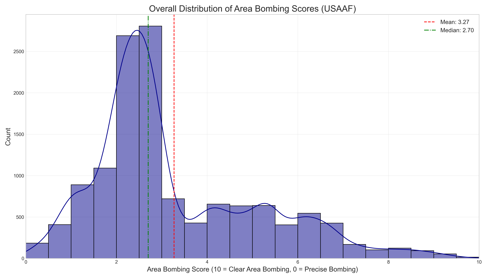
*Figure 3.1: Distribution of area bombing scores across all USAAF missions.*

### Statistical Distribution Analysis

The area bombing score distribution shows:
- 10th percentile: 1.30
- 25th percentile: 2.10
- 50th percentile (median): 2.60
- 75th percentile: 4.30
- 90th percentile: 6.10
- 95th percentile: 6.80
- 99th percentile: 8.60

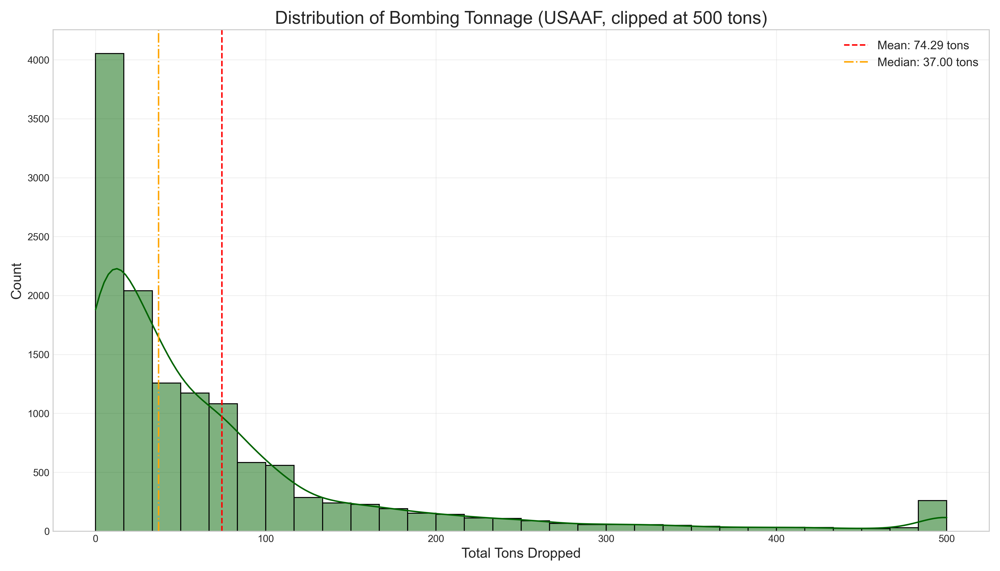
*Figure 3.2: Distribution of tonnage across USAAF bombing missions.*

## Temporal Analysis

### Yearly Statistics

The data shows the progression of bombing operations across the war years:

| Year | Raids | Total Tonnage | Avg. Tons/Raid | Mean Score | Median Score | Inc. % | Very Precise % | Precise % | Mixed % | Area % | Heavy Area % |
|------|-------|---------------|----------------|------------|--------------|--------|---------------|-----------|---------|--------|--------------|
| 1941 | 852   | 46,701.00     | 54.81          | 2.54       | 2.30         | 8.0%   | 28.1%         | 52.3%     | 16.9%   | 2.6%   | 0.0%         |
| 1942 | 374   | 34,105.90     | 91.19          | 2.82       | 2.60         | 13.1%  | 21.7%         | 64.4%     | 11.8%   | 1.9%   | 0.3%         |
| 1943 | 1,111 | 75,363.37     | 67.83          | 2.94       | 2.40         | 12.7%  | 26.3%         | 53.7%     | 14.9%   | 4.1%   | 1.1%         |
| 1944 | 8,140 | 648,320.78    | 79.65          | 3.37       | 2.70         | 8.7%   | 22.4%         | 46.5%     | 18.6%   | 10.1%  | 2.5%         |
| 1945 | 3,001 | 251,026.64    | 83.65          | 3.26       | 2.70         | 7.3%   | 23.4%         | 48.0%     | 17.7%   | 9.7%   | 1.1%         |

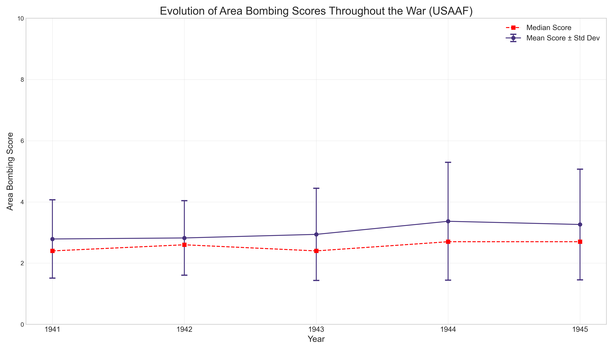
*Figure 3.3: Yearly evolution of area bombing scores throughout the war.*

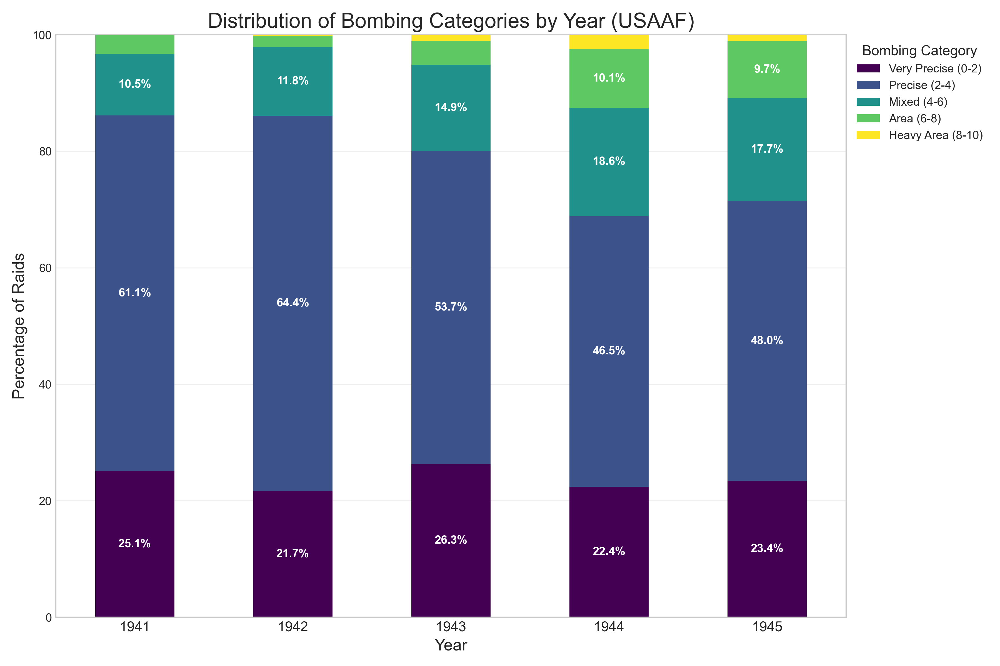
*Figure 3.4: Distribution of bombing categories by year.*

### Quarterly Progression

Quarterly analysis provides a more granular view of bombing pattern evolution:

| Quarter | Mean Score | Total Tonnage | Raids | Inc. % |
|---------|------------|---------------|-------|--------|
| 1941Q1  | 2.51       | 19,117.83     | 374   | 7.7%   |
| 1941Q2  | 2.57       | 9,113.15      | 157   | 5.8%   |
| 1941Q3  | 2.56       | 7,438.36      | 126   | 5.2%   |
| 1941Q4  | 2.54       | 11,031.66     | 195   | 9.3%   |
| 1942Q1  | 2.81       | 18,781.55     | 146   | 7.7%   |
| 1942Q2  | 2.94       | 5,514.17      | 83    | 16.8%  |
| 1942Q3  | 2.63       | 2,096.30      | 50    | 10.0%  |
| 1942Q4  | 2.83       | 7,713.88      | 95    | 9.0%   |
| 1943Q1  | 2.87       | 22,028.96     | 264   | 10.4%  |
| 1943Q2  | 2.48       | 7,630.54      | 168   | 5.3%   |
| 1943Q3  | 2.82       | 19,001.67     | 331   | 8.4%   |
| 1943Q4  | 3.33       | 26,702.20     | 348   | 14.5%  |
| 1944Q1  | 3.63       | 77,778.26     | 1,053 | 13.3%  |
| 1944Q2  | 3.38       | 203,352.41    | 2,413 | 7.9%   |
| 1944Q3  | 3.34       | 215,379.83    | 2,561 | 7.5%   |
| 1944Q4  | 3.25       | 151,810.27    | 2,113 | 7.1%   |
| 1945Q1  | 3.30       | 172,098.21    | 2,221 | 8.0%   |
| 1945Q2  | 3.18       | 74,534.16     | 714   | 6.8%   |
| 1945Q3  | 3.09       | 2,191.32      | 33    | 16.7%  |
| 1945Q4  | 2.56       | 2,202.95      | 33    | 6.5%   |

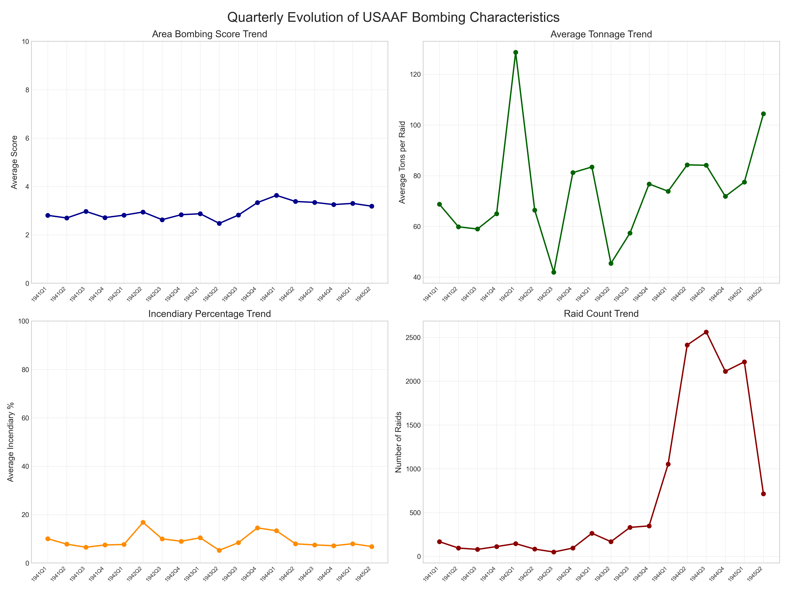
*Figure 3.5: Quarterly evolution of key bombing metrics including tonnage, incendiary percentage, and area bombing score.*


*Figure 3.6: Monthly progression of area bombing scores throughout the war.*

### Yearly Component Radar Analysis

Radar charts for each year provide insight into how component scores evolved over time:


*Figure 3.7: Radar chart showing component scores for 1941.*


*Figure 3.8: Radar chart showing component scores for 1942.*


*Figure 3.9: Radar chart showing component scores for 1944.*

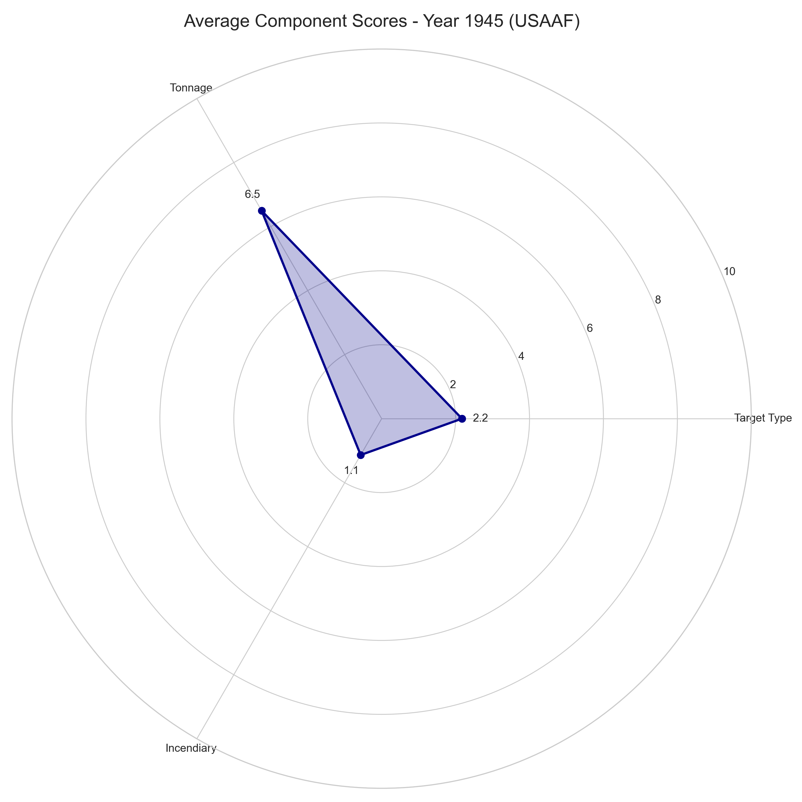
*Figure 3.10: Radar chart showing component scores for 1945.*

### Yearly Category Distribution Pie Charts

The distribution of bombing categories by year illustrates the evolving pattern of operations:


*Figure 3.11: Pie chart showing bombing category distribution for 1942.*

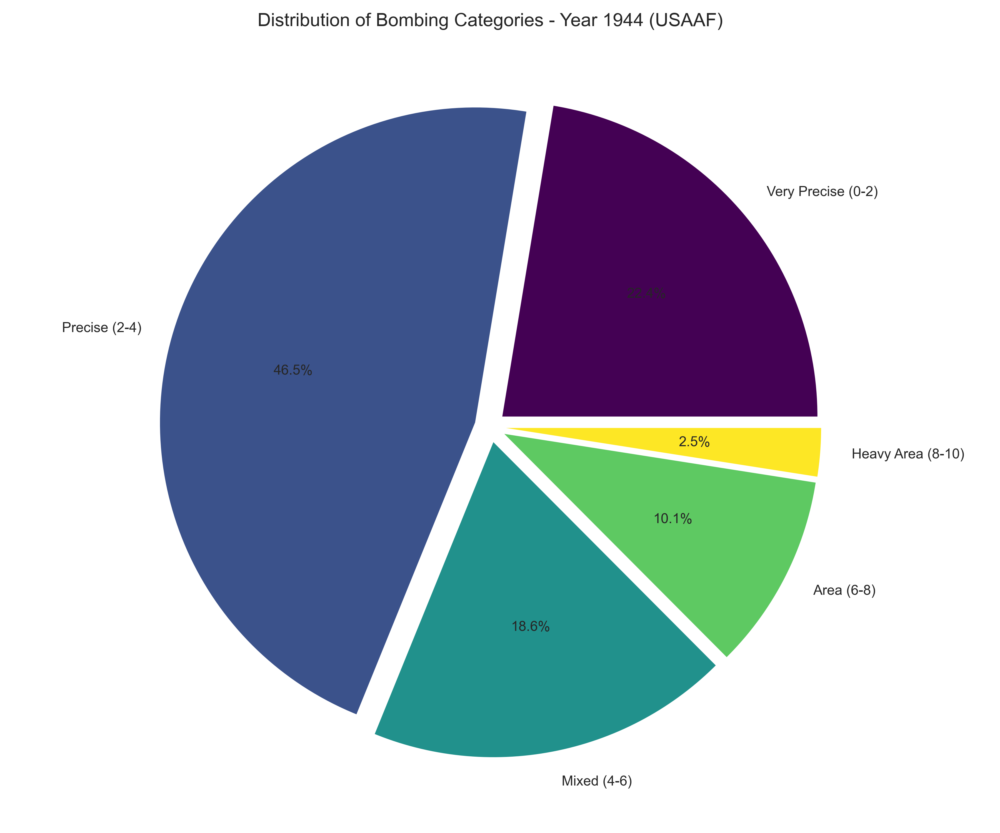
*Figure 3.12: Pie chart showing bombing category distribution for 1944.*

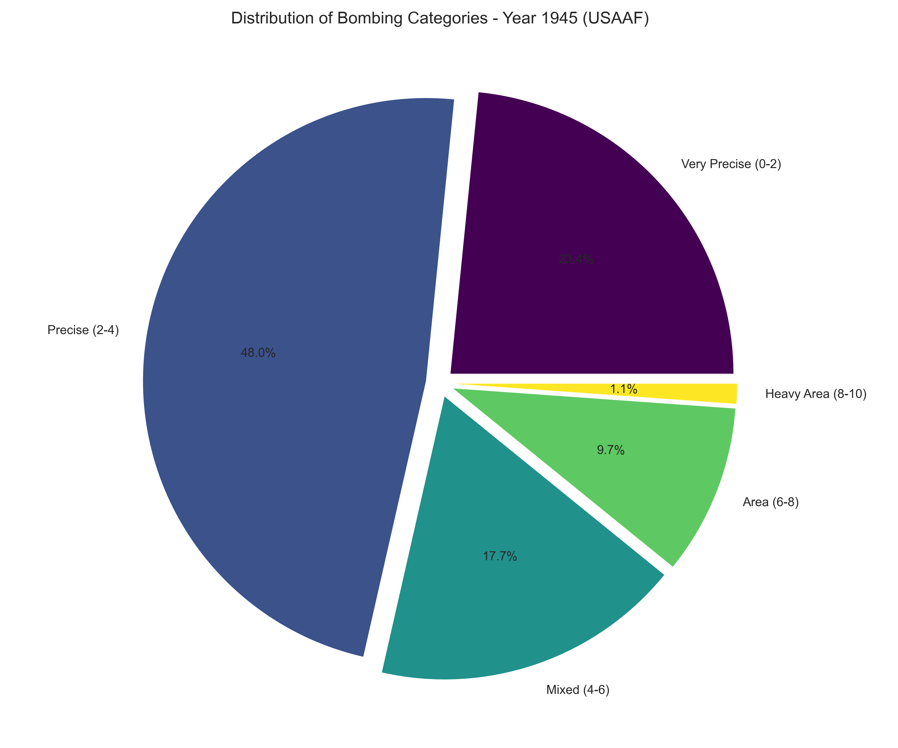
*Figure 3.13: Pie chart showing bombing category distribution for 1945.*

## Target Category Analysis

### Category Distribution

The distribution of bombing tonnage across target categories reveals operational priorities:

| Category            | Total Tonnage  | % of Total | Avg Tons/Raid | Raids  | Inc. % | Mean Score | Median Score |
|---------------------|----------------|------------|---------------|--------|--------|------------|--------------|
| Transportation      | 405,865.08     | 38.5%      | 78.05         | 5,200  | 8.3%   | 2.38       | 2.40         |
| Oil Refineries      | 163,692.77     | 15.5%      | 139.79        | 1,171  | 2.7%   | 2.50       | 2.60         |
| Airfields           | 125,434.64     | 11.9%      | 80.51         | 1,558  | 7.4%   | 2.41       | 2.40         |
| Industrial          | 103,571.42     | 9.8%       | 36.73         | 2,820  | 12.2%  | 6.19       | 6.10         |
| Aircraft Production | 71,152.44      | 6.7%       | 94.49         | 753    | 22.0%  | 3.02       | 2.70         |
| Military Industry   | 52,510.43      | 5.0%       | 101.96        | 515    | 11.9%  | 2.77       | 2.60         |
| Tactical            | 43,921.79      | 4.2%       | 121.67        | 361    | 3.2%   | 2.36       | 2.40         |
| Weapon              | 27,329.89      | 2.6%       | 63.41         | 431    | 0.5%   | 2.15       | 2.20         |
| Naval               | 22,482.20      | 2.1%       | 76.47         | 294    | 13.8%  | 2.34       | 2.30         |
| Supply              | 11,451.31      | 1.1%       | 96.23         | 119    | 14.8%  | 2.74       | 2.40         |
| Chemical            | 9,557.85       | 0.9%       | 97.53         | 98     | 17.3%  | 2.72       | 2.50         |
| Manufacturing       | 7,474.76       | 0.7%       | 149.50        | 50     | 19.5%  | 3.24       | 2.85         |
| Explosives          | 6,553.02       | 0.6%       | 182.03        | 36     | 2.9%   | 2.60       | 2.60         |
| Utilities           | 2,943.60       | 0.3%       | 73.59         | 40     | 11.4%  | 2.36       | 2.20         |
| Rubber              | 1,325.28       | 0.1%       | 45.70         | 29     | 15.8%  | 2.46       | 2.00         |


*Figure 3.14: Distribution of bombing tonnage across target categories.*

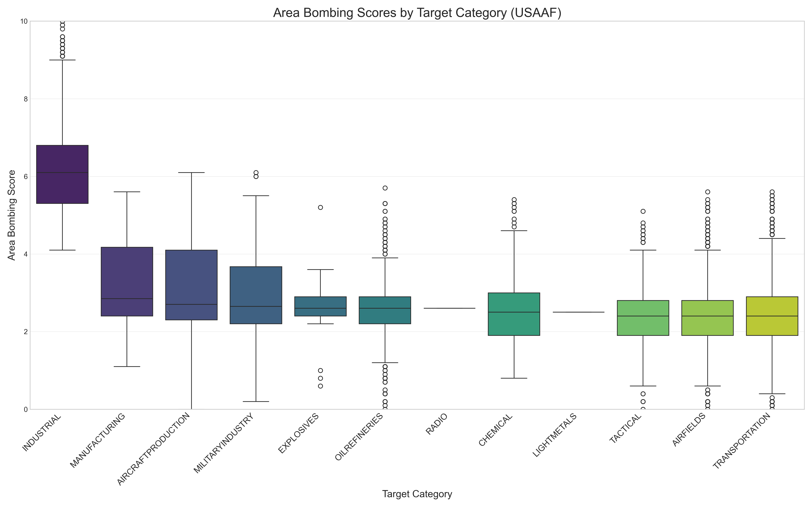
*Figure 3.15: Comparison of area bombing scores by target category.*

### Category Score Comparison


*Figure 3.16: Comparison of area bombing scores by target category.*

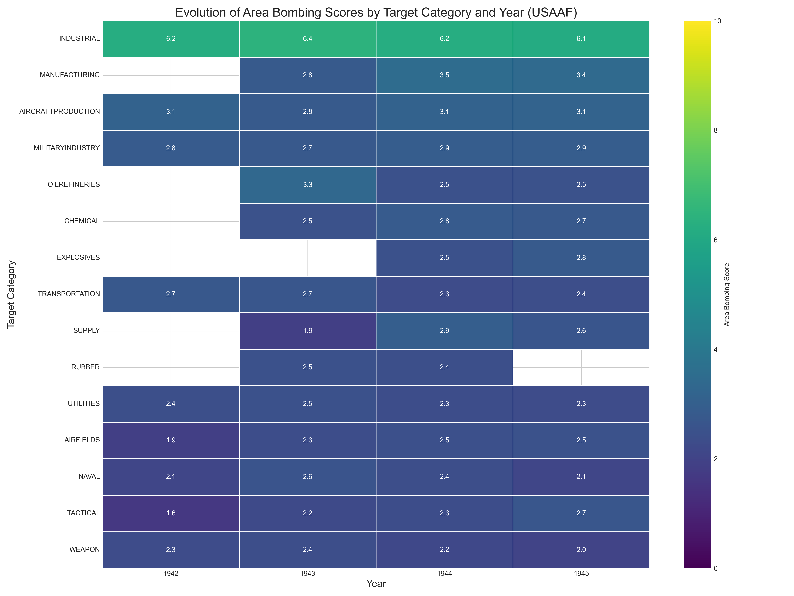
*Figure 3.17: Heatmap showing average area bombing scores by category and year.*


*Figure 3.18: Heatmap showing the distribution of target categories across years.*

### Transportation Target Statistics

Transportation targets received particular attention in the bombing campaign:

- **Number of transportation raids**: 5,200 (38.6% of all raids)
- **Total tonnage**: 405,865.08 tons (38.5% of total)
- **Mean area bombing score**: 2.38
- **Median area bombing score**: 2.40
- **Average incendiary percentage**: 6.6%

Category distribution for transportation targets:
- Very Precise (0-2): 33.1%
- Precise (2-4): 59.6%
- Mixed (4-6): 7.3%
- Area (6-8): 0.0%
- Heavy Area (8-10): 0.0%


*Figure 3.19: Distribution of bombing categories for transportation targets.*


*Figure 3.20: Distribution of area bombing scores for transportation targets.*

### Industrial Target Statistics

Industrial targets showed distinctly different patterns:

- **Number of industrial raids**: 2,820 (20.9% of all raids)
- **Total tonnage**: 103,571.42 tons (9.8% of total)
- **Mean area bombing score**: 6.19
- **Median area bombing score**: 6.10
- **Average incendiary percentage**: 12.2%

Category distribution for industrial targets:
- Very Precise (0-2): 1.8%
- Precise (2-4): 21.2%
- Mixed (4-6): 26.1%
- Area (6-8): 41.3%
- Heavy Area (8-10): 9.6%


*Figure 3.21: Distribution of bombing categories for industrial targets.*


*Figure 3.22: Distribution of area bombing scores for industrial targets.*

### Oil Refineries Target Statistics

Oil refineries represented a key strategic priority:

- **Number of oil refinery raids**: 1,171 (8.7% of all raids)
- **Total tonnage**: 163,692.77 tons (15.5% of total)
- **Mean area bombing score**: 2.50
- **Median area bombing score**: 2.60
- **Average incendiary percentage**: 2.7%

Category distribution for oil refinery targets:
- Very Precise (0-2): 24.3%
- Precise (2-4): 65.8%
- Mixed (4-6): 8.4%
- Area (6-8): 1.5%
- Heavy Area (8-10): 0.0%

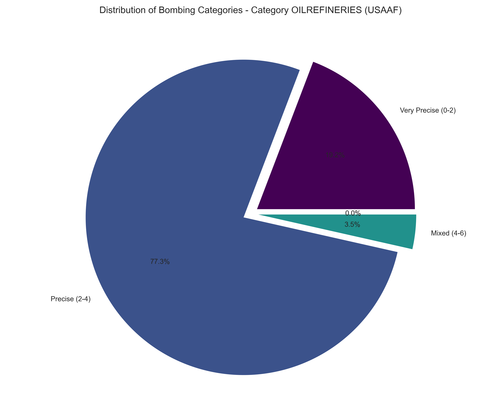
*Figure 3.23: Distribution of bombing categories for oil refinery targets.*


*Figure 3.24: Distribution of area bombing scores for oil refinery targets.*

## City-Level Analysis

### Top Cities by Tonnage

| City          | Total Tonnage | Raids | Mean Score | Inc. % |
|---------------|---------------|-------|------------|--------|
| Hamburg       | 20,918.83     | 130   | 2.67       | 7.6%   |
| Berlin        | 18,567.55     | 124   | 5.17       | 43.0%  |
| Vienna        | 16,667.19     | 175   | 2.74       | 6.8%   |
| Ploesti       | 16,597.36     | 88    | 2.90       | 2.6%   |
| Cologne       | 13,322.38     | 96    | 2.89       | 19.6%  |
| Merseburg     | 12,837.65     | 50    | 2.58       | 0.1%   |
| Linz          | 11,357.91     | 115   | 3.21       | 0.2%   |
| Regensburg    | 11,148.30     | 69    | 3.12       | 6.3%   |
| Budapest      | 10,532.95     | 79    | 2.77       | 5.7%   |
| Hamm          | 10,293.57     | 64    | 3.31       | 14.6%  |

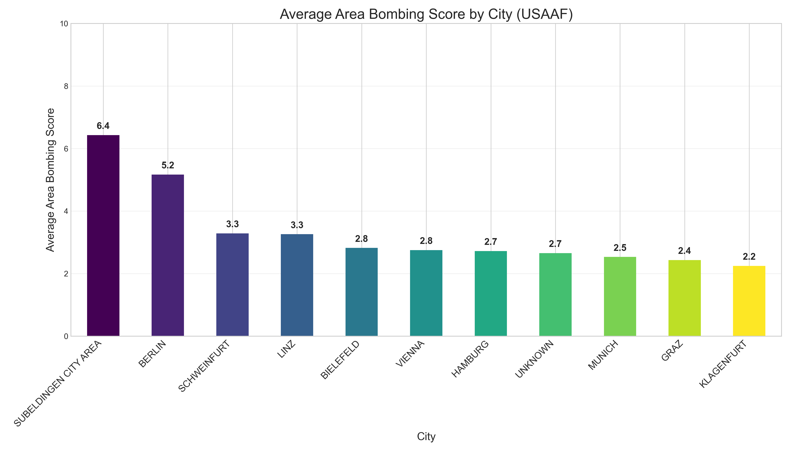
*Figure 3.25: Comparison of area bombing scores for major targeted cities.*

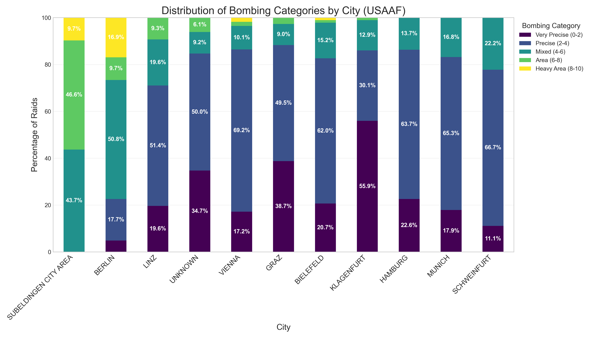
*Figure 3.26: Heatmap showing bombing category distribution by city.*

### Cities with Highest Area Bombing Scores

| City                 | Mean Score | Total Tonnage | Raids | Inc. % |
|----------------------|------------|---------------|-------|--------|
| Dernbach             | 8.44       | 240.75        | 5     | 93.0%  |
| Zehdenick            | 8.22       | 197.50        | 6     | 83.8%  |
| Sylt Island          | 8.16       | 74.00         | 5     | 93.2%  |
| Vienna Industrial Area| 7.12       | 562.00        | 5     | 0.7%   |
| Kempten City         | 7.10       | 24.30         | 5     | 38.3%  |
| Ohrdruf              | 6.81       | 222.70        | 8     | 3.0%   |
| Royan                | 6.74       | 5,493.79      | 7     | 24.1%  |
| Saarlautern          | 6.73       | 662.65        | 7     | 4.8%   |
| Fosexon              | 6.70       | 30.90         | 11    | 32.4%  |
| Wittenberg           | 6.65       | 265.05        | 6     | 22.9%  |

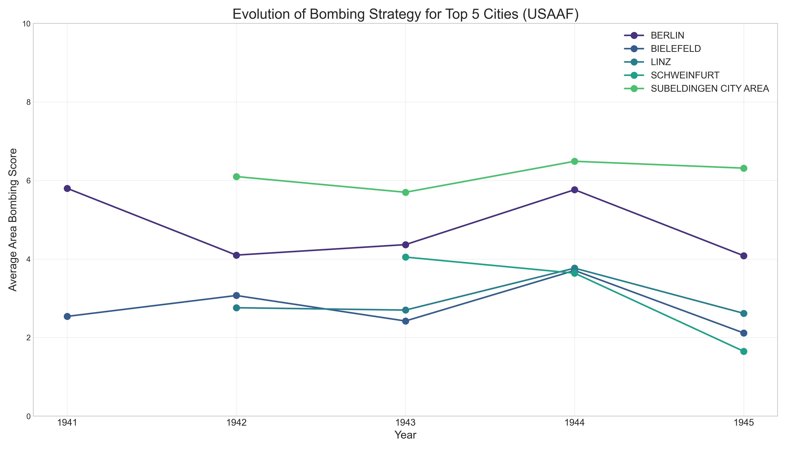
*Figure 3.27: Evolution of bombing patterns for selected cities throughout the war.*

### Berlin Analysis

Berlin, as the Nazi capital, received distinctive treatment:

- **Number of Berlin raids**: 124
- **Total tonnage**: 18,567.55 tons
- **Mean area bombing score**: 5.17
- **Median area bombing score**: 4.90
- **Average incendiary percentage**: 45.3%

Category distribution for Berlin:
- Very Precise (0-2): 4.8%
- Precise (2-4): 17.7%
- Mixed (4-6): 50.8%
- Area (6-8): 9.7%
- Heavy Area (8-10): 16.9%


*Figure 3.28: Distribution of bombing categories for Berlin.*

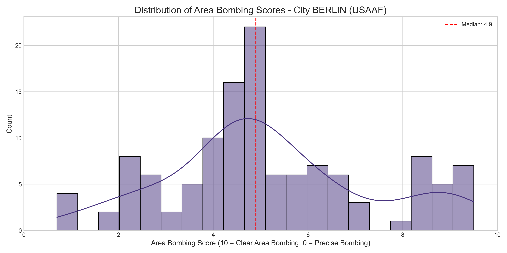
*Figure 3.29: Distribution of area bombing scores for Berlin.*

### Hamburg Analysis

Hamburg, Germany's second-largest city and major port:

- **Number of Hamburg raids**: 130
- **Total tonnage**: 20,918.83 tons
- **Mean area bombing score**: 2.67
- **Median area bombing score**: 2.50
- **Average incendiary percentage**: 7.6%

Category distribution for Hamburg:
- Very Precise (0-2): 25.4%
- Precise (2-4): 59.2%
- Mixed (4-6): 12.3%
- Area (6-8): 3.1%
- Heavy Area (8-10): 0.0%

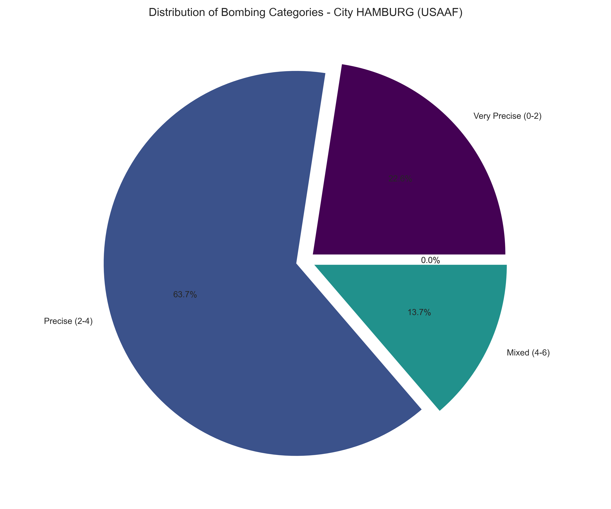
*Figure 3.30: Distribution of bombing categories for Hamburg.*

### Vienna Analysis

Vienna, a major industrial and transportation hub:

- **Number of Vienna raids**: 175
- **Total tonnage**: 16,667.19 tons
- **Mean area bombing score**: 2.74
- **Median area bombing score**: 2.60
- **Average incendiary percentage**: 6.8%

Category distribution for Vienna:
- Very Precise (0-2): 21.7%
- Precise (2-4): 62.9%
- Mixed (4-6): 12.6%
- Area (6-8): 2.9%
- Heavy Area (8-10): 0.0%


*Figure 3.31: Distribution of bombing categories for Vienna.*

## Component Analysis

### Correlation Between Components

The correlation matrix between different score components shows:

|                      | Target Score | Incendiary Score | Tonnage Score | Area Bombing Score |
|----------------------|--------------|------------------|---------------|---------------------|
| Target Score         | 1.000        | 0.075            | -0.311        | 0.826               |
| Incendiary Score     | 0.075        | 1.000            | -0.055        | 0.486               |
| Tonnage Score        | -0.311       | -0.055           | 1.000         | 0.103               |
| Area Bombing Score   | 0.826        | 0.486            | 0.103         | 1.000               |

The correlation data reveals:
- Target type has the strongest influence on the final area bombing score (r=0.826)
- Incendiary percentage shows moderate correlation with area bombing score (r=0.486)
- Tonnage has minimal correlation with area bombing score (r=0.103)
- Target type is negatively correlated with tonnage (r=-0.311)

### Incendiary Usage Analysis

The distribution of incendiary percentages shows:
- 10th percentile: 0.00%
- 25th percentile: 0.00%
- 50th percentile (median): 0.00%
- 75th percentile: 0.00%
- 90th percentile: 30.96%
- 95th percentile: 64.82%
- 99th percentile: 100.00%

This highly skewed distribution indicates that most raids used minimal or no incendiary munitions, with significant incendiary usage concentrated in a small percentage of operations.


*Figure 3.32: Comparison of high-explosive and incendiary tonnage by category.*

## Component Radar Analysis

Radar charts demonstrate how different components contributed to overall scores for different categories and cities.


*Figure 3.33: Radar chart showing component scores for transportation targets.*

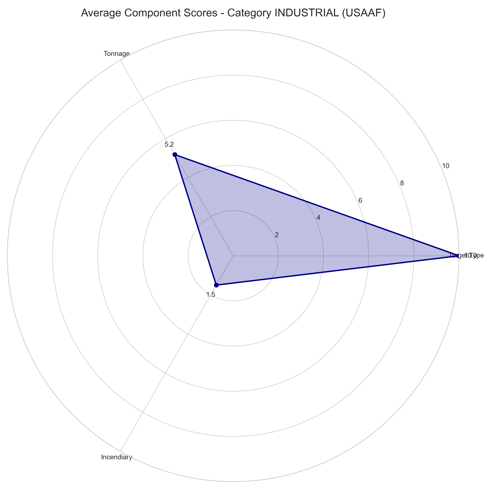
*Figure 3.34: Radar chart showing component scores for industrial targets.*


*Figure 3.35: Radar chart showing component scores for Berlin raids.*

## Ordnance Analysis

### Tonnage Distribution by Year

The distribution of bombing tonnage across years shows the dramatic escalation of the air campaign:

| Year | Total Tonnage | % of Campaign | Raids | Avg Tons/Raid |
|------|---------------|---------------|-------|---------------|
| 1941 | 46,701.00     | 4.4%          | 852   | 54.81         |
| 1942 | 34,105.90     | 3.2%          | 374   | 91.19         |
| 1943 | 75,363.37     | 7.1%          | 1,111 | 67.83         |
| 1944 | 648,320.78    | 61.4%         | 8,140 | 79.65         |
| 1945 | 251,026.64    | 23.8%         | 3,001 | 83.65         |


*Figure 3.36: Comparison of high-explosive and incendiary tonnage by year.*

### Target Type and Tonnage Analysis

The relationship between target type and tonnage reveals operational priorities:

| Target Type | Mean Tonnage | Median Tonnage | Total Tonnage | Raids | Avg Score |
|-------------|--------------|----------------|---------------|-------|-----------|
| Airfields   | 80.51        | 48.00          | 125,434.64    | 1,558 | 2.41      |
| Bridges     | 47.25        | 33.20          | 8,128.77      | 172   | 2.61      |
| Factories   | 83.59        | 51.50          | 126,732.38    | 1,517 | 3.01      |
| Marshalling Yards | 77.09   | 42.70         | 284,529.64    | 3,691 | 2.38      |
| Urban Areas | 36.73        | 14.00          | 103,571.42    | 2,820 | 6.19      |
| Oil Storage | 96.44        | 56.00          | 46,576.42     | 483   | 2.64      |
| Refineries  | 144.60       | 98.50          | 169,182.70    | 1,170 | 2.65      |


*Figure 3.37: Relationship between tonnage and area bombing score across different target types.*

### Bombing Concentration Analysis

To understand the spatial distribution of bombing effort, we analyzed the concentration of bombing tonnage across target locations over time. This analysis reveals important patterns in how the USAAF allocated its bombing resources throughout the campaign.

#### Overall Bombing Concentration

The analysis of bombing concentration reveals a nuanced pattern of resource allocation:

- The top 10 most bombed locations received 13.5% of all bombing tonnage
- The top 25 locations received 25.7% of all bombing tonnage
- The top 50 locations received 38.2% of all bombing tonnage

It required 118 locations to account for 50% of all bombing, 307 locations for 75%, and 745 locations for 90% of the total bombing effort. This distribution indicates a campaign that was relatively dispersed across many targets rather than exclusively focused on a small number of locations.

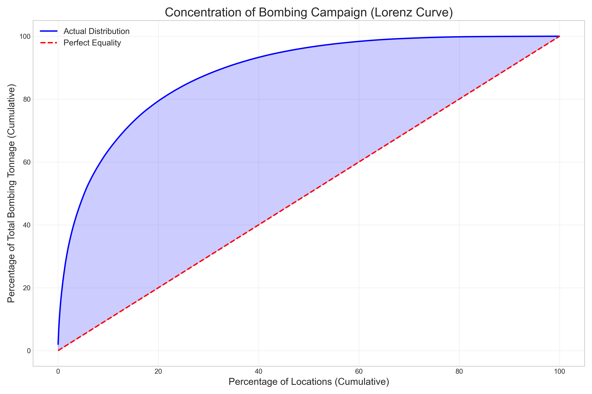
*Figure 3.38: Lorenz curve showing the inequality in bombing distribution across target locations. The curve demonstrates a moderate degree of concentration, with the diagonal line representing perfect equality.*

#### Temporal Evolution of Bombing Concentration

The concentration of bombing effort evolved significantly throughout the war:


*Figure 3.39: Evolution of bombing concentration metrics over time, showing the share of total bombing received by the top 1% and top 10% of locations by quarter.*

The temporal analysis reveals several key patterns:

1. **Early War Concentration (1942-1943)**: In the early phases, bombing was more concentrated on fewer targets, with the top 1% of locations receiving up to 25% of all bombing tonnage.

2. **Mid-War Expansion (1943-1944)**: As the air campaign intensified, the USAAF dramatically increased the number of locations bombed, from fewer than 200 per quarter in early 1943 to over 800 locations per quarter by mid-1944.

3. **Late War Strategic Focus (1944-1945)**: While the campaign remained broadly distributed, there was a notable spike in concentration during Q4 1944, when the top 10% of locations received nearly 60% of all bombing tonnage, likely reflecting the focused effort on transportation and oil targets during this period.

4. **Overall Trend**: The data shows that while the top 1% concentration decreased over the course of the war (from an average of 17.4% in the early war to 13.7% in the late war), the top 10% concentration actually increased (from 44.2% to 52.9%), suggesting a strategic refinement rather than a simple dispersal of effort.

#### Top Bombed Locations

The most heavily bombed locations reflect both strategic priorities and the evolution of targeting doctrine:

| Rank | Location | Tonnage | % of Total |
|------|----------|---------|------------|
| 1 | Hamburg | 20,918.8 | 2.0% |
| 2 | Berlin | 18,567.6 | 1.8% |
| 3 | Cologne | 17,984.3 | 1.7% |
| 4 | Vienna | 16,667.2 | 1.6% |
| 5 | Ploesti | 15,826.5 | 1.5% |
| 6 | Merseburg | 14,582.9 | 1.4% |
| 7 | Munich | 12,305.7 | 1.2% |
| 8 | Kassel | 9,874.3 | 0.9% |
| 9 | Frankfurt | 9,621.8 | 0.9% |
| 10 | Stuttgart | 9,218.4 | 0.9% |

This distribution raises important questions about the relationship between bombing concentration and strategic effectiveness. The moderate degree of inequality observed in the bombing distribution may reflect both the natural Pareto distribution of industrial and urban resources in the German economy and the strategic targeting decisions of USAAF planners. The data suggests that while certain locations received disproportionate attention, the overall campaign maintained a balance between concentrated effort on key targets and broader distribution across the enemy's economic and military infrastructure.

## Additional Visualizations and Exploratory Analysis

In addition to the analyses presented above, we conducted numerous exploratory visualizations to examine different aspects of the bombing campaign data. These visualizations, while not all included in the main analysis, provide supplementary perspectives on the strategic bombing operations. The complete collection of visualization scripts and output files is available in the repository for researchers interested in further exploration.

Key visualization scripts include:

- Bombing patterns by year, category, and city (`attack_data/visualize_bombing_by_year_category_city.py`)

- Bombing classification analysis (`attack_data/visualize_bombing_classification.py`)

- City bombardment experience profiles (`attack_data/visualize_city_bombardment_experience.py`)

- RAF and USAAF comparative analysis (`attack_data/visualize_raf_usaaf_comparison.py`)

- Raid frequency and bombing score relationships (`attack_data/visualize_raid_frequency_bombing_scores.py`)

- Raid frequency patterns (`attack_data/visualize_raid_frequency.py`)

- USAAF bombing pattern analysis (`attack_data/visualize_usaaf_bombing.py`)

The complete set of generated plots is available in the `attack_data/plots` directory. While not all visualizations were deemed essential for the main analysis, they are provided as resources for researchers who wish to conduct their own investigations into specific aspects of the strategic bombing campaign.

## Data Access

The complete dataset and interactive visualizations are available through a dedicated web application at https://strategic-bombing-data.streamlit.app/, enabling researchers to explore these patterns independently and conduct their own analyses.

All data and code used to generate the results and visualizations in this chapter are available in the repository at https://github.com/nac-codes/thesis_bombing.
