# Introduction

The Allied strategic bombing campaign of World War II has traditionally been portrayed as a narrative of pragmatic evolution: the abandonment of precision bombing in favor of area bombing as operational realities overwhelmed pre-war doctrine. This thesis challenges this conventional wisdom by revealing a striking paradox—the persistent American commitment to precision bombing throughout the conflict, defying theoretical predictions about the nature of modern warfare.

J.F.C. Fuller's theory of omnistate warfare, which predicts the inexorable progression toward maximum destruction as modern states mobilize their populations for total war, provides a powerful framework for understanding the barbarism of World War II. Yet as this thesis demonstrates, the United States presents an exception to Fuller's theory. Despite operating within an omnistate framework, America maintained a consistent commitment to precision bombing, with empirical data showing that approximately 69% of bombs dropped were precision-targeted rather than area bombing.

My argument proceeds in three stages, each challenging conventional narratives about strategic bombing. First, I demonstrate through comprehensive analysis of United States Strategic Bombing Survey data that precision bombing dominated the American campaign throughout the conflict, with no transition toward area bombing even as the war intensified.

Second, I examine the complex relationship between bombing operations and their media representation. Through analysis of thousands of contemporary newspaper articles, I show that American media maintained a consistent focus on precision bombing, mirroring the actual conduct of the campaign. This challenges simplistic notions of wartime propaganda.

Finally, drawing on Fuller's framework of omnistate warfare while acknowledging its limitations, I argue that America's commitment to precision bombing reflects a distinctive strategic culture that valued efficiency, technological sophistication, and moral restraint even in the crucible of World War II.

## Wars *aux allures déchaînées*
Warfare is interesting not because of its tactical details or ethical quandaries, but because it exposes the underlying values of the society conducting it. The American approach to strategic bombing—with its persistent emphasis on scale over precision—reflects fundamental patterns in how mass societies wage total war. To fully grasp these patterns, we must explore not only the events themselves but also the reasons behind American society's specific choices in warfare.

I introduce the work of J.F.C Fuller as a lens through which to view the American approach to strategic bombing. It is important to acknowledge that Fuller was a problematic figure—a pre-war Nazi sympathizer who attended Hitler's 50th birthday celebration in 1939 as an honored guest. Despite these troubling political affiliations, his analytical framework offers valuable insights into the transformation of warfare in the modern era. As an influential military theorist writing both before and after the war, Fuller identified a causal connection between mass society and the emergence of total war: warfare unlimited in scope and unconstrained by traditional military objectives, involving the mobilization of entire societies and the deliberate targeting of civilian populations. Rather than total war being something invented by the Nazis when they invaded Poland (as one eminent historian has claimed),[^1] we find in Fuller's analysis the very principles that underpin modern states as the driving forces behind the phenomenon of total war.

Before the advent of mass politics, warfare operated within clearly defined limits. As James Q. Whitman demonstrates, wars under monarchical sovereignty were conducted as contained political disputes, with professional armies acting as instruments of statecraft.[^2] Fuller aptly characterizes this earlier form of warfare as an "auction-room" where conflicts, though certainly brutal, remained confined to designated battlefields and did not consume society at large.[^3]

This contained nature of warfare was fundamentally transformed by Rousseau's concept of the "general will." This idea endowed the nation-state with what Fuller terms a "quasi-divine sanction," creating a powerful new mythology around popular majorities' supposed ability to divine and pursue the general interest. Although Fuller regarded this assumption as "patently fallacious," he recognized how it "flattered the popular imagination and unthinkingly was accepted as an article of faith."[^4]

The French Revolution demonstrated the profound implications of this transformation. The fusion of people and state under popular sovereignty fundamentally altered the character of warfare. As Fuller observed, "A new order of living and of killing emerged out of the cry of 'Vive la nation!'" War-making decisions were no longer guided by cabinet politics but by what he calls "the occult powers" of "wealth and public opinion—economics and emotionalism."[^5] When warfare became an expression of the general will, traditional restraints proved powerless against the unleashed passions of the nation.

Honoré Gabriel Riqueti, comte de Mirabeau, proved clairvoyant when, speaking to the French National Assembly on May 20, 1790, he anticipated the consequences of placing the power to declare war in the hands of a people's assembly:

> "Your votes will demand of you: will we be better assured of only just and equitable wars if exclusively delegated to an assembly of 700 persons the exercise of the right to make war? Have you foreseen how far the impassioned movements, the exaltation of courage, and the fervent ignition might carry and justify imprudence? ... While one member proposes deliberation, war will be clamored for; you will see around you an army of devotees. You will not be deceived by ministers; nor will you ever deceive yourselves... Behold the free peoples: it is because of more ambitious, more barbarous wars than they have ever undertaken. Behold the political assemblies: it is always under the spell of passion that they have decreed war."[^5.5]

The triumph of popular sovereignty unleashed what Fuller terms "the jinni of popular absolutism" from its "monarchial brass bottle," transforming the auction-room of war into a slaughterhouse.[^6] This transformation stemmed from mass politics' activation of humanity's deeper tribal impulses. Fuller argues that this pattern emerges from our evolutionary heritage: "Man as he is can only be explained by man as he was, and never by man as we would like him to be."[^7] When channeled through mass participation in politics, these ancient tribal loyalties transform political opponents and foreign nations into existential threats to the collective.

It is worth noting that Fuller's theories in his early work, *War and Western Civilization, 1832–1932: A Study of War as a Political Instrument and the Expression of Mass Democracy* (1932), primarily took aim at mass democracy as the root of modernity's crisis. Based on his political affiliations, he initially saw fascism as a potential solution to this crisis. However, in his later work, *The Conduct of War, 1789–1961* (1961), Fuller became more critical of both Nazism and Communism as exemplars of the mass politics madness and emotionality toward war. What Fuller missed in his present was the benefit of our hindsight—the ability to look back at all the various emerging modern societies of his time and identify a common thread between them.

Fuller's analysis leads to a stark conclusion that directly challenges political idealism: "The motive force of [mass politics] is not love of others, it is the hate of all outside the tribe, faction, party or nation."[^8] This tribal hatred, legitimized through popular sovereignty and amplified by mass participation, becomes the driving force behind total war. Drawing from Clausewitz's observation that "War belongs to the province of social life," Fuller argues that modern warfare evolved into "a war of ideas, a conflict between different conceptions of civilization." The general will, rather than promoting universal brotherhood, "predicates total war, and hate is the most puissant of recruiters."

This combination of tribal psychology and mass political institutions transformed warfare into wars of righteousness—conflicts that expressed not merely territorial disputes or political calculations, but fundamental conflicts between entire societies and their ways of life. Warfare in the age of omnistates thus became unbound from traditional limits, pursuing not just military victory but the complete transformation of the enemy society.

Churchill's wartime leadership exemplified this drive toward righteous warfare. His declaration that victory must be achieved "at all costs" and his characterization of the enemy as "a monstrous tyranny, never surpassed in the dark, lamentable catalogue of human crime" captured the moral absolutism inherent in omnistate warfare.[^9] In place of the careful calibration of power that had characterized traditional diplomacy, modern mass societies pursued total victory through the complete destruction of their enemies.

This outcome of total war cannot be traced back to any individual, whether it be Churchill or Hitler; it cannot be blamed on the scapegoat of industrialization (a crutch of Marxists and Realists alike). Rather, it stemmed from the inherent nature of the omnistate itself—the unleashing of "the jinni of popular absolutism." When warfare became an expression of the general will, it inevitably took on the character that Fuller described as wars *aux allures déchaînées*—wars of frenzied appearance, unbound from traditional limits and driven by the passionate certainty of righteous conviction.[^10]

Clausewitz famously described warfare as a "remarkable trinity" composed of three forces: the government and its political aims, the military and its professional conduct of operations, and the people with their primal passions and hatreds. In modern omnistates, these three elements often fall out of equilibrium, with the people and their passions assuming unprecedented influence. The revolution in mass politics elevated popular passion from a subordinate force, previously constrained by monarchical authority, to the dominant driver of warfare.


This transformation manifested across various political systems—Liberal Democracy, National Socialism, and Communism—which, despite their apparent differences, shared a fundamental reorientation of political authority around popular sovereignty and mass mobilization. What we call "omnistates" emerged across these seemingly different systems: the German *Volk* identified with the Nazi state, the proletariat with the Soviet Union, and the American people with THE United States. This completed the Clausewitzian triangle, where the edge between the state and the people became fully weighted against the others, unlocking a new, more passionate form of warfare witnessed in World War II.

When such omnistates engage in warfare against one another, the conflict inevitably transcends traditional military or political objectives. The enemy becomes not merely an opposing army or government but a mirror image of one's own society—a totality that must be confronted in its entirety.

This mirroring effect transforms the nature of conflict itself. Victory can no longer be achieved through limited military success or diplomatic compromise. Instead, warfare becomes an existential struggle between competing social orders, demanding nothing less than the complete transformation of the enemy society. The goal shifts from achieving specific political objectives to pursuing total victory through the comprehensive defeat and reconstruction of the opposing nation. We saw this manifest in the race-based conquering and exterminating of the Nazis, the mass rape and scorched earth tactics of Soviet expansion, and the area bombing campaigns of the United States and Britain. The applicability of this framework to the Nazi and Soviet regimes is obvious, but we will see how it also applies to the United States.

At Casablanca, the Combined Chiefs of Staff defined victory as the "progressive destruction and dislocation of the German Military, industrial, and economic system, and the undermining of the morale of the German people."[^11] The RAF's Combined Bomber Offensive was explicitly "designed to so destroy German material facilities as to undermine the willingness and ability of the **German worker** to continue the war,"[^12] as if the German worker was some monolithic entity to be slain.

Most telling was the British Chiefs of Staff's casual reference to bombing as a means to "inflict direct damage on Germany and Germans."[^13] This deliberate distinction between state and people crystallizes how omnistate warfare had evolved to target not just military forces or industrial capacity, but the entire fabric of enemy society. The careful balance of Clausewitz's trinity had given way to a totalizing view that saw these elements as a single, indivisible target for destruction.

When German General Hans-Jürgen von Arnim was captured in Tunisia, General Eisenhower's staff suggested following the traditional military custom of receiving the defeated commander—a practice reflective of the more gentlemanly form of monarchical warfare:

> The custom had its origin in the fact that mercenary soldiers of old had no real enmity toward their opponents. Both sides fought for the love of a fight, out of a sense of duty or, more probably, for money. A captured commander of the eighteenth century was likely to be, for weeks or months, the honored guest of his captor. The tradition that all professional soldiers are really comrades in arms has, in tattered form, persisted to this day.[^14]

But Eisenhower forcefully rejected this tradition.

> For me World War II was far too personal a thing to entertain such feelings. Daily as it progressed there grew within me the conviction that as never before in a war between many nations the forces that stood for human good and men's rights were this time confronted by a completely evil conspiracy with which no compromise could be tolerated.

Most tellingly, Eisenhower frames the conflict in explicitly religious terms:

> Because only by the utter destruction of the Axis was a decent world possible, the war became for me a crusade in the traditional sense of that often misused word.

Here we see one of America's most senior military commanders rejecting the traditional professional courtesies of his station, instead treating the enemy as an absolute moral evil. We see how the general will had transformed even career officers from dispassionate professionals into crusaders against evil.

This shift, however, did not originate within the military establishment but was deeply rooted in and enthusiastically embraced by the American public. Herbert Hyman's wartime polling data illustrates a populace that not only accepted the concept of total war but actively demanded it. By January 1944, an overwhelming 81% of Americans insisted upon Germany's unconditional surrender, with only one in ten respondents willing to consider any alternative.[^15] Significantly, rather than displaying signs of war fatigue, the American public demonstrated a remarkable willingness to endure further sacrifices. In August 1942, 70% of respondents believed that the population had not yet been asked to make sufficient sacrifices for the war effort. Even by April 1944, after prolonged periods of rationing and mobilization, 58% continued to hold the view that additional sacrifices were necessary.[^16] These attitudes were not formed independently by the public alone; undoubtedly, government messaging, media narratives, and wartime propaganda played influential roles. However, attributing this phenomenon exclusively to either state influence or popular sentiment oversimplifies the issue. Rather, it was the reciprocal and reinforcing relationship between the state and its citizens that served as the fundamental driving force behind the emergence and persistence of total war.

Based on this theoretical framework, we would expect the United States' approach to warfare to be overtly destructive rather than precise—to not just acquiesce to area bombing but to actively encourage it—as the emotionality of the populace-state relationship continued to influence the outcome of the war. Others have arrived at similar conclusions through different theoretical paths, as we shall see in the next section. Marxist theorists attribute this destructiveness to industrialization, while operational rationalists argue that area bombing was a tactical necessity. We will demonstrate that both theories are insufficient to explain the actual pattern of bombing during the war.

Most importantly, in Chapter 1 we will examine data from the United States Strategic Bombing Survey to evaluate the precise versus area bombing nature of the air campaign. What we will discover is that, contrary to what our theoretical framework might predict, the United States showed exceptional restraint in this regard. This American exceptionalism in the pursuit of precision bombing, rooted in isolationism and a defiance of the previous world war's carnage, created a unique doctrine of controlled, limited warfare. Understanding how this doctrine was ultimately overrun by the emotional impulses we have discussed is central to comprehending the paradoxical nature of the Allied bombing campaign.


[^1]: [Antony Beevor at Intelligence Squared Event (2012)](https://youtu.be/Sa-6pR5S5YY?si=7SCvHw2T72fDjegz&t=2849)
[^2]: James Q. Whitman, The Verdict of Battle: The Law of Victory and the Making of Modern War (Cambridge, MA: Harvard University Press, 2012), Chapter 4
[^3]: [J.F.C. Fuller, The Conduct of War, 1789–1961: A Study of the Impact of the French, Industrial, and Russian Revolutions on War and Its Conduct (New Brunswick, NJ: Rutgers University Press, 1961), 24](https://bomberdata.s3.us-east-1.amazonaws.com/Readings/corpora/fuller_conduct/chunks/fuller_conduct_0024.txt)
[^4]: [J.F.C. Fuller, The Conduct of War, 1789–1961: A Study of the Impact of the French, Industrial, and Russian Revolutions on War and Its Conduct (New Brunswick, NJ: Rutgers University Press, 1961), 24](https://bomberdata.s3.us-east-1.amazonaws.com/Readings/corpora/fuller_conduct/chunks/fuller_conduct_0024.txt)[, 36](https://bomberdata.s3.us-east-1.amazonaws.com/Readings/corpora/fuller_conduct/chunks/fuller_conduct_0036.txt)
[^5]: [J.F.C. Fuller, War and Western Civilization, 1832–1932: A Study of War as a Political Instrument and the Expression of Mass Democracy (London: Duckworth, 1932), 18](https://bomberdata.s3.us-east-1.amazonaws.com/Readings/corpora/fuller_civilization/chunks/fuller_civilization_0018.txt)
[^5.5]: Translated by GPT-4o. Original text from Mirabeau's speech: "je votes demands a vous-mernes: sera-t-on mieux assure de n'avoirquedesguerresjustes,equitables,siVondelegueexclusive-ment a une assemblee de 700 personnes Vexercice du droit defaire la guerre? Avez-vous prevu jusqu'ou les mouvements passiones,
jusqu'ouVexaltationducourageetd'unefaussedignitepourroient porter etjustijier Vimprudence . . . ? Pendant qu'un des membres proposera de deliberer, on demandera la guerre a grands cris; vous verrez autour de votes une armee de dtoyens. Votes ne serez pas trompes par des ministres; ne le serez-vousjamais par vous- memes?... Voyezlespeupleslibres:e'estpardesguerresplus ambitieuses, plus barbares qu'ils se sont toujours distingues. Voyez les assemblies politiques: e'est toujours sous le charme de la passion qu'elles ont decrete la guerre.'" From [J.F.C. Fuller, The Conduct of War, 1789–1961, 26](https://bomberdata.s3.us-east-1.amazonaws.com/Readings/corpora/fuller_conduct/chunks/fuller_conduct_0026.txt)
[^6]: [J.F.C. Fuller, The Conduct of War, 1789–1961: A Study of the Impact of the French, Industrial, and Russian Revolutions on War and Its Conduct (New Brunswick, NJ: Rutgers University Press, 1961), 24](https://bomberdata.s3.us-east-1.amazonaws.com/Readings/corpora/fuller_conduct/chunks/fuller_conduct_0024.txt)
[^7]: [J.F.C. Fuller, The Conduct of War, 1789–1961: A Study of the Impact of the French, Industrial, and Russian Revolutions on War and Its Conduct (New Brunswick, NJ: Rutgers University Press, 1961), 41](https://bomberdata.s3.us-east-1.amazonaws.com/Readings/corpora/fuller_conduct/chunks/fuller_conduct_0041.txt)
[^8]: [Ibid](https://bomberdata.s3.us-east-1.amazonaws.com/Readings/corpora/fuller_conduct/chunks/fuller_conduct_0041.txt)
[^9]: [Ibid, 310](https://bomberdata.s3.us-east-1.amazonaws.com/Readings/corpora/fuller_conduct/chunks/fuller_conduct_0310.txt)
[^10]:[Ibid, 33](https://bomberdata.s3.us-east-1.amazonaws.com/Readings/corpora/fuller_conduct/chunks/fuller_conduct_0033.txt)
[^11]: ["Plan for Combined Bomber Offensive From the United Kingdom," Combined Chiefs of Staff, May 14, 1943](https://docviewer.history-lab.org?doc_id=frus1943d92)
[^12]: [Ibid.](https://docviewer.history-lab.org?doc_id=frus1943d92)
[^13]: ["Memorandum by the British Chiefs of Staff," January 3, 1943](https://docviewer.history-lab.org/?doc_id=frus1941-43d401)
[^14]: Dwight D. Eisenhower, Crusade in Europe (Garden City, NY: Doubleday, 1948), 123-4
[^15]: [Memorandum on the Attitudes of the American People, Columbia University Archives](https://bomberdata.s3.us-east-1.amazonaws.com/Archive/HERBERT_HYMAN_PAPERS/MEMORANDUM_ATTITUDES/IMG_3966.JPG)
[^16]: [Ibid.](https://bomberdata.s3.us-east-1.amazonaws.com/Archive/HERBERT_HYMAN_PAPERS/MEMORANDUM_ATTITUDES/IMG_3964.JPG)


# Literature Review

## The Realist and Moralist Narratives

As we concluded in the introduction, our theoretical framework based on Fuller's analysis of omnistates would predict that the United States' approach to warfare would be overtly destructive rather than precise. Yet the historical record reveals a more complex picture, with the US showing exceptional restraint in its pursuit of precision bombing. To understand this apparent contradiction, we must first examine the existing scholarly perspectives on the Allied bombing campaign.

The current literature offers two competing narratives on the evolution of strategic bombing during World War II. The first, which we term the "Realist" narrative, presents the shift from precision to area bombing as a pragmatic adaptation to operational realities—a natural development from the naivete of "pinpoint" bombing to a more battle-tested approach. The second, which we call the "Moralist" narrative, interprets this shift as the inevitable result of bellicose military leaders willing to do anything to accomplish their objectives, with precision bombing serving merely as public relations cover for the campaign's true destructive intentions.

Before examining these perspectives in detail, it is necessary to define our key terms:
1. Precision bombing refers to the targeting of specific nodes in the enemy's economic network, such as factories, transportation hubs, and oil refineries. The goal of this strategy is to neutralize the enemy's war-making capacity by destroying these key nodes.
2. Area bombing refers to the bombing of a large area, typically a city or industrial area, with the aim of destroying it, its infrastructure, and portions of its workforce. The goal of this strategy is to disrupt economic production and weaken the morale of the civilian population.
3. Strategic bombing refers to the overall campaign, which may include precision bombing, area bombing, or both.

These categories, like our "Realist" and "Moralist" frameworks, are neither exhaustive nor mutually exclusive. No author fits neatly into one category, but they provide a helpful framework for understanding the scholarly landscape.

We begin with the Realist perspective. The main argument of the Realist perspective is that the theory of precision bombing, developed at Maxwell Air Force Base in Alabama over the decade preceding WWII, was not applicable under real-world wartime conditions. Pre-war theorists had approached strategic bombing too simplistically, viewing it merely as a targeting problem while failing to account for the complex military intelligence network required or the various frictions of war such as weather, maintenance, training, ordinance, and aircraft capabilities. As [Griffith (1994)](https://github.com/nac-codes/thesis_bombing/blob/master/corpora_cited/griffith_hansell/chunks/griffith_hansell_0031.txt) notes, "Only operational experience in combat would reveal many of the problems strategic bombers would face. Once World War II had begun the strategic air war took on a dynamic driven by existing technology and actual combat conditions, not by a preconceived air war doctrine." The reality of warfare meant that "technology and friction became the masters, not the servant of strategic bombing practices," leading to a significant departure from pre-war theoretical frameworks.

The technical and operational challenges of precision bombing proved to be far more daunting than pre-war theorists had anticipated. As [McFarland (1995)](https://github.com/nac-codes/thesis_bombing/blob/master/corpora_cited/mcfarland_pursuit/chunks/mcfarland_pursuit_0001.txt) reveals, even with sophisticated equipment like the Norden bombsight, accuracy remained elusive: "one study in 1944 concluded that only 7 percent of all American bombs fell within 1,000 feet of their aiming point."[^1]

The unescorted bomber doctrine proved particularly costly. [Builder (1994)](https://github.com/nac-codes/thesis_bombing/blob/master/corpora_cited/builder_icarus/chunks/builder_icarus_0107.txt) explains that "The invincibility of the unescorted bomber formation was an article of faith; Flying Fortress was no idle choice of name for the B-17." This faith would be shattered by reality - as demonstrated by the devastating Schweinfurt and Regensburg raids of 1943, which saw loss rates as high as 20½ percent.[^2]

The sheer scale required for "precision" attacks further undermined their practicality. According to [Beagle (2001)](https://github.com/nac-codes/thesis_bombing/blob/master/corpora_cited/beagle_pointblank/chunks/beagle_pointblank_0007.txt), even after achieving air superiority in 1944, a precision bombing mission against a single target required approximately 1,000 aircraft. Moreover, "the minimum bomb pattern bombers could deliver was typically larger than the area of the industrial plant being targeted," making precise targeting of specific components within facilities essentially impossible. These limitations meant that bombing campaigns against specific target sets like ball bearing production, aircraft manufacturing, or transportation infrastructure required months of sustained operations, allowing other target sets time to recover and demonstrating the resilience of the German war economy.

The narrative of the operational hazards of precision bombing typically climaxes with the notorious Schweinfurt raids. Schweinfurt was designated as a target because of the concentration of ball bearing production there, producing an estimated half of these mechanical devices essential to the functioning of automotive engines and industrial machinery. The October 14 mission was disastrous: "Of the 291 bombers dispatched, 198 of them were shot down or damaged." This raid finally shattered the "theory of the self-defending bomber," revealing the limitations of the doctrine that had justified unescorted bombing operations.

These operational challenges and especially the heavy losses during the Schweinfurt raids are employed to provide a rationale for the shift if not towards area bombing than at least away from precision bombing. To explain the shift towards area bombing there are both technical and theoretical arguments that have been put forth. The former describes the development of incendiary bomb technology as the driver of the allied approach to war. As [Knell (2003)](https://github.com/nac-codes/thesis_bombing/blob/master/corpora_cited/knell_city/chunks/knell_city_0057.txt) notes, "The fire raid using a mixture of H.E. and incendiary bombs and causing firestorms proved the ultimate answer," with these tactics being "practiced first by the Luftwaffe over Britain starting in September 1940, experimented with and developed further by RAF Bomber Command from 1942 onward."[^3]

This technological argument is supplemented by several theoretical arguments justifying the shift to area bombing. The first stems from the claim that Germany had initiated city attacks, thereby setting the precedent. As [Garrett (1993)](https://github.com/nac-codes/thesis_bombing/blob/master/corpora_cited/garrett_ethics/chunks/garrett_ethics_0025.txt) notes, "the Germans had after all initiated city attacks-first with the bombing of Warsaw, then the assault on Rotterdam in May 1940 (which was said to have caused 30,000 fatalities), and finally with the blitz on Britain itself."[^4]

A second theoretical justification arose from the concept of total war, which blurred traditional distinctions between combatants and civilians. As [Garrett (1993)](https://github.com/nac-codes/thesis_bombing/blob/master/corpora_cited/garrett_ethics/chunks/garrett_ethics_0300.txt) explains, total war "involves not just the complete mobilization of the resources of the state for military purposes but also the blurring, if not evaporation, of any distinction between the home front and the battle front."

This blurring of lines between civilian and military targets was further justified by the argument that industrial workers were legitimate military targets. [Buckley (1999)](https://github.com/nac-codes/thesis_bombing/blob/master/corpora_cited/buckley_total/chunks/buckley_total_0010.txt) poses the question: "Why would those organizing and supporting the war effort in Germany be less of a legitimate target than soldiers fighting at the front, especially in an age when most soldiers are conscripts and may have been indifferent supporters of or even hostile to the Nazi regime?"[^5]

Finally, these various justifications were ultimately supported by the pragmatic argument that area bombing was effective and helped bring the war to a swift conclusion. As [Buckley (1999)](https://github.com/nac-codes/thesis_bombing/blob/master/corpora_cited/buckley_total/chunks/buckley_total_0008.txt) argues, "the conduct of war throughout history has been influenced less by morality and more by military capability, balanced by political acceptability." The key factor became simply whether a strategy would "allow you to win and bring the war to a speedy conclusion."[^5.5] [^6]

The Realist perspective therefore may be summed up as follows: War has an inherent tendency toward escalation and brutality, as articulated by Clausewitz's observation that "war is an act of force which theoretically can have no limits." The shift from precision to area bombing was not driven by malice or bloodlust, but rather by what [Garrett 1993](https://github.com/nac-codes/thesis_bombing/blob/master/corpora_cited/garrett_ethics/chunks/garrett_ethics_0306.txt) describes as "the tendency in war, and particularly in total war, of military operations escalating to the use of all conceivable means."

The Moralist perspective contends that the distinction between precision and area bombing was largely rhetorical—a facade maintained to obscure the truly destructive and immoral nature of strategic bombing. [Sherry (1987)](https://github.com/nac-codes/thesis_bombing/blob/master/corpora_cited/sherry_armageddon/chunks/sherry_armageddon_0298.txt) notes that while "much was made about a distinction between British night bombing to terrorize German cities and American daylight precision bombing designed to immobilize the enemy's war-making capacity," this distinction "had never been clearly drawn in American doctrine."[^7]

The evidence of this duplicity, the Moralists argue, can be found in the actual conduct of the bombing campaign. [Downes (2008)](https://github.com/nac-codes/thesis_bombing/blob/master/corpora_cited/downes_strategic/chunks/downes_strategic_0005.txt) points out that "The U.S. Army Air Forces during World War II launched seventy self-described attacks on a 'city area' in Germany," and devoted "about half of their total effort to radar bombing, which—although not purposefully directed at civilians—American military officers knew was the functional equivalent of British area bombing."[^8]

[Maier (2005)](https://github.com/nac-codes/thesis_bombing/blob/master/corpora_cited/maier_city/chunks/maier_city_0011.txt) describes how the U.S. "clung to shrouding large-scale bombing with particular industrial or strategic objectives," even as the logic of bombing shifted from precision to pure destruction. By the end of the war, the justification had evolved from targeting specific military objectives to a broader theory that "the more destruction there was, the sooner the collapse would come."

Vengeance and emotion, this perspective argues, rather than military necessity, were the true drivers behind the strategic bombing campaign. This narrative, most notably advocated by Michael Sherry, points to the rhetoric surrounding bombing campaigns as evidence. As [Sherry (1987)](https://github.com/nac-codes/thesis_bombing/blob/master/corpora_cited/sherry_armageddon/chunks/sherry_armageddon_0747.txt) documents, public discourse was filled with emotional calls for "socking the rapacious German nation" and "repayment for Nazi crimes" - language that betrayed motivations far removed from rational military calculus.[^9]

This emotional drive for vengeance was enabled by what Sherry terms "amoral technicians" within the military bureaucracy. [Sherry (1987)](https://github.com/nac-codes/thesis_bombing/blob/master/corpora_cited/sherry_armageddon/chunks/sherry_armageddon_1300.txt) describes how "airmen placed operational considerations first and said little about the enemy, rarely employing the rhetoric of vengeance found elsewhere." Through this technical, methodological approach, "the air force could serve as a vehicle of vengeance while confining itself to the problems of technique."[^12]

The moral justification offered for this escalation was, according to [Sherry (1987)](https://github.com/nac-codes/thesis_bombing/blob/master/corpora_cited/sherry_armageddon/chunks/sherry_armageddon_0757.txt), dangerously open-ended. While Americans "acknowledged the widespread killing of civilians, accepted their innocence, labeled their killing murder," they then "designated it as justifiable homicide, as the only recourse if victory were to be secured and Allied casualties minimized." This reasoning "could justify almost any action that accelerated triumph."

Moralists have also argued that total war actually elongates rather than shortens conflict. The French Catholic philosopher Jacques Maritain, as cited by [Sherry (1987)](https://github.com/nac-codes/thesis_bombing/blob/master/corpora_cited/sherry_armageddon/chunks/sherry_armageddon_0396.txt), argued that "terror and total war prolonged war. They defeated the very end of victory by arousing resistance, and they poisoned the peace thereafter as well."

## Synthesis

Both the Realist and Moralist perspectives offer valuable insights into the evolution of strategic bombing during World War II, yet neither fully explains the paradox we identified in the introduction: the persistence of both precision and area bombing throughout the conflict. The Realist narrative, with its emphasis on operational necessity, fails to account for why precision bombing continued despite its apparent ineffectiveness. The Moralist narrative, focused on the moral failings of military leadership, cannot explain why genuine efforts at precision targeting persisted alongside area bombing.

What both perspectives miss is the sociopolitical dimension we explored through Fuller's analysis of omnistates. The emotional dynamics of mass politics created powerful pressures toward destructive warfare, yet the American commitment to precision bombing—however imperfect in execution—represented a genuine attempt to resist these pressures. This tension between the emotional imperatives of omnistate warfare and America's exceptional restraint in pursuing precision bombing is the central paradox that our analysis will address.

In the next chapter, we will move beyond these theoretical frameworks to examine the empirical evidence from the United States Strategic Bombing Survey. By analyzing the actual pattern of bombing operations throughout the war, we will demonstrate that neither the Realist nor the Moralist narrative adequately explains the complex reality of the Allied bombing campaign. Instead, we will show how the persistence of both precision and area bombing reflects the fundamental tension between rational military objectives and the emotional dynamics of omnistate warfare.

[^1]: For more information on bombing accuracy, see: [Crane 2016](https://github.com/nac-codes/thesis_bombing/blob/master/corpora_cited/crane_bombs/chunks/crane_bombs_0147.txt) emphasizes that while American airpower had confidence in the Norden bombsight, the anticipated precision was hard to achieve, with only about 14% of bombs landing within 1,000 feet of their targets during early 1943. [McFarland 1995](https://github.com/nac-codes/thesis_bombing/blob/master/corpora_cited/mcfarland_pursuit/chunks/mcfarland_pursuit_0251.txt) discusses the challenges that altitude and large bombing formations posed to accuracy, noting that bomb patterns became increasingly imprecise as formation size and altitude increased. [Parks 1945](https://github.com/nac-codes/thesis_bombing/blob/master/corpora_cited/parks_preciscion/chunks/parks_preciscion_0005.txt) describes how 'bombing on leader' formations, adopted for practical reasons, led to larger bombing patterns and a lower level of accuracy than originally anticipated for precision bombing.

[^2]: For more information on the challenges and assumptions surrounding bomber escort and self-defense capabilities, see: [Biddle 2002](https://github.com/nac-codes/thesis_bombing/blob/master/corpora_cited/biddle_rhetoric/chunks/biddle_rhetoric_0272.txt) examines how American planners believed in the viability of the "self-defending" bomber, relying on speed, altitude, and armament for unescorted penetration. This view persisted despite underlying doubts and logistical challenges, until wartime experience revealed its flaws. [Werrell 2009](https://github.com/nac-codes/thesis_bombing/blob/master/corpora_cited/werrell_death/chunks/werrell_death_0062.txt) discusses how American bomber advocates underestimated the need for escorts, firmly believing in the superiority of bombers in mutual defense formations, and failing to predict advancements in defensive technology, such as radar. [Hecks 1990](https://github.com/nac-codes/thesis_bombing/blob/master/corpora_cited/hecks_bombing/chunks/hecks_bombing_0126.txt) details the early struggles with the B-17, noting that inadequate armament and harsh European weather conditions led to high losses, showing that unescorted bombers faced significant operational challenges.

[^3]: [Werrell 2009](https://github.com/nac-codes/thesis_bombing/blob/master/corpora_cited/werrell_death/chunks/werrell_death_0175.txt) details the severe costs of the Schweinfurt raid, stating that "does not inflict decisive damage, cannot be followed up, and merits the award of five of the nation's highest decoration deserves sharp criticism." [Kohn 1988](https://github.com/nac-codes/thesis_bombing/blob/master/corpora_cited/interview_strategic/chunks/interview_strategic_0035.txt) includes firsthand account from Leon Johnson (one of the first four flying officers in the 8th Air Force) describing the Schweinfurt missions as "one of the most hazardous missions in the whole war," underscoring the intense five-hour battles fought over Schweinfurt. Additionally, [Crane 2016](https://github.com/nac-codes/thesis_bombing/blob/master/corpora_cited/crane_bombs/chunks/crane_bombs_0017.txt) argues that while precision bombing was initially seen as both efficient and humane, the pressures of war and technological limitations led commanders to prioritize military objectives over moral considerations. As he notes, "once LeMay became convinced that pinpoint tactics were no longer effective, morality alone was not enough to prevent the firebombing of Tokyo." The growing pressure to end an increasingly bloody war, combined with vast fleets of bombers that "could not just sit idle, despite poor weather," pushed commanders toward more destructive tactics.

[^4]: [Lucien (1971)](https://github.com/nac-codes/thesis_bombing/blob/master/corpora_cited/lucien_pinpoint/chunks/lucien_pinpoint_0036.txt) cites Donald Wilson (USAF General) who stated that "Modern industrial nations are susceptible to defeat by interruption of this web" and that "morale collapse brought about by the breaking of this closely knit web will be sufficient."

[^5]: The argument about civilian culpability was further developed by [Garrett (1993)](https://github.com/nac-codes/thesis_bombing/blob/master/corpora_cited/garrett_ethics/chunks/garrett_ethics_0300.txt) who noted that airpower made it "possible to wage war not just on the enemy's soldiers but on the society supporting them," leading to what one authority called "a crisis in the law of war, and a process of barbarization such as had not been seen in Europe since the second half of the seventeenth century." The rhetoric used here, however, might be categorized in the "Moralist" camp.

[^5.5]: [Crane 2016](https://github.com/nac-codes/thesis_bombing/blob/master/corpora_cited/crane_bombs/chunks/crane_bombs_0018.txt) explains that the overriding objective was winning the war quickly and efficiently with minimal American casualties, which often prevented morality from being an "overriding criterion." He notes that while some planners took comfort in proposals that would minimize civilian casualties, the need for Allied cooperation led the US to mute ethical arguments since Britain strongly supported attacking civilian morale. The Americans wanted to avoid causing rifts with their allies or aiding German propaganda.

[^6]: The evolution of this doctrine is traced by [Buckley (1999)](https://github.com/nac-codes/thesis_bombing/blob/master/corpora_cited/buckley_total/chunks/buckley_total_0009.txt) who notes that during WWI, bombing strategy "accepted that inaccurate bombs would hit and kill civilians and this was acceptable because it would damage enemy morale." While this targeting of civilians "declined as a strategy in the 1930s," it "re-emerged during the Second World War in the RAF once it proved impossible to bomb anything accurately." [Maier (2005)](https://github.com/nac-codes/thesis_bombing/blob/master/corpora_cited/maier_city/chunks/maier_city_0009.txt) describes how early in the war, the British moved to define "collateral damage" as an updated version of the medieval just-war doctrine of "double effect" - if civilians were killed while pursuing legitimate military objectives, this was acceptable as long as care was taken to minimize casualties and observe proportionality.

[^7]: This interpretation is supported by [Sherry (1987)](https://github.com/nac-codes/thesis_bombing/blob/master/corpora_cited/sherry_armageddon/chunks/sherry_armageddon_0298.txt) who notes that "In the 1930s, Americans never decisively opted for the enemy's war-making capacity as their objective. They proposed to attack the enemy's will, only by more humane and economical methods." The distinction between attacking war-making capacity and civilian will was thus blurred from the beginning.

[^8]: The emotional nature of public discourse around bombing is further evidenced by [Sherry (1987)](https://github.com/nac-codes/thesis_bombing/blob/master/corpora_cited/sherry_armageddon/chunks/sherry_armageddon_0747.txt) who notes that when Vera Brittain published a critique of bombing in 1944, the responses revealed "the mood of vengeance usually shrouded by utilitarian arguments for bombing."

[^9]: The casualness of moral debate around bombing is particularly striking. [Sherry (1987)](https://github.com/nac-codes/thesis_bombing/blob/master/corpora_cited/sherry_armageddon/chunks/sherry_armageddon_0757.txt) attributes this not just to "moral laziness" but to the circumstances of air war itself: "Americans entered the war with little tradition of realistic debate about air power to draw upon... journalists and politicians were ill-equipped or disinclined to raise moral issues."

[^12]: This interpretation helps explain why, as [Sherry (1987)](https://github.com/nac-codes/thesis_bombing/blob/master/corpora_cited/sherry_armageddon/chunks/sherry_armageddon_0757.txt) noted earlier, moral debates about bombing remained "casual" despite their gravity. If war itself is seen as inherently immoral, then debates about specific tactics become merely technical rather than ethical questions.


# Chapter 1: The Character of the Strategic Bombing Campaign

The historiography of strategic bombing presents us with several compelling narratives about how the campaign should have unfolded. The Realist perspective suggests an inexorable progression from precision to area bombing driven by operational necessity—as bombing accuracy proved elusive and losses mounted, military leaders would naturally shift toward less precise but more survivable tactics. The Moralist perspective similarly predicts a dominance of area bombing, but attributes it to the destructive impulses of military leadership using precision bombing merely as a veneer to mask their true intentions. Most strikingly, Fuller's omnistate theory would predict an overwhelmingly barbaric approach prioritizing destruction above all else—even military efficiency—as the emotional connection between populace and state drove warfare toward its most extreme form.

Yet the empirical evidence presents a striking paradox. Analysis of mission-level data from the European theater reveals that none of these predicted patterns materialized. Instead, we observe a remarkable consistency in the ratio between precision and area bombing throughout the conflict, with precision bombing remaining the dominant approach even as the absolute scale of operations increased dramatically.

In our analysis, we employ the most generous definition of area bombing—encompassing any use of incendiaries or any missions temporally or spatially associated with incendiary deployment—to accurately capture the operational reality wherein ostensibly precision targets frequently devolved into de facto area raids through the combined application of high explosives and incendiaries. This methodological approach explains why the area bombing contribution graph encompasses multiple industrial sectors rather than being limited to city areas alone, as the original categorization provided by the United States Strategic Bombing Survey (USSBS) proves both incomplete and potentially misleading in representing the actual nature of bombing operations.[^0.5]

The industry contribution graph for the United States Army Air Forces (Figure 1.1) provides the clearest evidence against these conventional narratives. The visualization shows the relative proportion of precision versus area bombing across different industrial sectors throughout the war.[^1] If the traditional narratives were correct, we would expect to see either a large increase in the proportion of area bombing late in the war (Realist view) or an overwhelming predominance of area bombing throughout with only token precision efforts (Moralist view). Instead, the data reveals that precision bombing accounted for 69.0% (1,211,273 tons) of all bombs dropped, compared to 31.0% (544,681 tons) categorized as area bombing. More importantly, this ratio remained relatively stable even as the absolute scale of bombing operations increased dramatically in 1944 and 1945.

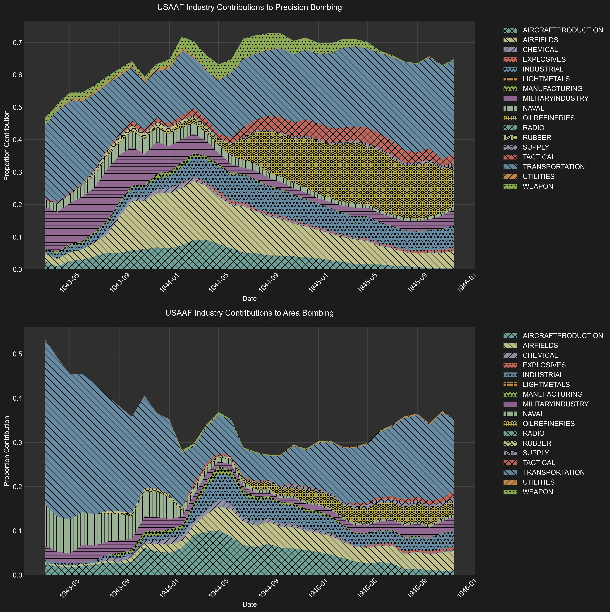
*Figure 1.1: First visualization of industry-specific bombing patterns for USAAF missions, showing the relative contribution of each industry sector and the proportion of area vs. precision bombing within each. The proportions are of the total tons of bombs dropped, and so the two graphs together sum to 100% at any given point. A monthly moving average is used. See [this python script](https://github.com/nac-codes/thesis_bombing/blob/master/attack_data/create_reports.py) for the code used to generate this graph.*

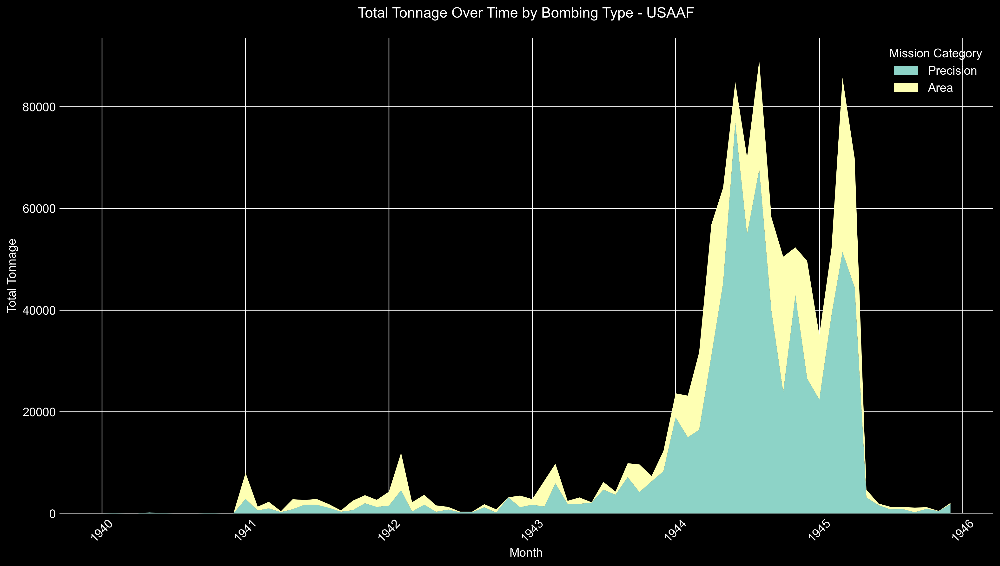
*Figure 1.2: Total tons of bombs dropped by bombing type for USAAF missions. Note the exponential growth in total tons dropped starting in late 1943.*

The strategic bombing campaign can be analyzed in three distinct phases:

**Phase 1 (1942-mid 1943)**: This initial phase featured low bombing tonnage overall. Unexpected emphasis on transportation infrastructure targets. Limited operational capacity during this developmental period.

**Phase 2 (Late 1943-early 1944)**: Significant escalation in bombing scale. Enhanced implementation of precision bombing tactics. Notable focus on the "Schweinfurt era" of industrial targeting. Diversification of targets including military industrial facilities, airfields, aviation infrastructure, radio and communications networks. Concurrent increase in both precision and area attacks on urban centers. Resembled the Haywood-Hansell doctrine of precision strategic bombing.

**Phase 3 (Mid 1944-1945)**: Renewed focus on transportation infrastructure for D-Day preparations. Increased area bombing for transportation targets. Maintained stable precision-to-area bombing ratios overall. Intensified targeting of petroleum infrastructure. Continued urban bombardment with decreasing proportion of area bombing tactics. New priority targets emerged: explosive manufacturing facilities and storage depots.

Overall, precision bombing accounted for 69.0% (1,211,273 tons) of all bombs dropped, compared to 31.0% (544,681 tons) categorized as area bombing. More importantly, this ratio remained relatively stable even as the absolute scale of bombing operations increased dramatically in 1944 and 1945. Both precision and area bombing intensified in parallel during these later stages, suggesting a simple expansion of bombing operations rather than a strategic pivot from one approach to another.

The persistence of both bombing strategies throughout the war fundamentally challenges the traditional historical narrative, but even more striking is the increasing emphasis on precision bombing as the conflict progressed. The conventional explanation—that operational failures of precision bombing led to the adoption of area bombing—not only fails to align with the empirical evidence but actually contradicts it. After the peak of area bombing on industrial centers during Phase 2, the proportion of area bombing relative to precision bombing actually decreased throughout the final phase of the war. While area bombing did increase in absolute tonnage as operations expanded, its proportional contribution diminished—a trend that runs directly contrary to the commonly held notion that area bombing by the USAAF escalated throughout the war. This pattern reflects a steadfast commitment to precision bombing by the United States, even as the scale of operations reached unprecedented levels. To understand these strategic choices by the United States, we must move beyond the simplistic moral dichotomy—a narrative of America’s descent into evil—that previous historians have emphasized.

This evidence undermines a key justification for the campaign's civilian toll—that operational limitations forced a shift to area bombing. Instead, both precision and area bombing were deliberate, parallel strategies from the start. We first examine whether either strategy was truly necessary or effective at achieving its stated aims.

## Area Bombing

The extraordinary resources devoted to area bombing reflected an emphasis on general destruction, yet proved ineffective at achieving its stated economic objectives. This disconnect between effort and outcome raises important questions about the underlying motivations for this approach. The devastating power of incendiary weapons, particularly when combined with high explosives, made them the most destructive conventional weapons of the war. As noted in the USSBS Physical Damage Report, incendiary bombs caused "close to five times as much damage, per ton, as high-explosive bombs" in urban areas.[^2.5]

Yet despite this destructive capacity, area bombing failed to achieve its purported strategic goals. If area bombing had successfully undermined the Nazi economy through civilian and urban targeting, we would expect to see either significant labor force reductions or the diversion of resources from military to civilian needs. The United States Strategic Bombing Survey found neither outcome.

The USSBS's comprehensive analysis found no evidence supporting either of these anticipated outcomes. The Survey's Overall Report explicitly states that "bomb damage to the civilian economy was not a proximate cause of the military collapse of Germany," further noting that there is no evidence that "shortages of civilian goods reached a point where the German authorities were forced to transfer resources from war production in order to prevent disintegration on the home front."[^3]

Additionally, German civilian employment levels remained stable throughout the war. The USSBS's analysis of the German economy reveals that the total employment of Germans, including those drafted into the Wehrmacht and accounting for casualties, remained "practically unchanged throughout the war."[^4] Even more telling, Germany maintained significant untapped labor reserves throughout the conflict. While Britain reduced its domestic service workforce from 1.2 to 0.5 million workers during the war, Germany's comparable workforce decreased only marginally from 1.5 to 1.3 million. This persistence of substantial civilian sector employment suggests that Germany retained significant economic flexibility, directly contradicting the notion that area bombing had put any significant pressure on the civilian economy.

The recovery capacity of German cities further undermines the strategic logic of area bombing. The United States Strategic Bombing Survey's analysis of ten heavily bombed German cities reveals an "extraordinary ability to recover from the effects of ruinous attacks." Hamburg provides a striking example: despite losing nearly one-third of its housing stock and suffering over 60,000 civilian casualties in the devastating "Operation Gomorrah" raids of July-August 1943, the city recovered 80% of its productive capacity within just five months. When industrial output was affected, the analysis shows that worker absenteeism, rather than physical destruction, accounted for the majority of production losses. Moreover, damage to local transportation and utility infrastructure proved insignificant, with services typically restored before industrial facilities had completed repairs.[^5]

The Area Division's detailed investigation of German cities subjected to area attacks provides further evidence of their limited effectiveness. Their Hamburg study concluded that "concentrated attacks (precision bombing) on limited targets were more effective in disrupting vital production than were the area raids on workers' quarters throughout the city." More broadly, the Area Studies Division Report found that area raids generally damaged "sectors of the German economy not essential to war production" and consequently "did not have a decisive effect upon the ability of the German nation to produce war material."[^6] While cities experienced immediate declines in their labor force following raids, they typically recovered most of their industrial workforce within two to three months.

Area bombing cannot be justified based on its practical economic effectiveness. As demonstrated above, it failed to meaningfully disrupt the German labor force or force resource reallocation from military to civilian needs. Attempts to justify it based on its psychological impact are equally unconvincing. The USSBS Morale Division's findings explicitly noted that "the fallacy of the idea that all one has to do is keep on bombing and finally a people's morale will be destroyed had been documented long ago."[^6.5] More recent scholarship has further emphasized the ambiguous and often counterproductive nature of morale bombing, with "depressed and discouraged workers" not necessarily translating into reduced productivity.[^6.6]

The persistence of area bombing despite this clear evidence of its ineffectiveness exemplifies the emotional dynamics that Fuller identified in omnistate warfare. While the fog of war meant that bombing's precise effects remained uncertain during the conflict, the doctrinal foundations for precision bombing had been well-established in interwar military thought.[^7] The decision to pursue and expand a strategy of generalized destruction—targeting not just economic assets but civilian populations—represented a marked departure from this theoretical framework. This suggests that area bombing was driven more by the emotional imperatives that Fuller described than by rational military calculation.

## Precision Bombing

The effectiveness of precision bombing as a military doctrine rests on the understanding of industrial economies as interconnected systems. Developed at the Air Corps Tactical School in the interwar period, this theory—variously called the "industrial web" or "critical node" theory—posited that modern economies function as complex networks where targeted strikes against key nodes could trigger cascading failures throughout the entire system. [^8] This rational, analytical approach to warfare stands in stark contrast to the emotional dynamics predicted by Fuller's omnistate theory, making the persistent American commitment to precision bombing all the more remarkable.

The theory presumed that within any war economy there existed a limited set of facilities or infrastructure points that produced "key items or services indispensable to the economy as a whole, such as national transportation and power resources." By identifying and destroying these bottlenecks, strategic bombing planners believed they could bring an entire economy to a halt with remarkable efficiency.

However, the successful application of precision bombing doctrine depends entirely on specific conditions within the target economy. The strategy requires an industrial base operating at or near maximum capacity, with minimal redundancy in critical systems and limited ability to adapt to disruptions. In such an economy, tight supply chains, significant resource constraints, and numerous bottlenecks create vulnerabilities that, when exploited, cannot be easily circumvented. Without these conditions, precision strikes become more of a nuisance than a decisive factor—the enemy can simply redirect resources or activate spare capacity to maintain production.

In examining the potential effectiveness of precision bombing against Nazi Germany, we must therefore first understand the fundamental nature of the German war economy. Evidence from the United States Strategic Bombing Survey suggests that the German industrial base did not match the theoretical prerequisites for successful precision bombing. As we shall see, rather than operating as a tightly constrained system vulnerable to targeted disruption, the German economy maintained significant underutilized capacity across multiple sectors.

As previously stated, Germany refused to fully mobilize its workforce, particularly women. Although this has often been attributed to Nazi paternalistic ideology, the reality is that the German economy simply did not require this additional labor force. In addition, even the administrative sector remained bloated, with approximately 3.5 million workers in public administration positions that Albert Speer, as armaments minister, tried unsuccessfully to reduce.[^9]

Civilian consumption levels remained remarkably high, with the economy operating under what the Strategic Bombing Survey termed a "guns and butter" philosophy that persisted even after the initial defeats in Russia. Rather than implementing strict rationing and resource allocation, Germany maintained civilian consumption at levels exceeding those of 1929 well into the war years.[^10]

Industrial capacity showed similar patterns of underutilization. With the notable exception of the aero-engine industry, most German armament facilities operated on single shifts throughout the war, despite having the machinery and infrastructure to support multiple shift operations. The USSBS noted that "machine tool and machinery capacity was generally in excess of needs," indicating significant unused productive potential. This inefficiency extended to the allocation of raw materials, particularly steel, which remained "freely available for all current purposes," including civilian construction projects of "doubtful utility."[^11]

Under Walther Funk's Economic Ministry, this pattern of inefficiency was institutionalized. The ministry maintained excess capacity while "satisfying high cost firms" and continuing "production of superfluous civilian goods." The appointment of Albert Speer as Minister for Weapons and Ammunition in 1942 revealed the fundamental tensions in Germany's economic strategy. Initially given limited powers as an "expediter" and coordinator of urgent weapons production, Speer operated within a fragmented system where multiple agencies maintained control over different sectors of the economy.[^12]

Only after the disaster at Stalingrad, when the impossibility of a quick victory became apparent, did Germany attempt comprehensive economic mobilization. In early 1943, Speer received sweeping powers as head of the newly created Ministry for Armament and War Production. However, this belated move toward rationalization faced two insurmountable challenges. First, Germany could no longer afford the time required to expand basic industrial capacity in steel, oil, and coal production—investments that should have been made years earlier. Second, despite the growing crisis, there remained strong resistance to reducing civilian consumption. Local political leaders (gauleiters) continued to oppose cuts to civilian standards even "in the hour of their greatest peril," and industrial reports indicate that civilian orders were still being fulfilled through 1943.[^13]

Despite these constraints, Speer achieved significant increases in armament production—56 percent higher in 1943 than 1942, and more than double 1941 levels. However, these gains demonstrate not Speer's organizational genius but rather the extent of Germany's previously unutilized industrial capacity. The Strategic Bombing Survey noted that this dramatic increase was possible primarily because of "the existence of large untapped capacities in Germany's industrial establishment."The Allied bombing campaign may have actually aided Speer's rationalization efforts, as "the stress of the raids permitted him to mobilize the energies of the population" and overcome bureaucratic resistance to efficiency measures.[^14]

There was a fundamental mismatch between Germany's economic preparation and the war it ultimately had to fight. The economy was structured for a series of quick victories that would enhance German living standards rather than a prolonged conflict requiring total mobilization.[^15] This approach meant that the economy the Allies were bombing had in fact more potential energy than kinetic making it a poor candidate for precision bombing strategies predicated on disrupting highly strained industrial systems.

The strategic bombing campaign faced an inherent challenge in its targeting strategy, as it devoted significant resources to industries with remarkable regenerative capacity. USAAF bombing data reveals that approximately 83% of bombs were directed at targets with significant regenerative or dispersal capacity. Aircraft and military production facilities (24.3% of total tonnage), industrial/city areas (9.8%), and naval installations (2.1%) all demonstrated remarkable resilience through dispersal and reconstruction. In contrast, sectors with limited redundancy or dispersal options — including chemical plants, explosives facilities, utilities, and specialized manufacturing - received only about 17% of the total bombing effort.[^16] While this categorization is somewhat of a generalization, the stark disparity suggests that the majority of bombing resources were directed at targets that could be reconstructed, relocated, or substituted relatively quickly.

The transportation network alone received 38.4% of the total effort, and had some of the most considerable effects. Between August and December, freight car loadings fell by approximately 50%, while coal shipments dropped precipitously from 7.4 million tons to 2.7 million tons. By March 1945, coal shipments could barely meet the railroads' own fuel needs.[^17] As senior German officers like von Rundstedt and von Gersdorf later acknowledged, it was not the overall shortages of materials that proved most devastating, but rather "the constant attrition of these supplies en route from the factories to the front lines."[^18] Yet much of this tonnage had limited impact due to dispersed targeting. As Generalmajor Peters stated to the USSBS, "the bombing of a certain limited area, or a stretch of railway lines from north to south, or east to west, caused much more damage than indiscriminate bombing of marshalling yards and railroad stations throughout the entire German Reich."[^19] This suggests that the same strategic effect could have been achieved with far fewer bombs if properly concentrated. Most notably, he emphasized that bridge attacks were particularly devastating, stating that while damaged marshalling yards could be repaired to maintain at least two to three tracks for traffic, bridge repairs "took months," and severely damaged bridges were often abandoned entirely. Peters concluded that had the Allies "confined themselves to bombing bridges only, throughout Germany, transportation would have come to a complete standstill."[^20] This testimony suggests that even in a case where strategic bombing proved ultimately successful, it was far less efficient in terms of effect per tons dropped than it could have been.

Another example of effectiveness came with the campaign against Germany's synthetic oil plants provides perhaps the most striking example—production of synthetic fuels, which accounted for 90% of aviation gasoline and 30% of motor gasoline, collapsed from 359,000 tons in early 1944 to just 24,000 tons by September. Aviation gasoline output specifically plummeted from 175,000 tons to a mere 5,000 tons during this period. The oil campaign had cascading effects across other vital industries, as these same facilities produced synthetic nitrogen, methanol, and rubber—by late 1944, synthetic nitrogen production had fallen from 75,000 to 20,000 tons monthly, forcing cuts in both agricultural use and explosives manufacturing.[^21]

Still, there were other vulnerable industries could have been effectively targeted but were not. Haywood S. Hansell Jr., a key architect of American air strategy, makes a compelling case in his memoir that targeting Germany's electrical power system could have achieved decisive results before the Normandy invasion. He argues that "the Combined Bomber Offensive could have included the destruction of most of the German powerplants and the disruption of the power distribution system by demolishing the switching stations" and that this, combined with attacks on synthetic petroleum, nitrogen production, and transportation, "would have produced in May or June of 1944 the chaos which characterized the German war industry and the German state in January, February, and March of 1945." The fact that this strategy was not pursued, Hansell suggests, was largely due to political rather than military considerations.[^22]

The presence of officers like Hansell within the USAAF who recognized these strategic shortcomings raises profound questions about why a more efficient approach to precision bombing was not adopted. While some might attribute this to bureaucratic inertia or organizational politics, Fuller's omnistate theory suggests a deeper explanation: the emotional dynamics of warfare in mass societies created pressure toward destruction for its own sake rather than purely instrumental military effectiveness. The remarkable aspect of the American bombing campaign is not that it succumbed to these pressures—as evidenced by the inefficiencies in target selection—but rather that it resisted them to the extent that it did, maintaining a persistent commitment to precision bombing despite the emotional imperatives of omnistate warfare.

Some might argue that such precision targeting was impractical given the operational capabilities of the time. Hansell's analysis challenges this notion. Using the example of the utilities industry, he describes how two combat wings (108 bombers) attacking a power generating station would achieve "virtual assurance of at least 1 hit in the powerhouse, a 96.5 percent probability of knocking it out with 2 hits for several months and 89 percent probability of 3 hits, knocking it out for 6 to 18 months." To target two-thirds of German electrical power would have required approximately 35,000 to 48,000 tons of bombs - "a small portion of the total effort available in March, April, and May of 1944," when U.S. Strategic Air Forces dropped 198,000 tons of bombs, with only 6,080 tons directed at oil targets.[^23]

The testimony of German industrialists further confirms that precision bombing could have been more effective with better target selection. As Hettlage, a German economic official, noted to USSBS interrogators, most German industrialists were "inclined to invest only for the purpose of post-war business" and "opposed the purchase of new machines, especially single purpose machines" for war production.[^23.5] This reluctance to fully convert to war production created vulnerabilities that could have been exploited through more focused precision bombing of critical industrial bottlenecks.

What emerges from this analysis is a picture of precision bombing that was neither as ineffective as its critics claim nor as efficient as it could have been. The persistent American commitment to this approach, despite its imperfections and the emotional pressures of omnistate warfare, represents a remarkable exception to Fuller's prediction that warfare would inevitably trend toward maximum destruction. This tension between the rational, analytical approach of precision bombing and the emotional dynamics of mass warfare helps explain the paradoxical coexistence of precision and area bombing throughout the conflict.

## Conclusion

The strategic bombing campaign presents us with a remarkable paradox. Despite the theoretical predictions of the Realist, Moralist, and Fuller's omnistate frameworks—all of which would anticipate a campaign dominated by area bombing—the empirical evidence reveals a persistent commitment to precision bombing throughout the conflict. This commitment persisted despite significant operational challenges and the availability of more destructive alternatives.

Our analysis reveals that both area and precision bombing could have been significantly more effective. Area bombing, while devastating to civilian populations, failed to achieve its stated economic objectives of reducing labor availability or forcing resource reallocation from military to civilian needs. Precision bombing, while theoretically sound, was often misdirected at targets with significant regenerative capacity rather than critical bottlenecks in the German war economy.

The inefficiencies in both approaches cannot be attributed solely to incompetence. As we have seen, officers like Haywood S. Hansell Jr. advocated for more focused targeting strategies that could have achieved decisive results before the Normandy invasion. Hansell's analysis of the electrical power system as a critical vulnerability suggests that the knowledge for more effective bombing existed within the military establishment. The fact that this knowledge was not fully utilized raises profound questions about the factors driving strategic decision-making.

While elements of area bombing reveal the temptation of total war seeping into military thought—particularly in the transportation sector where incendiaries were used despite their tactical ineffectiveness against rail infrastructure—what stands out most about the American bombing campaign is not its destructiveness but its restraint. In a conflict characterized by unprecedented barbarism on multiple fronts, the persistent American commitment to precision bombing represents a remarkable exception to Fuller's prediction that omnistate warfare would inevitably trend toward maximum destruction.

This exceptional restraint becomes even more striking when we consider that it persisted despite the emotional pressures of total war and the operational challenges of precision bombing. The question of why the United States maintained this approach—resisting both the operational logic of the Realist perspective and the emotional dynamics of omnistate warfare described by Fuller—will be explored in subsequent chapters. What is clear from our analysis is that the strategic bombing campaign was neither a simple story of pragmatic adaptation to operational realities nor a predetermined descent into barbarism, but rather a complex negotiation between military necessity, technological capability, and moral restraint.

[^0.5]: We define precision bombing and area bombing based on tactical implementation rather than stated intent. While the USSBS narrowly defined area raids as those "intentionally directed against a city area by more than 100 bombers with a bomb weight in excess of 100 tons, which destroyed more than 2 percent of the residential buildings in the city," our methodology categorizes any mission using incendiaries—or any mission temporally and spatially associated with incendiary use—as area bombing. This approach captures the operational reality of how supposedly precision targets often became de facto area raids through the combined use of high explosives and incendiaries, a reality the USSBS itself acknowledged when noting that precision raids targeting facilities within cities "had the practical effect of an area raid against that city" even while being recorded as precision attacks [(USSBS Overall Report)](https://bomberdata.s3.us-east-1.amazonaws.com/Archive/Reports/BOX_47/FOLDER_2/OVERALL_REPORT/IMG_8271.JPG).

[^1]: This analysis draws from a comprehensive digitization effort of the United States Strategic Bombing Survey's original mission records. The project involved processing 8,134 photographs of original USSBS computer printouts, using Azure Optical Character Recognition and Document Intelligence to extract 31 distinct fields of data per raid. These fields included target identification, mission details, operational parameters, and detailed bomb loads. The extracted data underwent multiple stages of validation and correction, combining deterministic rules based on known bomb specifications with context-aware large language models to ensure accuracy. A final manual review process helped identify and remove summation rows that could have led to double-counting of mission data. The resulting dataset contains over 54,608 individual bombing missions. The complete dataset, along with all code used in its creation, has been made publicly available to enable further research and analysis (you may find the complete the complete dataset [here](https://github.com/nac-codes/thesis_bombing/blob/master/attack_data/combined_attack_data_bombing_type.csv), the github repository [here](https://github.com/nac-codes/thesis_bombing) and the index of primary and secondary sources [here](https://raw.githubusercontent.com/nac-codes/thesis_bombing/refs/heads/master/s3_bucket_index.md). A detailed description of the methodology, including specific validation rules and data processing steps, may be found here: [methodology_attack_data.md](https://github.com/nac-codes/thesis_bombing/blob/master/methodology_attack_data.md). A presentation of the results is available here: [results_attack_data.md](https://github.com/nac-codes/thesis_bombing/blob/master/results_attack_data.md).

[^2]: Our classification system identifies area bombing through the presence of incendiary munitions. This approach is justified by the fundamental difference in destructive capacity between high explosive and incendiary weapons. As documented in the USSBS Physical Damage Report, high explosive bombs primarily damaged structures through blast effects and falling debris, with fires being a relatively rare secondary effect. Their lethality stemmed mainly from fragmentation, which required either direct exposure or insufficient structural protection. In contrast, incendiary attacks could create widespread firestorms with massive civilian casualties, as evidenced at Hamburg where "the great fire attacks burned in excess of 12 square miles – 4½ square miles in a single night – and 100,000 persons perished in the fire area" [(USSBS Physical Damage Report)](https://bomberdata.s3.us-east-1.amazonaws.com/Archive/Reports/BOX_75/FOLDER_134b/PHYSICAL_DAMAGE/IMG_10499.JPG). While both types of bombing could target civilian areas, only incendiary-based attacks achieved the kind of indiscriminate mass destruction that truly distinguishes area bombing as a fundamentally different form of aerial warfare. For a detailed breakdown of the classification methodology, see [categorize_bombing.py](https://github.com/nac-codes/thesis_bombing/blob/master/attack_data/categorize_bombing.py).

[^2.25]: The one notable exception to this stability was the transportation sector, where we observed a substantial increase in area bombing from late 1943 onwards (see Figure 1.2). This trend is particularly striking given the tactical ineffectiveness of incendiaries against rail infrastructure. The USSBS Transportation Division Report clearly indicated that "systematic line cuts (preferably bridges, underpasses, and viaducts)" and "throats of yards and other choke points" were the most effective methods of disrupting rail transport [(USSBS Transportation Report)](https://bomberdata.s3.us-east-1.amazonaws.com/Archive/Reports/BOX_59/FOLDER_64a/LOGISTICS/IMG_9689.JPG). Even when incendiaries successfully destroyed freight station structures at "Köln Gereon Yard, Essen central freight station, and Munster," their "very heavy concrete platforms... were still sufficient for the volume of traffic which continued to move" [(USSBS Transportation Report)](https://bomberdata.s3.us-east-1.amazonaws.com/Archive/Reports/BOX_59/FOLDER_64a/LOGISTICS/IMG_9690.JPG). Several scholars have noted this pattern: Lucien Mott highlights the targeting of civilian populations under the guise of military objectives [(Lucien Mott 2019)](https://bomberdata.s3.us-east-1.amazonaws.com/Readings/corpora/lucien_pinpoint/chunks/lucien_pinpoint_0036.txt), while Robert Anthony Pape discusses how transportation targets often served as nominal military objectives for broader civilian targeting [(Pape 1960)](https://bomberdata.s3.us-east-1.amazonaws.com/Readings/corpora_cited/pape_coercion/chunks/pape_coercion_0177.txt). See a graph of the development of strategic bombing in the transportation sector [here](https://github.com/nac-codes/thesis_bombing/blob/master/attack_data/reports/trends_by_industry/trend_transportation__usaaf.png).

[^2.5]: [United States Strategic Bombing Survey, Physical Damage Report, 23](https://bomberdata.s3.us-east-1.amazonaws.com/Archive/Reports/BOX_75/FOLDER_134b/PHYSICAL_DAMAGE/IMG_10499.JPG)

[^3]: [United States Strategic Bombing Survey, Overall Report, 38](https://bomberdata.s3.us-east-1.amazonaws.com/Archive/Reports/BOX_47/FOLDER_2/OVERALL_REPORT/IMG_8254.JPG)

[^4]: [United States Strategic Bombing Survey, German Economy Report, 9](https://bomberdata.s3.us-east-1.amazonaws.com/Archive/Reports/BOX_47/FOLDER_3/GERMAN_ECONOMY/IMG_8550.JPG)

[^5]: [United States Strategic Bombing Survey, Overall Report, 72](https://bomberdata.s3.us-east-1.amazonaws.com/Archive/Reports/BOX_47/FOLDER_2/OVERALL_REPORT/IMG_8271.JPG)

[^6]: [Gian P. Gentile, How Effective Is Strategic Bombing? Lessons Learned from World War II to Kosovo (New York: New York University Press, 2001), 78](https://bomberdata.s3.us-east-1.amazonaws.com/Readings/corpora/gentile_effective/chunks/gentile_effective_0098.txt)

[^6.5]: [Herbert Hyman, "The Psychology of Total War: Observations from the USSBS Morale Division"](https://bomberdata.s3.us-east-1.amazonaws.com/Archive/HERBERT_HYMAN_PAPERS/USSBS_ARTICLE/IMG_3948.JPG)

[^6.6]: Eric Ash, "Terror Targeting: The Morale of the Story," Aerospace Power Journal (Winter 1999), accessed via Defense Technical Information Center, https://apps.dtic.mil/sti/tr/pdf/ADA529782.pdf. Ash demonstrates how bombing could sometimes boost Allied morale through retribution while failing to break enemy resolve, noting that physical destruction did not automatically lead to moral collapse.

[^7]: [Conrad C. Crane, Bombs, Cities, and Civilians: American Airpower Strategy in World War II (Lawrence: University Press of Kansas, 1993), 29](https://bomberdata.s3.us-east-1.amazonaws.com/Readings/corpora/crane_bombs/chunks/crane_bombs_0020.txt)

[^8]: [Alexander B. Downes, "Defining and Explaining Civilian Victimization," in Targeting Civilians in War (Ithaca: Cornell University Press, 2008), 39](https://bomberdata.s3.us-east-1.amazonaws.com/Readings/corpora/downes_strategic/chunks/downes_strategic_0065.txt)

[^9]: [United States Strategic Bombing Survey, German Economy Report, 7](https://bomberdata.s3.us-east-1.amazonaws.com/Archive/Reports/BOX_47/FOLDER_3/GERMAN_ECONOMY/IMG_8549.JPG)

[^10]: [United States Strategic Bombing Survey, German Economy Report, 9](https://bomberdata.s3.us-east-1.amazonaws.com/Archive/Reports/BOX_47/FOLDER_3/GERMAN_ECONOMY/IMG_8550.JPG)

[^11]: [United States Strategic Bombing Survey, German Economy Report, 20-1](https://bomberdata.s3.us-east-1.amazonaws.com/Archive/Reports/BOX_47/FOLDER_3/GERMAN_ECONOMY/IMG_8556.JPG)

[^12]: [United States Strategic Bombing Survey, German Economy Report, 24-5](https://bomberdata.s3.us-east-1.amazonaws.com/Archive/Reports/BOX_47/FOLDER_3/GERMAN_ECONOMY/IMG_8558.JPG)

[^13]: Ibid.

[^14]: [United States Strategic Bombing Survey, German Economy Report, 26-7](https://bomberdata.s3.us-east-1.amazonaws.com/Archive/Reports/BOX_47/FOLDER_3/GERMAN_ECONOMY/IMG_8559.JPG)

[^15]: This is a point that's been made by others.
[Alan J. Levine, The Strategic Bombing of Germany, 1940-1945 (Westport, CT: Praeger, 1992), 34](https://bomberdata.s3.us-east-1.amazonaws.com/Readings/corpora/levine_bombing/chunks/levine_bombing_0034.txt)
[Richard Overy, The Bombers and the Bombed: Allied Air War Over Europe, 1940-1945 (New York: Viking, 2013), 255](https://bomberdata.s3.us-east-1.amazonaws.com/Readings/corpora/overy_bombed/chunks/overy_bombed_0255.txt). It is worth noting while Germany had a material cushion, it was under severe economic strain, as outlined by Tooze. By 1944, Wehrmacht expenditures alone exceeded the total national income of the late 1930s. [Adam Tooze, The Wages of Destruction: The Making and Breaking of the Nazi Economy (London: Allen Lane, 2006), 414](https://bomberdata.s3.us-east-1.amazonaws.com/Readings/corpora/tooze_wages/chunks/tooze_wages_0414.txt)

[^16]: Full analysis of USAAF tonnage (1,054,708.40 total tons): Easily dispersible/regenerative targets (82.7%): Transportation (405,038.14, 38.4%), Aircraft/Airfields (197,310.60, 18.7%), Industrial Areas (103,426.67, 9.8%), Military Industry (52,739.97, 5.0%), Manufacturing (7,474.76, 0.7%), Naval (22,467.20, 2.1%), Supply (11,522.81, 1.1%), Tactical (43,535.28, 4.1%), Other misc. (29,441.57, 2.8%). Less dispersible/strategic bottleneck targets (17.3%): Oil (163,244.13, 15.5%), Chemical (9,557.85, 0.9%), Explosives (6,553.02, 0.6%), Light Metals (67.20, 0.0%), Radio (184.00, 0.0%), Rubber (1,317.28, 0.1%), Utilities (2,943.60, 0.3%). View at [summary_statistics_detailed.txt](https://github.com/nac-codes/thesis_bombing/blob/master/attack_data/reports/summary_statistics/summary_statistics_detailed.txt)

[^17]: [United States Strategic Bombing Survey, German Economy Report, 12-3](https://bomberdata.s3.us-east-1.amazonaws.com/Archive/Reports/BOX_47/FOLDER_3/GERMAN_ECONOMY/IMG_8552.JPG)

[^18]: [United States Strategic Bombing Survey, Logisitics Report, 125-6](https://bomberdata.s3.us-east-1.amazonaws.com/Archive/Reports/BOX_59/FOLDER_64a/LOGISTICS/IMG_9689.JPG)

[^19]: [United States Strategic Bombing Survey, Interrogation of Generalmajors Peters, 315](https://bomberdata.s3.us-east-1.amazonaws.com/Archive/Interrogations/CONTAINER_5/2L139/IMG_0315.JPG)-[316](https://bomberdata.s3.us-east-1.amazonaws.com/Archive/Interrogations/CONTAINER_5/2L139/IMG_0316.JPG)

[^20]: Ibid.

[^21]: [United States Strategic Bombing Survey, German Economy Report, 12-3](https://bomberdata.s3.us-east-1.amazonaws.com/Archive/Reports/BOX_47/FOLDER_3/GERMAN_ECONOMY/IMG_8552.JPG)

[^22]: [Haywood S. Hansell, The Strategic Air War Against Germany and Japan: A Memoir (Washington, D.C.: Office of Air Force History, 1986), 278](https://bomberdata.s3.us-east-1.amazonaws.com/Readings/corpora/hansell_memoir/chunks/hansell_memoir_0278.txt)

[^23]: Ibid., [Appendix](https://bomberdata.s3.us-east-1.amazonaws.com/Readings/corpora/hansell_memoir/chunks/hansell_memoir_0301.txt)

[^23.5]: [United States Strategic Bombing Survey, "Interrogation of Hettlage"](https://bomberdata.s3.us-east-1.amazonaws.com/Archive/Telford_Taylor_Papers/USSBS_HETTLAGE/IMG_3866.JPG)

[^24]: [U.S. Strategic Bombing Survey, "Interrogation of Albert Speer"](https://bomberdata.s3.us-east-1.amazonaws.com/Archive/Interrogations/CONTAINER_6/2L178_USSBS/IMG_0492.JPG)


# Chapter 2: The Paradox of American Precision Bombing

## Media Representation and the Precision Bombing Narrative

This chapter examines how this commitment to precision bombing was reflected in American media coverage during and after the war. Through an analysis of thousands of newspaper articles, we can trace how the bombing campaign was presented to the American public and how this presentation challenges conventional assumptions about wartime propaganda and the relationship between the state and its citizens in an omnistate framework.

I have conducted an analysis of over 9,000 American newspaper articles from 1943 to 1946 that contained the term "strategic bombing."[^31] Each article was categorized based on how it framed bombing operations: as precision bombing (targeting specific military installations), area bombing (targeting entire urban centers), industrial bombing (targeting economic infrastructure), counterforce bombing (targeting military capabilities), countervalue bombing (targeting civilian morale), or nuclear bombing.[^32]

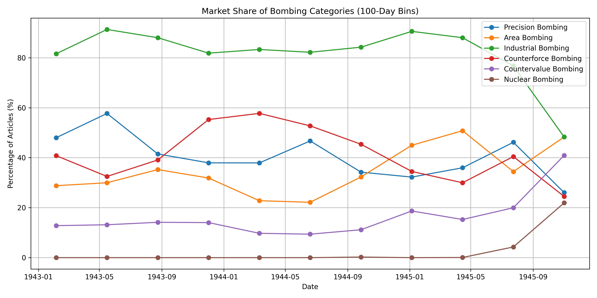 *Figure 2.1: Evolution of Strategic Bombing Narratives in American Media, 1943-1946. See [newspapers/analysis.py](https://github.com/nac-codes/thesis_bombing/blob/master/newspapers/analysis.py) for the code used to generate the underlying data.*

The results (Figure 2.1) reveal a striking parallel between the actual conduct of the bombing campaign and its media representation. Just as our analysis in Chapter 1 showed a consistent ratio between precision and area bombing throughout the war, media coverage maintained a remarkably stable focus on precision and industrial bombing. Contrary to what Fuller's omnistate theory might predict—a gradual shift toward celebrating destruction for its own sake as the war progressed—American newspapers consistently emphasized the strategic, economic, and military objectives of bombing operations.

Throughout the period studied, over 80% of articles were categorized as relating to precision bombing and industrial targets, with many articles discussing both aspects. Coverage of area bombing and civilian targeting was also present but at lower levels, with area bombing appearing in approximately 30% of articles and countervalue bombing (targeting civilian morale) in about 15%. This distribution indicates that media coverage predominantly emphasized the destruction of specific industrial and military installations, while reports focusing on civilian casualties and urban destruction remained consistently subordinate in the overall media narrative.

In an omnistate framework, we might expect media coverage to increasingly emphasize the destruction of enemy society as the war progressed, appealing to the emotional connection between the populace and the state. Instead, American media maintained a remarkably consistent focus on the rational, instrumental aspects of bombing—the destruction of specific military and industrial targets rather than the general devastation of enemy cities.

## The Paradox of Restraint in Media Representation

The parallel between the actual conduct of the bombing campaign and its media representation suggests a broader cultural commitment to precision warfare that transcended military doctrine. This commitment persisted despite the emotional pressures of total war and the temptation to embrace more destructive approaches. The American resistance to these pressures represents again a remarkable exception to Fuller's prediction that omnistate warfare would inevitably trend toward maximum destruction.

What makes this restraint particularly noteworthy is that it occurred within a media environment that was otherwise highly emotional and morally absolute in its portrayal of the enemy. German and Japanese societies were frequently demonized in American media, with dehumanizing depictions common in news coverage, editorial cartoons, and propaganda posters. Yet even amid this moral absolutism, the coverage of bombing operations maintained a focus on precision, efficiency, and military necessity rather than vengeance or destruction for its own sake.

This paradox challenges simplistic understandings of wartime propaganda and suggests a more complex relationship between the state, the media, and the public in an omnistate framework. Rather than simply manipulating public emotions to support increasingly destructive warfare, American media maintained a narrative of restraint and precision that reflected and reinforced the actual conduct of the bombing campaign.

[^31]: The analysis covers the period from January 1943, when the term "strategic bombing" began appearing regularly in American newspapers, through December 1946. Articles were sourced from the newspapers.com digital archive.
[^32]: For detailed methodology of the content analysis and category definitions, see [methodology_sentiment.md](https://github.com/nac-codes/thesis_bombing/blob/master/methodology_sentiment.md).


# Conclusion

What is interesting about this thesis is not what it has found, but what it did not find. We began with a theory tracing the evolution of modern warfare from the French Revolution, anticipating a trajectory toward total barbarism, complete dehumanization of the enemy, and unrestrained destruction.

Indeed, with certain belligerents in the Second World War, this grim prediction was fully realized. Some argue vehemently that the United States was no exception to this rule.

Yet, the empirical data tells a different story—a story of American exceptionalism. If the United States had truly succumbed to the bloodthirsty impulses predicted by Fuller's omnistate theory, the bombing data would reflect a starkly different reality. We would see a pronounced shift toward indiscriminate area bombing, escalating dramatically as the war progressed.

But the numbers are clear: precision bombing overwhelmingly dominated the American campaign both in reality and rhetoric. This empirical data challenges conventional narratives and compels us to reconsider our assumptions about the nature of American warfare.

Thus, the critical question emerges: what is it about the United States—not merely its institutions and structures, but its people, its culture, its very *mores*—that fostered this proclivity for precision? What inspired this almost romantic vision of warfare, a vision where conflict could be waged with surgical precision, minimizing bloodshed and human suffering? This was warfare reimagined as an intelligent endeavor, marked by efficiency, strategic clarity, and moral restraint rather than barbaric excess.

As we transition from the modern era into the information age, it becomes imperative to revisit and deeply understand these uniquely American impulses. We must identify precisely what differentiated America in the modern era and consciously amplify those qualities today. For as humanity's destructive capabilities have exponentially grown, so too has our capacity—through advanced computation and precision technologies—to wage war in a manner that is intelligent, targeted, and humane.

We must therefore ask ourselves: what truly makes America exceptional? Was it our capacity to wage industrial-scale warfare, unleashing destruction on an unprecedented scale? Or was it our commitment to waging war intelligently, with restraint and precision? Was it our zealous crusade to impose democracy through force, or was it our resistance to the seductive allure of total war, in our collective insistence on ethical constraints and strategic clarity?

These are the questions this thesis raises. They are questions not merely of historical curiosity but of urgent contemporary relevance. As we stand at the threshold of a new era, armed with unprecedented technological power, we must consciously choose the path forward. Will we succumb to the darker impulses of omnistate warfare, or will we embrace a more intelligent and humane approach to warfare?


# Bibliography

Ash, Eric. "Terror Targeting: The Morale of the Story." *Aerospace Power Journal* (Winter 1999).

Beagle, Jonathan M. "Operation Pointblank: A Tale of Bombers and Fighters." Maxwell Air Force Base, AL: Air University Press, 2001.

Biddle, Tami Davis. *Rhetoric and Reality in Air Warfare: The Evolution of British and American Ideas about Strategic Bombing, 1914-1945*. Princeton: Princeton University Press, 2002.

Buckley, John. *Air Power in the Age of Total War*. London: UCL Press, 1999.

Builder, Carl H. *The Icarus Syndrome: The Role of Air Power Theory in the Evolution and Fate of the U.S. Air Force*. Routledge, 1994.

Crane, Conrad C. *Bombs, Cities, and Civilians: American Airpower Strategy in World War II*. Lawrence: University Press of Kansas, 1993.

Downes, Alexander B. *Targeting Civilians in War*. Ithaca: Cornell University Press, 2008.

Eisenhower, Dwight D. *Crusade in Europe*. Garden City, NY: Doubleday, 1948.

Fuller, J.F.C. *The Conduct of War, 1789–1961: A Study of the Impact of the French, Industrial, and Russian Revolutions on War and Its Conduct*. New Brunswick, NJ: Rutgers University Press, 1961.

Fuller, J.F.C. *War and Western Civilization, 1832–1932: A Study of War as a Political Instrument and the Expression of Mass Democracy*. London: Duckworth, 1932.

Garrett, Stephen A. *Ethics and Airpower in World War II: The British Bombing of German Cities*. New York: St. Martin's Press, 1993.

Gentile, Gian P. *How Effective Is Strategic Bombing? Lessons Learned from World War II to Kosovo*. New York: New York University Press, 2001.

Griffith, Charles. *The Quest: Haywood Hansell and American Strategic Bombing in World War II*. Knoxville: The University of Tennessee, 1994.

Hansell, Haywood S. *The Strategic Air War Against Germany and Japan: A Memoir*. Washington, D.C.: Office of Air Force History, 1986.

Hecks, Karl. *Bombing 1939-45: The Air Offensive Against Land Targets in World War Two*. London: Robert Hale, 1990.

Hyman, Herbert. "The Psychology of Total War: Observations from the USSBS Morale Division."

Knell, Hermann. *To Destroy a City: Strategic Bombing and Its Human Consequences in World War II*. Cambridge, MA: Da Capo Press, 2003.

Kohn, Richard H., and Joseph P. Harahan. *Strategic Air Warfare: An Interview with Generals Curtis E. LeMay, Leon W. Johnson, David A. Burchinal, and Jack J. Catton*. Washington, D.C.: Office of Air Force History, 1988.

Levine, Alan J. *The Strategic Bombing of Germany, 1940-1945*. Westport, CT: Praeger, 1992.

Maier, Charles S. "Targeting the city: Debates and silences about the aerial bombing of World War II." 2010

McFarland, Stephen L. *America's Pursuit of Precision Bombing, 1910-1945*. Washington, D.C.: Smithsonian Institution Press, 1995.

Overy, Richard. *The Bombers and the Bombed: Allied Air War Over Europe, 1940-1945*. New York: Viking, 2013.

Pape, Robert Anthony. *Bombing to Win: Air Power and Coercion in War*. Ithaca: Cornell University Press, 1960.

Parks, W. Hays. "Precision and Area Bombing: Who Did Which, and When?" *Journal of Strategic Studies* 18, no. 1 (1995): 145-174.

Sherry, Michael S. *The Rise of American Air Power: The Creation of Armageddon*. New Haven: Yale University Press, 1987.

Tooze, Adam. *The Wages of Destruction: The Making and Breaking of the Nazi Economy*. London: Allen Lane, 2006.

United States Strategic Bombing Survey. *Area Studies Division Report*.

United States Strategic Bombing Survey. *German Economy Report*. College Park, MD: National Archives.

United States Strategic Bombing Survey. *Logistics Report*. College Park, MD: National Archives.

United States Strategic Bombing Survey. *Morale Division Findings*. College Park, MD: National Archives.

United States Strategic Bombing Survey. *Overall Report (European War)*. College Park, MD: National Archives.

United States Strategic Bombing Survey. *Physical Damage Division Report (ETO)*. College Park, MD: National Archives.

Werrell, Kenneth P. *Death From the Heavens: A History of Strategic Bombing*. Annapolis, MD: Naval Institute Press, 2009.

Whitman, James Q. *The Verdict of Battle: The Law of Victory and the Making of Modern War*. Cambridge, MA: Harvard University Press, 2012.

# APPENDIX 1: Methodology for Attack Data

The following outlines the comprehensive methodology employed to create and analyze a digital database of strategic bombing missions during World War II. The process involved the collection of primary source data, optical character recognition (OCR) processing, data cleaning and validation, and the generation of analytical reports. Each step is detailed below, with references to the specific scripts used in the data processing pipeline.

## Data Collection

The foundational data for this thesis was derived from 8,134 photographs of original United States Strategic Bombing Survey (USSBS) computer printouts. These documents, housed at the National Archives in College Park, Maryland, contain detailed raid-level data of bombing missions "FROM THE FIRST ATTACK TO 'V-E' DAY." The photographs captured the following information per raid:

- Target identification (location, name, coordinates, and code)
- Mission details (date, time, air force, and squadron)
- Operational parameters (number of aircraft, altitude, sighting method, visibility, target priority)
- Detailed bomb loads (numbers, sizes, and tonnages of high explosive, incendiary, and fragmentation munitions)

An example of these computer printouts is shown in Figure 2.1.


*Figure 2.1: Example of USSBS computer printout showing detailed raid data.*

The photographs were systematically organized into directories based on boxes, books, and images to maintain a coherent data structure for subsequent processing.

## Optical Character Recognition (OCR)

To convert the photographed tables into machine-readable text, we employed OCR techniques using Azure's Form Recognizer service. The service was chosen for its capability to handle complex table structures and handwritten components.

### Processing with Azure Form Recognizer

The script [`send_to_azure.py`](https://github.com/nac-codes/thesis_bombing/blob/master/attack_data/send_to_azure.py) was developed to automate the submission of images to the Azure service.

```python
# Excerpt from send_to_azure.py

document_analysis_client = DocumentAnalysisClient(
    endpoint=endpoint, credential=AzureKeyCredential(key)
)

def analyze_document(image_path):
    ...
    poller = document_analysis_client.begin_analyze_document(
        "prebuilt-layout", document=image_file
    )
    result = poller.result()
    ...
```

This script navigated through the directory of images, sent each image to Azure for processing, and stored the resulting JSON outputs containing the extracted data.

## Data Processing Pipeline

The data processing involved several stages to transform the raw OCR outputs into a clean, structured dataset suitable for analysis. The main steps included:

1. Extracting and organizing metadata and table data from the OCR outputs.
2. Correcting OCR errors and filling missing values using deterministic methods and language models.
3. Validating and cleaning the data to ensure consistency and accuracy.
4. Combining individual tables into a consolidated dataset.
5. Identifying and handling outliers and summation rows.
6. Generating analytical reports and visualizations.

### Extracting and Organizing Data

The initial processing of Azure's OCR output was handled by [`process_ocr.py`](https://github.com/nac-codes/thesis_bombing/blob/master/attack_data/process_ocr.py). This script was responsible for two critical tasks: extracting metadata about the target and identifying the correct data table from the OCR output.

Azure Form Recognizer returns a structured JSON object containing detected tables, text blocks, and their spatial relationships on the page. While this provides a good foundation, the script needed to handle several complexities:

1. **Table Identification**: The script searched for tables containing exactly 23 columns matching our expected format:
```python
# Excerpt from process_ocr.py
expected_column_names = [
    "DATE OF ATTACK DAY", "MO", "YR", "TIME OF ATTACK", "AIR FORCE",
    "GROUP OR SQUADRON NUMBER", "NUMBER OF AIRCRAFT BOMBING",
    "ALTITUDE OF RELEASE IN HUND. FT.", "SIGHTING", "VISIBILITY OF TARGET",
    "TARGET PRIORITY", "HIGH EXPLOSIVE BOMBS NUMBER", "SIZE", "TONS",
    "FUZING NOSE", "TAIL", "INCENDIARY BOMBS NUMBER", "SIZE", "TONS",
    "FRAGMENTATION BOMBS NUMBER", "SIZE", "TONS", "TOTAL TONS"
]
```

The script used fuzzy string matching to identify the correct table and column alignment, as OCR sometimes misread column headers:

```python
def find_table_with_23_columns(ocr_data, expected_names):
    best_match_score = 0
    best_match_table = None

    for table in ocr_data.get("tables", []):
        # Calculate fuzzy match scores between expected and found columns
        avg_score = calculate_column_match_score(table, expected_names)
        if avg_score > best_match_score:
            best_match_score = avg_score
            best_match_table = table
```

2. **Metadata Extraction**: Each page contained critical target information (location, name, coordinates, and target code) that needed to be extracted. The script used GPT-4o to help parse this information accurately:

```python
def extract_target_info(ocr_data, jpg_file):
    # Construct prompt for GPT-4 with the page content
    prompt = f"""Extract the following target information from this text:
    - Target Location
    - Target Name
    - Latitude
    - Longitude
    - Target Code

    Text: {page_text}
    """

    # Use GPT to extract structured information
    response = client.chat.completions.create(
        model="gpt-4",
        messages=[{"role": "user", "content": prompt}]
    )
```

3. **Data Organization**: The extracted data was organized into a structured format with two main components:
   - Metadata dictionary containing target information
   - Table data containing the actual bombing mission details

The script saved this information in two formats:
- A JSON file (`extracted_data.json`) containing both metadata and table data
- A CSV file (`table_data.csv`) containing just the table data for easier processing

```python
def save_csv(data, filename):
    with open(filename, 'w', newline='') as f:
        writer = csv.writer(f)
        writer.writerow(data.keys())
        writer.writerows(zip(*data.values()))

def save_json(data, filename):
    with open(filename, 'w') as f:
        json.dump(data, f, indent=2)
```

This initial processing stage was critical for ensuring data quality and consistency. The script included extensive logging to track any issues or anomalies in the extraction process, allowing for manual review when necessary. The output files were organized in a directory structure that maintained the relationship between original images and extracted data:

```
original_image.JPG
original_image_output/
    ├── extracted_data.json
    └── table_data.csv
```

This structured approach to data extraction provided a solid foundation for subsequent processing steps, ensuring that both the tabular data and contextual metadata were accurately preserved.

### Validating and Correcting Data Fields

After initial extraction, each table underwent a rigorous validation and correction process using [`process_table.py`](https://github.com/nac-codes/thesis_bombing/blob/master/attack_data/process_table.py). This script implemented a sophisticated field-by-field validation system with specific rules for each column type.

1. **Field-Specific Validation Rules**: Each column had its own validation function with precise expectations:

```python
def check_AIR_FORCE(value, is_required, is_RAF):
    # Expected: 8, 9, 12, 15 for US Air Forces, or R for Royal Air Force
    if pd.isna(value):
        if is_required:
            if is_RAF:
                return False, "AIR FORCE is required. Could be 8, 9, 12, 15, or R. Potentially is R."
            else:
                return False, "AIR FORCE is required. Should be 8, 9, 12, or 15. Potentially is 8."
    # Additional validation logic...

def check_DAY(value, is_required):
    # Expected: Single day (1-31) or a range (e.g., 15-16)
    if pd.isna(value):
        return not is_required, "DAY is required. Should be a number between 1 and 31 or a range (e.g., 15-16)."
    # Additional validation logic...
```

2. **Contextual Error Correction**: When errors were detected, the script used GPT-4o-mini with highly specific prompts that included:
   - The expected format and valid values for the field
   - Values from surrounding rows in the same column for context
   - Related values from the same row (e.g., bomb numbers and tonnage)
   - Historical patterns from similar entries

For example, when correcting Air Force designations, the prompt would look like this:

```python
prompt = f"""Correct the Air Force designation.
Current value: {value}
Valid options: 8, 9, 12, 15 (US Air Forces) or R (Royal Air Force)
Previous 3 rows in column: {previous_values}
Next 3 rows in column: {next_values}
Target location: {target_location}
Date of attack: {attack_date}

Please select the most likely correct value from the valid options."""
```

3. **Mathematical Validation**: For bomb-related data, the script implemented cross-field validation to ensure internal consistency:

```python
def check_TONNAGE(row):
    # Validate that individual tonnages sum to total
    he_tons = row['HIGH EXPLOSIVE BOMBS TONS']
    inc_tons = row['INCENDIARY BOMBS TONS']
    frag_tons = row['FRAGMENTATION BOMBS TONS']
    total_tons = row['TOTAL TONS']

    calculated_total = sum([he_tons, inc_tons, frag_tons])
    if abs(calculated_total - total_tons) > 0.1:
        return False, f"Total tons ({total_tons}) does not match sum of individual tonnages ({calculated_total})"
    return True, None
```

4. **Iterative Correction Process**: The script processed each row multiple times if necessary:
   - First pass: Basic validation and correction of individual fields
   - Second pass: Cross-field validation (e.g., tonnage calculations)
   - Final pass: Overall consistency check

This meticulous approach to data validation and correction significantly reduced errors while maintaining the integrity of the historical data. By providing GPT-4o-mini with specific constraints and contextual information, we minimized the risk of hallucinated values and ensured corrections were historically plausible.

The script maintained detailed logs of all corrections, allowing for manual review of significant changes:

```python
logging.info(f"Row {row_idx + 1}: Corrected Value for '{col}': {corrected_value}")
```

This combination of deterministic validation rules and context-aware AI assistance proved highly effective in cleaning the OCR output while preserving the historical accuracy of the data.

### Deterministic Validation and Correction

A critical aspect of data validation involved the mathematical relationships between bomb quantities, sizes, and tonnages. The script [`post_process_2.py`](https://github.com/nac-codes/thesis_bombing/blob/master/attack_data/post_process_2.py) implemented a sophisticated system to validate and correct these interrelated values using known bomb specifications from the period.

#### Bomb Weight Mappings

First, we established a comprehensive mapping of bomb size codes to their actual weights in pounds:

```python
bomb_weight_mapping = {
    "HIGH EXPLOSIVE": {
        1: [100], 2: [250, 300], 3: [500, 600], 4: [1000, 1100], 5: [2000],
        6: [4000], 7: [500], 8: [1000], 9: [1000], 10: [1600],
        11: [325, 350], 12: [1000], 13: [1660], 14: [2000]
    },
    "INCENDIARY": {
        1: [2], 2: [4], 3: [6], 4: [10], 5: [100], 6: [500],
        7: [14 * 6], 8: [38 * 6], 9: [60 * 6], 10: [34 * 4],
        11: [110 * 4], 12: [128 * 4], 13: [100]
    },
    "FRAGMENTATION": {
        1: [4], 2: [20], 3: [23], 4: [90], 5: [260],
        6: [3 * 23], 7: [6 * 20], 8: [20 * 20, 24 * 20], 9: [6 * 90],
        10: [24 * 4], 11: [90 * 4]
    }
}
```

This was derived from the index of the USSBS computer printouts:

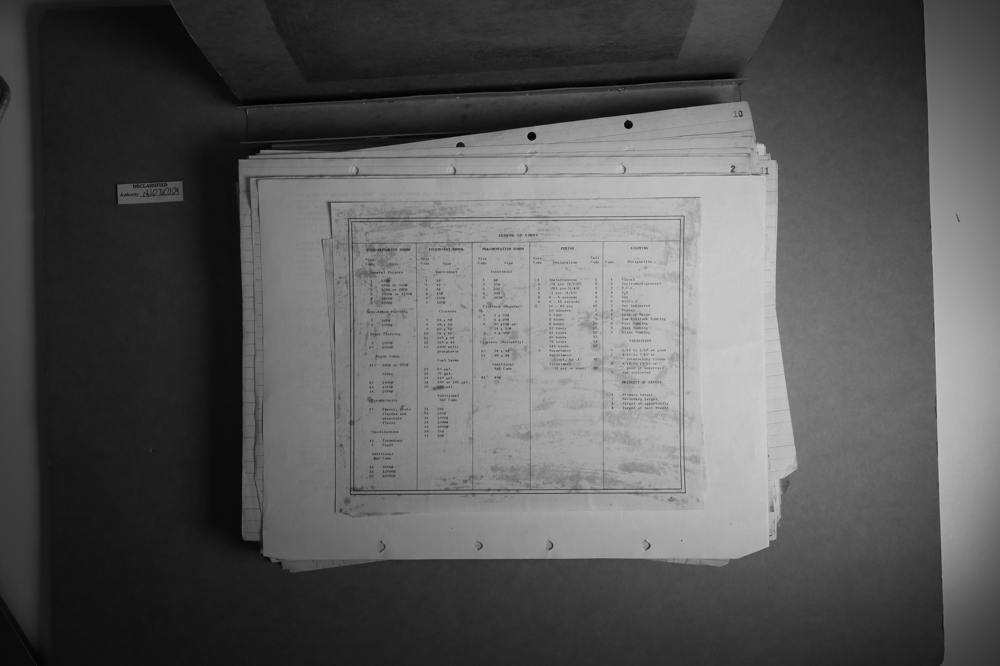

#### Validation Process

For each row in the dataset, the script performed a three-way validation between:
- Number of bombs
- Bomb size (which mapped to weight in pounds)
- Total tonnage

The process worked as follows:

1. **Calculate Expected Values**: For each combination of two known values, calculate the expected third value:
```python
def get_expected_values(row, bomb_type):
    tonnage = row[f'{bomb_type} BOMBS TONS']
    number = row[f'{bomb_type} BOMBS NUMBER']
    size_code = row[f'{bomb_type} BOMBS SIZE']

    # If we have tonnage and number, calculate expected size
    if not pd.isna(tonnage) and not pd.isna(number):
        expected_size = size_code
        expected_tonnage = tonnage
        expected_number = number
    # If we have tonnage but no number, calculate expected number
    elif not pd.isna(tonnage) and pd.isna(number):
        expected_size = size_code
        expected_tonnage = tonnage
        expected_number = (tonnage * 2000) / weight  # Convert tons to pounds
    # If we have number but no tonnage, calculate expected tonnage
    elif pd.isna(tonnage) and not pd.isna(number):
        expected_size = size_code
        expected_tonnage = (number * weight) / 2000  # Convert pounds to tons
        expected_number = number
```

2. **Fuzzy Matching**: Compare each calculated combination against the original OCR values to find the best match:
```python
def find_best_match(original_values, expected_values_list):
    best_match = None
    best_score = -1

    for expected_values in expected_values_list:
        score = sum([
            calculate_similarity(original_values['tonnage'], expected_values['tonnage']),
            calculate_similarity(original_values['size'], expected_values['size']),
            calculate_similarity(original_values['number'], expected_values['number'])
        ])

        if score > best_score:
            best_score = score
            best_match = expected_values
```

This approach sometimes produced mathematically correct but historically implausible values (such as fractional numbers of bombs). However, by using fuzzy string matching to compare the calculated values against the original OCR output, the script typically selected the most historically accurate combination. For example:

- Original OCR: `{number: 24, size: 3, tons: 6.0}`
- Calculated options:
  1. `{number: 24, size: 3, tons: 6.0}` - Score: 300
  2. `{number: 24.5, size: 3, tons: 5.9}` - Score: 250
  3. `{number: 23.8, size: 3, tons: 6.1}` - Score: 240

The first option would be selected as it best matches the original OCR values while maintaining mathematical consistency.

The script logged all corrections for manual review:
```python
logging.debug(f"Original values: {original_values}")
logging.debug(f"Calculated options: {expected_values_list}")
logging.debug(f"Selected best match: {best_match}")
```

This deterministic approach to validation proved particularly effective for correcting GPT-4o-mini hallucinations, as it leveraged both mathematical relationships and historical accuracy through fuzzy matching against the original values.

### Combining Data into a Consolidated Dataset

After processing individual tables, the script [`combine.py`](https://github.com/nac-codes/thesis_bombing/blob/master/attack_data/combine.py) aggregated the data into a single comprehensive CSV file.

It outputted two CSV files:
- [`combined_attack_data_complete_checked.csv`](https://github.com/nac-codes/thesis_bombing/blob/master/attack_data/combined_attack_data_complete_checked.csv): A detailed dataset which includes all the original data fields, including tonnage.
- [`combined_attack_data.csv`](https://github.com/nac-codes/thesis_bombing/blob/master/attack_data/combined_attack_data.csv): A simplified dataset which includes only the most important fields for analysis. Reduced tonnage data to being binary (0 or 1) for high explosive, incendiary, and fragmentation bombs.

This script handled file system traversal, read individual CSV files, and concatenated them while preserving relevant metadata.

### Final Manual Review and Outlier Detection

The final step in data cleaning involved manual verification of statistical outliers using [`check_attacka_data.py`](https://github.com/nac-codes/thesis_bombing/blob/master/attack_data/check_attacka_data.py). This was particularly important for handling summation rows—entries that represented mission totals rather than individual sorties—which occasionally escaped automated detection.

The script facilitated this review process in several ways:

1. **Statistical Detection**: For each bomb type (high explosive, incendiary, and fragmentation), the script identified statistical outliers:
```python
def find_outliers(data, column):
    mean = np.mean(data[column])
    std = np.std(data[column])
    outliers = data[data[column] > mean + 2*std]
    return outliers.sort_values(by=column, ascending=False)
```

2. **Contextual Review**: For each outlier, the script displayed:
   - The full table from the original image
   - Target information and date
   - Surrounding entries for context
   - The original photograph for verification

3. **Interactive Correction**: Users could:
   - Mark entries as summation rows (removing them from the dataset)
   - Correct erroneous values
   - Verify legitimate high-tonnage missions

The script generated distribution plots for each bomb type, helping identify unusual patterns:

```python
plot_distribution(
    data,
    f'Distribution of {bomb_type}',
    'reports/tons/',
    f'tonnage_distribution_{bomb_type.lower().replace(" ", "_")}.png'
)
```

This final manual review was particularly effective at catching aggregated entries that had slipped through automated detection, ensuring the final dataset limited the amount of double-counting.

The processed and validated dataset may be found at: [`combined_attack_data_complete_checked.csv`](https://github.com/nac-codes/thesis_bombing/blob/master/attack_data/combined_attack_data_complete_checked.csv)

### Categorizing Area vs. Precision Bombing

A critical methodological challenge was determining whether each mission should be categorized as "area" or "precision" bombing. Initially, we considered using a simple ratio of incendiary to high explosive/fragmentary bombs as the determining factor. However, this approach proved inadequate as it failed to capture the sophisticated tactics employed in area bombing campaigns.

Historical evidence shows that the most devastating area raids deliberately combined both high explosive and incendiary bombs. As described in contemporary accounts, high explosive bombs would first demolish roofs and windows, creating optimal conditions for incendiary bombs to penetrate buildings and initiate urban firestorms. These tactical combinations turned targeted structures into "giant cauldrons" that became epicenters of devastating urban fires (See: [Hansen, *Fury*](https://github.com/nac-codes/thesis_bombing/blob/master/corpora_cited/hansen_fury/chunks/hansen_fury_0078.txt), [Davis, *Spaatz*](https://github.com/nac-codes/thesis_bombing/blob/master/corpora_cited/davis_spaatz/chunks/davis_spaatz_0810.txt)).

Given this historical context, we developed a more nuanced categorization algorithm that considers both temporal and spatial relationships between raids. The algorithm, implemented in [`categorize_bombing.py`](https://github.com/nac-codes/thesis_bombing/blob/master/attack_data/categorize_bombing.py), uses the following logic:

1. Any mission that deployed incendiary bombs is automatically categorized as "area" bombing
2. For missions using only high explosive bombs, the algorithm:
   - Examines all other missions targeting the same location
   - Uses a 4-hour time window before and after the mission
   - If any related mission within this window used incendiaries, categorizes the mission as "area" bombing
   - Only if no related missions used incendiaries is the mission categorized as "precision" bombing

```python
def categorize_mission(row, df, time_window_hours=4):
    # First check if this mission used incendiaries
    if row['INCENDIARY BOMBS NUMBER'] > 0:
        return 'area'

    # Check other missions at same target within time window
    time_window_start = mission_time - timedelta(hours=time_window_hours)
    time_window_end = mission_time + timedelta(hours=time_window_hours)

    related_missions = df[
        (df['box'] == box) &
        (df['book'] == book) &
        (df['image'] == image) &
        (pd.to_datetime(df['DATETIME']) >= time_window_start) &
        (pd.to_datetime(df['DATETIME']) <= time_window_end)
    ]

    # If any related mission used incendiaries, categorize as area bombing
    if (related_missions['INCENDIARY BOMBS NUMBER'] > 0).any():
        return 'area'

    return 'precision'
```

This generous approach to identifying area bombing does have limitations. For instance, some oil refinery raids that used small quantities of incendiary bombs—presumably to ignite petroleum products as part of precise targeting—are categorized as "area" bombing despite potentially being more accurately described as precision attacks. However, these edge cases represent a relatively small portion of the overall dataset, and the categorization still provides a valuable analytical framework for understanding strategic bombing patterns.


# APPENDIX 2: Results for Attack Data

## Comparison of Total Bomb Tonnage

The total bomb tonnage recorded in our dataset is closely aligned with the figures reported by both the United States Strategic Bombing Survey (USSBS) Tabulating Service and the Office of Statistical Control (OSC) for the Eighth and Fifteenth Air Forces. Our data for the USAAF shows:

- **Eighth Air Force**: 697,814.46 tons
- **Fifteenth Air Force**: 290,529.45 tons

These figures are remarkably close to the OSC's reported totals of 692,918 tons for the Eighth Air Force and 312,173 tons for the Fifteenth Air Force[^1]. The slight discrepancies can be attributed to OCR error and LLM hallucinations.

However, the data for the Royal Air Force (RAF) Bomber Command presents a significant shortfall of over 300,000 tons when compared to historical records. Our dataset records:

- **RAF Bomber Command**: 701,245.61 tons

In contrast, the Air Ministry reported a total of 1,066,141 tons dropped by the RAF Bomber Command[^1]. The missing tonnage in our dataset is predominantly in the **Industrial** category, which mainly includes city area bombings[^2]. This discrepancy suggests that a substantial number of RAF mission records, particularly those targeting urban industrial areas, are missing from the archives utilized for our dataset.

## Implications for Data Analysis

The close alignment of USAAF data confirms that our dataset provides a reliable foundation for analyzing bombing missions conducted by the Eighth and Fifteenth Air Forces, which constituted the majority of USAAF bombings in the European theater. For the RAF data, while the available records are valuable, any conclusions drawn must acknowledge the incomplete nature of the dataset, especially concerning the substantial underrepresentation of bombings on city areas.

---

## Target Category by Air Force

| Target Category    | RAF Tonnage | RAF % | USAAF Tonnage | USAAF % | Total Tonnage |
|-------------------|-------------|-------|---------------|----------|---------------|
| Transportation    | 155,684.12  | 27.8% | 405,038.14    | 72.2%   | 560,722.26    |
| Industrial        | 194,472.29  | 65.3% | 103,426.67    | 34.7%   | 297,898.96    |
| Oil Refineries    | 94,959.91   | 36.8% | 163,244.12    | 63.2%   | 258,204.03    |
| Airfields         | 34,560.41   | 21.5% | 126,112.16    | 78.5%   | 160,672.57    |
| Military Industry | 60,199.04   | 53.3% | 52,739.97     | 46.7%   | 112,939.01    |
| Aircraft Production| 10,161.84   | 12.5% | 71,198.44     | 87.5%   | 81,360.28     |
| Naval             | 40,268.67   | 64.2% | 22,467.20     | 35.8%   | 62,735.87     |
| Weapon            | 4,836.12    | 15.0% | 27,325.89     | 85.0%   | 32,162.01     |
| Chemical          | 15,251.73   | 61.5% | 9,557.85      | 38.5%   | 24,809.58     |
| Manufacturing     | 436.94      | 5.5%  | 7,474.76      | 94.5%   | 7,911.71      |
| Explosives        | 1,426.12    | 17.9% | 6,553.02      | 82.1%   | 7,979.14      |
| Utilities         | 3,011.33    | 50.6% | 2,943.60      | 49.4%   | 5,954.93      |
| Light Metals      | 336.10      | 83.3% | 67.20         | 16.7%   | 403.30        |
|--------------------|-------------|-------|---------------|----------|---------------|
| **Total**          | 701,245.61  | 100%  | 1,054,708.40  | 100%    | 1,755,954.02  |

## Yearly Tonnage by Air Force

| Year | 8th AF | 15th AF | RAF | 9th AF | 12th AF | Unknown | Total |
|------|---------|----------|------|---------|----------|----------|--------|
| 1940 | - | 304.00 | 213.22 | 60.00 | - | - | 577.23 |
| 1941 | 22,980.06 | 1,831.56 | 62,265.68 | 6,116.48 | 30.00 | 658.37 | 93,882.14 |
| 1942 | 24,211.65 | 2,754.35 | 36,473.89 | 7,128.44 | 757.10 | 215.05 | 71,540.49 |
| 1943 | 54,809.07 | 13,462.19 | 67,437.82 | 6,622.31 | 900.50 | 839.00 | 144,070.89 |
| 1944 | 434,066.29 | 193,868.57 | 385,895.60 | 22,456.01 | 2,537.00 | 1,186.43 | 1,040,009.89 |
| 1945 | 161,747.39 | 78,308.78 | 148,959.40 | 10,931.43 | 1,816.75 | 4,109.64 | 405,873.39 |
| **Total** | **697,814.46** | **290,529.45** | **701,245.61** | **53,314.67** | **6,041.35** | **7,008.48** | **1,755,954.02** |
| % of Total | 39.7% | 16.5% | 39.9% | 3.0% | 0.3% | 0.4% | 100% |

## Area vs Precision Bombing

This section analyzes how bombing tonnage was distributed between area and precision bombing strategies, based on data processed by the [`create_reports.py`](https://github.com/nac-codes/thesis_bombing/blob/master/attack_data/create_reports.py) script. These reports and visualizations provide insights into bombing patterns, target priorities, and mission characteristics of both the Royal Air Force (RAF) and the United States Army Air Forces (USAAF) during World War II. All the reports and charts referenced can be found in the [**attack_data/reports**](https://github.com/nac-codes/thesis_bombing/blob/master/attack_data/reports) directory.

---

### Summary Statistics

We begin with the [**Summary Statistics Report**](https://github.com/nac-codes/thesis_bombing/blob/master/attack_data/reports/summary_statistics/summary_statistics_detailed.txt), which offers an overall quantitative snapshot of the bombing campaign.

#### Key Highlights:

- **Total Tonnage Dropped**: **1,697,811 tons**
  - **RAF** contributed **669,624 tons** (39.4%)
  - **USAAF** contributed **1,028,188 tons** (60.6%)

- **Bomb Type Distribution**:
  - **High Explosive (HE)**: **1,510,054 tons** (88.9%)
  - **Incendiary**: **146,497 tons** (8.6%)
  - **Fragmentation**: **41,260 tons** (2.4%)

- **Yearly Tonnage Statistics**:
  - **1944** saw the highest bombing activity with **1,025,761 tons** dropped.
  - The USAAF's contribution peaked in 1944, reflecting increased American involvement.

- **Bombing Type Distribution**:
  - **Precision Bombing** accounted for **61%** of total tonnage.
  - **Area Bombing** made up **39%** of total tonnage.

#### Detailed Breakdown:

For a more granular view, please refer to the full [**Summary Statistics Report**](https://github.com/nac-codes/thesis_bombing/blob/master/attack_data/reports/summary_statistics/summary_statistics_detailed.txt), which includes:

- Tonnage by **Air Force** and **Year**
- Tonnage by **Target Category**
- Bomb Type Distribution by **Air Force** and by **Industry**

---

### Attack Type Comparison: Area vs Precision Bombing

The [**Attack Types by Air Force and Mission Category**](https://github.com/nac-codes/thesis_bombing/blob/master/attack_data/reports/attack_type_comparison/attack_types_by_mission_category.png) chart illustrates the distribution of total tonnage between area and precision bombing for both the RAF and USAAF.

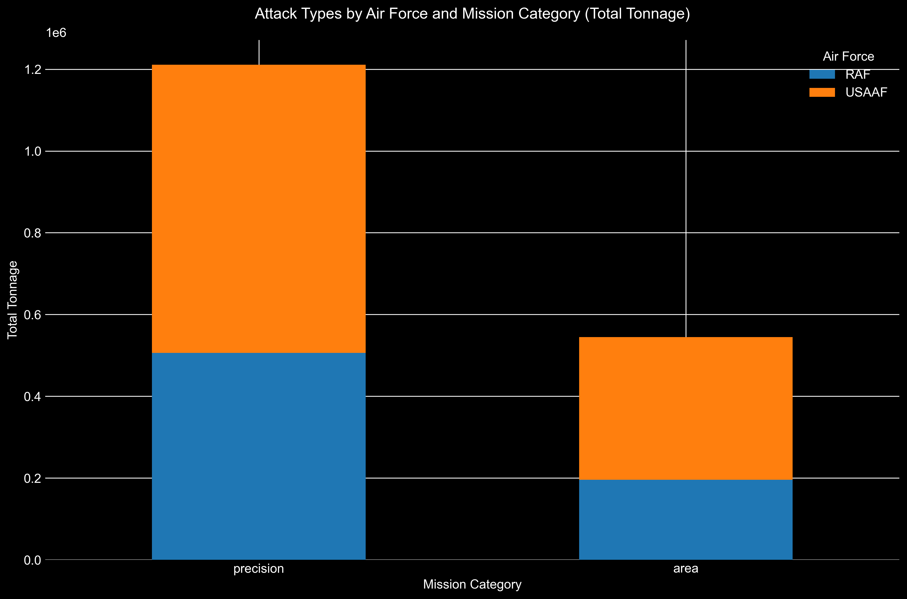

#### Explanation:

- The **x-axis** represents the **mission category** (Area or Precision).
- The **y-axis** shows the **total tonnage dropped**.
- Each bar is **stacked** to show contributions from the **RAF** and **USAAF**.

---

### Overall Trends

The [**Overall Trends by Bombing Type**](https://github.com/nac-codes/thesis_bombing/blob/master/attack_data/reports/overall_trends/overall_trends_by_bombing_type.png) visualization presents how the total tonnage of area and precision bombings evolved over time.

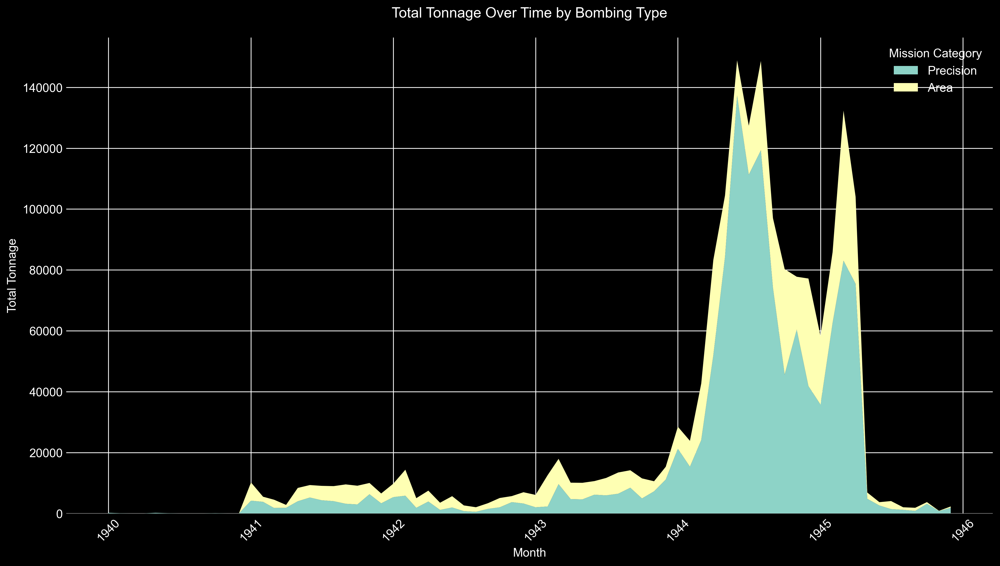

#### Explanation:

- **Stacked Area Chart** showing monthly total tonnage for **area** and **precision** missions.
- **Timeframe**: From the beginning to the end of the bombing campaign.

---

### Industry Contribution Analysis

The [**Industry Contribution Analysis**](https://github.com/nac-codes/thesis_bombing/blob/master/attack_data/reports/industry_contribution) examines how different target industries contributed to the overall bombing efforts over time, using a 12-month rolling window analysis. Each visualization shows the proportional contribution of different industries to both precision and area bombing campaigns.

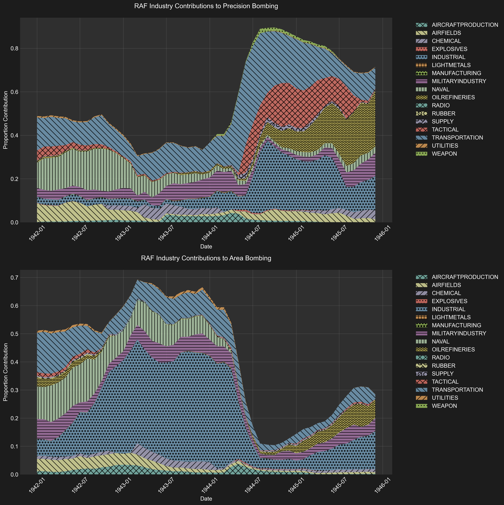

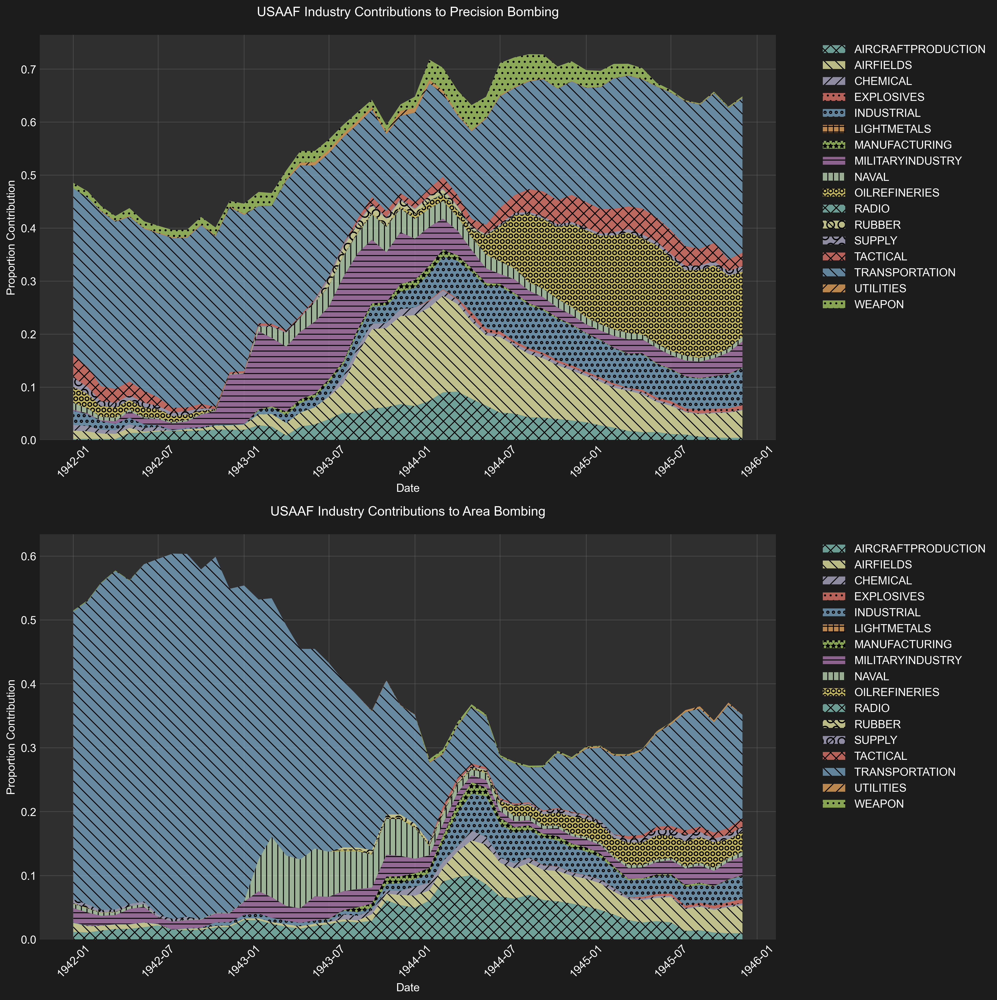

#### Understanding the Visualizations

Each figure consists of two panels:
1. **Top Panel**: Shows industry contributions to precision bombing
2. **Bottom Panel**: Shows industry contributions to area bombing

The y-axis represents the **proportional contribution** of each industry, calculated as:
- For each month, using the previous 12 months of data:
  1. Calculate the total tonnage dropped across all industries
  2. For each industry:
     - Calculate its percentage of total tonnage
     - Split this percentage between precision and area bombing based on that industry's mission types
     - Stack these proportions to show relative contribution

Key features:
- The height of each colored section represents that industry's relative contribution
- Hatching patterns help distinguish between industries
- The sum of all sections equals 1.0 (100%) at any given point
- The x-axis spans from January 1942 to December 1945
- Different colors and patterns are used consistently across both air forces for easy comparison

This visualization method allows us to see:
- How the relative importance of different target types evolved
- Which industries were prioritized by each air force
- The balance between precision and area bombing for different target types
- Shifts in strategic focus over time

---

### Area Bombing Composition

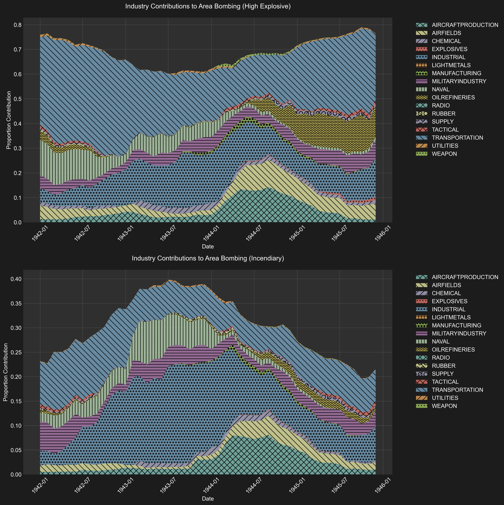

#### Explanation:

- **Top Panel**: Displays contributions of each industry to the **HE tonnage** in area bombings over time.
- **Bottom Panel**: Shows the same for **incendiary tonnage**.

---

### Trends by Industry

The [**Trends by Industry Reports**](https://github.com/nac-codes/thesis_bombing/blob/master/attack_data/reports/trends_by_industry) offer insights into the bombing patterns for specific industries over time.

#### Sample Industries:

##### Transportation

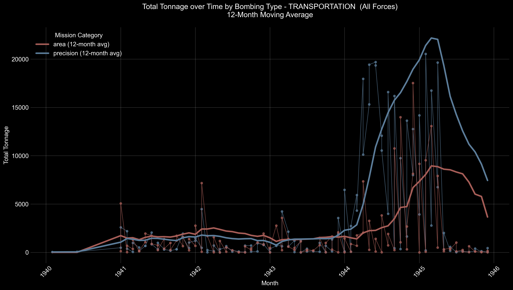

##### Oil Refineries

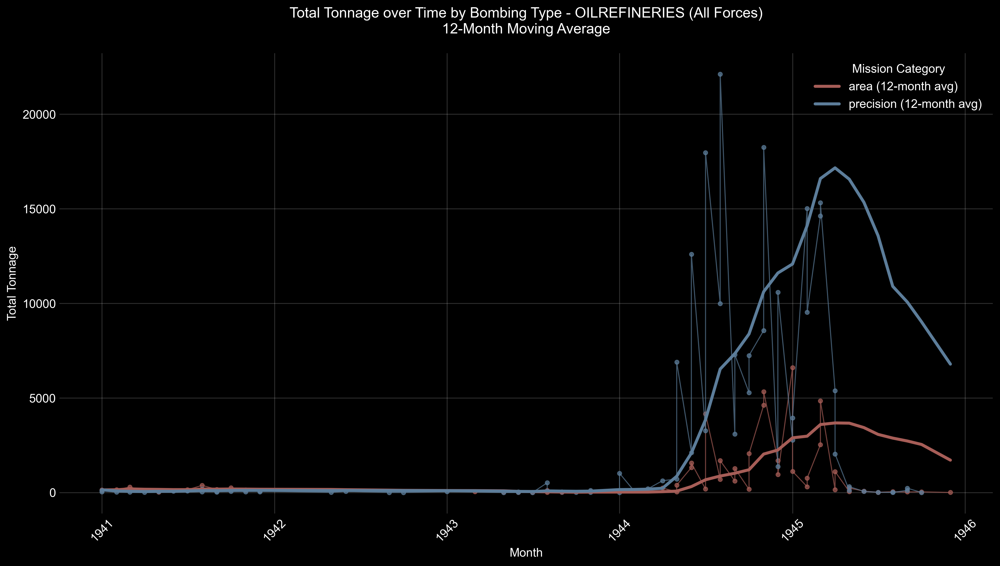

#### Industrial Areas

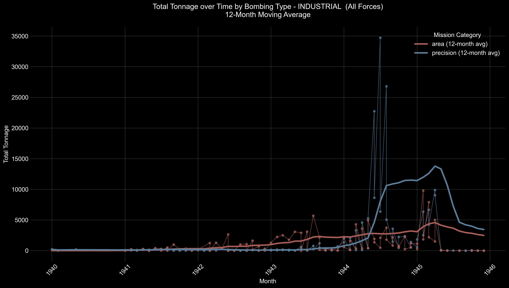

#### Explanation:

- **Plots** show both **raw monthly tonnage** and **12-month moving averages** for area and precision bombings.
- **Purpose**: To identify patterns, shifts in strategic focus, and the effectiveness of bombing campaigns against specific industries.
- **All industry trends** are available in the [**trends_by_industry**](https://github.com/nac-codes/thesis_bombing/blob/master/attack_data/reports/trends_by_industry) directory.

---

### Top Missions

The [**Top Missions Reports**](https://github.com/nac-codes/thesis_bombing/blob/master/attack_data/reports/top_missions) list the most significant missions in terms of tonnage for each industry, separated by bombing type and air force.

#### Details:

- **CSV Files** for each industry and air force combination, such as:

  - `top_missions_transportation_raf_area.csv`
  - `top_missions_transportation_usaaf_precision.csv`

- **Information Included**:
  - **Date and Time**
  - **Mission ID**
  - **Target Name and Location**
  - **Number of Aircraft Bombing**
  - **Total Tonnage**
  - **Bomb Type Breakdown** (HE and Incendiary tonnage and percentages)

#### Accessing the Reports:

- The complete list of top missions for each industry can be found in the [**top_missions**](https://github.com/nac-codes/thesis_bombing/blob/master/attack_data/reports/top_missions) directory.
- These reports are valuable for identifying key operations and understanding tactical priorities.

---

**Note**: All reports and charts mentioned are accessible in the [**attack_data/reports**](https://github.com/nac-codes/thesis_bombing/blob/master/attack_data/reports) directory. For specific charts not displayed in this document due to space constraints, please refer to the corresponding subdirectories and files within the reports folder.

[^1]: **Sources**: [USSBS Tabulating Service Data Part 1](https://github.com/nac-codes/thesis_bombing/blob/master/ussbs_reports/ECONOMIC_REPORT/IMG_8547.JPG) and [Part 2](https://github.com/nac-codes/thesis_bombing/blob/master/ussbs_reports/ECONOMIC_REPORT/IMG_8548.JPG). [Office of Statistical Control and Air Ministry records](https://github.com/nac-codes/thesis_bombing/blob/master/ussbs_reports/OVERALL_REPORT/STATISTICAL_APPENDIX/IMG_8297.JPG).

[^2]: The total tonnage dropped by the RAF on industrial targets is reported in the [Statistical Appendix of the USSBS Overall Report](https://github.com/nac-codes/thesis_bombing/blob/master/ussbs_reports/OVERALL_REPORT/STATISTICAL_APPENDIX/IMG_8326.JPG) as 610,679 tons. We recorded only 194,472.29 tons as seen in the [Summary Statistics Report](https://github.com/nac-codes/thesis_bombing/blob/master/attack_data/reports/summary_statistics/summary_statistics_detailed.txt).

# APPENDIX 3: Methodology for Sentiment Analysis

This project aims to analyze how American newspapers from the period 1943–1946 used and framed the term “strategic bombing.” Below is a step-by-step explanation of how each script contributed to the data collection, preprocessing, and analysis pipeline. The final result is a time-based classification (e.g., precision, area, industrial, counterforce, countervalue, nuclear, and unrelated/NA) of thousands of newspaper articles, culminating in a visual “market share” graph showing how these categories evolved over time.

---

## 1. Obtaining and Managing Website Cookies

### Script: `get_cookies.py`
The first step requires accessing an online newspaper archive, which usually needs authentication.

1. **What It Does**
   - Automates the login process to the newspaper archive (newspapers.com in this example) via a Columbia University SSO (Single Sign-On) flow.
   - Handles Duo two-factor authentication using Selenium.
   - Saves the user’s authenticated session cookies locally (in `cookies_newspapers.json`) for future reuse.

2. **Why It Matters**
   - Most archives require login credentials.
   - Storing cookies allows the main scraping script to bypass the repeated login process.

---

## 2. Scraping Newspaper Articles

### Script: `scrape.py`
Once cookies are acquired, the next step is to actually **scrape** newspaper articles that match the user’s search results.

1. **What It Does**
   - **Extracts a list of relevant article URLs** from pre-downloaded or saved search results pages (`search_results*.html`).
   - **Uses Selenium** along with the cookies from `get_cookies.py` to authenticate.
   - Visits each article’s webpage, collects the HTML source, and extracts:
     - **Page metadata** to store in `info.txt.met` (includes snippet about the article or publication date).
     - **Article content** (the textual transcript) to store in `content.txt`.
   - Organizes each article by its image ID in a subfolder (e.g., `IMG_12345`).

2. **Why It Matters**
   - Without scraping, we cannot access or download the text used for analysis.
   - Each article is encapsulated in its own directory, keeping links between metadata and the corresponding article content.

---

## 3. Parsing Metadata to Structured JSON

### Script: `extract_metadata.py`
After scraping, each folder has an `info.txt.met` file with raw metadata (e.g., date, newspaper name, page). We convert this into a structured JSON file (`info.txt.json`).

1. **What It Does**
   - Walks through all subfolders looking for `.txt.met` files.
   - Parses the contained text with a regular expression, extracting:
     - **Publication Date** (day, month, year)
     - **Newspaper Name**
     - **Archive Source**
   - Creates a JSON file (`info.txt.json`) in the same folder, including this structured metadata.

2. **Why It Matters**
   - Dates and newspaper names are essential for time‐series analysis.
   - Uniform JSON ensures consistency for the next steps.

---

## 4. Extracting Bombing Snippets

### Script: `extract_snippets.txt`
We only want to analyze passages that mention the keyword *“strategic bombing.”*

1. **What It Does**
   - Searches each `content.txt` file for the phrase “strategic bombing.”
   - For each match, captures a specified number of surrounding words (e.g., ±150 words).
   - Writes that extracted text into a new file called `bombing_snippet.txt`.

2. **Why It Matters**
   - Many historical newspaper articles contain large amounts of text, and only a portion directly discusses strategic bombing.
   - By isolating relevant “bombing_snippet.txt,” we focus GPT analysis on the relevant excerpt.

---

## 5. GPT Analysis and Categorization

### Script: `analysis.py`
The preprocessed snippets are then run through an LLM (GPT) to determine which strategic bombing categories they reflect (if any).

1. **What It Does**
   - Walks through each subfolder to see if `bombing_snippet.txt` is present.
   - If there is no `gpt_analysis.json`, it sends the snippet to GPT.
   - The GPT prompt:
     - Asks for a short discussion and tone analysis.
     - Requests categorization into one or more of:
       *Precision Bombing, Area Bombing, Industrial Bombing, Counterforce Bombing, Countervalue Bombing, Nuclear Bombing, or Unrelated/NA.*
   - Saves GPT’s response as `gpt_analysis.json`.

2. **Why It Matters**
   - Provides consistent, machine‐readable metadata about how the article frames strategic bombing.
   - Skips folders that already have a `gpt_analysis.json`, allowing crash recovery and incremental updates.

---

## 6. Combining the Data & Visualizing Trends

### Script: `combine_and_plot.py`
Finally, we unite both metadata (`info.txt.json`) and GPT analysis (`gpt_analysis.json`) into a single CSV. Then we visualize how categories evolved across time.

1. **What It Does**
   **Combining to CSV**
   - Locates folders that contain both `info.txt.json` and `gpt_analysis.json`.
   - Extracts:
     - *Date* (from `info.txt.json`).
     - *Categories* (from `gpt_analysis.json`).
   - Maps them to standardized columns (Precision, Area, Industrial, Counterforce, Countervalue, Nuclear).
   - Creates and/or appends to a CSV file (`combined_bombing_data.csv`), one row per article.

   **Plotting the “Market Share”**
   - Converts the CSV to a Pandas DataFrame.
   - Bins articles into time intervals (default: 100 days).
   - For each time bin, calculates the percentages of articles mentioning each category.
   - Plots multiple percentage lines on a single graph, illustrating how coverage trends changed over time.

2. **Why It Matters**
   - Aggregating data across thousands of articles reveals long-term patterns in how newspapers discussed strategic bombing.
   - The market-share–style plot visually communicates shifts in emphasis from one bombing method to another, or an overall rise in references to destructive tactics.

---

## Overall Workflow

1. **Authentication (get_cookies.py)**
   Acquire session cookies and handle login.

2. **Scraping Articles (scrape.py)**
   Loop through each article search result, visit the page (using cookies), download content, and store text files.

3. **Metadata Structuring (extract_metadata.py)**
   Convert raw `.txt.met` files to structured `info.txt.json` with precise date and newspaper info.

4. **Targeted Snippets (extract_snippets.txt)**
   Focus on text containing “strategic bombing” by extracting short contexts into `bombing_snippet.txt`.

5. **AI Analysis (analysis.py)**
   Use GPT to categorize each snippet, writing final results to `gpt_analysis.json`.

6. **Merge & Visualize (combine_and_plot.py)**
   Combine date + category data into a CSV, then graph category usage over time in 100-day bins.

---

## Conclusion

By following this pipeline, we build a dataset of American newspaper coverage of “strategic bombing” from 1943 to 1946. We see how attentive newspapers were to this specific term and how the framing shifted among discussions of precision, area, industrial, and other bombing types. Ultimately, the data helps illustrate a historical narrative: early emphasis on precision strikes gave way to more extensive coverage of area and countervalue bombing (large-scale attacks on civilian centers) as the war intensified, culminating in a more complex public understanding of strategic bombing’s moral and practical implications.
