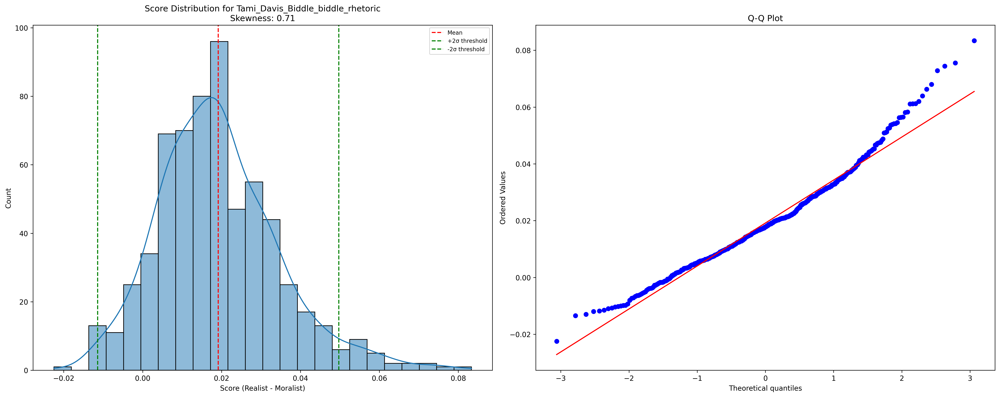
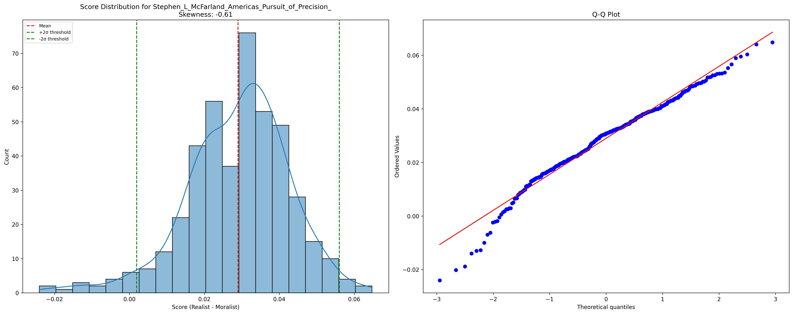
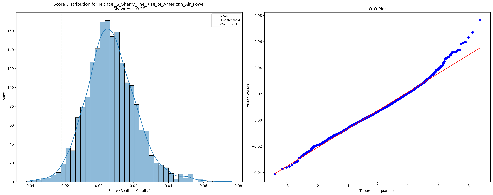

# Bombs and Popular Fury: A Computational and Sociological Analysis of the American World War II Strategic Bombing Campaign

# Statement of Purpose
There are currently two competing narratives on the the shift of strategic bombing from precision to area bombing over the course of the Second World War. One presents it as a natural development from the naivete of precision, or "pinpoint," bombing to a more realistic and battle-tested approach of more generalized area bombing. This we call the "Realist" narrative. The other presents the shift to area bombing as the inevitable result of bellicose military leaders who were willing to do anything to accomplish their objectives and sees precision bombing as a mere public relations front to cover up the true intentions of the bombing campaign. This we call the "Moralist" narrative.

This thesis will attempt to both discredit and synthesize these two narratives. After a brief overview of the literature from both perspectives, we will begin with an analysis of the effectiveness of precision bombing *vis a vis* area bombing. We will utilize raw attack data from the US Strategic Bombing Survey (USSBS) to display the persistance of precision bombing late into the war, diminishing the narrative of a blanket shift to area bombing. Reports from the US Strategic Bombing Survey will substantiate the claim that these late-war precision attacks were the decisive factor in Allied military victory while area bombing and even the land invasion had fairly little (at least economic) effect. We will then back up this *post facto* analysis with the presentation of an *a priori* theory for the effectiveness of precision bombing and the relative ineffectiveness of area bombing.

Knowing the effectiveness of precision bombing over area bombing, we will then question why the Allies persisted in applying area bombing as much as they did late into the war and raise doubts as to whether the true objective of the Allied bombing campaign was to weaken the German war-making capacity while minimizing civilian casualties. To this question we will then apply a theory of the state and war-making as presented by the likes of Hans-Herrmann Hoppe that describe the sociological process by which the modern state shifted towards a form of total war that was not just economic in nature but sought to eliminate every vertex of the enemy's Clausewitzian triangle: its popular passion, its political will, and its military leadership. We argue that the driving force behind the wanton destructiveness of the Allied area bombings was not the military cadre alone or even primarily, but instead was the natural result of the left edge of Clausewitz's triangle—popular passion and governmental will—becoming both overzealous in its ability to destroy and impatient for an end to the war. Destruction—of the enemy materiel, its political entities, its infrastructure, and even its population—became the means by which the Allies sought to achieve swift and total victory. 

This thesis is not unique in its criticism of area bombing during World War II, nor in identifying popular sentiment as a driving force behind the Allied bombing campaign's most destructive elements. However, it diverges from conventional interpretations in both its synthesis and conclusions. While many scholars use the shift to area bombing as evidence of warfare's inherently destructive nature—and thus argue for the general avoidance of war—this thesis reaches a different conclusion. Rather than condemning war itself, it identifies the inclusion of popular passion in warmaking as the fundamental problem. It argues that precision bombing doctrine represented a step toward a more rational and civilized approach to warfare, one that was ultimately overwhelmed by the fury of the *demos* and totalitarian impulses.

# Review of the Literature
First, in order to avoid confusion, it is necessary to define strategic bombing, precision bombing, and area bombing. 
1. Precision bombing refers to the targeting of specific nodes in the enemy's economic network, such as factories, transportation hubs, and oil refineries. The goal of this strategy is to neutralize the enemy's war-making capacity by destroying these key nodes.
2. Area bombing, on the other hand, refers to the bombing of a large area, typically a city or industrial area, with the aim of destroying it, its infrastructure, and portions of its workforce. The goal of this strategy is to disrupt economic production and weaken the morale of the civilian population.
3. Strategic bombing refers to the overall campaign, which may include precision bombing, area bombing or both.

As stated previously, we have divided the literature into two categories: the "Realist" and the "Moralist." These categories are neither exhaustive nor mutually exclusive. No one author fits neatly into one category or the other. They are meant merely to provide a framework for comprehension of both reader and author. 

We begin with the Realist perspective. The main argument of the Realist perspective is that the theory of precision, otherwise known as "pinpoint," bombing, developed at Maxwell Air Force Base in Alabama over the decade preceding WWII, was not applicable under real-world wartime conditions. The pre-war theorists, so the idea goes, had approached strategic bombing too simplistically, viewing it merely as a targeting problem while failing to account for the complex military intelligence network required or the various frictions of war such as weather, maintenance, training, ordinance, and aircraft capabilities. As [Griffith (1994)](./corpora/griffith_hansell/chunks/griffith_hansell_0031.txt) notes, "Only operational experience in combat would reveal many of the problems strategic bombers would face. Once World War II had begun the strategic air war took on a dynamic driven by existing technology and actual combat conditions, not by a preconceived air war doctrine." The reality of warfare meant that "technology and friction became the masters, not the servant of strategic bombing practices," leading to a significant departure from pre-war theoretical frameworks.

The technical and operational challenges of precision bombing proved to be far more daunting than pre-war theorists had anticipated. As [McFarland (1995)](./corpora/mcfarland_pursuit/chunks/mcfarland_pursuit_0001.txt) reveals, even with sophisticated equipment like the Norden bombsight, accuracy remained elusive: "one study in 1944 concluded that only 7 percent of all American bombs fell within 1,000 feet of their aiming point." Others like [Beagle (2001)](./corpora/beagle_pointblank/chunks/beagle_pointblank_0007.txt) cite a more generous study, noting that "over the duration of the Second World War, only about 20 percent of the bombs aimed at targets designated for precision attack fell within 1,000 feet of their aim point."[^1]

The unescorted bomber doctrine proved particularly costly. [Builder (1994)](./corpora/builder_icarus/chunks/builder_icarus_0107.txt) explains that "The invincibility of the unescorted bomber formation was an article of faith; Flying Fortress was no idle choice of name for the B-17." This faith would be shattered by reality - as demonstrated by the devastating Schweinfurt and Regensburg raids of 1943, which saw loss rates as high as 20½ percent. Beyond the technical challenges of accuracy and survivability, [Kennett (1982)](./corpora/kennett_history/chunks/kennett_history_0128.txt) emphasizes that "precision bombing would almost certainly be daylight bombing, which meant that the bomber would need speed, armament, or both for its own defense," which created an almost impossible operational challenge for both the engineering of the bombers and crews that flew them.[^2]

The sheer scale required for "precision" attacks further undermined their practicality. According to [Beagle (2001)](./corpora/beagle_pointblank/chunks/beagle_pointblank_0007.txt), even after achieving air superiority in 1944, a precision bombing mission against a single target required approximately 1,000 aircraft. Moreover, "the minimum bomb pattern bombers could deliver was typically larger than the area of the industrial plant being targeted," making precise targeting of specific components within facilities essentially impossible. These limitations meant that bombing campaigns against specific target sets like ball bearing production, aircraft manufacturing, or transportation infrastructure required months of sustained operations, allowing other target sets time to recover and demonstrating the resilience of the German war economy.

The narrative of the operational hazards of precision bombing typically climaxes with the notorious Schweinfurt raids. Schweinfurt was designated as a target because of the concentration of ball bearing production there, producing an estimated half of these mechanical devices essential to the functioning of automotive engines and industrial machinery. As [Biddle (2002)](./corpora/biddle_rhetoric/chunks/biddle_rhetoric_0366.txt) recounts, the first raid on August 17, 1943, celebrating the anniversary of U.S. operations in Europe, led to the loss of 16% of the bombers, but this high cost did not prevent a second assault. The October 14 mission, however, was disastrous: "Of the 291 bombers dispatched, 198 of them were shot down or damaged." This raid finally shattered the "theory of the self-defending bomber," revealing the limitations of the doctrine that had justified unescorted bombing operations.

The failure to achieve strategic objectives at Schweinfurt exposed flaws in the precision bombing campaign, exacerbated by overestimation of the bombers' self-defense capabilities. According to [Murray (1983)](./corpora/murray_defeat/chunks/murray_defeat_0269.txt), “The conduct of the Schweinfurt/Regensburg attack…reflects an overestimation of both the accuracy and effectiveness of bombing,” a realization made more acute by "the heavy losses that American bombers suffered…reflecting the insufficient range of escorting fighters." [Haun (2019)](./corpora/haun_lectures/chunks/haun_lectures_0263.txt) underscores the unsustainable attrition rates, noting that “Eighth Air Force sacrificed 60 of 291 B-17s at an unsustainable attrition rate of 20.7 percent” during the October raid, which “curtailed US efforts to conduct unescorted high-altitude daylight precision bombing against Germany.”[^3]

These operational challenges and especially the heavy losses during the Schweinfurt raids are employed to provide a rationale for the shift if not towards area bombing than at least away from precision bombing. To explain the shift towards area bombing there are both technical and theoretical arguments that have been put forth. The former describes the development of incendiary bomb technology as the driver of the allied approach to war. As [Knell (2003)](./corpora/knell_city/chunks/knell_city_0057.txt) notes, "The fire raid using a mixture of H.E. and incendiary bombs and causing firestorms proved the ultimate answer," with these tactics being "practiced first by the Luftwaffe over Britain starting in September 1940, experimented with and developed further by RAF Bomber Command from 1942 onward." The devastating effectiveness of these tactics was demonstrated during the Hamburg raids of July 1943, where, according to [Crane (2016)](./corpora/crane_bombs/chunks/crane_bombs_0202.txt), "Approximately 45,000 people had died... the vast majority from the devastating RAF firestorm of the night of 27 July, the first such conflagration caused by bombing." The impact was so severe that even American commanders like General Eaker were impressed, believing that "the fear of another Hamburg 'apparently has the Germans in a great dither,'" and wanted to exploit this psychological advantage with similar attacks on Berlin.

[Overy (2020)](./corpora/overy_airwar/chunks/overy_airwar_0294.txt) explains that while "large high-explosive bombs were better suited for precision attacks," it was "the growing evidence of how effective fire-bombs were, which came about with the switch to area bombing, that encouraged the RAF to place greater emphasis on them." The technical advantages of area bombing with incendiaries were further enhanced by the development of new techniques, including "the use of high explosive bombs to seal off a section of a city into which the fire-bombs were to be aimed," which "enormously increased the destructive power of the conventional bomb attack."

This technological argument is supplemented by several theoretical arguments justifying the shift to area bombing. The first stems from the claim that Germany had initiated city attacks, thereby setting the precedent. As [Garrett (1993)](./corpora/garrett_ethics/chunks/garrett_ethics_0025.txt) notes, "the Germans had after all initiated city attacks-first with the bombing of Warsaw, then the assault on Rotterdam in May 1940 (which was said to have caused 30,000 fatalities), and finally with the blitz on Britain itself." The Blitz campaign against Britain is often emphasized, with "50,000 tons of bombs [having been] dropped on British cities, which led to about 40,000 civilian" casualties.

A second theoretical justification arose from the concept of total war, which blurred traditional distinctions between combatants and civilians. As [Garrett (1993)](./corpora/garrett_ethics/chunks/garrett_ethics_0300.txt) explains, total war "involves not just the complete mobilization of the resources of the state for military purposes but also the blurring, if not evaporation, of any distinction between the home front and the battle front." This concept was articulated as early as 1921 by the British Naval Staff, who stated that "modern war resolves itself into an attempt to throttle the national life" with the ultimate object being "to bring pressure on the mass of the enemy people, distressing them by every possible means, so as to compel the enemy's government to submit to terms."[^4]

This blurring of lines between civilian and military targets was further justified by the argument that industrial workers were legitimate military targets. [Buckley (1999)](./corpora/buckley_total/chunks/buckley_total_0010.txt) poses the question: "Why would those organizing and supporting the war effort in Germany be less of a legitimate target than soldiers fighting at the front, especially in an age when most soldiers are conscripts and may have been indifferent supporters of or even hostile to the Nazi regime?" The argument extended to the claim that those who "build and manufacture the weapons of total war" were as culpable as those who used them.[^5]

This targeting of civilian workers was given theoretical cover through careful rhetorical framing. As [Bellamy (2012)](./corpora/bellamy_terror/chunks/bellamy_terror_0006.txt) notes, while acknowledging it was "contrary to the dictates of humanity [to engage in] the indiscriminate bombing of a city for the sole purpose of terrorising the civilian population," military leaders like Hugh Trenchard (RAF) argued that since "a state's industrial capacity determined its ability to wage war, bombing aimed at 'dehousing' factory workers was legitimate." The resulting civilian casualties were characterized as an "inevitable result of a lawful operation of war" - an unintended but "not unhelpful byproduct."

Finally, these various justifications were ultimately supported by the pragmatic argument that area bombing was effective and helped bring the war to a swift conclusion. As [Buckley (1999)](./corpora/buckley_total/chunks/buckley_total_0008.txt) argues, "the conduct of war throughout history has been influenced less by morality and more by military capability, balanced by political acceptability." In total war environments, "both the stakes and the military capability have been high, resulting in the use of previously unparalleled methods of waging war." The key factor became simply whether a strategy would "allow you to win and bring the war to a speedy conclusion."[^5.5]

[Werrell (2009)](./corpora/werrell_death/chunks/werrell_death_0242.txt) utilizes a combination of the above arguments to joust with the "Moralist" narrative directly, questioning the very premise of civilian innocence in modern warfare. He asks provocatively: "are all civilians innocent? Certainly babies are. But are war workers, be they men, women, or even children? Are those who support the war with their labor, taxes, voices, and votes innocent?" He further contextualizes the moral debate by comparing strategic bombing casualties to other forms of warfare, noting that while "Strategic bombing in World War II probably killed at least 600,000," the World War I Allied blockade "starved to death 800,000, certainly mostly women, children, and old men." His conclusion is that "the great evil is not strategic bombing but war itself."

The Realist perspective therefore may be summed up as follows: War has an inherent tendency toward escalation and brutality, as articulated by Clausewitz's observation that "war is an act of force which theoretically can have no limits" [Garrett 1993](./corpora/garrett_ethics/chunks/garrett_ethics_0198.txt). The shift from precision to area bombing was not driven by malice or bloodlust, but rather by what [Garrett 1993](./corpora/garrett_ethics/chunks/garrett_ethics_0306.txt) describes as "the tendency in war, and particularly in total war, of military operations escalating to the use of all conceivable means." As Clausewitz argued, attempts to place "philanthropic" limits on warfare are futile and even dangerous - "the mistakes which come from kindness can be the very worst" [Garrett 1993](./corpora/garrett_ethics/chunks/garrett_ethics_0198.txt). This escalation was further driven by technological advancement - as [Garrett 1993](./corpora/garrett_ethics/chunks/garrett_ethics_0306.txt) notes, "Because the technology was there, it proved well-nigh irresistible to employ it." The development of new technologies, the emergence of total societal mobilization, and operational necessities all pushed strategic bombing toward ever more destructive forms. Since the war itself was deemed just and necessary, the means required to end it - including area bombing - were seen as regrettable but ultimately justified by the imperative of victory.

The Moralist perspective contends that the distinction between precision and area bombing was largely rhetorical—a facade maintained to obscure the truly destructive and immoral nature of strategic bombing. [Sherry (1987)](./corpora/sherry_armageddon/chunks/sherry_armageddon_0298.txt) notes that while "much was made about a distinction between British night bombing to terrorize German cities and American daylight precision bombing designed to immobilize the enemy's war-making capacity," this distinction "had never been clearly drawn in American doctrine." Indeed, as early as 1926, the Air Corps doctrine described air attack as "a method of imposing will by terrorizing the whole population... while conserving life and property to the greatest extent." While references to "terrorizing" were later discretely dropped, the underlying intent remained.[^6]

The evidence of this duplicity, the Moralists argue, can be found in the actual conduct of the bombing campaign. [Downes (2008)](./corpora/downes_strategic/chunks/downes_strategic_0005.txt) points out that "The U.S. Army Air Forces during World War II launched seventy self-described attacks on a 'city area' in Germany," and devoted "about half of their total effort to radar bombing, which—although not purposefully directed at civilians—American military officers knew was the functional equivalent of British area bombing." The choice of weapons further betrays this intent: American commanders used "a large percentage of incendiary bombs (the preferred weapon against cities) on these raids even though such bombs were ineffective against rail yards, the official targets."

[Maier (2005)](./corpora/maier_city/chunks/maier_city_0011.txt) describes how the U.S. "clung to shrouding large-scale bombing with particular industrial or strategic objectives," even as the logic of bombing shifted from precision to pure destruction. By the end of the war, the justification had evolved from targeting specific military objectives to a broader theory that "the more destruction there was, the sooner the collapse would come." This evolution was not a response to operational necessity but rather the revelation of bombing's true purpose.[^7]

Vengeance and emotion, this perspective argues, rather than military necessity, were the true drivers behind the strategic bombing campaign. This narrative, most notably advocated by Michael Sherry, points to the rhetoric surrounding bombing campaigns as evidence. As [Sherry (1987)](./corpora/sherry_armageddon/chunks/sherry_armageddon_0747.txt) documents, public discourse was filled with emotional calls for "socking the rapacious German nation" and "repayment for Nazi crimes" - language that betrayed motivations far removed from rational military calculus.[^8]

This emotional drive for vengeance was enabled by what Sherry terms "amoral technicians" within the military bureaucracy. [Sherry (1987)](./corpora/sherry_armageddon/chunks/sherry_armageddon_1300.txt) describes how "airmen placed operational considerations first and said little about the enemy, rarely employing the rhetoric of vengeance found elsewhere." Through this technical, methodological approach, "the air force could serve as a vehicle of vengeance while confining itself to the problems of technique." The result was a kind of moral abdication where military leaders became "instruments of a nation's anger in which they had no particular investment."

This combination of public bloodlust and bureaucratic amorality created what [Downes (2008)](./corpora/downes_strategic/chunks/downes_strategic_0121.txt) describes as an erosion of moral restraint. When "conflicting doctrines and policies clashed, they were judged by the pragmatic test of military efficacy and the degree to which they would contribute to victory. Moral and political considerations were secondary." This prioritization of military victory above all else led to what Barton Bernstein calls a "redefinition of morality" that ultimately enabled the use of atomic weapons, as "by 1945, there were few moral restraints left in what had become virtually a total war."

The moral justification offered for this escalation was, according to [Sherry (1987)](./corpora/sherry_armageddon/chunks/sherry_armageddon_0757.txt), dangerously open-ended. While Americans "acknowledged the widespread killing of civilians, accepted their innocence, labeled their killing murder," they then "designated it as justifiable homicide, as the only recourse if victory were to be secured and Allied casualties minimized." Yet as Sherry points out, few could plausibly argue that American survival itself was at stake. Rather, "they meant the requirements of victory, total victory at that, and with minimum suffering and loss for the victors." This reasoning "could justify almost any action that accelerated triumph."[^9]

[Maier (2005)](./corpora/maier_city/chunks/maier_city_0000.txt) adds that this moral progression—from accepting collateral damage, to area bombing, to atomic weapons—has been difficult to critically examine due to two "twin inhibitions": "the reluctance of German commentators to seem apologetic for the Third Reich, and the difficulty in the U.S. of seeming to cast any aspersions on those who fought 'the good war.'" This framing of World War II as "the good war" has made it particularly challenging to critically examine the ethics of Allied bombing campaigns.

Moralists have also argued that total war actually elongates rather than shortens conflict. The French Catholic philosopher Jacques Maritain, as cited by [Sherry (1987)](./corpora/sherry_armageddon/chunks/sherry_armageddon_0396.txt), argued that "terror and total war prolonged war. They defeated the very end of victory by arousing resistance, and they poisoned the peace thereafter as well." Maritain proposed a utilitarian standard: "Whatever was unnecessary for victory... was 'bestiality.'" While this standard could be manipulated to justify extreme measures if they could be plausibly linked to victory, it at least provided a framework for restraint that appealed to practical interests rather than "unenforceable rules of international law or flimsy consciences."

This argument about the counterproductive nature of total war is supported by evidence that the war never truly reached the theoretical extremes of "total war." As [Hansen (2008)](./corpora/hansen_fury/chunks/hansen_fury_0372.txt) points out, even during the Allied invasion of Germany, armies "did not—as total war would predict—go from house to house spraying civilians with machine-gun fire. On the contrary, they took every reasonable effort to minimize civilian casualties." This suggests that the war "did not—as some would have it—entirely erase the distinction between a soldier and a citizen (though it may have blurred it)." While Hansen acknowledges that Germany's defeat was "both a geopolitical and a moral necessity," he argues that "none of this can justify the degree of death and destruction meted out."[^10]

The moral calculus used to justify civilian casualties was particularly problematic. [Garrett (1993)](./corpora/garrett_ethics/chunks/garrett_ethics_0228.txt) critiques Bomber Harris's notorious statement that he did not "regard the whole of the remaining cities of Germany as worth the bones of one British Grenadier." Garrett argues that while governments have a "perfect obligation" to protect their own soldiers and civilians, they retain "imperfect" but real duties to enemy civilians, "the assumption being that all individual human beings have certain rights that continue to obtain even in the midst of war."[^11]

The Moralist critique ultimately extends beyond specific tactics to challenge fundamental assumptions about the nature of war itself. [Fuller (1961)](./corpora/fuller_conduct/chunks/fuller_conduct_0245.txt) illuminates a crucial philosophical divide between two conceptions of warfare. The Clausewitzian view maintains that "morality, as understood by civilized peoples, was a factor in social life," seeing war as an extension of politics bound by societal values and ethical constraints. Lenin's more radical critique strips away this civilized veneer, reducing war to "a purely animal struggle in which no punches were barred." His declaration that "We repudiate all morality derived from non-human and non-class concepts... We do not believe in an eternal morality" represents not just a rejection of traditional military ethics, but an unmasking of what the Moralists see as warfare's true nature.

This perspective suggests that the escalation to area bombing reveals the fundamental truth of Lenin's analysis—that beneath the rhetoric of precision and military necessity lies the inherently barbaric nature of modern warfare. The bureaucratic machinery of strategic bombing, with its technical language and cold calculations, served merely as what Lenin would recognize as "a deception, a fraud in the interests of the landlords and capitalists." The precision bombing doctrine, in this view, was less a genuine military innovation than a moral fig leaf, designed to obscure warfare's descent into unrestricted violence. The Moralist critique thus sees the strategic bombing campaign not as an aberration but as the inevitable unmasking of war's true character: an "animal struggle" that necessarily tends toward total destruction once its civilized pretenses are abandoned.[^12]

To better understand the distribution of these perspectives within the literature, we conducted a computational analysis of the texts using natural language processing techniques. Each source text was divided into meaningful chunks and processed using OpenAI's text-embedding-ada-002 model to generate vector representations.[^13] These embeddings were then compared against two carefully curated sets of statements representing the Realist and Moralist positions. The Realist statements encompassed arguments about operational necessity, technological limitations, and military pragmatism (e.g., "Precision bombing was largely ineffective due to technological limitations" and "The effectiveness of area bombing in hastening victory justifies its use over less effective methods"), while the Moralist statements captured ethical critiques and concerns about strategic bombing's moral implications (e.g., "The shift from precision to indiscriminate bombing was not due to necessity but reflected an immoral strategy" and "Emotional vengeance, not military necessity, motivated strategic bombing").[^14]

The resulting analysis reveals a notable skew toward the Realist perspective across our sample of strategic bombing literature (Figure 1). This bias manifests not only in the aggregate but is particularly visible in individual authors' distributions. For instance, Tami Davis Biddle's work shows a characteristic S-shaped pattern in its Q-Q plot, indicating a systematic bias toward Realist arguments (Figure 2). Conversely, Stephen L. McFarland's "America's Pursuit of Precision Bombing" demonstrates a more Moralist-leaning perspective, with a pronounced negative skew in its distribution (Figure 3).[^15]

This computational analysis helps illuminate several important aspects of the strategic bombing literature. First, it suggests that the Realist perspective, with its focus on operational and technological constraints, dominates the scholarly discourse. While this could reflect the inherent strength of the Realist position, it may also indicate a historiographical bias toward military and operational histories over moral and ethical analyses. Second, the relative scarcity of strong Moralist positions might partly stem from the extremity of our Moralist statement set, which perhaps represents a more radical critique than typically found in academic literature.[^16]

A particularly interesting case emerges in Michael Sherry's "The Rise of American Air Power," which we initially drew upon heavily for the Moralist perspective. Our analysis shows that Sherry's work actually exhibits a more nuanced distribution, with significant representation in both camps (Figure 4). This suggests either that our initial reading was overly selective, focusing on his most pointed moral critiques while overlooking more balanced operational analysis, or that our computational method may not fully capture the subtleties of his argument.[^17]

[^1]: For more information on bombing accuracy, see: [Crane 2016](./corpora/crane_bombs/chunks/crane_bombs_0147.txt) emphasizes that while American airpower had confidence in the Norden bombsight, the anticipated precision was hard to achieve, with only about 14% of bombs landing within 1,000 feet of their targets during early 1943. [McFarland 1995](./corpora/mcfarland_pursuit/chunks/mcfarland_pursuit_0251.txt) discusses the challenges that altitude and large bombing formations posed to accuracy, noting that bomb patterns became increasingly imprecise as formation size and altitude increased. [Parks 1945](./corpora/parks_preciscion/chunks/parks_preciscion_0005.txt) describes how 'bombing on leader' formations, adopted for practical reasons, led to larger bombing patterns and a lower level of accuracy than originally anticipated for precision bombing.

[^2]: For more information on the challenges and assumptions surrounding bomber escort and self-defense capabilities, see: [Biddle 2002](./corpora/biddle_rhetoric/chunks/biddle_rhetoric_0272.txt) examines how American planners believed in the viability of the "self-defending" bomber, relying on speed, altitude, and armament for unescorted penetration. This view persisted despite underlying doubts and logistical challenges, until wartime experience revealed its flaws. [Werrell 2009](./corpora/werrell_death/chunks/werrell_death_0062.txt) discusses how American bomber advocates underestimated the need for escorts, firmly believing in the superiority of bombers in mutual defense formations, and failing to predict advancements in defensive technology, such as radar. [Hecks 1990](./corpora/hecks_bombing/chunks/hecks_bombing_0126.txt) details the early struggles with the B-17, noting that inadequate armament and harsh European weather conditions led to high losses, showing that unescorted bombers faced significant operational challenges.

[^3]: [Werrell 2009](./corpora/werrell_death/chunks/werrell_death_0175.txt) details the severe costs of the Schweinfurt raid, stating that "does not inflict decisive damage, cannot be followed up, and merits the award of five of the nation's highest decoration deserves sharp criticism." [Kohn 1988](./corpora/interview_strategic/chunks/interview_strategic_0035.txt) includes firsthand account from Leon Johnson (one of the first four flying officers in the 8th Air Force) describing the Schweinfurt missions as "one of the most hazardous missions in the whole war," underscoring the intense five-hour battles fought over Schweinfurt. Additionally, [Crane 2016](./corpora/crane_bombs/chunks/crane_bombs_0017.txt) argues that while precision bombing was initially seen as both efficient and humane, the pressures of war and technological limitations led commanders to prioritize military objectives over moral considerations. As he notes, "once LeMay became convinced that pinpoint tactics were no longer effective, morality alone was not enough to prevent the firebombing of Tokyo." The growing pressure to end an increasingly bloody war, combined with vast fleets of bombers that "could not just sit idle, despite poor weather," pushed commanders toward more destructive tactics.

[^4]: [Lucien (1971)](./corpora/lucien_pinpoint/chunks/lucien_pinpoint_0036.txt) cites Donald Wilson (USAF General) who stated that "Modern industrial nations are susceptible to defeat by interruption of this web" and that "morale collapse brought about by the breaking of this closely knit web will be sufficient."

[^5]: The argument about civilian culpability was further developed by [Garrett (1993)](./corpora/garrett_ethics/chunks/garrett_ethics_0300.txt) who noted that airpower made it "possible to wage war not just on the enemy's soldiers but on the society supporting them," leading to what one authority called "a crisis in the law of war, and a process of barbarization such as had not been seen in Europe since the second half of the seventeenth century." The rhetoric used here, however, might be categorized in the "Moralist" camp.

[^5.5]: [Crane 2016](./corpora/crane_bombs/chunks/crane_bombs_0018.txt) explains that the overriding objective was winning the war quickly and efficiently with minimal American casualties, which often prevented morality from being an "overriding criterion." He notes that while some planners took comfort in proposals that would minimize civilian casualties, the need for Allied cooperation led the US to mute ethical arguments since Britain strongly supported attacking civilian morale. The Americans wanted to avoid causing rifts with their allies or aiding German propaganda.

[^6]: The evolution of this doctrine is traced by [Buckley (1999)](./corpora/buckley_total/chunks/buckley_total_0009.txt) who notes that during WWI, bombing strategy "accepted that inaccurate bombs would hit and kill civilians and this was acceptable because it would damage enemy morale." While this targeting of civilians "declined as a strategy in the 1930s," it "re-emerged during the Second World War in the RAF once it proved impossible to bomb anything accurately." [Maier (2005)](./corpora/maier_city/chunks/maier_city_0009.txt) describes how early in the war, the British moved to define "collateral damage" as an updated version of the medieval just-war doctrine of "double effect" - if civilians were killed while pursuing legitimate military objectives, this was acceptable as long as care was taken to minimize casualties and observe proportionality.

[^7]: This interpretation is supported by [Sherry (1987)](./corpora/sherry_armageddon/chunks/sherry_armageddon_0298.txt) who notes that "In the 1930s, Americans never decisively opted for the enemy's war-making capacity as their objective. They proposed to attack the enemy's will, only by more humane and economical methods." The distinction between attacking war-making capacity and civilian will was thus blurred from the beginning.

[^8]: The emotional nature of public discourse around bombing is further evidenced by [Sherry (1987)](./corpora/sherry_armageddon/chunks/sherry_armageddon_0747.txt) who notes that when Vera Brittain published a critique of bombing in 1944, the responses revealed "the mood of vengeance usually shrouded by utilitarian arguments for bombing."

[^9]: The casualness of moral debate around bombing is particularly striking. [Sherry (1987)](./corpora/sherry_armageddon/chunks/sherry_armageddon_0757.txt) attributes this not just to "moral laziness" but to the circumstances of air war itself: "Americans entered the war with little tradition of realistic debate about air power to draw upon... journalists and politicians were ill-equipped or disinclined to raise moral issues."

[^10]: Hansen's argument about the limits of total war is particularly significant as it challenges both the necessity and inevitability of area bombing. He argues that "Moral clarity has two sides to it: it gives the Allied war aims moral purpose and it defines the limits within which those aims are pursued."

[^11]: Garrett develops this argument further, explaining that moral reasoning requires "universalization," meaning decisions must consider "the interests and rights of all affected parties." He argues that "The mere fact that a state of war exists does not remove the legitimate claims of enemy civilians for a reasonable chance to go on living."

[^12]: This interpretation helps explain why, as [Sherry (1987)](./corpora/sherry_armageddon/chunks/sherry_armageddon_0757.txt) noted earlier, moral debates about bombing remained "casual" despite their gravity. If war itself is seen as inherently immoral, then debates about specific tactics become merely technical rather than ethical questions.

[^13]: The technical implementation can be found in [`get_similarity_scores.py`](./scripts/literature_review/get_similarity_scores.py) and [`calc_and_visualize.py`](./scripts/literature_review/calc_and_visualize.py). The embedding process converts text into high-dimensional vectors that capture semantic relationships, allowing for quantitative comparison of textual similarity. Each chunk's embedding is compared against both Realist and Moralist statement sets using cosine similarity. The maximum cosine similarity value is then taken from each set and subtracted from each other to generate a relative position score on the spectrum of Moralist to Realist. Most values are close to zero, because the general context and semantics of the statements are similar.

[^14]: The statement sets were carefully constructed to represent the core arguments of each perspective, with 15 Realist statements and 13 Moralist statements. The full statement sets are available in [`get_similarity_scores.py`](./scripts/literature_review/get_similarity_scores.py). The relative scoring between -1 (most Moralist) and +1 (most Realist) allows for nuanced positioning of each text chunk along the ideological spectrum.

[^15]: Statistical significance was assessed using skewness tests (scipy.stats.skewtest), with p < 0.05 indicating significant deviation from normal distribution. The visualization methodology employs both histogram distributions and Q-Q plots to reveal patterns in the data. Red bars in Figure 1 indicate statistically significant skewness.

[^16]: Our sample includes over 60 major works on strategic bombing, representing approximately 30,000 text chunks and 9.8 million words. While not exhaustive, this corpus encompasses most of the seminal works in the field and provides a reasonable representation of the scholarly literature.

[^17]: The analysis of Sherry's work shows a skewness of 0.234 with a p-value of 0.041, indicating a slight but statistically significant lean toward the Realist perspective, despite his reputation for moral critique. This highlights the importance of quantitative analysis in challenging our qualitative impressions of historical texts.

## Research plan

This research will proceed along four complementary tracks, combining empirical analysis, theoretical modeling, computational linguistics, and sociological theory to examine the strategic bombing campaign of World War II.

### 1. Analysis of USSBS Attack Data

The first component involves a detailed analysis of the United States Strategic Bombing Survey (USSBS) attack data, which I have digitized into a comprehensive dataset. This data includes:
- Complete record of RAF and USAAF bombing missions
- Target coordinates and categories
- Detailed ordnance information (bomb types, fuzing, and tonnage)
- Temporal distribution of attacks

The analysis will focus particularly on:
a) Classification of attacks into precision, area, and tactical bombing categories based on:
   - Ordnance selection (high explosive vs. incendiary)
   - Fuze settings
   - Target type
   - Formation patterns
b) Quantitative analysis of:
   - Relative proportion of precision vs. area bombing over time
   - Geographic distribution of attack types
   - Correlation between target type and ordnance selection
   - Persistence of precision bombing techniques through 1945

This empirical analysis will challenge the conventional narrative of a wholesale shift to area bombing, demonstrating instead a continued commitment to precision bombing throughout the war.[^18]

### 2. Economic Network Simulation

The second track involves developing a computer simulation to provide theoretical validation of precision bombing's superior effectiveness. The simulation will model:
a) A network representation of an industrial economy where:
   - Nodes represent factories, power plants, and transportation hubs
   - Edges represent resource flows and dependencies
   - Workers are distributed across nodes
b) Impact analysis of different bombing strategies:
   - Precision bombing (targeted node removal)
   - Area bombing (distributed worker reduction)
   - Mixed strategies
c) Measurement of:
   - Production capacity over time
   - Network resilience
   - Recovery patterns
   - Resource allocation efficiency

The simulation will incorporate historical parameters from the German war economy to ensure relevance to the actual strategic bombing campaign.

### 3. Public Opinion Analysis

The third component employs computational linguistics to analyze public discourse around strategic bombing. The research will examine:
a) A corpus of over 10,000 newspaper articles (1941-1946) containing "strategic bombing" and related terms
b) Semantic analysis using:
   - Vector embeddings of relevant passages
   - Comparison with precision/area bombing concept vectors
   - Temporal trend analysis
c) Measurement of:
   - Evolution of bombing-related terminology
   - Shift in moral framing
   - Changes in technical vs. emotional content
   - Geographic and political variations in coverage

This analysis will quantify the public's growing enthusiasm for area bombing and its potential influence on military strategy.

### 4. Analysis of USSBS Reports and Interrogations

The fourth track incorporates qualitative analysis of digitized USSBS reports and interrogation transcripts to provide detailed insight into the relative effectiveness of precision versus area bombing strategies. This analysis will examine:

a) Industry-specific USSBS reports including:
   - Oil and chemical production
   - Aircraft and armaments manufacturing
   - Transportation systems
   - Utilities

b) Key interrogation transcripts, including:
   - Albert Speer's detailed accounts of industrial adaptation
   - Factory managers' descriptions of production disruption
   - Military leaders' assessments of strategic impact
   - Economic planners' discussions of resource allocation

This documentary analysis will complement the quantitative attack data by providing detailed ground-truth assessment of bombing impacts, as well as the informed perspectives of key leaders of the Nazi war economy. Of particular value are Speer's candid post-war assessments of which attacks proved most devastating to German war production.

### 5. Theoretical Framework

The final track involves applying relevant sociological and economic theories to interpret the empirical findings, particularly:
a) Hans-Hermann Hoppe's analysis of:
   - Democratic warfare
   - State monopoly on violence
   - Total war dynamics
b) Ludwig von Mises's theories on:
   - Interventionism
   - War economics
   - Bureaucratic management
c) William Aylott Orton's work on:
   - Liberal democracy
   - Total war transformation
   - Civilian mobilization

This theoretical framework will help explain why, despite precision bombing's superior effectiveness, area bombing remained prevalent.

[^18]: Each mission record contains 27 distinct data fields, including target coordinates, bomb types, fuzing details, sighting assessment, and number of sorties. This granular data allows for sophisticated statistical analysis of bombing patterns and effectiveness.

# Proposed table of contents

## Abstract

## Chapter 1: Introduction
- ### 1.1 Background and Context
- ### 1.2 Purpose of the Study
- ### 1.3 Research Questions and Objectives
- ### 1.4 Significance of the Study
- ### 1.5 Structure of the Thesis

## Chapter 2: Conceptual Framework
- ### 2.1 Definitions of Key Concepts
  - #### 2.1.1 Strategic Bombing
  - #### 2.1.2 Precision Bombing
  - #### 2.1.3 Area Bombing
- ### 2.2 The Clausewitzian Triangle and Total War
- ### 2.3 Theories of the State and War-Making
  - #### 2.3.1 Hans-Hermann Hoppe's Analysis
  - #### 2.3.2 Ludwig von Mises's Theories
  - #### 2.3.3 William Aylott Orton's Contributions

## Chapter 3: Literature Review
- ### 3.1 Overview of Existing Literature
- ### 3.2 The Realist Perspective
  - #### 3.2.1 Operational Challenges of Precision Bombing
    - ##### 3.2.1.1 Technological Limitations
    - ##### 3.2.1.2 Weather and Environmental Factors
    - ##### 3.2.1.3 Intelligence and Targeting Difficulties
  - #### 3.2.2 The Schweinfurt Raids Case Study
  - #### 3.2.3 Justifications for Shift to Area Bombing
    - ##### 3.2.3.1 Technological Advancements in Incendiaries
    - ##### 3.2.3.2 Total War Doctrine
    - ##### 3.2.3.3 Civilian Workers as Legitimate Targets
    - ##### 3.2.3.4 Effectiveness in Hastening Victory
- ### 3.3 The Moralist Perspective
  - #### 3.3.1 Critique of the Precision vs. Area Bombing Distinction
  - #### 3.3.2 Evidence of Intentions and Conduct
    - ##### 3.3.2.1 Rhetorical Analysis of Military Doctrine
    - ##### 3.3.2.2 Analysis of Bombing Campaigns
  - #### 3.3.3 Role of Public Sentiment and Vengeance
    - ##### 3.3.3.1 Media and Public Discourse
    - ##### 3.3.3.2 Emotional Motivations in Strategy
  - #### 3.3.4 Moral Implications and Critiques
    - ##### 3.3.4.1 Ethical Considerations in Warfare
    - ##### 3.3.4.2 Total War and Moral Restraints
- ### 3.4 Computational Analysis of the Literature
  - #### 3.4.1 Methodology
    - ##### 3.4.1.1 Text Corpus Compilation
    - ##### 3.4.1.2 Natural Language Processing Techniques
    - ##### 3.4.1.3 Statement Sets for Realist and Moralist Perspectives
  - #### 3.4.2 Findings
    - ##### 3.4.2.1 Distribution of Perspectives
    - ##### 3.4.2.2 Author-Specific Analyses
  - #### 3.4.3 Interpretation of Results
- ### 3.5 Synthesis and Critique of Both Perspectives

## Chapter 4: Research Methodology
- ### 4.1 Research Design and Approach
- ### 4.2 Data Sources
  - #### 4.2.1 USSBS Attack Data
  - #### 4.2.2 USSBS Reports and Interrogations
  - #### 4.2.3 Newspaper Corpus
- ### 4.3 Data Collection and Preparation
  - #### 4.3.1 Digitization and Data Cleaning
  - #### 4.3.2 Classification Criteria for Bombing Missions
- ### 4.4 Analytical Techniques
  - #### 4.4.1 Statistical Analysis of Bombing Data
  - #### 4.4.2 Economic Network Simulation Modeling
  - #### 4.4.3 Computational Linguistics Methods
  - #### 4.4.4 Qualitative Content Analysis
- ### 4.5 Limitations and Ethical Considerations

## Chapter 5: Empirical Analysis of Bombing Data
- ### 5.1 Classification of Bombing Missions
  - #### 5.1.1 Criteria for Precision Bombing
  - #### 5.1.2 Criteria for Area Bombing
  - #### 5.1.3 Criteria for Tactical Bombing
- ### 5.2 Quantitative Analysis of Bombing Patterns
  - #### 5.2.1 Temporal Trends
  - #### 5.2.2 Geographic Distribution
  - #### 5.2.3 Ordnance Selection and Usage
- ### 5.3 Persistence of Precision Bombing
  - #### 5.3.1 Analysis of Late-War Missions
  - #### 5.3.2 Case Studies of Successful Precision Attacks
- ### 5.4 Impact Assessment
  - #### 5.4.1 Correlation with German War Production
  - #### 5.4.2 Effectiveness in Disrupting War-Making Capacity

## Chapter 6: Economic Network Simulation
- ### 6.1 Model Development
  - #### 6.1.1 Representation of Industrial Economy
    - ##### 6.1.1.1 Node Definition (Factories, Power Plants, Hubs)
    - ##### 6.1.1.2 Edge Definition (Resource Flows)
  - #### 6.1.2 Incorporation of Workforce Distribution
  - #### 6.1.3 Historical Parameters and Assumptions
- ### 6.2 Simulation of Bombing Strategies
  - #### 6.2.1 Precision Bombing Simulation
  - #### 6.2.2 Area Bombing Simulation
  - #### 6.2.3 Mixed Strategy Simulation
- ### 6.3 Results and Analysis
  - #### 6.3.1 Production Capacity Over Time
  - #### 6.3.2 Network Resilience and Vulnerabilities
  - #### 6.3.3 Recovery Patterns Post-Attack
- ### 6.4 Discussion of Simulation Findings
  - #### 6.4.1 Implications for Bombing Strategy Effectiveness
  - #### 6.4.2 Validation Against Historical Data

## Chapter 7: Analysis of USSBS Reports and Interrogations
- ### 7.1 Industry-Specific Impact Assessments
  - #### 7.1.1 Oil and Chemical Production
  - #### 7.1.2 Aircraft and Armaments Manufacturing
  - #### 7.1.3 Transportation Systems
  - #### 7.1.4 Utilities and Infrastructure
- ### 7.2 Insights from Key Interrogations
  - #### 7.2.1 Albert Speer's Testimonies
  - #### 7.2.2 Factory Managers' Accounts
  - #### 7.2.3 Military Leaders' Assessments
  - #### 7.2.4 Economic Planners' Discussions
- ### 7.3 Synthesis of Documentary Evidence
  - #### 7.3.1 Comparing Reported Impact with Empirical Data
  - #### 7.3.2 Lessons from German Industrial Adaptations

## Chapter 8: Public Opinion and Discourse Analysis
- ### 8.1 Corpus Construction and Data Collection
  - #### 8.1.1 Selection of Newspapers and Articles
  - #### 8.1.2 Time Frame and Search Criteria
- ### 8.2 Computational Linguistics Methods
  - #### 8.2.1 Semantic Analysis Techniques
  - #### 8.2.2 Vector Embeddings and Concept Comparisons
- ### 8.3 Findings
  - #### 8.3.1 Evolution of Bombing Terminology
  - #### 8.3.2 Shifts in Moral Framing Over Time
  - #### 8.3.3 Analysis of Technical vs. Emotional Content
  - #### 8.3.4 Geographic and Political Variations in Discourse
- ### 8.4 Influence of Public Opinion on Military Strategy
  - #### 8.4.1 Correlation with Strategic Decisions
  - #### 8.4.2 Democratic Fury and War-Making

## Chapter 9: Theoretical Interpretation and Discussion
- ### 9.1 Application of Sociological and Economic Theories
  - #### 9.1.1 Hans-Hermann Hoppe's Theory of Democratic Warfare
    - ##### 9.1.1.1 State Monopoly on Violence
    - ##### 9.1.1.2 Total War Dynamics
  - #### 9.1.2 Ludwig von Mises's Theories on War Economics
    - ##### 9.1.2.1 Interventionism in Warfare
    - ##### 9.1.2.2 Bureaucratic Management and Decision-Making
  - #### 9.1.3 William Aylott Orton's Contributions on Liberal Democracy and Total War
- ### 9.2 Integration with Empirical Findings
  - #### 9.2.1 Understanding the Persistence of Area Bombing
  - #### 9.2.2 Role of Popular Passion and Governmental Will
  - #### 9.2.3 Implications for the Clausewitzian Triangle
- ### 9.3 Re-evaluating the Realist and Moralist Narratives
  - #### 9.3.1 Synthesis of Perspectives
  - #### 9.3.2 Critique of Existing Interpretations
- ### 9.4 The Inclusion of the Demos in War-Making
  - #### 9.4.1 Democratic Societies and Total War
  - #### 9.4.2 Consequences for Warfare Ethics

## Chapter 10: Conclusion
- ### 10.1 Summary of Key Findings
- ### 10.2 Contributions to Scholarship
- ### 10.3 Limitations of the Study
- ### 10.4 Recommendations for Future Research
- ### 10.5 Final Reflections on Bombing and Democratic Fury

## References

## Appendices
- ### Appendix A: Additional Data Tables and Graphs
- ### Appendix B: Simulation Parameters and Source Code
- ### Appendix C: List of Newspaper Sources and Articles
- ### Appendix D: Detailed Methodologies and Algorithms
- ### Appendix E: Glossary of Terms and Abbreviations

## List of Figures

## List of Tables

# Bibliography

## Primary Sources

Air Corps Tactical School. "Bombardment Aviation: Air Force Course, 1937-1938." Maxwell Air Force Base, AL: Air University Archives, 1937.

Eisenhower, Dwight D. *Crusade in Europe*. Garden City, NY: Doubleday & Company, 1948.

Hansell, Haywood S., Jr. "The Strategic Air War Against Germany and Japan: A Memoir." Washington, D.C.: Office of Air Force History, United States Air Force, 1986.

Harris, Sir Arthur. *Bomber Offensive*. London: Collins, 1947.

LeMay, Curtis E., Leon W. Johnson, David A. Burchinal, and Jack J. Catton. "Strategic Air Warfare: An Interview with Generals Curtis E. LeMay, Leon W. Johnson, David A. Burchinal, and Jack J. Catton." Edited by Richard H. Kohn and Joseph P. Harahan. Washington, DC: Office of Air Force History, United States Air Force, 1988.

"Newspaper Coverage of Strategic Bombing, 1941-1946." newspapers.com.

United States Strategic Bombing Survey. "Attack Data and Statistical Records." Washington, D.C., 1945. National Archives Record Group 243, Boxes 1-7.

United States Strategic Bombing Survey. "Interrogation Reports of German Officials." Washington, D.C., 1945-1947. National Archives Record Group 243, Containers 1-7, Files 2L2-2L206.

United States Strategic Bombing Survey. Industry Reports. Washington, D.C., 1945-1947. National Archives Record Group 243. Including:
- "Aircraft Industry Report." Box 47, Folder 3
- "Antifriction Bearings Industry Report." Box 57, Folder 53
- "German Oil Industry Report." Box 67, Folder 109
- "Machine Tools Industry Report." Box 57, Folder 55
- "Motor Vehicle Industry Report." Box 62, Folder 77
- "Optical and Precision Instruments Report." Box 56, Folder 50
- "Railroad Transportation Report." Box 90, Folder 200
- "Rubber Industry Report." Box 74, Folder 129
- "Tank Industry Report." Box 62, Folder 78
- "U-Boat Industry Report." Box 63, Folder 92

United States Strategic Bombing Survey. "Overall Economic Effects Report." Washington, D.C., 1945. National Archives Record Group 243, Box 75, Folder 134.

United States Strategic Bombing Survey. "Physical Damage Assessment Reports." Washington, D.C., 1945. National Archives Record Group 243, Box 75, Folder 134b.

United States Strategic Bombing Survey. "Strategic Bombing Accuracy Analysis." Washington, D.C., 1945. National Archives Record Group 243, Box 59, Folder 63.

United States Strategic Bombing Survey. "Summary Report (European War)." Washington, D.C., 1945. National Archives Record Group 243, Box 47, Folder 2.

## Secondary Sources
<!-- Note: Many of these citations are WRONG! I will go back and fix them all later. The authors as far as I know are generally correct. -->
Ballew, Brian P. *The Enemy Objectives Unit in World War II: Selecting Targets for Aerial Bombardment that Support the Political Purpose of War*. Pickle Partners Publishing.

Beagle Jr., T. W. *Effects-Based Targeting: Another Empty Promise?* Air University Press.

Bellamy, Alex J. *Massacres and Morality: Mass Atrocities in an Age of Civilian Immunity*. Oxford Scholarship Online.

Biddle, Tami Davis. "British and American Approaches to Strategic Bombing: Their Origins and Implementation in the World War II Combined Bomber Offensive."

Biddle, Tami Davis. *Rhetoric and Reality in Air Warfare: The Evolution of British and American Ideas about Strategic Bombing, 1914-1945*. 2004.

Boog, Horst, Gerhard Krebs, and Detlef Vogel. *Germany and the Second World War Volume VII: The Strategic Air War in Europe and the War in the West and East Asia, 1943-1944/5*. Oxford: Clarendon Press, 2006.

Boyne, Walter J. *The Influence of Air Power upon History*. Barnsley: Pen & Sword Books Limited, year.

Bradley, F. J. *No Strategic Targets Left*. Turner Publishing Company.

Buckley, John. *Air Power in the Age of Total War*. London: UCL Press, n.d.

Builder, Carl H. *The Icarus Syndrome: The Role of Air Power Theory in the Evolution and Fate of the U.S. Air Force*. Routledge.

Call, Steven Charles. *A People’s Air Force: Air Power and American Popular Culture, 1945-1965*. Ann Arbor, MI: UMI A Bell & Howell Information Company, 2023.

Clodfelter, Mark. "Aiming to Break Will: America's World War II Bombing of German Morale and its Ramifications." *The Journal of Strategic Studies*.

Clodfelter, Mark. *Beneficial Bombing: The Progressive Foundations of American Air Power, 1917-1945*. Lincoln: University of Nebraska Press, 2006.

Coffey, Thomas M. *Decision over Schweinfurt*. South San Francisco Public Library, Year.

Coffey, Thomas M. *HAP: The Story of the U.S. Air Force and the Man Who Built It, General Henry “Hap” Arnold.* New York: The Viking Press, 1982.

Crane, Conrad C. *American Airpower Strategy in World War II: Bombs, Cities, Civilians, and Oil.* Lawrence: University Press of Kansas, 1993.

Davis, Richard G. *Carl A. Spaatz and the Air War in Europe*. Washington, DC: Office of Air Force History, U.S. Air Force.

Delori, Mathias. "Understanding the Fragmentation of the Memory of the Allied Bombings of World War II: The Role of the United States Strategic Bombing Survey." Year Unknown.

Downes, Alexander B. *Defining and Explaining Civilian Victimization*. Ithaca: Cornell University Press.

Ehlers, Rober S. Jr. *Targeting the Third Reich: Air Intelligence and the Allied Bombing Campaigns*. Modern War Studies. Unknown Publisher, Year.

Eisenhower, Dwight D. *Rusade in Europe*. New York: Vintage Books, A Division of Penguin Random House LLC.

Foch, Ferdinand. *The Principles of War*. New York: The H. K. Fly Company, 1928.

Fuller, J. F. C. *The Conduct of War 1789–1961*. Routledge.

Fuller, Major-General John Frederick Charles. *War and Western Civilization 1832-1932*. New York: Books for Libraries Press, 1970.

Futrell, Robert Frank. *Ideas, Concepts, Doctrine: Basic Thinking in the United States Air Force.* Maxwell AFB, AL: Air University Press, [year].

Garrett, Stephen A. *Ethics and Airpower in World War II: The British Bombing of German Cities*. New York: St. Martin's Press, 1998.

Gentile, Gian P. *How Effective Is Strategic Bombing? Lessons Learned from World War II to Kosovo*. New York: New York University Press.

Gentile, Gian. *ADVOCACY OR ASSESSMENT? The United States Strategic Bombing Survey of Germany and Japan.* UMI, A Bell & Howell Information Company.

Griffith, Charles R. *The Quest: Haywood Hansell and American Strategic Bombing in World War II*. Knoxville: The University of Tennessee, 2023.

Hansell, Haywood S., Jr. *The Strategic Air War Against Germany and Japan: A Memoir*. Washington, D.C.: Office of Air Force History, United States Air Force.

Hansen, Randall. *Fire and Fury: The Allied Bombing of Germany 1942-45*. Toronto: Doubleday Canada, 2017.

Harris, Sir Arthur. *Bomber Offensive*. Unknown, Year.

Haun, Phil. *Lectures of the Air Corps Tactical School and American Strategic Bombing in World War II.* Lexington: The University Press of Kentucky.

Haysparks, W. “'Precision' and 'Area' Bombing: Who Did Which, and When?” US Army Air Forces.

Hecks, Karl. *Bombing 1939 - 1945: The Air Offensive against Land Targets in World War Two*. London: Robert Hale, 1994.

Howard, Michael. *War and the Liberal Conscience*. New York: Columbia University Press.

Howard, Michael. *War in European History*. Oxford: Oxford University Press, [Year].

Kennett, Lee. *A History of Strategic Bombing*. New York: Charles Scribner's Sons, Year.

Klubes, David Robert. *Conventional Strategic Bombing and Compellence*. UMI.

Knell, Hermann. *To Destroy a City*. New York: Da Capo Press, year.

Krippendorff, Ekkehart. *Staat und Krieg: Die historische Logik politischer Unvernunft*. Frankfurt am Main: edition suhrkamp, 2023.

LeMay, Curtis E., Leon W. Johnson, David A. Burchinal, and Jack J. Catton. *Strategic Air Warfare*. Edited by Richard H. Kohn and Joseph P. Harahan. Washington, DC: Office of Air Force History, United States Air Force.

Levine, Alan J. *The Strategic Bombing of Germany, 1940-1945*. Praeger Publishers, 2023.

Lucien M. *Strategic Bombing Campaign During World War Two: Pinpoint vs Area Bombing*. St. John’s University.

MacIsaac, David. *Strategic Bombing in World War Two: The Story of The United States Strategic Bombing Survey*. New York: Garland Publishing, Inc.

Maier, Charles S. *Targeting the City: Debates and Silences about the Aerial Bombing of World War II*. Cambridge: Cambridge Press, 2023.

McFarland, Stephen L. *America's Pursuit of Precision Bombing, 1910-1945*. Tuscaloosa: The University of Alabama Press, [year].

Meilinger, Col Phillip S.  The Paths of Heaven: The Evolution of Airpower Theory. Maxwell Air Force Base, AL: Air University Press.

Meilinger, Phillip S. *The Historiography of Airpower: Theory and Doctrine*. Unknown, Year.

Mierzejewski, Alfred C. *The Collapse of the German War Economy, 1944-1945: Allied Air Power and the German National Railway*. Chapel Hill: The University of North Carolina Press, 1990.

Mises, Ludwig von. *A Critique of Interventionism*. Arlington: Arlington House Publishers, [Year].

Morris, Lt. Col. Craig F. *The Origins of American Strategic Bombing Theory: Transforming Technology into Military Doctrine*. Auburn University, Year.

Moyn, Samuel. *Humane: How the United States Abandoned Peace and Reinvented War.* New York: Farrar, Straus and Giroux, 2021.

Murray, Williamson. *Strategy for Defeat: The Luftwaffe, 1933-1945*. Maxwell Air Force Base, Ala.: Air University Press, [n.d.].

Orton, William Aylott. *The Liberal Tradition*. New Haven: Yale University Press.

Overy, Richard J. *The Air War 1939-1945*. Plunkett Lake Press.

Overy, Richard. *The Bombers and the Bombed: Europe 1940 - 1945*. London: Penguin Books, n.d.

Pape, Robert Anthony. *Why Study Military Coercion?* Ithaca: Cornell University Press, [year].

Ross, Sheerwood. *How the United States Reversed Its Policy on Bombing Civilians*. American Humanist Association.

Ross, Stewart Halsey. *Strategic Bombing by the United States in World War II: The Myths and the Facts*. Jefferson, NC: McFarland, [Year].

Sherry, Michael S. *The Rise of American Air Power: The Creation of Armageddon.* New Haven: Yale University Press, 1987.

Tooze, Adam. *The Wages of Destruction: The Making and Breaking of the Nazi Economy*. New York: Penguin Group, 2006.

Van Creveld, Martin. *The Age of Airpower*. New York: PublicAffairs, Year.

Webster, Sir Charles, and Noble Frankland. *The Strategic Air Offensive Against Germany 1939-1945: Volume III: Victory Part 5*. London: Her Majesty's Stationery Office, 1961.

Werrell, Kenneth P. *Death from the Heavens: A History of Strategic Bombing*. Annapolis, MD: Naval Institute Press, [year].

Willmott, H P. *1943 and the Eleventh Principle of War*. Potomac Books.

Wragg, David. *The Offensive Weapon: The Strategy of Bombing*. London: Robert Hale Limited, 1994.
