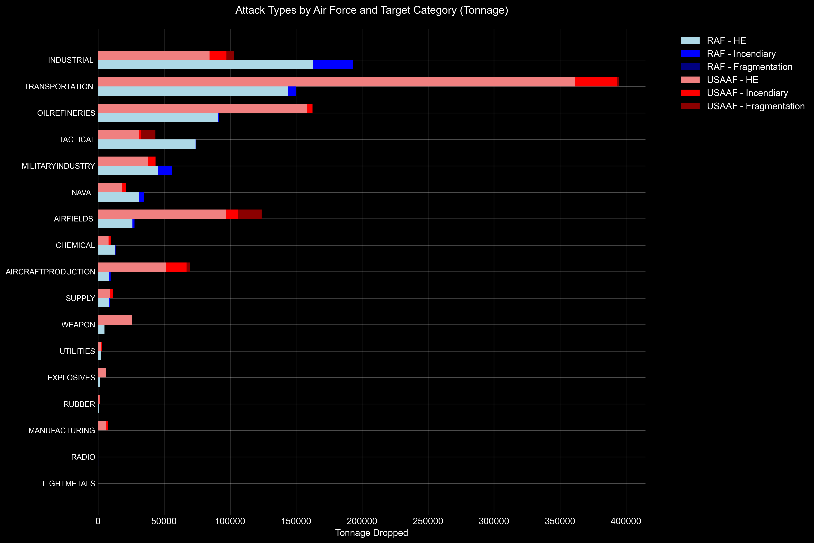
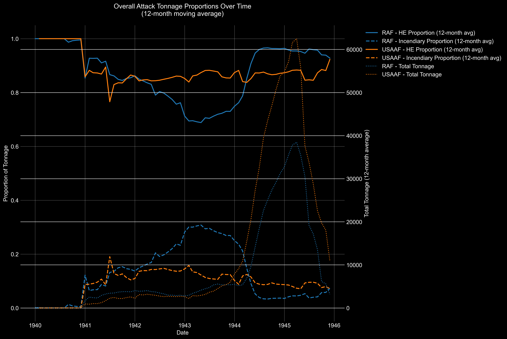
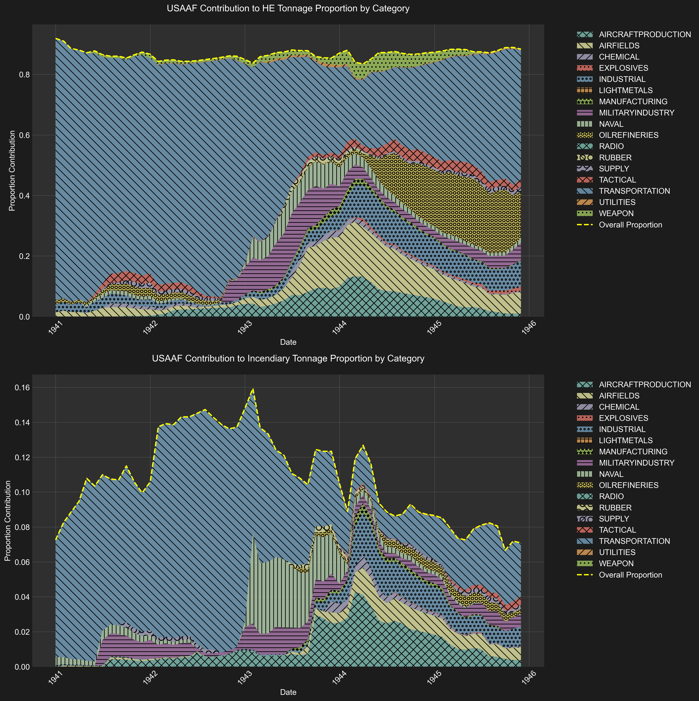
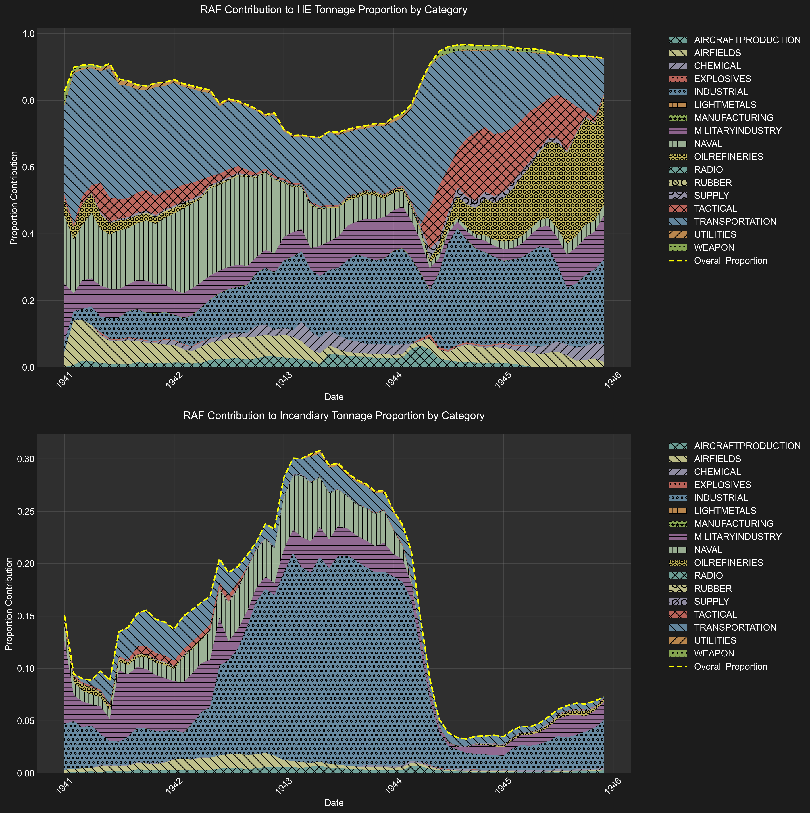
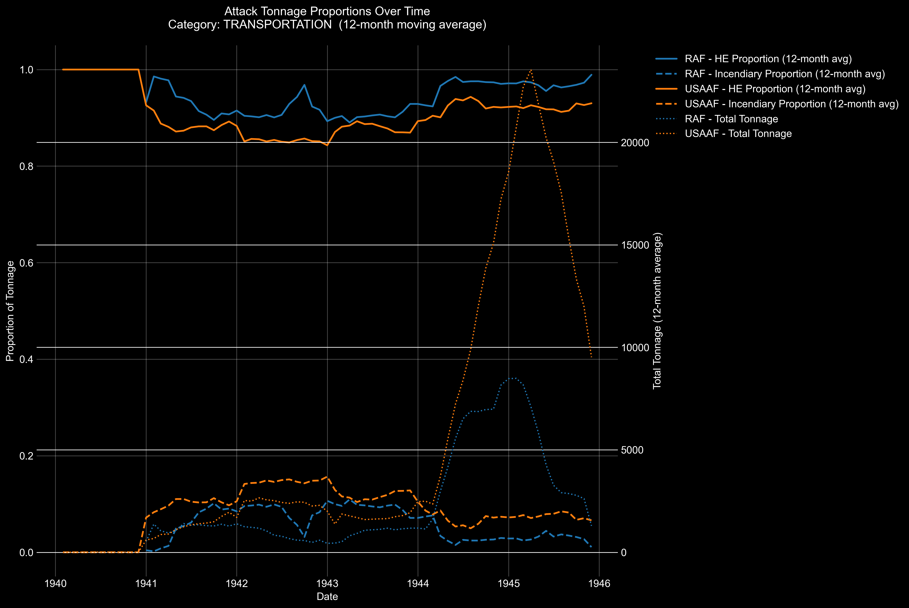
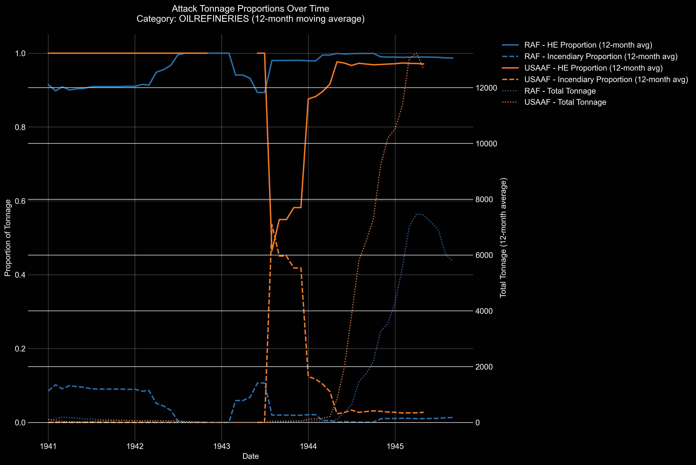
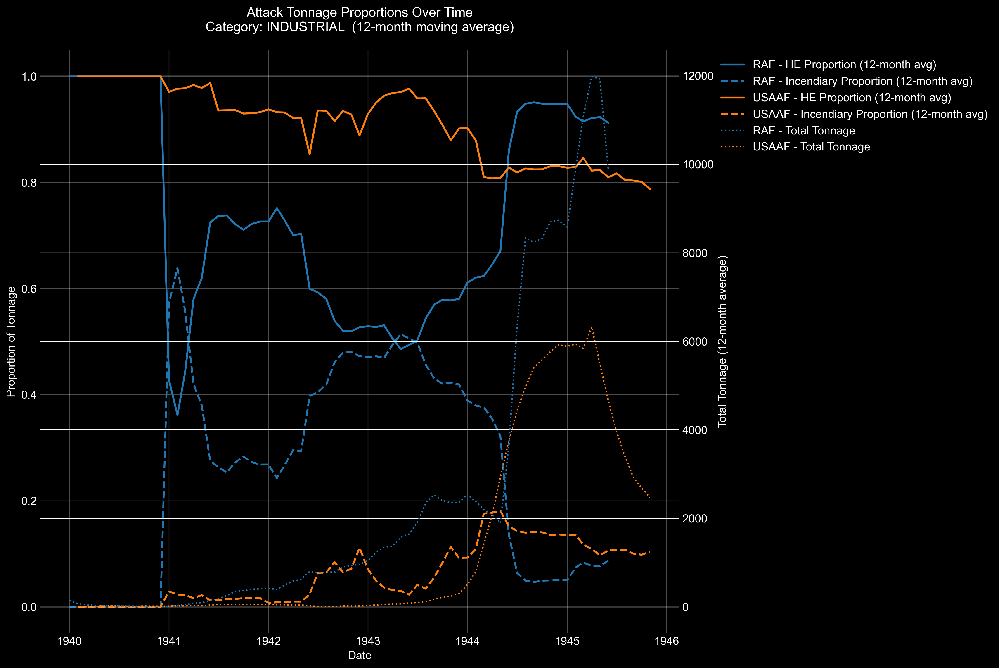

## Results

### Comparison of Total Bomb Tonnage

The total bomb tonnage recorded in our dataset is closely aligned with the figures reported by both the United States Strategic Bombing Survey (USSBS) Tabulating Service and the Office of Statistical Control (OSC) for the Eighth and Fifteenth Air Forces. Our data for the USAAF shows:

- **Eighth Air Force**: 681,076 tons
- **Fifteenth Air Force**: 284,482 tons

These figures are remarkably close to the OSC's reported totals of 692,918 tons for the Eighth Air Force and 312,173 tons for the Fifteenth Air Force[^1]. The slight discrepancies can be attributed to OCR error and LLM hallucinations.

However, the data for the Royal Air Force (RAF) Bomber Command presents a significant shortfall of approximately 300,000 tons when compared to historical records. Our dataset records:

- **RAF Bomber Command**: 669,623 tons

In contrast, the Air Ministry reported a total of 1,066,141 tons dropped by the RAF Bomber Command[^1]. The missing tonnage in our dataset is predominantly in the **Industrial** category, which mainly includes city area bombings. This discrepancy suggests that a substantial number of RAF mission records, particularly those targeting urban industrial areas, are missing from the archives utilized for our dataset.

### Implications for Data Analysis

The close alignment of USAAF data confirms that our dataset provides a reliable foundation for analyzing bombing missions conducted by the Eighth and Fifteenth Air Forces, which constituted the majority of USAAF bombings in the European theater. For the RAF data, while the available records are valuable, any conclusions drawn must acknowledge the incomplete nature of the dataset, especially concerning the substantial underrepresentation of bombings on city areas.

---

## Detailed Analysis of Reports and Charts

We generated several reports and visualizations using the `create_report_tons.py` script to analyze the bombing data. The following sections walk through these outputs, discussing their significance and highlighting key findings.

### Overall Attack Types by Target Category

The [**Attack Types by Target Category Summary (Tonnage)**](./attack_data/reports/attack_types_summary_tonnage.txt) report provides a breakdown of total tonnage dropped on each target category by both the RAF and USAAF. Key insights include:

- **Transportation** was the most heavily bombed category, with a total of **544,955 tons** dropped, accounting for approximately **32%** of all bombings.
- **Industrial** targets received a combined total of **296,377 tons**, with the RAF contributing **65.3%** of this tonnage.
- The **Oil Refineries** category saw significant focus from the USAAF, with **162,685 tons** dropped, representing **64%** of the total tonnage on that category.

### Bomb Type Distribution

The [**Attack Type Comparison**](./attack_data/reports/attack_types_tonnage.png) visualizes the distribution of bomb types (High Explosive, Incendiary, Fragmentation) used against each target category.

- High Explosive (HE) bombs were predominantly used across all categories, constituting **88.9%** of the total tonnage.
- **Incendiary bombs** were notably used in the **Industrial** and **Transportation** categories, aligning with strategies to disrupt infrastructure and manufacturing capabilities.
- **Fragmentation bombs** saw significant use in the **Airfields** and **Tactical** categories, reflecting their utility against personnel and light equipment.

### Temporal Analysis of Bombing Campaigns

The [**Overall Temporal Analysis**](./attack_data/reports/overall_temporal_analysis_tonnage.png) chart illustrates the tonnage dropped over time by both the RAF and USAAF with a 12-month rolling average.

- We confirm the substantial increase in bombing activity in late **1944** into early **1945**, coinciding with Allied Air Forces acquiring air superiority and the conflagratory conclusion of the war.

### Yearly Tonnage Statistics

The [**Statistical Analysis Report (Tonnage)**](./attack_data/reports/statistics_report_tonnage.txt) provides yearly breakdowns:

- **1944** was the most intensive year, with a total of **1,025,761 tons** dropped.
- The RAF maintained consistent bombing efforts throughout the war but had a noticeable shortfall in recorded tonnage for **city targets** in our dataset.

### Contribution Analysis by Air Force by Target Category

#### RAF Contributions

The [**RAF Category Contributions to Attack Tonnage Proportions**](./attack_data/reports/contribution_analysis_tonnage_raf.txt) report details the RAF's focus areas:

- **Industrial** targets were the primary focus, comprising **26.4%** of RAF's total tonnage.
- **Transportation** was also significant, with **25.8%** of tonnage, reflecting efforts to disrupt German logistics.

#### USAAF Contributions

Similarly, the [**USAAF Category Contributions to Attack Tonnage Proportions**](./attack_data/reports/contribution_analysis_tonnage_usaaf.txt) report shows:

- **Transportation** dominated USAAF efforts, accounting for **58.8%** of their total tonnage.
- **Oil Refineries** were a priority, representing **7.3%** of tonnage, indicative of attempts to cripple Germany's fuel supplies.

### Temporal Analysis by Target Category

We generated temporal analysis charts for each target category and in total. These charts use a 12-month rolling window to show how different target categories contributed to the overall bombing campaign over time, split between high explosive (HE) and incendiary munitions.

Each chart consists of two panels:
1. **Top Panel**: Shows how different target categories contributed to the proportion of HE bombs dropped
2. **Bottom Panel**: Shows how different target categories contributed to the proportion of incendiary bombs dropped

The stacked area plots represent:
- The vertical height of each colored region shows that category's contribution to the total proportion
- The yellow dashed line represents the overall proportion of that bomb type across all categories
- The patterns (hatching) help distinguish between categories in areas of similar color
- The sum of all categories' contributions equals the total proportion of that bomb type

Key insights from these visualizations:
- **USAAF** shows a more diverse target set with transportation targets dominating HE usage, while industrial targets saw the highest proportion of incendiary bombs
- **RAF** demonstrates more concentrated targeting patterns, with industrial targets receiving both HE and incendiary bombs consistently throughout the campaign. Still, we must keep in mind that our dataset is heavily deficient in RAF bombing on industrial targets.
- Both air forces show distinct shifts in targeting priorities over time, and in the case of the USAAF, we see relatively little evidence of a shift towards area bombing of industrial targets late in the war. This may evidence that the narrative of the USAAF's shift towards more indiscriminate bombing later in the war is overstated.

The temporal contribution analysis helps identify not just when certain target types were bombed, but how they fit into the overall strategic bombing campaign and what methods (HE vs. incendiary) were preferred for different target categories and how these methods evolved over time.

Notable examples of category-specific charts include:

#### Transportation

- A significant surge in attacks on transportation targets occurred in early **1944**, aligning with preparations for ground offensives and continuing into **1945** as part of a broader strategy to disrupt German economic and logistical capabilities.

#### Oil Refineries

- Bombings of oil refineries intensified in mid to late **1944** and continued into **1945**, reflecting strategic shifts to undermine Germany's fuel production.

#### Industrial Areas

- The data shows consistent RAF activity against industrial targets. Imagining this chart including the missing RAF industrial bombing missions would show an even more jarring number of tons dropped on industrial targets (mostly city areas).

### Tonnage Distribution by Bomb Type

Histograms of bomb tonnage distributions provide insights into the usage patterns of different bomb types and the typical mission loads for each:

- [**High Explosive Bombs Distribution**](./attack_data/reports/tonnage_distribution_high_explosive_bombs_tons.png)
- [**Incendiary Bombs Distribution**](./attack_data/reports/tonnage_distribution_incendiary_bombs_tons.png)
- [**Fragmentation Bombs Distribution**](./attack_data/reports/tonnage_distribution_fragmentation_bombs_tons.png)

These distributions highlight the prevalence and typical mission loads for each bomb type.

---

### Target Category by Air Force

| Target Category    | RAF Tonnage | RAF % | USAAF Tonnage | USAAF % | Total Tonnage |
|-------------------|-------------|-------|---------------|----------|---------------|
| Transportation    | 149,908     | 27.5% | 395,047       | 72.5%   | 544,955       |
| Industrial        | 193,511     | 65.3% | 102,866       | 34.7%   | 296,377       |
| Oil Refineries    | 91,697      | 36.0% | 162,685       | 64.0%   | 254,382       |
| Tactical          | 74,328      | 63.1% | 43,471        | 36.9%   | 117,800       |
| Airfields         | 27,833      | 18.3% | 123,947       | 81.7%   | 151,780       |
| Military Industry | 55,788      | 56.0% | 43,824        | 44.0%   | 99,612        |
| Naval             | 34,991      | 62.0% | 21,404        | 38.0%   | 56,396        |
| Weapon            | 4,836       | 15.8% | 25,837        | 84.2%   | 30,673        |
| Supply            | 6,617       | 32.6% | 13,652        | 67.4%   | 20,269        |
| Manufacturing     | 314         | 4.0%  | 7,475         | 96.0%   | 7,789         |
| Explosives        | 1,366       | 17.9% | 6,252         | 82.1%   | 7,617         |
| Utilities         | 2,448       | 45.4% | 2,944         | 54.6%   | 5,392         |
| Rubber            | 755         | 36.4% | 1,317         | 63.6%   | 2,073         |
| Radio             | 211         | 53.4% | 184           | 46.6%   | 395           |
| Light Metals      | 28          | 29.4% | 67            | 70.6%   | 95            |

### Yearly Tonnage by Air Force

| Year | 8th AF | 15th AF | RAF | 9th AF | 12th AF | Total |
|------|---------|----------|------|---------|----------|--------|
| 1940 | - | 170 | 145 | 60 | - | 375 |
| 1941 | 20,571 | 1,492 | 44,402 | 6,091 | 30 | 73,085 |
| 1942 | 22,830 | 1,744 | 35,486 | 7,100 | 757 | 67,966 |
| 1943 | 51,982 | 12,567 | 64,302 | 5,509 | 901 | 135,784 |
| 1944 | 429,943 | 191,293 | 379,129 | 22,264 | 2,537 | 1,025,761 |
| 1945 | 155,750 | 77,216 | 146,159 | 10,503 | 1,817 | 394,837 |
| **Total** | **681,076** | **284,482** | **669,624** | **51,528** | **6,041** | **1,697,811** |
| % of Total | 40.1% | 16.8% | 39.4% | 3.0% | 0.4% | 100% |

*Note: All figures rounded to nearest ton. Percentages may not sum to 100% due to rounding.*

### Bomb Type Distribution by Air Force

| Air Force | HE Tons (%) | Incendiary Tons (%) | Fragmentation Tons (%) | Total Tons |
|-----------|-------------|---------------------|----------------------|------------|
| 8th AF | 589,815 (86.6%) | 73,835 (10.8%) | 17,426 (2.6%) | 681,076 |
| RAF | 612,489 (91.5%) | 56,297 (8.4%) | 838 (0.1%) | 669,624 |
| 15th AF | 257,155 (90.4%) | 9,128 (3.2%) | 18,199 (6.4%) | 284,482 |
| 9th AF | 40,465 (78.5%) | 6,668 (12.9%) | 4,394 (8.5%) | 51,528 |
| 12th AF | 5,766 (95.4%) | 86 (1.4%) | 189 (3.1%) | 6,041 |

### Overall Totals Summary

| Category | Tonnage | Percentage |
|----------|---------|------------|
| **Total Tonnage** | 1,697,811 | 100% |
| RAF Total | 669,624 | 39.4% |
| USAAF Total | 1,028,188 | 60.6% |
| **By Bomb Type** | | |
| High Explosive | 1,510,054 | 88.9% |
| Incendiary | 146,497 | 8.6% |
| Fragmentation | 41,260 | 2.4% |

*Note: All figures rounded to nearest ton. Percentages may not sum to 100% due to rounding.*

---

## Discussion of Discrepancies

When comparing our dataset totals to historical records, several observations emerge:

- **USAAF Data Alignment**: Our recorded totals for the Eighth and Fifteenth Air Forces closely match the historical figures reported by the OSC and USSBS. This consistency validates the reliability of our dataset for USAAF analyses.
  
- **RAF Data Shortfall**: The significant discrepancy of approximately **300,000 tons** in RAF Bomber Command's total tonnage indicates missing records, particularly in the **Industrial** category. Given that much of RAF's strategy involved area bombings of cities at night, it's plausible that a substantial portion of these missions is absent from our dataset due to archival gaps.

### Implications for Research

The missing RAF data, especially concerning bombings of city areas, necessitates caution when interpreting analyses involving RAF contributions. Researchers should:

- **Acknowledge Data Limitations**: Clearly state the missing data in any analysis to avoid overstating conclusions about RAF activities.
- **Cross-Reference Sources**: Where possible, supplement our dataset with additional archival records or secondary sources to fill in gaps.
- **Focus on USAAF Data for Certain Analyses**: For studies requiring complete datasets, consider emphasizing USAAF data, which is more comprehensive in our records.

---

## Conclusion

Our comprehensive raid-by-raid dataset offers valuable insights into the strategic bombing campaigns of World War II, particularly for the USAAF's Eighth and Fifteenth Air Forces. While the dataset aligns closely with historical records for USAAF missions, the identified shortfall in RAF Bomber Command data underscores the need for careful consideration of archival completeness when conducting analyses. Future research efforts should aim to locate and incorporate the missing RAF records to provide a more holistic understanding of the air war over Europe.

---

[^1]: **Sources**: [USSBS Tabulating Service Data Part 1](ussbs_reports/ECONOMIC_REPORT/IMG_8547.JPG) and [Part 2](ussbs_reports/ECONOMIC_REPORT/IMG_8548.JPG). [Office of Statistical Control and Air Ministry records](ussbs_reports/OVERALL_REPORT/STATISTICAL_APPENDIX/IMG_8297.JPG).
