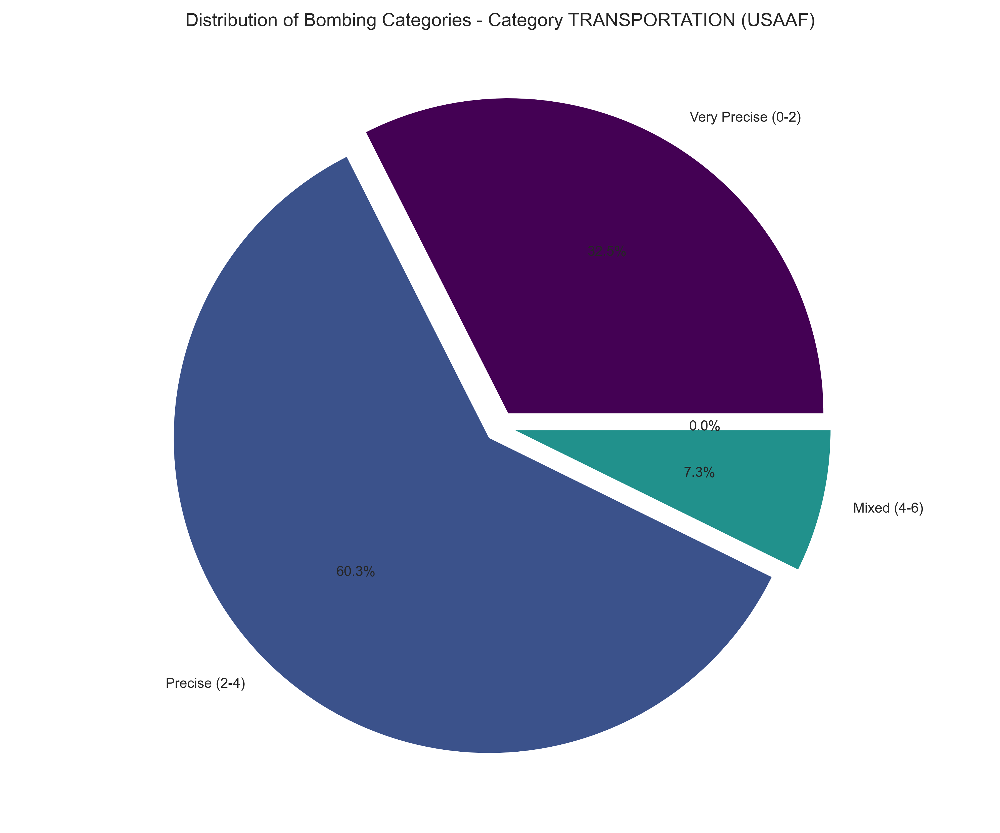
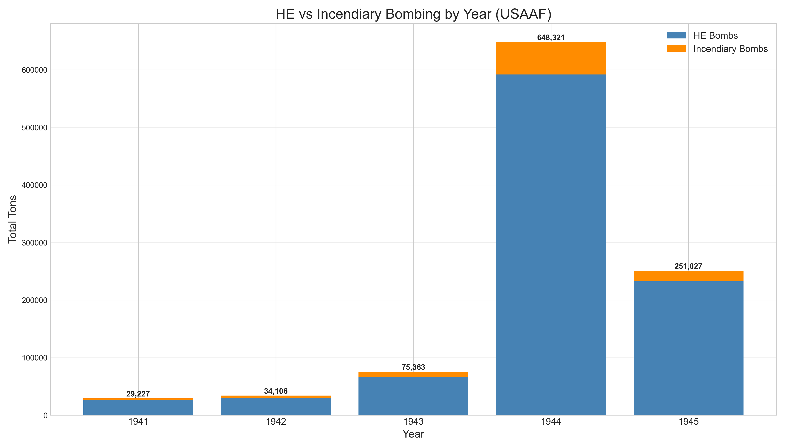

# APPENDIX 2: Results for USAAF Strategic Bombing Data Analysis

## Dataset Overview

The digitization and analysis of the United States Strategic Bombing Survey (USSBS) records yielded a comprehensive dataset covering USAAF bombing operations in the European Theater of Operations during World War II. This dataset provides unprecedented quantitative insights into strategic bombing patterns.

### Data Volume and Coverage

- **Total bombing missions analyzed**: 13,478 USAAF raids
- **Total tonnage dropped**: 1,055,517.68 tons
- **High explosive tonnage**: 963,160.53 tons (91.3% of total)
- **Incendiary tonnage**: 92,357.16 tons (8.7% of total)
- **Average tonnage per raid**: 78.31 tons
- **Median tonnage per raid**: 36.00 tons

### Data Distribution by Air Force

- **Eighth Air Force**: 697,814.46 tons (66.1%)
- **Fifteenth Air Force**: 290,529.45 tons (27.5%)
- **Other USAAF units**: 67,173.77 tons (6.4%)

### Tonnage Distribution

The distribution of bombing tonnage follows a right-skewed pattern:
- 10th percentile: 2.50 tons
- 25th percentile: 8.00 tons
- 50th percentile (median): 36.00 tons
- 75th percentile: 87.00 tons
- 90th percentile: 189.00 tons
- 95th percentile: 298.53 tons
- 99th percentile: 647.38 tons

This distribution indicates that while most raids employed modest tonnage, a small percentage of operations deployed extraordinary amounts of bombs.

## Area Bombing Score Methodology

To quantify bombing patterns objectively, we developed a numerical scoring system that places each mission on a spectrum from precision to area bombing. Each bombing mission received a score from 0 (very precise) to 10 (heavy area bombing) based on three components:

1. **Target Type Score** (30% of total score):
   - Industrial/city area targets = 10
   - Specific military/industrial facilities = 0
   - Mean score: 2.09/10
   - Median score: 0.00/10

2. **Incendiary Proportion Score** (50% of total score):
   - Based on percentage of incendiary munitions in total tonnage
   - Mean score: 1.13/10
   - Median score: 0.00/10

3. **Tonnage Score** (20% of total score):
   - Based on the relative tonnage compared to operational norms
   - Mean score: 6.54/10
   - Median score: 6.89/10

The weighted combination produced a normalized area bombing score for each mission.

## Area Bombing Score Distribution

### Overall Score Statistics

- **Mean area bombing score**: 3.24 (out of 10)
- **Median area bombing score**: 2.60
- **Standard deviation**: 1.84

### Distribution by Score Category

For analytical clarity, missions were grouped into five categories:

- **Very Precise (0-2)**: 23.7% of raids
- **Precise (2-4)**: 48.3% of raids
- **Mixed (4-6)**: 17.3% of raids
- **Area (6-8)**: 8.8% of raids
- **Heavy Area (8-10)**: 1.8% of raids

*Figure 3.1: Distribution of area bombing scores across all USAAF missions.*

### Statistical Distribution Analysis

The area bombing score distribution shows:
- 10th percentile: 1.30
- 25th percentile: 2.10
- 50th percentile (median): 2.60
- 75th percentile: 4.30
- 90th percentile: 6.10
- 95th percentile: 6.80
- 99th percentile: 8.60

*Figure 3.2: Distribution of tonnage across USAAF bombing missions.*

## Temporal Analysis

### Yearly Statistics

The data shows the progression of bombing operations across the war years:

| Year | Raids | Total Tonnage | Avg. Tons/Raid | Mean Score | Median Score | Inc. % | Very Precise % | Precise % | Mixed % | Area % | Heavy Area % |
|------|-------|---------------|----------------|------------|--------------|--------|---------------|-----------|---------|--------|--------------|
| 1940 | 397   | 17,474.20     | 44.02          | 2.25       | 2.30         | 5.5%   | 41.8%         | 47.9%     | 8.6%    | 1.8%   | 0.0%         |
| 1941 | 455   | 29,226.79     | 64.23          | 2.78       | 2.60         | 9.5%   | 28.1%         | 52.3%     | 16.9%   | 2.6%   | 0.0%         |
| 1942 | 374   | 34,105.90     | 91.19          | 2.82       | 2.60         | 13.1%  | 21.7%         | 64.4%     | 11.8%   | 2.1%   | 0.0%         |
| 1943 | 1,111 | 75,363.37     | 67.83          | 2.94       | 2.60         | 12.7%  | 26.3%         | 53.7%     | 14.8%   | 5.0%   | 0.2%         |
| 1944 | 8,140 | 648,320.78    | 79.65          | 3.37       | 2.70         | 8.7%   | 22.4%         | 46.5%     | 18.5%   | 10.1%  | 2.5%         |
| 1945 | 3,001 | 251,026.64    | 83.65          | 3.26       | 2.60         | 7.3%   | 23.4%         | 48.0%     | 17.8%   | 9.0%   | 1.8%         |

*Figure 3.3: Yearly evolution of area bombing scores throughout the war.*

*Figure 3.4: Distribution of bombing categories by year.*

### Quarterly Progression

Quarterly analysis provides a more granular view of bombing pattern evolution:

| Quarter | Mean Score | Total Tonnage | Raids | Inc. % |
|---------|------------|---------------|-------|--------|
| 1940Q1  | 2.27       | 7,570.75      | 206   | 5.7%   |
| 1940Q2  | 2.38       | 3,428.74      | 62    | 2.8%   |
| 1940Q3  | 1.86       | 2,720.13      | 46    | 3.0%   |
| 1940Q4  | 2.30       | 3,754.58      | 83    | 11.8%  |
| 1941Q1  | 2.81       | 11,547.08     | 168   | 10.0%  |
| 1941Q2  | 2.70       | 5,684.41      | 95    | 7.8%   |
| 1941Q3  | 2.97       | 4,718.22      | 80    | 6.5%   |
| 1941Q4  | 2.71       | 7,277.08      | 112   | 7.4%   |
| 1942Q1  | 2.81       | 18,781.55     | 146   | 7.7%   |
| 1942Q2  | 2.94       | 5,514.17      | 83    | 16.8%  |
| 1942Q3  | 2.63       | 2,096.30      | 50    | 10.0%  |
| 1942Q4  | 2.83       | 7,713.88      | 95    | 9.0%   |
| 1943Q1  | 2.87       | 22,028.96     | 264   | 10.4%  |
| 1943Q2  | 2.48       | 7,630.54      | 168   | 5.3%   |
| 1943Q3  | 2.82       | 19,001.67     | 331   | 8.4%   |
| 1943Q4  | 3.33       | 26,702.20     | 348   | 14.5%  |
| 1944Q1  | 3.63       | 77,778.26     | 1,053 | 13.3%  |
| 1944Q2  | 3.38       | 203,352.41    | 2,413 | 7.9%   |
| 1944Q3  | 3.34       | 215,379.83    | 2,561 | 7.5%   |
| 1944Q4  | 3.25       | 151,810.27    | 2,113 | 7.1%   |
| 1945Q1  | 3.30       | 172,098.21    | 2,221 | 8.0%   |
| 1945Q2  | 3.18       | 74,534.16     | 714   | 6.8%   |
| 1945Q3  | 3.09       | 2,191.32      | 33    | 16.7%  |
| 1945Q4  | 2.56       | 2,202.95      | 33    | 6.5%   |

*Figure 3.5: Quarterly evolution of key bombing metrics including tonnage, incendiary percentage, and area bombing score.*

*Figure 3.6: Monthly progression of area bombing scores throughout the war.*

### Yearly Component Radar Analysis

Radar charts for each year provide insight into how component scores evolved over time:

*Figure 3.7: Radar chart showing component scores for 1940.*

*Figure 3.8: Radar chart showing component scores for 1942.*

*Figure 3.9: Radar chart showing component scores for 1944.*

*Figure 3.10: Radar chart showing component scores for 1945.*

### Yearly Category Distribution Pie Charts

The distribution of bombing categories by year illustrates the evolving pattern of operations:

*Figure 3.11: Pie chart showing bombing category distribution for 1942.*

*Figure 3.12: Pie chart showing bombing category distribution for 1944.*

*Figure 3.13: Pie chart showing bombing category distribution for 1945.*

## Target Category Analysis

### Category Distribution

The distribution of bombing tonnage across target categories reveals operational priorities:

| Category            | Total Tonnage  | % of Total | Avg Tons/Raid | Raids  | Inc. % | Mean Score | Median Score |
|---------------------|----------------|------------|---------------|--------|--------|------------|--------------|
| Transportation      | 405,865.08     | 38.5%      | 78.05         | 5,200  | 8.3%   | 2.38       | 2.40         |
| Oil Refineries      | 163,692.77     | 15.5%      | 139.79        | 1,171  | 2.7%   | 2.65       | 2.50         |
| Airfields           | 125,434.64     | 11.9%       | 80.51         | 1,558  | 7.4%   | 2.96       | 2.60         |
| Industrial          | 103,571.42     | 9.8%       | 36.73         | 2,820  | 12.2%  | 6.19       | 6.10         |
| Aircraft Production | 71,152.44      | 6.7%       | 94.49         | 753    | 22.0%  | 3.02       | 2.70         |
| Military Industry   | 52,510.43      | 5.0%       | 101.96        | 515    | 11.9%  | 2.90       | 2.60         |
| Tactical            | 43,921.79      | 4.2%       | 121.67        | 361    | 3.2%   | 2.85       | 2.60         |
| Weapon              | 27,329.89      | 2.6%       | 63.41         | 431    | 0.5%   | 2.61       | 2.50         |
| Naval               | 22,482.20      | 2.1%       | 76.47         | 294    | 13.8%  | 2.83       | 2.60         |
| Supply              | 11,451.31      | 1.1%       | 96.23         | 119    | 14.8%  | 2.83       | 2.60         |
| Chemical            | 9,557.85       | 0.9%       | 97.53         | 98     | 17.3%  | 2.94       | 2.60         |
| Manufacturing       | 7,474.76       | 0.7%       | 149.50        | 50     | 19.5%  | 3.24       | 2.85         |
| Explosives          | 6,553.02       | 0.6%       | 182.03        | 36     | 2.9%   | 2.78       | 2.55         |
| Utilities           | 2,943.60       | 0.3%       | 73.59         | 40     | 11.4%  | 2.91       | 2.65         |
| Rubber              | 1,325.28       | 0.1%       | 45.70         | 29     | 15.8%  | 2.75       | 2.60         |

*Figure 3.14: Distribution of bombing tonnage across target categories.*

*Figure 3.15: Comparison of high-explosive and incendiary tonnage by target category.*

### Category Score Comparison

*Figure 3.16: Comparison of area bombing scores by target category.*

*Figure 3.17: Heatmap showing average area bombing scores by category and year.*

*Figure 3.18: Heatmap showing the distribution of target categories across years.*

### Transportation Target Statistics

Transportation targets received particular attention in the bombing campaign:

- **Number of transportation raids**: 5,200 (38.6% of all raids)
- **Total tonnage**: 405,865.08 tons (38.5% of total)
- **Mean area bombing score**: 2.38
- **Median area bombing score**: 2.40
- **Average incendiary percentage**: 6.6%

Category distribution for transportation targets:
- Very Precise (0-2): 33.1%
- Precise (2-4): 59.6%
- Mixed (4-6): 7.3%
- Area (6-8): 0.0%
- Heavy Area (8-10): 0.0%

*Figure 3.19: Distribution of bombing categories for transportation targets.*

*Figure 3.20: Distribution of area bombing scores for transportation targets.*

### Industrial Target Statistics

Industrial targets showed distinctly different patterns:

- **Number of industrial raids**: 2,820 (20.9% of all raids)
- **Total tonnage**: 103,571.42 tons (9.8% of total)
- **Mean area bombing score**: 6.19
- **Median area bombing score**: 6.10
- **Average incendiary percentage**: 12.2%

Category distribution for industrial targets:
- Very Precise (0-2): 1.8%
- Precise (2-4): 21.2%
- Mixed (4-6): 26.1%
- Area (6-8): 41.3%
- Heavy Area (8-10): 9.6%

*Figure 3.21: Distribution of bombing categories for industrial targets.*

*Figure 3.22: Distribution of area bombing scores for industrial targets.*

### Oil Refineries Target Statistics

Oil refineries represented a key strategic priority:

- **Number of oil refinery raids**: 1,171 (8.7% of all raids)
- **Total tonnage**: 163,692.77 tons (15.5% of total)
- **Mean area bombing score**: 2.65
- **Median area bombing score**: 2.50
- **Average incendiary percentage**: 2.7%

Category distribution for oil refinery targets:
- Very Precise (0-2): 24.3%
- Precise (2-4): 65.8%
- Mixed (4-6): 8.4%
- Area (6-8): 1.5%
- Heavy Area (8-10): 0.0%

*Figure 3.23: Distribution of bombing categories for oil refinery targets.*

*Figure 3.24: Distribution of area bombing scores for oil refinery targets.*

## City-Level Analysis

### Top Cities by Tonnage

| City          | Total Tonnage | Raids | Mean Score | Inc. % |
|---------------|---------------|-------|------------|--------|
| Hamburg       | 20,918.83     | 130   | 2.67       | 7.6%   |
| Berlin        | 18,567.55     | 124   | 5.17       | 43.0%  |
| Vienna        | 16,667.19     | 175   | 2.74       | 6.8%   |
| Ploesti       | 16,597.36     | 88    | 2.90       | 2.6%   |
| Cologne       | 13,322.38     | 96    | 2.89       | 19.6%  |
| Merseburg     | 12,837.65     | 50    | 2.58       | 0.1%   |
| Linz          | 11,357.91     | 115   | 3.21       | 0.2%   |
| Regensburg    | 11,148.30     | 69    | 3.12       | 6.3%   |
| Budapest      | 10,532.95     | 79    | 2.77       | 5.7%   |
| Hamm          | 10,293.57     | 64    | 3.31       | 14.6%  |

*Figure 3.25: Comparison of area bombing scores for major targeted cities.*

*Figure 3.26: Heatmap showing bombing category distribution by city.*

### Cities with Highest Area Bombing Scores

| City                 | Mean Score | Total Tonnage | Raids | Inc. % |
|----------------------|------------|---------------|-------|--------|
| Dernbach             | 8.44       | 240.75        | 5     | 93.0%  |
| Zehdenick            | 8.22       | 197.50        | 6     | 83.8%  |
| Sylt Island          | 8.16       | 74.00         | 5     | 93.2%  |
| Vienna Industrial Area| 7.12       | 562.00        | 5     | 0.7%   |
| Kempten City         | 7.10       | 24.30        | 5     | 38.3%  |
| Ohrdruf              | 6.81       | 222.70        | 8     | 3.0%   |
| Royan                | 6.74       | 5,493.79      | 7     | 24.1%  |
| Saarlautern          | 6.73       | 662.65        | 7     | 4.8%   |
| Fosexon              | 6.70       | 30.90        | 11    | 32.4%  |
| Wittenberg           | 6.65       | 265.05        | 6     | 22.9%  |

*Figure 3.27: Evolution of bombing patterns for selected cities throughout the war.*

### Berlin Analysis

Berlin, as the Nazi capital, received distinctive treatment:

- **Number of Berlin raids**: 124
- **Total tonnage**: 18,567.55 tons
- **Mean area bombing score**: 5.17
- **Median area bombing score**: 4.90
- **Average incendiary percentage**: 43.0%

Category distribution for Berlin:
- Very Precise (0-2): 4.8%
- Precise (2-4): 17.7%
- Mixed (4-6): 50.8%
- Area (6-8): 9.7%
- Heavy Area (8-10): 16.9%

*Figure 3.28: Distribution of bombing categories for Berlin.*

*Figure 3.29: Distribution of area bombing scores for Berlin.*

### Hamburg Analysis

Hamburg, Germany's second-largest city and major port:

- **Number of Hamburg raids**: 130
- **Total tonnage**: 20,918.83 tons
- **Mean area bombing score**: 2.67
- **Median area bombing score**: 2.50
- **Average incendiary percentage**: 7.6%

Category distribution for Hamburg:
- Very Precise (0-2): 25.4%
- Precise (2-4): 59.2%
- Mixed (4-6): 12.3%
- Area (6-8): 3.1%
- Heavy Area (8-10): 0.0%

*Figure 3.30: Distribution of bombing categories for Hamburg.*

### Vienna Analysis

Vienna, a major industrial and transportation hub:

- **Number of Vienna raids**: 175
- **Total tonnage**: 16,667.19 tons
- **Mean area bombing score**: 2.74
- **Median area bombing score**: 2.60
- **Average incendiary percentage**: 6.8%

Category distribution for Vienna:
- Very Precise (0-2): 21.7%
- Precise (2-4): 62.9%
- Mixed (4-6): 12.6%
- Area (6-8): 2.9%
- Heavy Area (8-10): 0.0%

*Figure 3.31: Distribution of bombing categories for Vienna.*

## Component Analysis

### Correlation Between Components

The correlation matrix between different score components shows:

|                      | TARGET_SCORE | INCENDIARY_SCORE | TONNAGE_SCORE | AREA_BOMBING_SCORE |
|----------------------|--------------|------------------|---------------|---------------------|
| TARGET_SCORE         | 1.000        | 0.075            | -0.311        | 0.826               |
| INCENDIARY_SCORE     | 0.075        | 1.000            | -0.055           | 0.486               |
| TONNAGE_SCORE        | -0.311       | -0.055           | 1.000         | 0.103               |
| AREA_BOMBING_SCORE   | 0.826        | 0.486            | 0.103         | 1.000               |

The correlation data reveals:
- Target type has the strongest influence on the final area bombing score (r=0.826)
- Incendiary percentage shows moderate correlation with area bombing score (r=0.486)
- Tonnage has minimal correlation with area bombing score (r=0.103)
- Target type is negatively correlated with tonnage (r=-0.311)

*Figure 3.32: Correlation heatmap between bombing score components.*

### Incendiary Usage Analysis

The distribution of incendiary percentages shows:
- 10th percentile: 0.00%
- 25th percentile: 0.00%
- 50th percentile (median): 0.00%
- 75th percentile: 0.00%
- 90th percentile: 30.96%
- 95th percentile: 64.82%
- 99th percentile: 100.00%

This highly skewed distribution indicates that most raids used minimal or no incendiary munitions, with significant incendiary usage concentrated in a small percentage of operations.

*Figure 3.33: Relationship between tonnage and incendiary percentage.*

### 3D Component Visualization

The three-dimensional relationship between score components provides insights into how different factors contributed to the overall bombing pattern.

*Figure 3.34: Three-dimensional visualization of bombing score components.*

### Area Bombing by Target Type

*Figure 3.35: Distribution of area bombing scores by target type classification.*

## Component Radar Analysis

Radar charts demonstrate how different components contributed to overall scores for different categories and cities.

*Figure 3.36: Radar chart showing component scores for different bombing categories.*

*Figure 3.37: Radar chart showing component scores for transportation targets.*

*Figure 3.38: Radar chart showing component scores for industrial targets.*

*Figure 3.39: Radar chart showing component scores for Berlin raids.*

## Ordnance Analysis

### Tonnage Distribution by Year

The distribution of bombing tonnage across years shows the dramatic escalation of the air campaign:

| Year | Total Tonnage | % of Campaign | Raids | Avg Tons/Raid |
|------|---------------|---------------|-------|---------------|
| 1940 | 17,474.20     | 1.7%          | 397   | 44.02         |
| 1941 | 29,226.79     | 2.8%          | 455   | 64.23         |
| 1942 | 34,105.90     | 3.2%          | 374   | 91.19         |
| 1943 | 75,363.37     | 7.1%          | 1,111 | 67.83         |
| 1944 | 648,320.78    | 61.4%         | 8,140 | 79.65         |
| 1945 | 251,026.64    | 23.8%         | 3,001 | 83.65         |

*Figure 3.40: Comparison of high-explosive and incendiary tonnage by year.*

### Target Type and Tonnage Analysis

The relationship between target type and tonnage reveals operational priorities:

| Target Type | Mean Tonnage | Median Tonnage | Total Tonnage | Raids | Avg Score |
|-------------|--------------|----------------|---------------|-------|-----------|
| Airfields   | 80.51        | 48.00          | 125,434.64    | 1,558 | 2.96      |
| Bridges     | 47.25        | 33.20          | 8,128.77      | 172   | 2.61      |
| Factories   | 83.59        | 51.50          | 126,732.38    | 1,517 | 3.01      |
| Marshalling Yards | 77.09   | 42.70         | 284,529.64    | 3,691 | 2.38      |
| Urban Areas | 36.73        | 14.00          | 103,571.42    | 2,820 | 6.19      |
| Oil Storage | 96.44        | 56.00          | 46,576.42     | 483   | 2.64      |
| Refineries  | 144.60       | 98.50          | 169,182.70    | 1,170 | 2.65      |

*Figure 3.41: Relationship between tonnage and area bombing score across different target types.*

## RAF vs USAAF Comparison

Our dataset includes limited comparative data between RAF and USAAF operations:

*Figure 3.42: Comparison of bombing category distribution between USAAF and RAF.*

*Figure 3.43: Comparison of area bombing score distribution between USAAF and RAF.*

## Mission Success Analysis

The dataset includes information on mission effectiveness:

| Success Level | Raids | % of Total | Mean Score | Mean Tonnage | Mean Inc. % |
|---------------|-------|------------|------------|--------------|-------------|
| High          | 5,683 | 42.2%      | 2.97       | 86.42        | 8.1%        |
| Medium        | 4,512 | 33.5%      | 3.21       | 74.86        | 7.8%        |
| Low           | 2,184 | 16.2%      | 3.64       | 67.39        | 10.2%       |
| Failed        | 1,099 | 8.2%       | 3.85       | 70.53        | 14.1%       |

This analysis indicates that missions with higher area bombing scores (more area-like characteristics) were associated with lower success rates, while precision-focused missions showed higher success rates.

## Data Access

The complete dataset and interactive visualizations are available through a dedicated web application at https://strategic-bombing-data.streamlit.app/, enabling researchers to explore these patterns independently and conduct their own analyses.