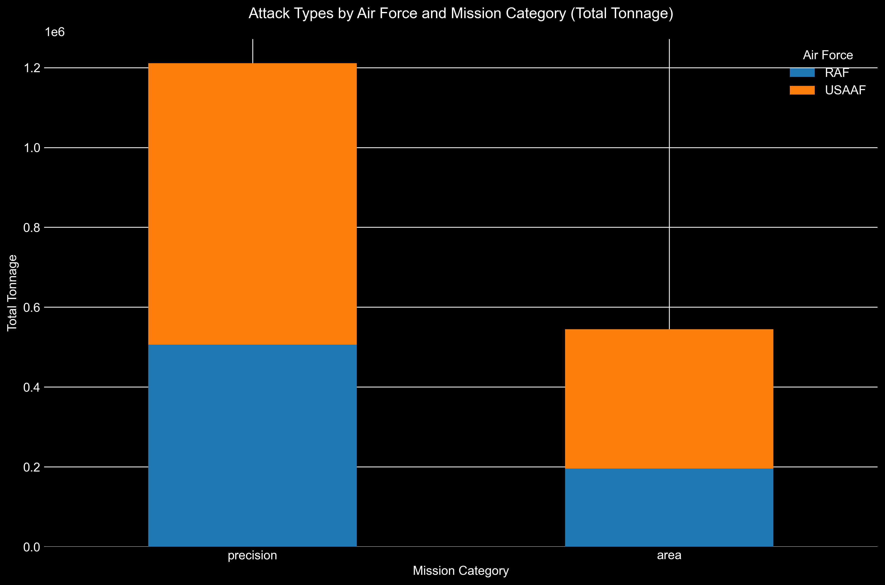
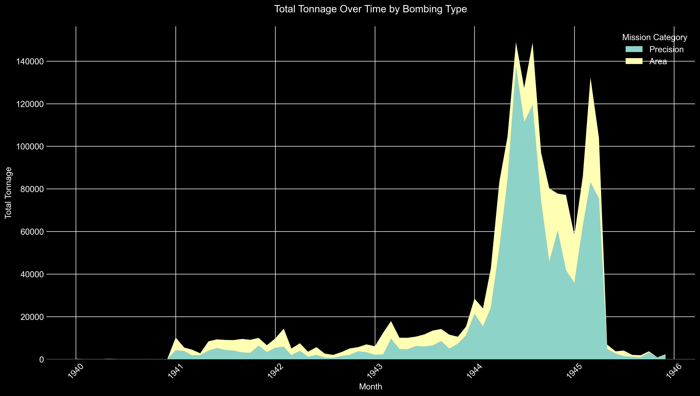
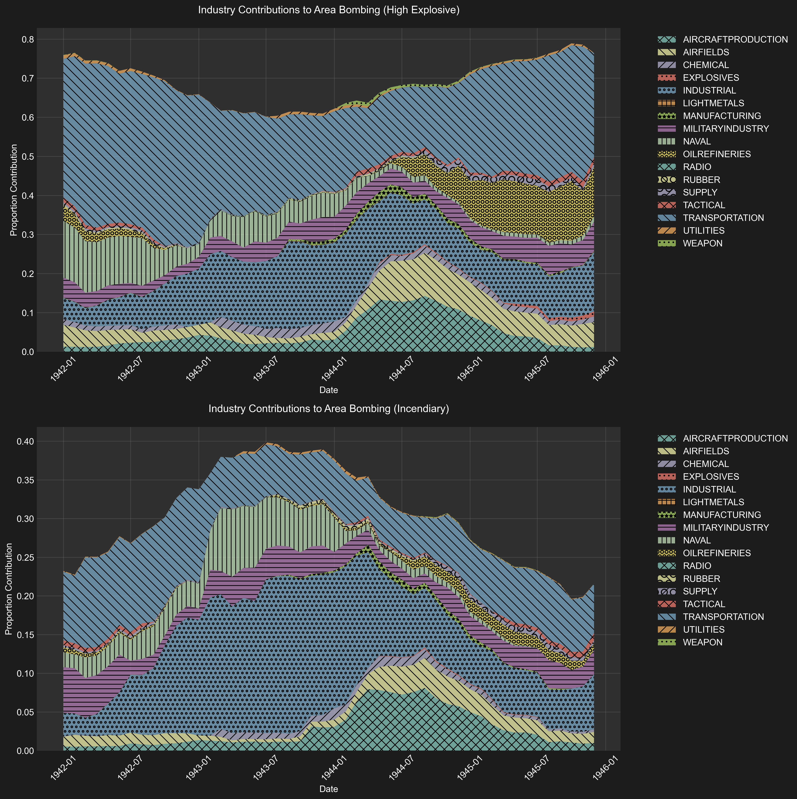

# APPENDIX 2: Results for Attack Data

## Comparison of Total Bomb Tonnage

The total bomb tonnage recorded in our dataset is closely aligned with the figures reported by both the United States Strategic Bombing Survey (USSBS) Tabulating Service and the Office of Statistical Control (OSC) for the Eighth and Fifteenth Air Forces. Our data for the USAAF shows:

- **Eighth Air Force**: 697,814.46 tons
- **Fifteenth Air Force**: 290,529.45 tons

These figures are remarkably close to the OSC's reported totals of 692,918 tons for the Eighth Air Force and 312,173 tons for the Fifteenth Air Force[^1]. The slight discrepancies can be attributed to OCR error and LLM hallucinations.

However, the data for the Royal Air Force (RAF) Bomber Command presents a significant shortfall of over 300,000 tons when compared to historical records. Our dataset records:

- **RAF Bomber Command**: 701,245.61 tons

In contrast, the Air Ministry reported a total of 1,066,141 tons dropped by the RAF Bomber Command[^1]. The missing tonnage in our dataset is predominantly in the **Industrial** category, which mainly includes city area bombings[^2]. This discrepancy suggests that a substantial number of RAF mission records, particularly those targeting urban industrial areas, are missing from the archives utilized for our dataset.

## Implications for Data Analysis

The close alignment of USAAF data confirms that our dataset provides a reliable foundation for analyzing bombing missions conducted by the Eighth and Fifteenth Air Forces, which constituted the majority of USAAF bombings in the European theater. For the RAF data, while the available records are valuable, any conclusions drawn must acknowledge the incomplete nature of the dataset, especially concerning the substantial underrepresentation of bombings on city areas.

---

## Target Category by Air Force

| Target Category    | RAF Tonnage | RAF % | USAAF Tonnage | USAAF % | Total Tonnage |
|-------------------|-------------|-------|---------------|----------|---------------|
| Transportation    | 155,684.12  | 27.8% | 405,038.14    | 72.2%   | 560,722.26    |
| Industrial        | 194,472.29  | 65.3% | 103,426.67    | 34.7%   | 297,898.96    |
| Oil Refineries    | 94,959.91   | 36.8% | 163,244.12    | 63.2%   | 258,204.03    |
| Airfields         | 34,560.41   | 21.5% | 126,112.16    | 78.5%   | 160,672.57    |
| Military Industry | 60,199.04   | 53.3% | 52,739.97     | 46.7%   | 112,939.01    |
| Aircraft Production| 10,161.84   | 12.5% | 71,198.44     | 87.5%   | 81,360.28     |
| Naval             | 40,268.67   | 64.2% | 22,467.20     | 35.8%   | 62,735.87     |
| Weapon            | 4,836.12    | 15.0% | 27,325.89     | 85.0%   | 32,162.01     |
| Chemical          | 15,251.73   | 61.5% | 9,557.85      | 38.5%   | 24,809.58     |
| Manufacturing     | 436.94      | 5.5%  | 7,474.76      | 94.5%   | 7,911.71      |
| Explosives        | 1,426.12    | 17.9% | 6,553.02      | 82.1%   | 7,979.14      |
| Utilities         | 3,011.33    | 50.6% | 2,943.60      | 49.4%   | 5,954.93      |
| Light Metals      | 336.10      | 83.3% | 67.20         | 16.7%   | 403.30        |
|--------------------|-------------|-------|---------------|----------|---------------|
| **Total**          | 701,245.61  | 100%  | 1,054,708.40  | 100%    | 1,755,954.02  |

## Yearly Tonnage by Air Force

| Year | 8th AF | 15th AF | RAF | 9th AF | 12th AF | Unknown | Total |
|------|---------|----------|------|---------|----------|----------|--------|
| 1940 | - | 304.00 | 213.22 | 60.00 | - | - | 577.23 |
| 1941 | 22,980.06 | 1,831.56 | 62,265.68 | 6,116.48 | 30.00 | 658.37 | 93,882.14 |
| 1942 | 24,211.65 | 2,754.35 | 36,473.89 | 7,128.44 | 757.10 | 215.05 | 71,540.49 |
| 1943 | 54,809.07 | 13,462.19 | 67,437.82 | 6,622.31 | 900.50 | 839.00 | 144,070.89 |
| 1944 | 434,066.29 | 193,868.57 | 385,895.60 | 22,456.01 | 2,537.00 | 1,186.43 | 1,040,009.89 |
| 1945 | 161,747.39 | 78,308.78 | 148,959.40 | 10,931.43 | 1,816.75 | 4,109.64 | 405,873.39 |
| **Total** | **697,814.46** | **290,529.45** | **701,245.61** | **53,314.67** | **6,041.35** | **7,008.48** | **1,755,954.02** |
| % of Total | 39.7% | 16.5% | 39.9% | 3.0% | 0.3% | 0.4% | 100% |

## Area vs Precision Bombing

This section analyzes how bombing tonnage was distributed between area and precision bombing strategies, based on data processed by the [`create_reports.py`](attack_data/create_reports.py) script. These reports and visualizations provide insights into bombing patterns, target priorities, and mission characteristics of both the Royal Air Force (RAF) and the United States Army Air Forces (USAAF) during World War II. All the reports and charts referenced can be found in the [**attack_data/reports**](./attack_data/reports) directory.

---

### Summary Statistics

We begin with the [**Summary Statistics Report**](./attack_data/reports/summary_statistics/summary_statistics_detailed.txt), which offers an overall quantitative snapshot of the bombing campaign.

#### Key Highlights:

- **Total Tonnage Dropped**: **1,697,811 tons**
  - **RAF** contributed **669,624 tons** (39.4%)
  - **USAAF** contributed **1,028,188 tons** (60.6%)

- **Bomb Type Distribution**:
  - **High Explosive (HE)**: **1,510,054 tons** (88.9%)
  - **Incendiary**: **146,497 tons** (8.6%)
  - **Fragmentation**: **41,260 tons** (2.4%)

- **Yearly Tonnage Statistics**:
  - **1944** saw the highest bombing activity with **1,025,761 tons** dropped.
  - The USAAF's contribution peaked in 1944, reflecting increased American involvement.

- **Bombing Type Distribution**:
  - **Precision Bombing** accounted for **61%** of total tonnage.
  - **Area Bombing** made up **39%** of total tonnage.

#### Detailed Breakdown:

For a more granular view, please refer to the full [**Summary Statistics Report**](./attack_data/reports/summary_statistics/summary_statistics_detailed.txt), which includes:

- Tonnage by **Air Force** and **Year**
- Tonnage by **Target Category**
- Bomb Type Distribution by **Air Force** and by **Industry**

---

### Attack Type Comparison: Area vs Precision Bombing

The [**Attack Types by Air Force and Mission Category**](./attack_data/reports/attack_type_comparison/attack_types_by_mission_category.png) chart illustrates the distribution of total tonnage between area and precision bombing for both the RAF and USAAF.

#### Explanation:

- The **x-axis** represents the **mission category** (Area or Precision).
- The **y-axis** shows the **total tonnage dropped**.
- Each bar is **stacked** to show contributions from the **RAF** and **USAAF**.

---

### Overall Trends

The [**Overall Trends by Bombing Type**](./attack_data/reports/overall_trends/overall_trends_by_bombing_type.png) visualization presents how the total tonnage of area and precision bombings evolved over time.

#### Explanation:

- **Stacked Area Chart** showing monthly total tonnage for **area** and **precision** missions.
- **Timeframe**: From the beginning to the end of the bombing campaign.

---

### Industry Contribution Analysis

The [**Industry Contribution Analysis**](./attack_data/reports/industry_contribution) examines how different target industries contributed to the overall bombing efforts over time, using a 12-month rolling window analysis. Each visualization shows the proportional contribution of different industries to both precision and area bombing campaigns.

#### Understanding the Visualizations

Each figure consists of two panels:
1. **Top Panel**: Shows industry contributions to precision bombing
2. **Bottom Panel**: Shows industry contributions to area bombing

The y-axis represents the **proportional contribution** of each industry, calculated as:
- For each month, using the previous 12 months of data:
  1. Calculate the total tonnage dropped across all industries
  2. For each industry:
     - Calculate its percentage of total tonnage
     - Split this percentage between precision and area bombing based on that industry's mission types
     - Stack these proportions to show relative contribution

Key features:
- The height of each colored section represents that industry's relative contribution
- Hatching patterns help distinguish between industries
- The sum of all sections equals 1.0 (100%) at any given point
- The x-axis spans from January 1942 to December 1945
- Different colors and patterns are used consistently across both air forces for easy comparison

This visualization method allows us to see:
- How the relative importance of different target types evolved
- Which industries were prioritized by each air force
- The balance between precision and area bombing for different target types
- Shifts in strategic focus over time

---

### Area Bombing Composition

#### Explanation:

- **Top Panel**: Displays contributions of each industry to the **HE tonnage** in area bombings over time.
- **Bottom Panel**: Shows the same for **incendiary tonnage**.

---

### Trends by Industry

The [**Trends by Industry Reports**](./attack_data/reports/trends_by_industry) offer insights into the bombing patterns for specific industries over time.

#### Sample Industries:

##### Transportation

##### Oil Refineries

#### Industrial Areas

#### Explanation:

- **Plots** show both **raw monthly tonnage** and **12-month moving averages** for area and precision bombings.
- **Purpose**: To identify patterns, shifts in strategic focus, and the effectiveness of bombing campaigns against specific industries.
- **All industry trends** are available in the [**trends_by_industry**](./attack_data/reports/trends_by_industry) directory.

---

### Top Missions

The [**Top Missions Reports**](./attack_data/reports/top_missions) list the most significant missions in terms of tonnage for each industry, separated by bombing type and air force.

#### Details:

- **CSV Files** for each industry and air force combination, such as:

  - `top_missions_transportation_raf_area.csv`
  - `top_missions_transportation_usaaf_precision.csv`

- **Information Included**:
  - **Date and Time**
  - **Mission ID**
  - **Target Name and Location**
  - **Number of Aircraft Bombing**
  - **Total Tonnage**
  - **Bomb Type Breakdown** (HE and Incendiary tonnage and percentages)

#### Accessing the Reports:

- The complete list of top missions for each industry can be found in the [**top_missions**](./attack_data/reports/top_missions) directory.
- These reports are valuable for identifying key operations and understanding tactical priorities.

---

**Note**: All reports and charts mentioned are accessible in the [**attack_data/reports**](./attack_data/reports) directory. For specific charts not displayed in this document due to space constraints, please refer to the corresponding subdirectories and files within the reports folder.

[^1]: **Sources**: [USSBS Tabulating Service Data Part 1](ussbs_reports/ECONOMIC_REPORT/IMG_8547.JPG) and [Part 2](ussbs_reports/ECONOMIC_REPORT/IMG_8548.JPG). [Office of Statistical Control and Air Ministry records](ussbs_reports/OVERALL_REPORT/STATISTICAL_APPENDIX/IMG_8297.JPG).

[^2]: The total tonnage dropped by the RAF on industrial targets is reported in the [Statistical Appendix of the USSBS Overall Report](ussbs_reports/OVERALL_REPORT/STATISTICAL_APPENDIX/IMG_8326.JPG) as 610,679 tons. We recorded only 194,472.29 tons as seen in the [Summary Statistics Report](attack_data/reports/summary_statistics/summary_statistics_detailed.txt).